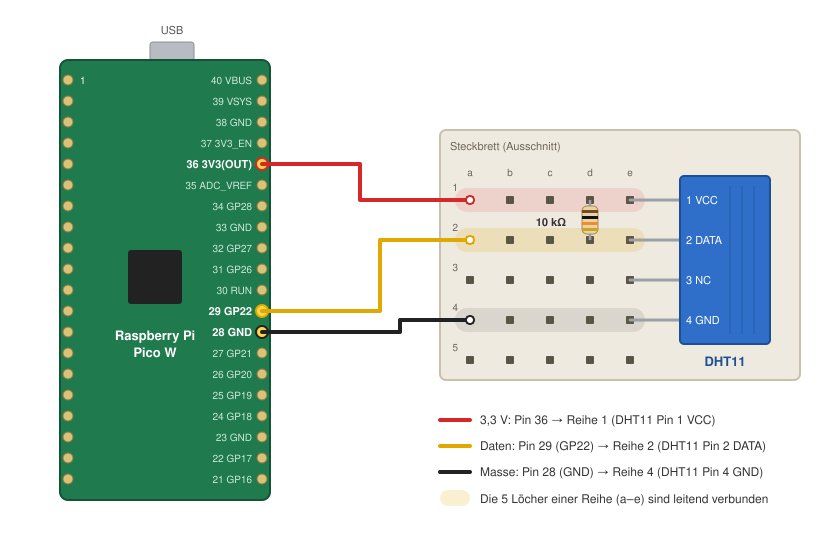

# Materialien

Sie erhalten in der ersten Sitzung die folgenden Materialien ausgehändigt:

| Anzahl | Bauteil | Hinweis |
|---|---|---|
| 1 | Raspberry Pi Pico W (oder ESP32) | Mikrocontroller mit WLAN |
| 1 | Temperatursensor DHT11 | Temperatur und Luftfeuchtigkeit, 4 Pins |
| 1 | Widerstand 10 kΩ | Pull-up für die Datenleitung (Farbringe braun-schwarz-orange) |
| 1 | Steckbrett (Breadboard) | für den Aufbau ohne Löten |
| 3 | Steckkabel (Jumper Wires) | idealerweise rot, gelb/grün, schwarz |
| 1 | USB-Micro-B-Kabel (bei Bedarf) | Stromversorgung und Programmierung |

Bitte geben Sie diese nach Ende des Semesters unaufgefordert zurück, erst dann wird die Note freigegeben.

Der Einsatz anderer Hardware kann mit der Lehrveranstaltungsleitung abgesprochen werden.

# Aufbau der Hardware

Der DHT11 wird mit drei Leitungen an den Pico W angeschlossen: Versorgungsspannung (3,3 V), Masse (GND) und eine Datenleitung. Der 10 kΩ-Widerstand verbindet die Datenleitung mit 3,3 V (Pull-up), damit die Leitung im Ruhezustand einen definierten Pegel hat.

| Pico W | | DHT11 | Kabel |
|---|---|---|---|
| Pin 36 – 3V3(OUT) | → | Pin 1 – VCC | rot |
| Pin 29 – GP22 | → | Pin 2 – DATA | gelb |
| – | | Pin 3 – NC (nicht verbunden) | – |
| Pin 28 – GND | → | Pin 4 – GND | schwarz |

Zusätzlich: **10 kΩ-Widerstand** zwischen DHT11 Pin 1 (VCC) und Pin 2 (DATA).

### Schritt für Schritt

1. **USB-Kabel abstecken.** Verdrahten Sie immer im stromlosen Zustand.
2. **DHT11 einstecken.** Stecken Sie den Sensor so in das Steckbrett, dass jeder der vier Pins in einer eigenen Reihe steckt. Pin 1 ist der linke Pin, wenn das Gitter zu Ihnen zeigt und die Pins nach unten zeigen.
3. **Widerstand einstecken.** Verbinden Sie mit dem Widerstand die Reihe von Pin 1 (VCC) mit der Reihe von Pin 2 (DATA). Die Einbaurichtung ist beim Widerstand egal.
4. **Kabel stecken.** Verbinden Sie die Pins des Pico W mit den Reihen des Sensors wie in der Tabelle angegeben. Die Pin-Nummern finden Sie im [Pinout](images/raspberry_pi_Pico-R3-Pinout-narrow.png), Pin 1 ist neben dem USB-Anschluss markiert.
5. **Kontrolle.** Prüfen Sie vor dem Einstecken des USB-Kabels, dass 3,3 V und GND nicht vertauscht sind. Ein falsch gepolter Sensor kann heiß werden und kaputtgehen.
6. **In der Konfiguration eintragen.** Der Datenpin wird in der [`settings.toml`](https://github.com/jhumci/MECH-M-3-IIoT/blob/main/src/raspi_firmware/settings.toml) als `sensor_pin = 22` angegeben.

::: {.callout-tip}
## Hinweise
- **Steckbrett:** Die fünf Löcher einer Reihe (a–e) sind im Inneren leitend verbunden. Was in derselben Reihe steckt, ist also miteinander verbunden.
- **DHT11 als Modul:** Manche DHT11 sind auf einer kleinen Platine mit nur drei Pins verbaut. Dort ist der Pull-up-Widerstand bereits eingebaut und die Pin-Reihenfolge ist aufgedruckt (z.B. `+`, `out`, `-`). Der zusätzliche Widerstand entfällt dann.
- **ESP32:** Der Aufbau ist identisch (3V3, GND, Datenpin). Die ESP32-Vorlage nutzt GPIO 4 als Datenpin (`DHT_SENSOR_PIN` in `src/esp32_firmware/src/sensors/my_sensor.h`).
- **Keine Messwerte?** Der DHT11 liefert höchstens alle 1–2 Sekunden einen neuen Wert. Häufiges Auslesen führt zu Fehlern.
:::
