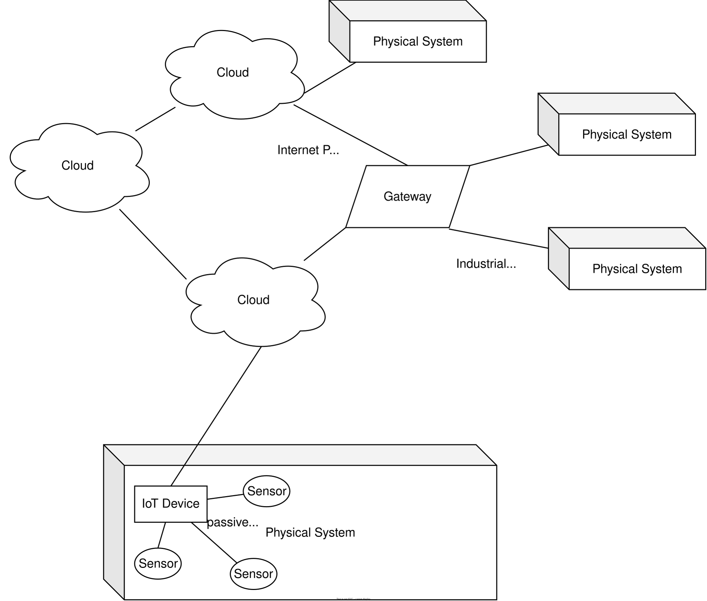
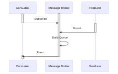
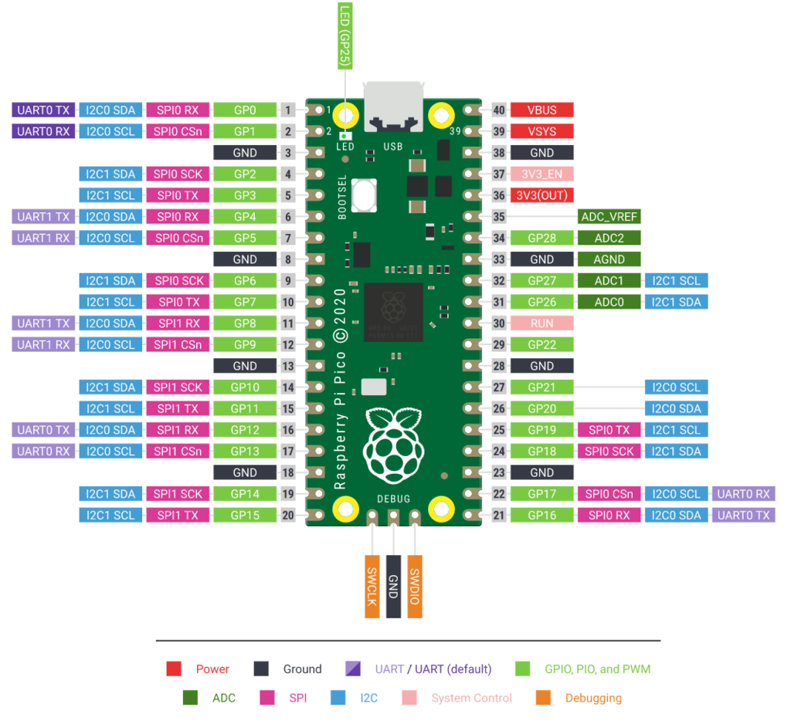

# Synchron

## [Grundbegriffe](https://jhumci.github.io/2024_SoSe_IoT1/IoT_1_Grundbegriffe/#)

## [Kommunikations-Architekturen (MQTT)](https://jhumci.github.io/2024_SoSe_IoT1/IoT_4_Architekturen/)

## [Telemetrie](https://jhumci.github.io/2023_WiSe_IoT2/IoT_8_Telemetrie/)

## Vorstellung der Aufgabenstellung

Jede Gruppe entwickelt mit einem eigenen Microcontroller und Sensor. Ziel des ersten Teils ist eine Firmware, die die Messwerte des DHT11 so an den Kurs-Broker sendet, wie es [`conventions.md`](https://github.com/jhumci/MECH-M-3-IIoT/blob/main/docs/iot-specs/conventions.md) und [`asyncapi.yaml`](https://github.com/jhumci/MECH-M-3-IIoT/blob/main/docs/iot-specs/asyncapi.yaml) vorgeben.

- [ ] Erstellen Sie einen Fork von diesem [Git-Repository](https://github.com/jhumci/MECH-M-3-IIoT) und laden Sie `Robo-Chris` ein.
- [ ] Verkabeln Sie den Sensor wie unter [Materialien](Materialien.qmd) beschrieben.
- [ ] Richten Sie den Pico W ein (siehe *Erste Schritte* unten) und arbeiten Sie die *Meilensteine* der Reihe nach ab. Für die ersten Meilensteine reicht ein einfaches Skript ohne Konfigurationsdatei und ohne Klassen.
- [ ] Überprüfen Sie mit dem [MQTT Explorer](https://mqtt-explorer.com/), ob Ihre Nachrichten auf dem richtigen Topic und im richtigen Format ankommen.
- [ ] Refactoren Sie Ihren Code in die Struktur der Vorlage [`code.py`](https://github.com/jhumci/MECH-M-3-IIoT/blob/main/src/raspi_firmware/code.py): alle veränderlichen Werte kommen in die [`settings.toml`](https://github.com/jhumci/MECH-M-3-IIoT/blob/main/src/raspi_firmware/settings.toml), die Logik in die vorgesehenen Klassen.

### Erste Schritte mit dem Pico W

::: {.callout-important}
## CircuitPython, nicht MicroPython
Die Vorlage `code.py`, der TOML-Parser in `lib/` und alle Hinweise auf dieser Seite beziehen sich auf **CircuitPython**. MicroPython ist ein naher Verwandter, aber die Vorlage und die Adafruit-Bibliotheken laufen dort nicht. Wenn Sie MicroPython oder den ESP32 verwenden möchten, sprechen Sie das vorher mit der Lehrveranstaltungsleitung ab.
:::

1. **CircuitPython installieren.** Laden Sie die aktuelle `.uf2`-Datei für den [Raspberry Pi Pico W](https://circuitpython.org/board/raspberry_pi_pico_w/) herunter. Halten Sie die Taste `BOOTSEL` am Pico gedrückt, während Sie das USB-Kabel einstecken. Es erscheint ein Laufwerk `RPI-RP2`, auf das Sie die `.uf2`-Datei kopieren. Der Pico startet neu und meldet sich als Laufwerk `CIRCUITPY`.
2. **Bibliotheken kopieren.** Laden Sie das [Adafruit CircuitPython Bundle](https://circuitpython.org/libraries) herunter, dessen Versionsnummer zu Ihrer CircuitPython-Version passt (z.B. Bundle 10.x für CircuitPython 10). Legen Sie auf `CIRCUITPY` einen Ordner `lib/` an und kopieren Sie aus dem Bundle hinein:

   | Datei / Ordner aus dem Bundle | Wofür |
   |---|---|
   | `adafruit_dht.mpy` | DHT11 auslesen |
   | `adafruit_minimqtt/` (ganzer Ordner) | MQTT-Client |
   | `adafruit_connection_manager.mpy`, `adafruit_ticks.mpy` | werden von MiniMQTT benötigt |
   | `adafruit_ntp.mpy` | Uhrzeit aus dem Internet holen (siehe Hinweise unten) |

   Dazu kommt `toml.py` aus [`src/raspi_firmware/lib/`](https://github.com/jhumci/MECH-M-3-IIoT/tree/main/src/raspi_firmware/lib) dieses Repositories.
3. **`code.py` und `settings.toml`** liegen im Hauptverzeichnis von `CIRCUITPY`. `code.py` startet automatisch, sobald Sie eine Datei auf dem Laufwerk speichern. Ein eigener Upload-Schritt ist nicht nötig.
4. **Serielle Konsole öffnen.** Alle `print()`-Ausgaben und alle Fehlermeldungen Ihres Programms erscheinen nur dort. Ohne Konsole arbeiten Sie blind. Geeignet sind z.B. der [Mu Editor](https://codewith.mu/), die Erweiterung *Serial Monitor* in VS Code, PuTTY (Windows) oder `screen`/`minicom` (Linux, macOS), jeweils mit 115200 Baud. Details: [Connecting to the Serial Console](https://learn.adafruit.com/welcome-to-circuitpython/kattni-connecting-to-the-serial-console). In der Konsole beendet `Ctrl+C` das Programm und `Ctrl+D` startet es neu.

### Meilensteine

Jeder Meilenstein liefert ein sichtbares Ergebnis. Gehen Sie erst zum nächsten, wenn der aktuelle stabil läuft, dann wissen Sie bei Problemen immer, welcher Teil schuld ist.

| # | Meilenstein | Woran Sie den Erfolg erkennen |
|---|---|---|
| 1 | LED blinken lassen (`board.LED`, `digitalio`) | Die Onboard-LED blinkt. Sie wissen, wie Sie Code auf den Pico bringen und die Konsole lesen. |
| 2 | Sensor auslesen (`adafruit_dht`), alle 2 Sekunden `print()` | Temperatur und Luftfeuchtigkeit erscheinen in der Konsole. Einzelne Fehlversuche werden abgefangen und das Programm läuft weiter. |
| 3 | Mit dem WLAN verbinden (`wifi`, `socketpool`) | Die IP-Adresse des Pico erscheint in der Konsole. |
| 4 | Eine einzelne MQTT-Nachricht senden (`adafruit_minimqtt`) | Die Nachricht ist im MQTT Explorer unter Ihrem Topic sichtbar. |
| 5 | Spezifikation erfüllen | Payload ist JSON mit `timestamp`, `value` und `unit` wie in `asyncapi.yaml`. Auf dem Status-Topic steht `ok`, nach dem Abstecken des Pico wechselt es von selbst auf `offline`. |
| 6 | Refactoring | Struktur wie in der Vorlage, Konfiguration in `settings.toml`, Sendeintervall aus der Konfiguration. |

### Hinweise zu den schwierigen Stellen

Hier keine Lösungen, sondern die Stichworte, die Ihnen die Suche verkürzen:

- **Zeitstempel.** Die Spezifikation verlangt einen Zeitstempel in UTC nach ISO 8601. Der Pico hat keine batteriegepufferte Uhr; nach dem Einschalten steht sie auf dem Jahr 2000. Stichworte: `adafruit_ntp` holt die Zeit aus dem Internet, das Modul `rtc` setzt die Uhr des Pico.
- **Datum formatieren.** Das `time`-Modul von CircuitPython hat kein `strftime`. `time.localtime()` liefert aber ein Tupel aus Jahr, Monat, Tag, Stunde, Minute und Sekunde, aus dem sich der String mit einer Formatierung zusammenbauen lässt.
- **Client-ID.** Der Broker erlaubt jede Client-ID nur einmal. Melden sich zwei Geräte mit derselben ID an, werfen sie sich gegenseitig hinaus, und beide sehen ständig Verbindungsabbrüche. Die Vorlage der `settings.toml` hat dafür keinen eigenen Schlüssel. Überlegen Sie, woraus Sie eine ID ableiten, die in der ganzen Gruppe eindeutig ist.
- **Last Will.** Das `offline` auf dem Status-Topic sendet nicht Ihr Programm, sondern der Broker, wenn die Verbindung abbricht. Es wird beim Verbindungsaufbau hinterlegt. Stichwort: `will_set()` in MiniMQTT, retained.
- **Sensorfehler.** Der DHT11 liefert regelmäßig einen `RuntimeError` (Checksum, Timing). Das ist kein Fehler in Ihrem Aufbau, sondern normal. Fangen Sie ihn ab und versuchen Sie es beim nächsten Intervall erneut.

::: {.callout-warning collapse="true"}
## Typische Probleme
- **WLAN wird nicht gefunden.** Der Pico W kann nur 2,4-GHz-Netze. Viele Router senden 5 GHz unter demselben Namen; das erkennt der Pico nicht. Handy-Hotspots funktionieren meist, wenn sie auf 2,4 GHz eingestellt sind.
- **`ImportError: no module named 'socket'`** oder `select`: Diese Module gibt es in CircuitPython nicht. Für Netzwerkzugriffe ist `socketpool` zuständig, siehe Termin 2.
- **`AttributeError: 'module' object has no attribute 'strftime'`**: siehe Hinweis *Datum formatieren*.
- **`ImportError: no module named 'adafruit_...'`**: Datei fehlt in `lib/` oder das Bundle passt nicht zur CircuitPython-Version.
- **Temperatur zu hoch.** Sitzt der Sensor direkt neben dem Pico, misst er dessen Abwärme mit. Siehe [Materialien](Materialien.qmd).
- **Alles hängt nach mehreren Neustarts.** Häufige Neustarts per Speichern oder `Ctrl+D` können das WLAN-Modul aufhängen. USB-Kabel kurz abstecken, dann läuft es wieder.
- **Verbindung bricht ständig ab.** Meist eine doppelte Client-ID, siehe oben.
:::

# Asynchrone Inhalte

Mit folgenden Inhalten sollten Sie sich vertraut machen, um die Aufgabenstellung erfolgreich zu bearbeiten:

**CircuitPython auf dem Pico W** (die Vorlage baut darauf auf):

- [Welcome to CircuitPython](https://learn.adafruit.com/welcome-to-circuitpython): Installation, `CIRCUITPY`-Laufwerk, serielle Konsole
- [Pico W WiFi with CircuitPython](https://learn.adafruit.com/pico-w-wifi-with-circuitpython): WLAN-Verbindung, `settings.toml`, erste Netzwerkzugriffe
- [MQTT in CircuitPython](https://learn.adafruit.com/mqtt-in-circuitpython): Einführung in MiniMQTT, dazu die [API-Dokumentation](https://docs.circuitpython.org/projects/minimqtt/en/latest/)
- [DHT CircuitPython Code](https://learn.adafruit.com/dht/dht-circuitpython-code): Auslesen des DHT11 mit `adafruit_dht`
- [Wokwi](https://wokwi.com/projects/new/micropython-pi-pico-w): Online-Simulator für Mikrocontroller. Nützlich, um Schaltungen zu testen; simuliert allerdings MicroPython, nicht CircuitPython.

**MQTT und Schnittstellen-Beschreibung:**

- [AWS Whitepaper on MQTT](https://docs.aws.amazon.com/whitepapers/latest/designing-mqtt-topics-aws-iot-core/mqtt-design-best-practices.html): Topic-Design und Best Practices
- [AsyncAPI](https://www.asyncapi.com/en): Die Spezifikation, in der `asyncapi.yaml` geschrieben ist. Im [AsyncAPI Studio](https://studio.asyncapi.com/) lässt sich die Datei lesbar darstellen.
- [MQTT Explorer](https://mqtt-explorer.com/): Freier MQTT-Client zur Visualisierung von Nachrichten. Abonnieren Sie `iiot/group/#`, um auch die Nachrichten der anderen Gruppen zu sehen.

**Zum Hintergrund** (nicht für die Vorlage nötig):

- [MicroPython](https://mciwing.github.io/micropython/) und die [MicroPython-Einführung](https://docs.micropython.org/en/latest/esp32/tutorial/intro.html): der nahe Verwandte von CircuitPython, verbreitet auf dem ESP32
- [PlatformIO](https://docs.platformio.org/en/latest/): Build-System für die ESP32-Vorlage in `src/esp32_firmware`
