<!-- paginate: true -->


# IoT Devices and Definitions

<center>


</center>

---

## Beispiele

### 6:55 Uhr - Zähneputzen

<center>


</center>

###### https://eu.playbrush.com/pages/erwachsene

---

### 7:15 Uhr - Müsli

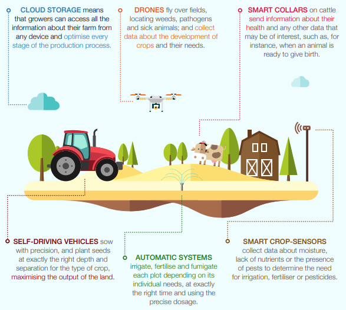

###### https://www.iberdrola.com/documents/20125/40267/Infographic_SmartFarming.pdf/aed36b03-d538-0b0b-d2c4-c79e5f978bd3?t=1627038507160

---

### 7:20 Uhr - Schuhauswahl

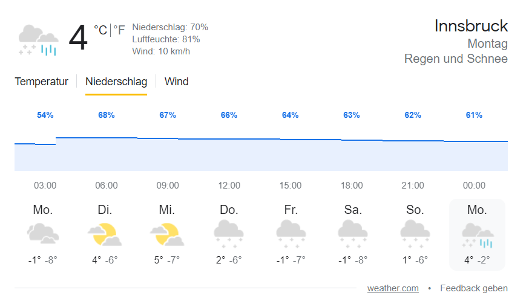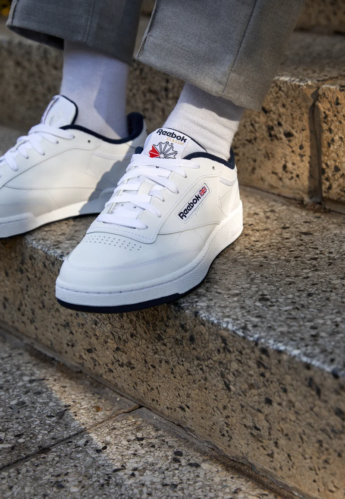


---

### 7:25 Uhr - Verlassen der Wohnung

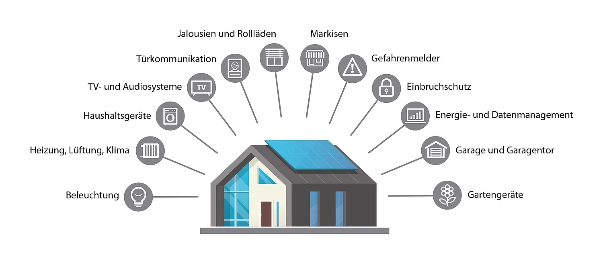


---

### 7:35 Uhr - Standortverlauf

<center>

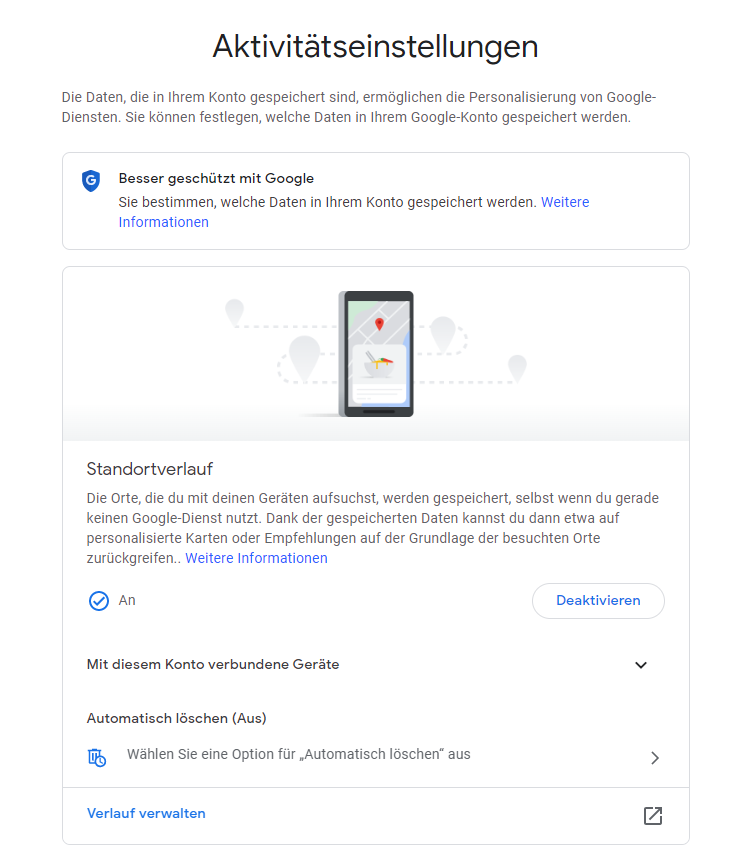

</center>

###### https://github.com/luka1199/geo-heatmap


---

### 7:45 Uhr - Navigation

<center>


</center>

---

<center>

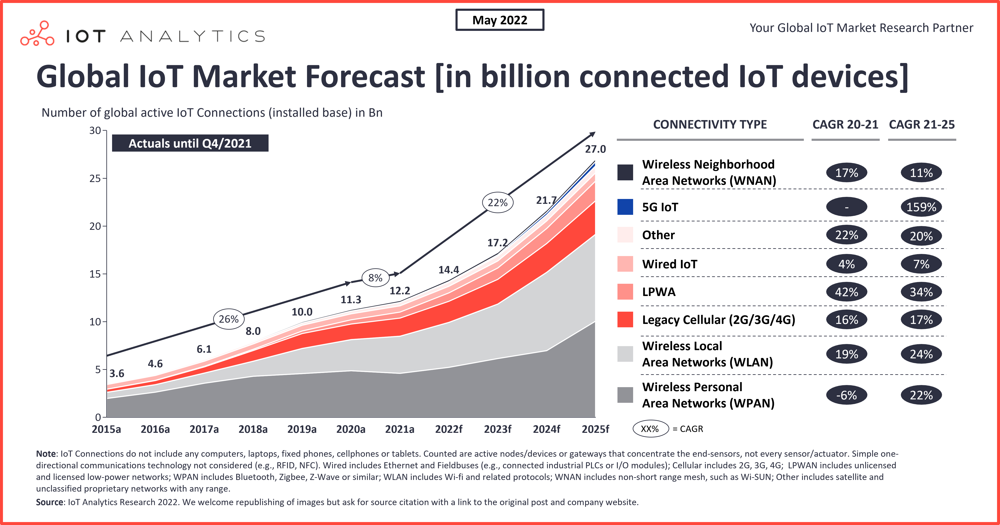

</center>

---

## 🎯 Lernziele

In dieser Woche werden wir uns mit folgenden Inhalten auseinandersetzen.
* Was verbirgt sich hinter dem Schlagwort IoT?
* Was unterscheidet Digitale Zwillinge und Cyber-Physikalische Systeme?
* Welche Komponenten und Funktionen gehören zu einem IoT-System?

---

## Internet of Things

* Erweiterung des Internets über PCs und Server hinaus
* (potentielle) Verknüpfung von Milliarden Geräten,
* die Daten sammeln und austauschen
* ggf. Aktionen ausführen

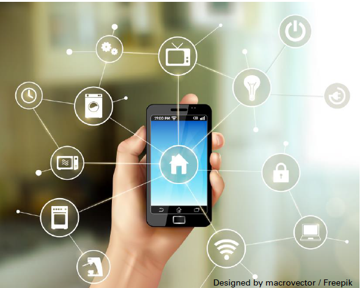

---

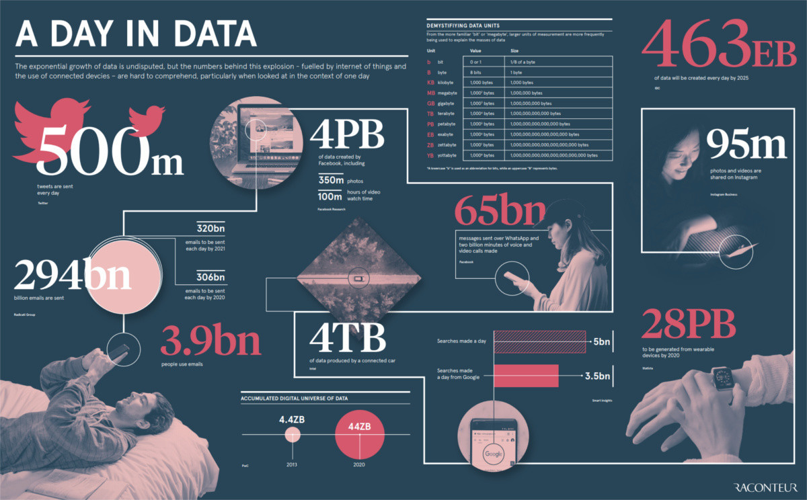


---

## Information, Data, Knowledge

> KNOWLEDGE IS KNOWING that a tomato is a fruit. Wisdom is knowing not to put it in a fruit salad. - Brian O'Driscoll

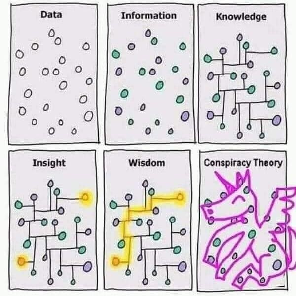

###### https://www.weforum.org/agenda/2019/04/how-much-data-is-generated-each-day-cf4bddf29f/

---

### Pyramid of Knowlegde

* Daten: Symbole `0110 1010 1010 0010 ...`
* Information: Daten, die so verarbeitet werden, dass sie nützlich sind; liefert Antworten auf die Fragen *wer*, *was*, *wo* und *wann*
    `{"temp_in_c": 50.0, "time" : "10:30:22", "status" : "working"}`
* Knowledge: Anwendung von Daten und Informationen; Beantwortung von *Wie*-Fragen
    * *Wie* hängt die Temperatur mit dem Status unserer Maschine zusammen?
    *"If the temperature rises above 55°C, the machine will stop working"* 

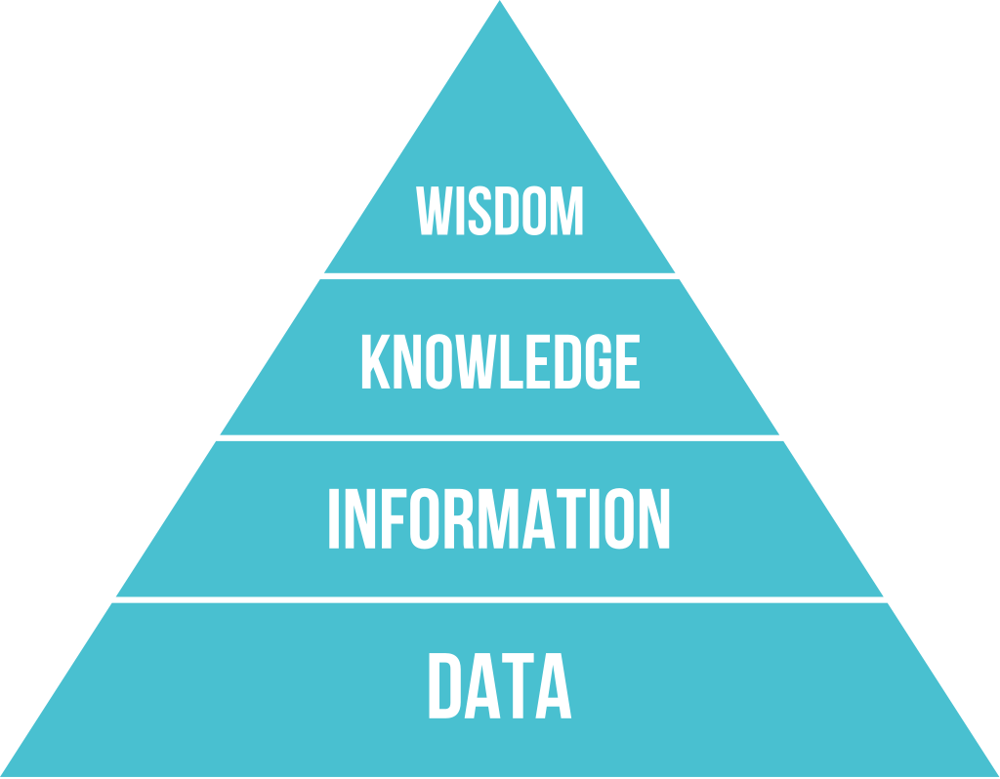

---

* Insights: Die Wertschätzung des *Warum*
    *Higher temperatures make the hydraulic liquid to viscose and leak.* 
* Wisdom: Evaluierte Insights.
    *We tested the temperature dependence of the liquid and the machine with different liquids*


---


###### https://www.guggenheim.org/artwork/34812

---

### Don't confuse Knowledge with Insights

<center>

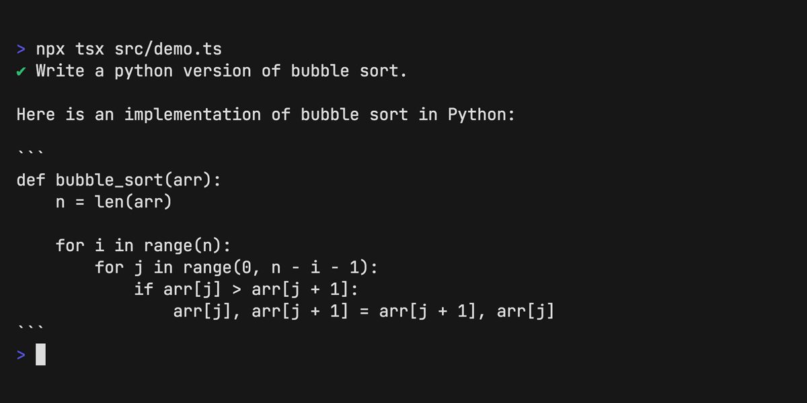

</center>

###### https://openai.com/blog/chatgpt/

---

#### Limitationen Künstlicher Intelligenz

* Data: Hinter einem Chat GTP steckt ein ANN, das Text in Form von binären Informationen darstellt
* Information: Es wurde mit einer großen Menge an Daten trainiert und hat gelernt, wie wer, was, wo, wann und Grammatik zusammenhängen
* Knowledge: Es wendet diese Informationen an, um auf der Grundlage des eingegebenen und des vorhergesagten Textes eine Folge von Wörtern vorherzusagen

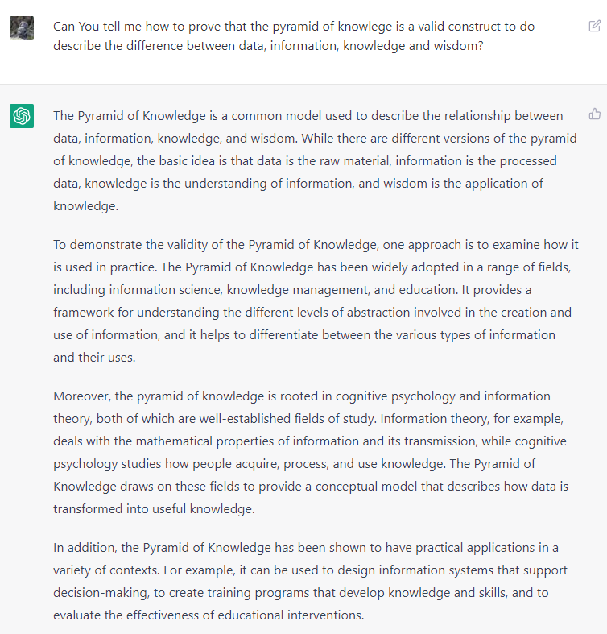

---

#### Limitationen Künstlicher Intelligenz

* Insights: Es hat keine Einsicht, warum es erzählt, was es erzählt (man kann es (noch) nicht nach Quellen fragen)?
* Wisdom: Es kann keine Argumente oder Experimente verwenden, um die Wahrheit seines Wissens zu bestätigen.


---

## Things

**Einzelne** Einheiten, die **physikalisch** in der realen Welt existieren
* **sammeln Daten** über sich selbst oder ihre Umgebung 
* können **kommunizieren**, um Daten über ein Netz zu senden/empfangen
* können **rechnen**
* können **Aktionen** ermöglichen

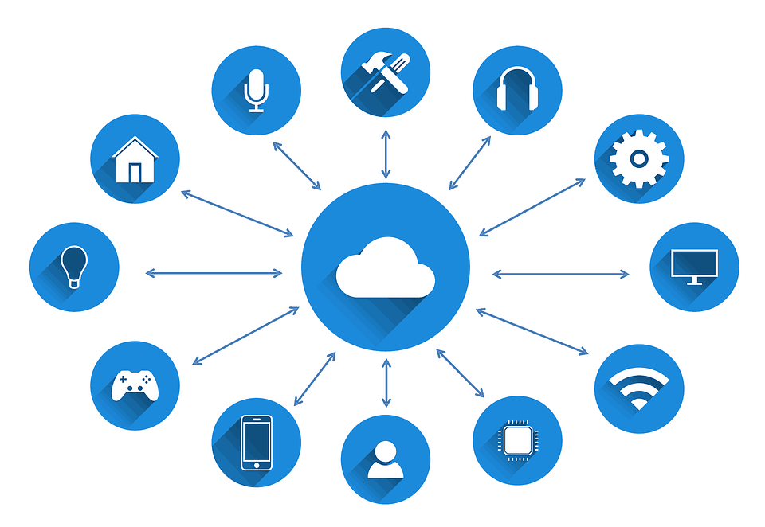

---

### Examples

* ein [Smartphone](https://www.google.com/covid19/mobility/) das Bewegungs- und Positionsdaten verfolgt
* ein [Türkontakt](https://www.bosch-smarthome.com/de/de/produkte/geraete/tuer-fensterkontakt/) der verfolgt, ob eine Tür offen ist
* ein [smart fridge](https://www.samsung.com/us/explore/family-hub-refrigerator/overview/) der es erlaubt, zu sehen, was im Kühlschrank ist

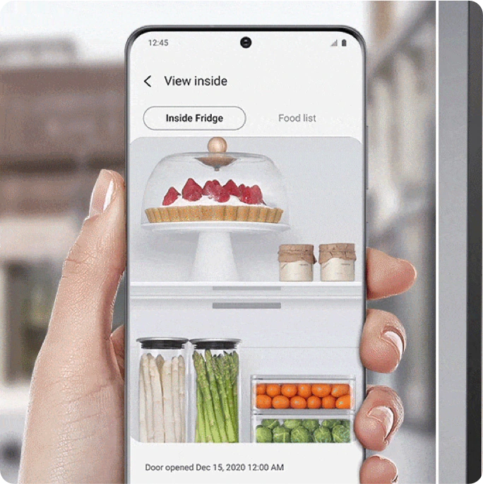

---

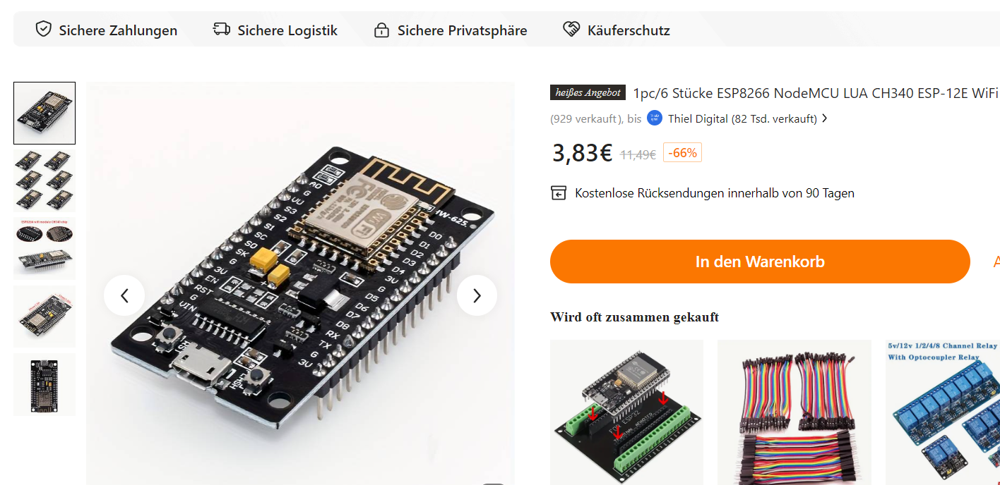

---

### Thing as Cyber-Physikalisches System (CPS)

<center>

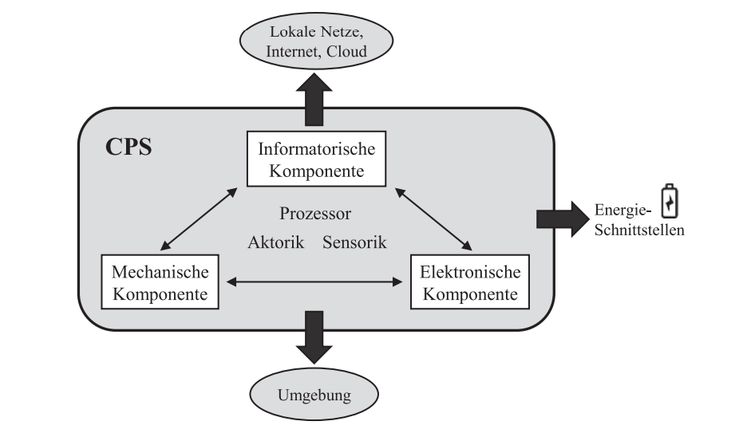

</center>

###### https://link.springer.com/content/pdf/10.1007/978-3-662-61580-5.pdf

---

### Hardware Elements of an IoT Device

<center>

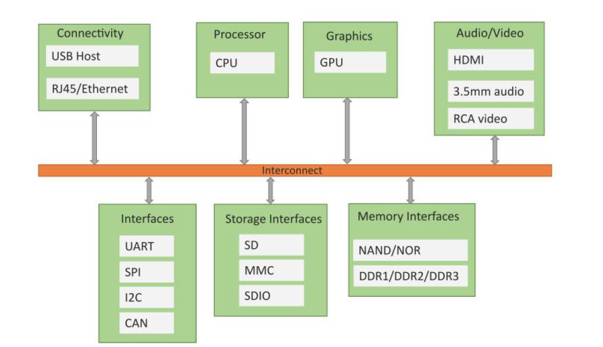

</center>


###### http://www.internet-of-things-book.com


---

#### Beispiel Raspberry Pi

* preiswerter Mini-Computer
* läuft mit verschiedenen Linux-Varianten
* ermöglicht die Anbindung von Sensoren und Aktoren über
die General Purpose Input/Output (GPIO)

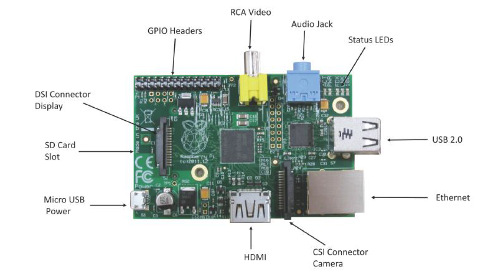

---


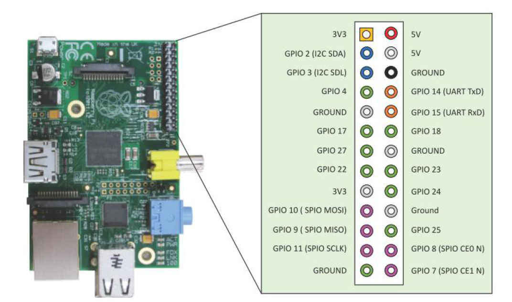

* digitaler Kontaktstift (Pin), dessen Verhalten, unabhängig, ob als Eingabe- oder Ausgabekontakt, durch logische Programmierung frei bestimmbar ist

---

#### Beispiel: LoRaWan Fensterkontakt

<center>

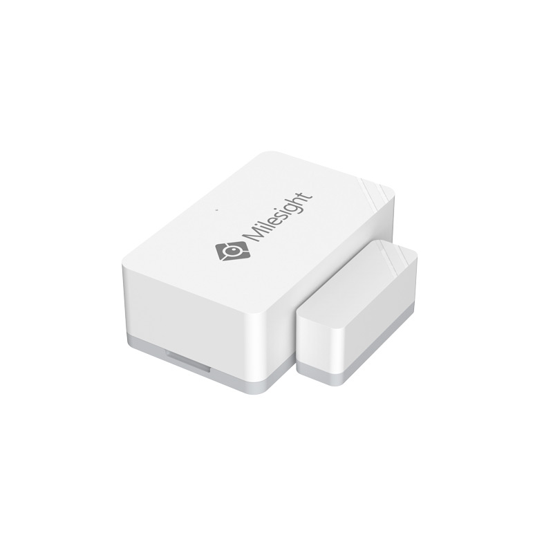

</center>

###### https://iot-shop.de/shop/mil-ws301-868-milesight-ws301-tur-fenster-kontakt-5219

---

#### Beispiel: Microcontroller mit Sensoren und BT-LE

<center>

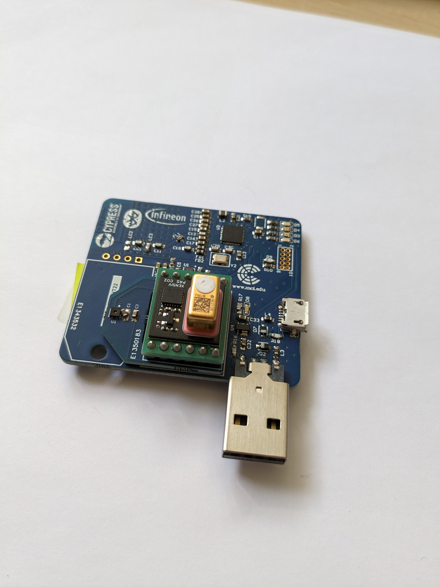

</center>

---

#### Beispiel: Soft-SPS mit I/Os

<center>

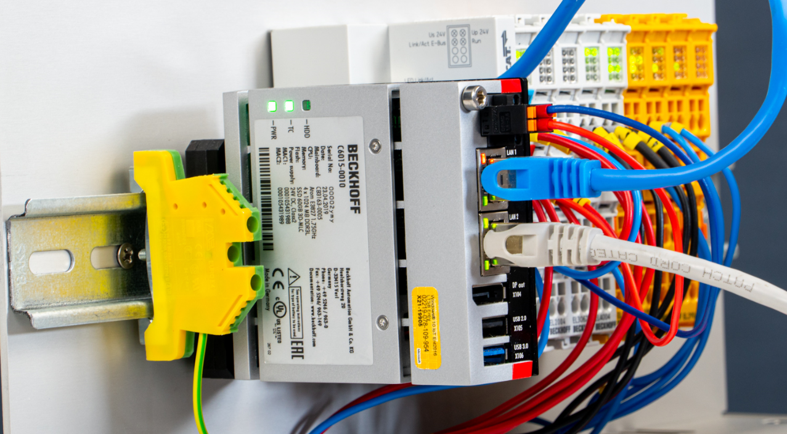

</center>


---

## Internet

* im engen Sinn: weltweites Netzwerk zum Informationsaustausch
* of Things: Fähigkeit aktiv Informationen miteinader auszutauschen
    * Vor IoT: Passiver Temperatursensor, welcher durch Widerstandsänderung Stromfluss bei angelegter Spannung verändert
    * IoT: aktiver Senor, welche Information über Temperatur und Messzeitpunk als Datenpaket übermittelt

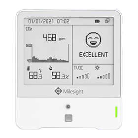

---


### Bus-Systeme

* Dienen der Datenübertragung zwischen zwei und mehr Teilnehmern
* Signalisierung von Informationen als digitales Datensignal
* Mehrere Teilnehmer können ein Übertragungsmedium nutzen
* Besitzen ein definiertes Protokoll (z.B. I²C-Bus am Raspberry Pi)


---


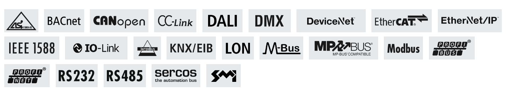

* für verschiedene Einsatzgebiete
    * Sicherheit
    * Geschwindigkeit
    * Standardisierte Anwendungsfälle

---

### Topologien

* Vernetzung verschiedener Kommunikationssysteme
* Gateways als übersetzter zwischen verschiedenen Systemen


---

### Herausforderungen

* Es werden bereits große Mengen an Daten erfasst
* Erkenntnisse aus großen Datenbeständen erzielen
* Die Daten aus Informations-Silos befreien, um wissen zu schaffen
    * Welche Informationen bilden Synergien?
    * Wie können Informationen aus verschiedenen Quellen zusammengebracht werden?

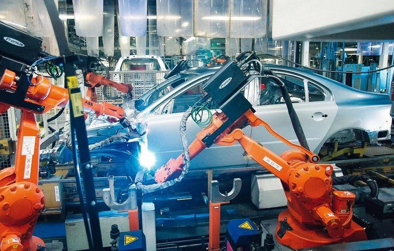

---

<center>

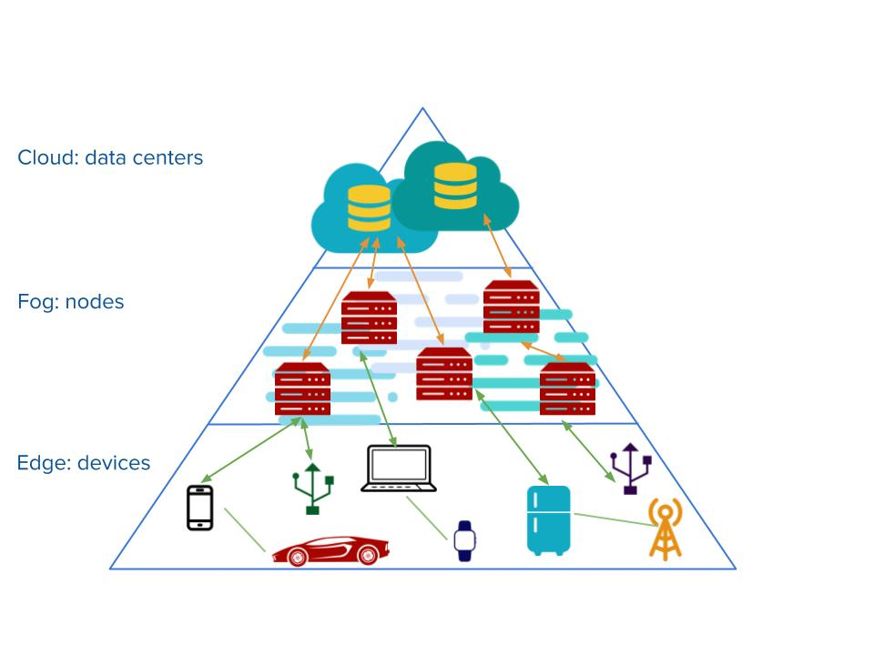

</center>

###### https://info.varnish-software.com/blog/edge-cloud-fog-computing

---

## Cloud

* zentraler Verknüpfungspunkt für der Daten im IoT
* nicht orts-/ hardware-gebunden
    * Erreichbarkeit
    * Skalierbarkeit
    * Automatisierung
* Aufgaben
    * Extract, Transform, Load
    * Speichern
    * Analyse
    * Visualisierung

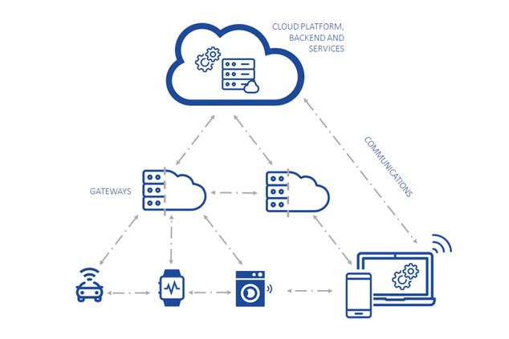


---

### Extract, Transform, Load (ETL) 

* Extraktion
    * periodisch: z.B. Temperatursensor
    * ereignisgesteuert: z.B. Bewegungsmelder
    * anfragegesteuert: z.B. Kamera
* Transformation
    * Syntaktische Transformationen (Form): z.B. Format der Zeitstempel 
    * Semantische Transformationen (Inhalt): z.B. Durchschnitt 
* Laden
    * Einbringen in die zentrale Datenstruktur (z.B. Data Warehouse oder Datenbank)

---


---

### Speichern

* Datenbank:
    * Softwaresystem zur Aufbewahrung von Daten
* Data Warehouse:
    * Sammlung aufbereiteter Daten in fester Struktur
* Data Lake:
    * Unstrukturierte Sammlung von Daten


---


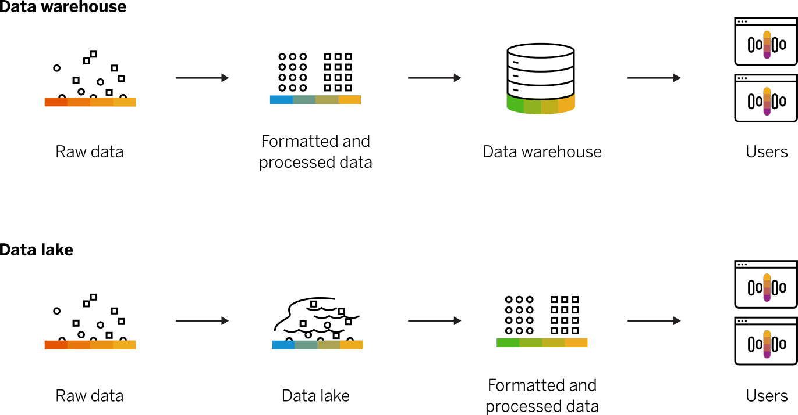

###### https://www.sap.com/germany/insights/what-is-a-data-lake.html

<!-- _class: white -->
---

### Analyse

* Wert-Überwachung (Stream Processing)
    ```Python
    if temp_c > 50:
        print("Machine is running hot!")
    ```
* Auswertung (Data Science)
    * *"Wie lange lief die Maschine durchschnittlich, bis 40°C erreicht wurden?"*
* Prognosen (Machine Learning)
    * *"Wie warm wird die Maschine, wenn zunächst A für 30 Minuten dann B für 90 Minuten produziert wird?"*
* Optimierung (Optimierung ggf. KI)
    * *"Was soll auf welcher Maschine, in welcher Reihenfolge produziert werden, damit keine zu heiß wird?"* 

---

#### Digitaler Zwilling

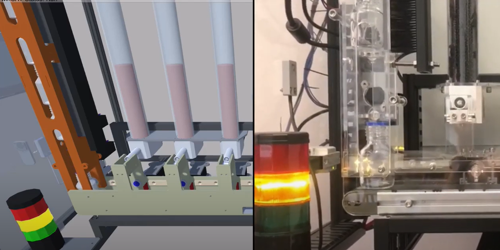

###### https://www.youtube.com/watch?v=e9Jyv7h8mo0

---

#### Digitaler Zwilling

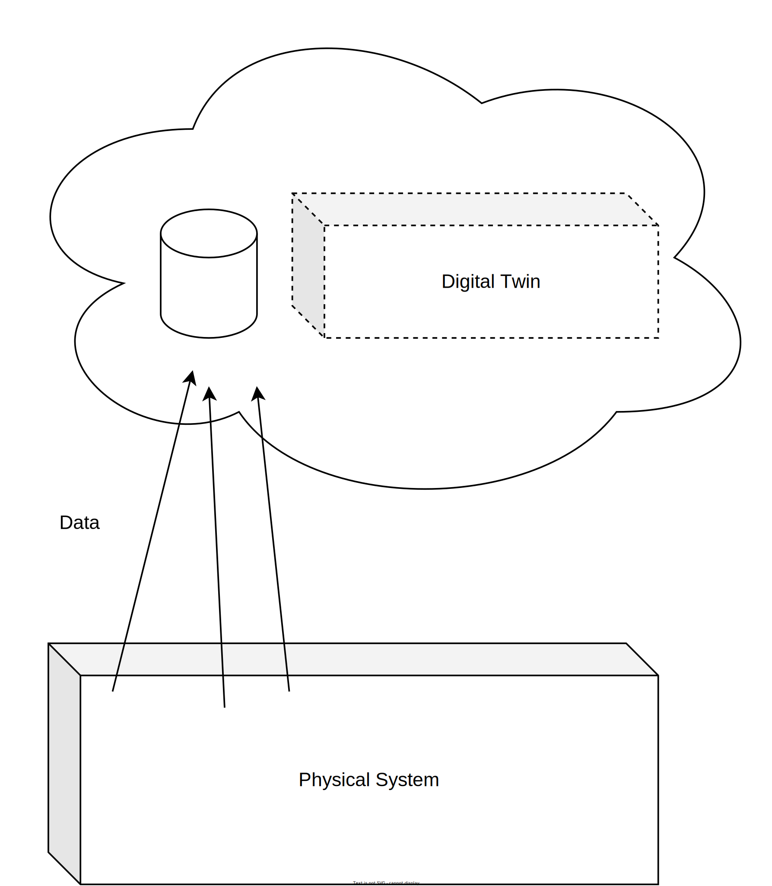

* Abbild des Verhaltens des physikalischen Systems
    * Überwachung
    * Analyse
* Fragen
    * Welche Daten müssen erfasst werden?
    * Welche Modelle liegen dahinter?

---

##### Beispiel Sendungsverfolgung


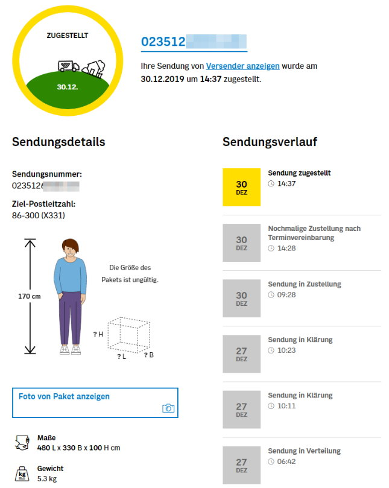

###### https://www.paketda.de/news-sendungsverfolgung-oesterreichische-post.html

* Durch Scannen eines Barcodes, kann der aktuelle Prozessschritt identifiziert werden
* Durch einen GPS-Sender kann die Position des Ausliefer-Fahrzeugs und damit indirekt die des Pakets erfasst werden
* Der reine Anwendungsfall der Sendungsverfolgung greift nicht in die physikalischen Prozesse ein

---


### Visualisierung


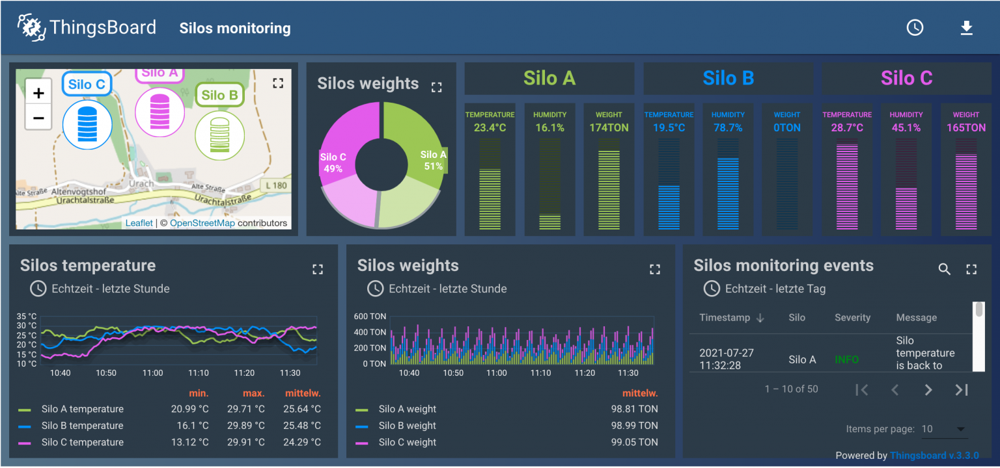


---


#### Cyber-Physikalisches Systeme

* Verbund informatischer, softwaretechnischer Komponenten mit mechanischen und elektronischen Teilen, die über eine Dateninfrastruktur
    * Überwachung
    * Analyse
    * Optimierung
    * Steuerung
* Fragen
    * Systemverhalten
    * Verantwortlichkeiten

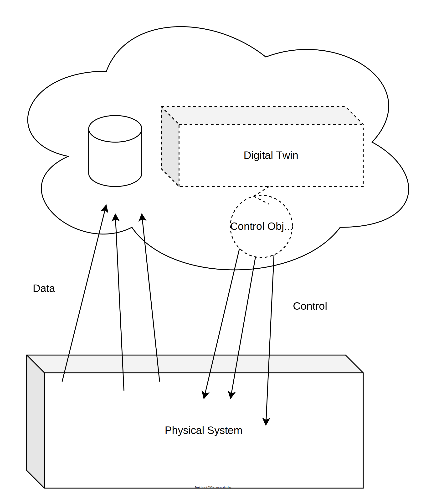

--- 

##### Beispiel Automatisierte Bestellung von Druckerpatronen

<center>

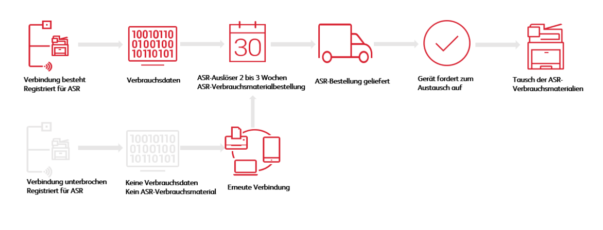

</center>

###### https://www.xerox.com/downloads/supplies/Automatic_Supplies_Replenishment_FAQ_Enduser_DE.pdf

* Drucker ordert selbstständig neue Patronen

---

#### SPS als Cyber-Physikalisches System?

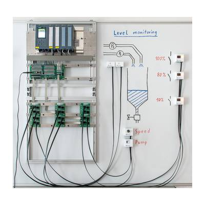

* auch hier wird überwacht, analysiert, optimiert und gesteuert
* allerdings sind die Systemgrenzen sehr eng
---

### Anbieter von IoT Clouds 

<center>

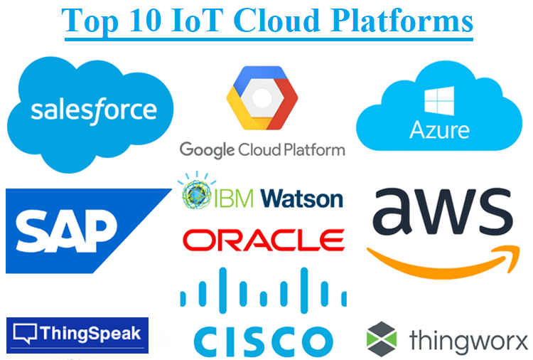

</center>

---

#### IoT Clouds 

* Backend zur Integration verteilter Systeme 
* Device-Management: welche Geräte werden erfasst, was ist deren Status
* Pub/Sub-Services: Welche Daten werden wohin verteilt
* Stream Analytics: Welche Aktionen werden basierend auf den Daten ausgelöst


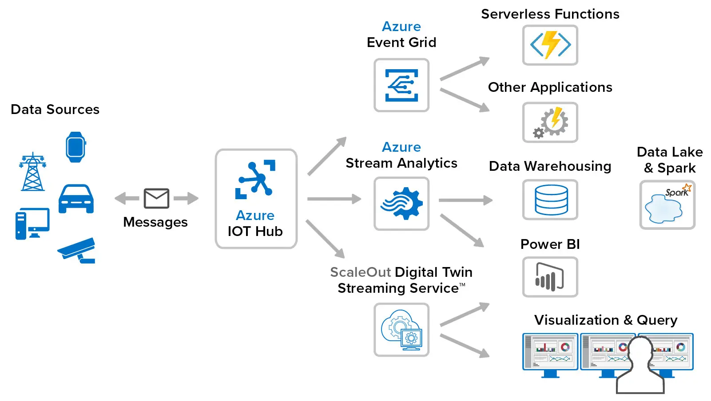


---

### node-red

<center>


</center>

* Plattform / Software zur Vernetzung von Sensoren und Schnittstellen (ELT)
* Browser- und fluss-basiert
* Erweiterungsmöglichkeiten für Visualisierung, Speicherung, Analyse
* In IoT1 als einfache IoT-Plattform

###### https://nodered.org/


---

### Internet of Things in a nutshell

* viele Geräte mit Aktoren und Sensoren kommunizieren (Fokus in IoT2)
* die Kommunikation findet (teilweise) über weite Stecken statt und nutzt verschiedene Bus-Systeme und Protokolle
* Daten und digitale Abbilder der Geräte werden zentral miteinander verknüpft (Cloud)

