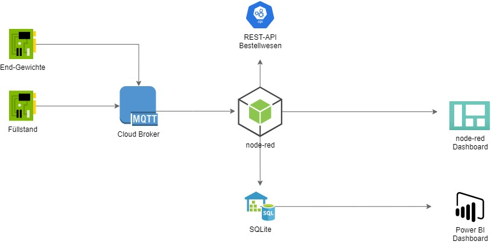
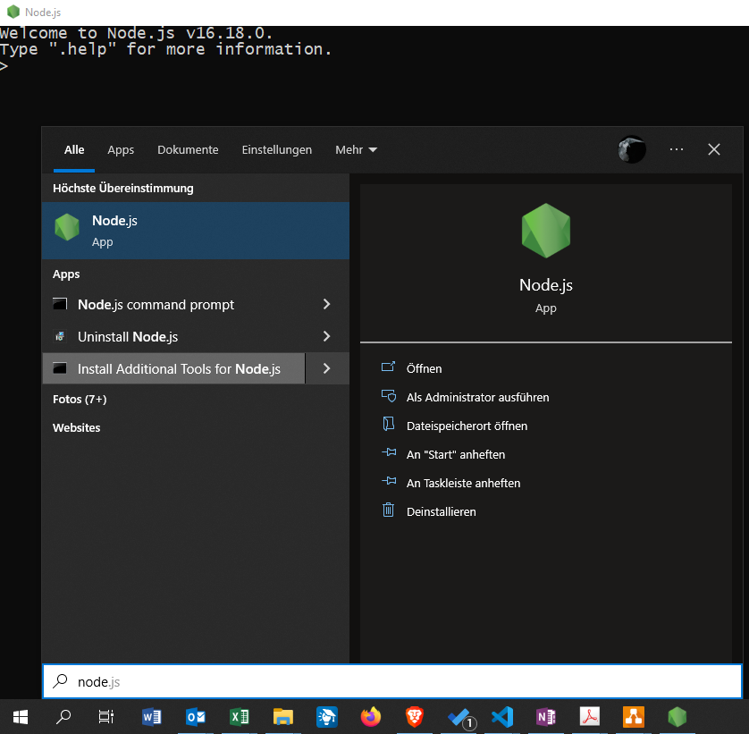
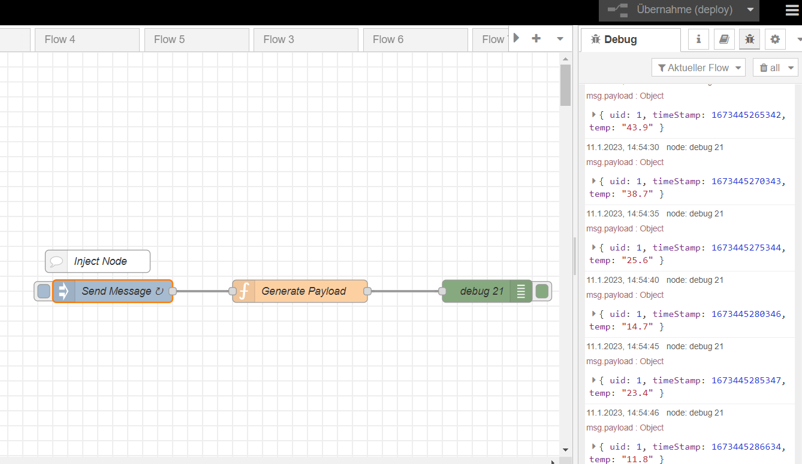
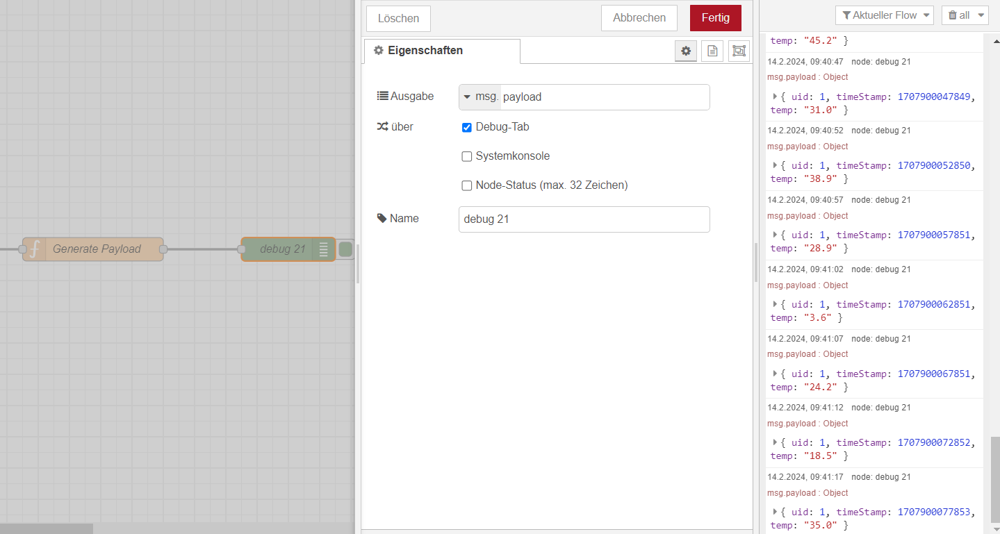
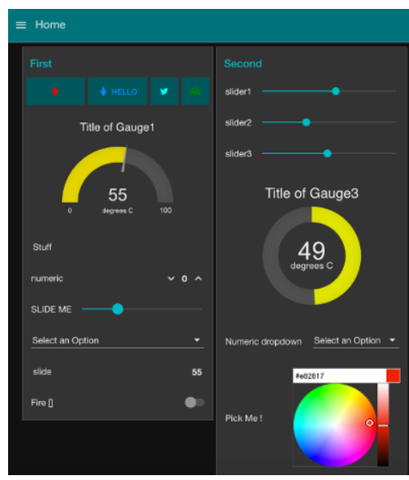
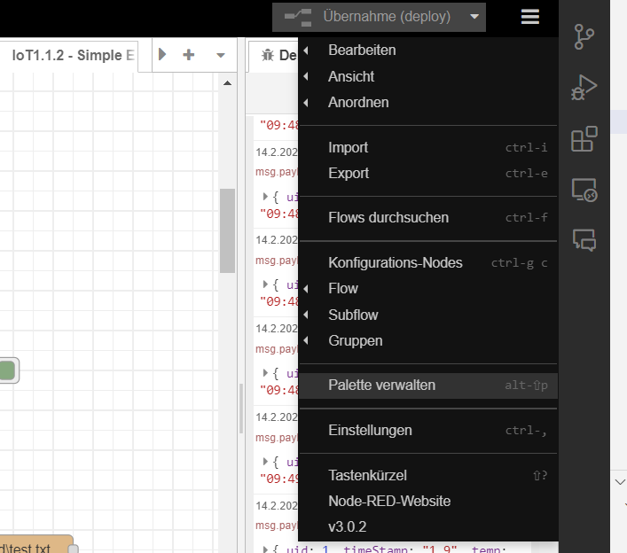
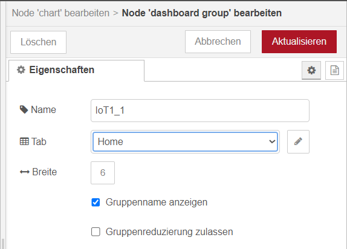
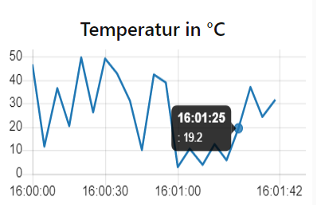
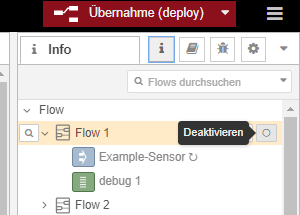

<!-- paginate: true -->

# Aufgaben - Grundbegriffe


--- 


## Beschreibung des Anwendungsfalls
 

Die Lehrveranstaltung orientiert sich an der [MCI Teaching Factory](https://www.youtube.com/embed/e9Jyv7h8mo0). Diese ist eine miniaturisierte Version einer Abfüllanlage für Granulat-Mischungen. Dabei kann automatisiert eine Mischung aus drei verschiedenen Granulaten erstellt werden, um z.B. Kunststoffe mit verschiedenen Eigenschaften herzustellen. In späteren Semestern werden Sie die Steuerung der Anlage programmieren lernen. In diesem Semester nutzen wird die Anlage als physikalisches System, zu dem wir einen digitalen Zwilling bauen. 

---

<iframe width="1138" height="720" src="https://www.youtube.com/embed/e9Jyv7h8mo0" title="MCI | Teaching Factory | Side by side" frameborder="0" allow="accelerometer; autoplay; clipboard-write; encrypted-media; gyroscope; picture-in-picture; web-share" allowfullscreen></iframe>

---

### IoT-Architektur

<center>



</center>

---

### Aufgaben

Im Laufe des Semester werden wir den  digitalen Zwilling Schritt für Schritt erweitern. Die von Ihnen zu dokumentierenden Projektabgaben sind mit **P#** gekennzeichnet.

- Einheit 1: Installation von node-red als Cloud Plattform
- Einheit 2: Beschreibung von drei IoT-Anwendungsfällen
    - Use Case 1: Erstellung eines Dash-Boards
    - Use Case 2: Automatisierte Benachrichtigung bei Prozessfehlern
    - Use Case 3: Automatisiertes Wiederauffüllung
    - Use Case 4: Datensammlung für das Qualitätsmanagement
    - P1: Fertigen Sie ein Use Case Diagramm an
    - P2: Beschreiben Sie einen Use Case in einem Template
    - P3: Fertigen Sie ein Sequenzdiagramm an
- Einheit 3: Datenstrukturen
    - P4: Erzeugen Sie ein Klassendiagramm
    - P5: Umsetzung Use Case 1
    - P6: Umsetzung Use Case 2

---

- Einheit 4: Architekturen für Kommunikationsparadigmen
    - P7: Anbindung eines MQTT-Brokers
    - P8: Anbindung einer REST-Schnittstelle
- Einheit 5: Netzwerke
    - P9: Netzwerkkonfiguration Shelly Plugs
- Einheit 6: Datenbanken
    - P10: ER-Diagramm für die Erfassung von Prozessdaten
    - P11: Relationen in Normalform aufstellen
- Einheit 7: SQL
    - P12: SQL-Tabelle der Relationen anlegen
    - P13: Datenspeicherung für Use Case 4 umsetzen
- Einheit 8: Visualisierung und Business Analytics 
    - P14:  Weiterentwicklung des Dashboards mit Datenbankabfragen für UseCase 1
    - P15:  Weiterentwicklung des Dashboards mit Datenbankabfragen für UseCase 4
    - P15: Datenanalyse für Use Case 4


---

- *sofern zeitlich möglich*: Hackathon
    - P13:  Präsentation Abschluss Hackathon:
        - Kreativität
        - Anspruch
        - Nutzer-Interface
        - Umsetzungs-Schwierigkeit
        - Fortschritt innerhalb der Session

---

## ✍️ Warm-Up: Begriffsdefinition

* 5 Minuten am **21.3.2024**
* Bilden Sie ein zweier-Team. In diesem Team werden die auch den Rest des Semesters zusammenarbeiten
* Stellen Sie die Präsentation zum nächsten Termin den anderen Teams vor
* Stellen Sie einen IoT-Anwendungsfall ihrer Wahl vor, den Sie im Internet gefunden haben
* Erstellen Sie dazu folgende Folien
    * **User**: Wer ist der Anwender des Systems?
    * **Value-Proposition**: Welchen Mehrwert bietet das System?
    * **Devices**: Welche Devices kommen dabei zum Einsatz?
    * **Information**: Welche Informationen werden und ausgetauscht gesammelt?
    * **Aktionen**: Welche Aktionen werden durch das System in der Physikalischen Welt ausgelöst?
    * **Cloud**: Welche Cloud-Plattform wird genutzt (könnte genutzt werden?), was passiert hier?
    * **Human-in-the-Loop**: Welche Interaktionen gibt es mit dem Menschen?
* Nutzen Sie die PPT-Vorlage im Sakai

---

## Aufgaben 1: Node-Red

### 🎯 Lernziele

Nach dieser Einheit sind Sie in der Lage dazu

* Node-red auf Ihrem PC auszuführen
* Daten auf Ihrem PC abzuspeichern
* Alarmfunktionen anzupassen
* Visualisierungen anzupassen

---

### Installation von node-red

* node-red benötigt eine Laufzeitumgebung zum Ausführen von JavaScript-Programmen namens [node-js](https://nodejs.org/en/#home-downloadhead)
* die meisten JavaScript-Programme werden direkt im Browser angezeigt. Programme, wie node-red starten einen lokalen Web-Sever und können dann über eine lokale IP-Adresse (`127.0.0.1`) im Browser angesteuert werden
* Installieren Sie node-js und node-red auf Ihrem PC indem Sie folgenden [Anleitung](https://nodered.org/docs/getting-started/local) folgen

---

#### ✍️ Aufgaben

* Installieren und starten Sie [node-js](https://nodejs.org/en/#home-downloadhead)
* Installieren Sie [node-red / installing with npm](https://nodered.org/docs/getting-started/local), indem Sie die Befehle in der node-js Kommandozeile (`node-js command prompt`) eingeben
* Installation `npm install -g --unsafe-perm node-red`
* Starten Sie node-red indem sie ` node-red` eingeben



---

- Starten von node-red 
```
$ node-red

Welcome to Node-RED
===================

30 Jun 23:43:39 - [info] Node-RED version: v1.3.5
...
30 Jun 23:43:44 - [info] Server now running at http://127.0.0.1:1880/red/
```
* Aufruf der URL im Browser unter der URL: http://127.0.0.1:1880

---

#### Importieren Sie den folgenden [Flow 1_1_1](flows\1\Beispiel_1_1_1.json)

- Hamburger-Menü: `Import`. JSON-Datei kopieren und `Import`

```json
[
    {
        "id": "8eb6aa35fe2e0c61",
        "type": "tab",
        "label": "IoT - Simple Flow",
        "disabled": false,
        "info": "",
        "env": []
    },
    {
        "id": "d57825aad30f42d9",
        "type": "inject",
        "z": "8eb6aa35fe2e0c61",
        "name": "Send Message",
        "props": [
            {
                "p": "payload"
            },
            {
                "p": "topic",
                "vt": "str"
            }
        ],
        "repeat": "5",
        "crontab": "",
        "once": false,
        "onceDelay": "",
        "topic": "",
        "payload": "",
        "payloadType": "num",
        "x": 420,
        "y": 320,
        "wires": [
            [
                "0dcde4cf01b64b07"
            ]
        ]
    },
    {
        "id": "c2639ddd8124305f",
        "type": "comment",
        "z": "8eb6aa35fe2e0c61",
        "name": "Inject Node",
        "info": "The Inject node allows you to inject messages into a flow, either by clicking the button on the node, or setting a time interval between injects.",
        "x": 400,
        "y": 280,
        "wires": []
    },
    {
        "id": "0dcde4cf01b64b07",
        "type": "function",
        "z": "8eb6aa35fe2e0c61",
        "name": "Generate Payload",
        "func": "var randomTemp = (Math.random() * 50).toFixed(1);  //random temp from -30.0 to 30.0 degrees\n\nvar timeIndex = Date.now();\n\n\nmsg.payload = \n            {\n               \"uid\" : 1,\n                \"timeStamp\": timeIndex,\n                \"temp\": randomTemp\n            };\n\nreturn msg;",
        "outputs": 1,
        "noerr": 0,
        "initialize": "",
        "finalize": "",
        "libs": [],
        "x": 670,
        "y": 320,
        "wires": [
            [
                "ffbc65cb66fad176"
            ]
        ]
    },
    {
        "id": "ffbc65cb66fad176",
        "type": "debug",
        "z": "8eb6aa35fe2e0c61",
        "name": "debug 21",
        "active": true,
        "tosidebar": true,
        "console": false,
        "tostatus": false,
        "complete": "payload",
        "targetType": "msg",
        "statusVal": "",
        "statusType": "auto",
        "x": 920,
        "y": 320,
        "wires": []
    }
]
```

---

### Anwendungsfall: Temperaturüberwachung


---



---

### Flussbasiertes Programmieren

* Jeder Knoten bildet einer Funktion ab, die genauer konfiguriert werden kann
* Knoten geben auf der rechten Seite ein Nachrichten-Objekt (`msg`) aus
* Der Inhalt einer Nachricht wird as payload (`msg.payload`) bezeichnet.
* Die Funktion eines Knotens wird i.d.R. durch ein Event (den Eingang einer Nachricht auf der linken Seite) ausgelöst



---

#### Ausführen des Flows

- Klick auf `Übernahme (deploy)` wendet Änderungen in der Arbeitsfläche an
- Klick auf Käfer-Symbol darunter öffnet die Debug Konsole. Diese gibt alle Nachrichten am den grünen Debug Knoten aus (sofern aktiviert)
- Klick auf Rechteck links neben Inject-Knoten führt den Inject Knoten einmalig aus


---

#### ✍️ Aufgaben

- Öffnen Sie den Inject-Node `Send Message` und ändern Sie das Intervall, in dem eine Message erzeugt wird auf 2 Sekunden
- Öffnen Sie den Node `Generate Payload`. Hier finden Sie einen Code in der Programmiersprache JavaScript. Ändern die die `uid` (ID des Sensor) zu einer Zahl ihrer Wahl
- Klicken Sie `Übernahme(deploy)` (oben rechts) und öffnen sie die Debug-Console (Käfer-Symbol)
- Klicken Sie auf den Button links am Inject-Node `Send Message` und vergewissern Sie sich, dass die richtige Nachricht erzeugt wird

---

### Einfacher ELT-Prozesse mit node-red


---

#### Importieren Sie den folgenden [Flow 1_1_2](flows\1\Beispiel_1_1_2.json)

```
[
    {
        "id": "3af74d37f3401170",
        "type": "tab",
        "label": "IoT1.1.2 - Simple ETL",
        "disabled": false,
        "info": "",
        "env": []
    },
    {
        "id": "bf51e947630c40ae",
        "type": "inject",
        "z": "3af74d37f3401170",
        "name": "Send Message",
        "props": [
            {
                "p": "payload"
            },
            {
                "p": "topic",
                "vt": "str"
            }
        ],
        "repeat": "5",
        "crontab": "",
        "once": false,
        "onceDelay": "",
        "topic": "",
        "payload": "",
        "payloadType": "num",
        "x": 1620,
        "y": 960,
        "wires": [
            [
                "74e5caf2c9720d61"
            ]
        ]
    },
    {
        "id": "09235e7862515817",
        "type": "comment",
        "z": "3af74d37f3401170",
        "name": "Inject Node",
        "info": "The Inject node allows you to inject messages into a flow, either by clicking the button on the node, or setting a time interval between injects.",
        "x": 1600,
        "y": 920,
        "wires": []
    },
    {
        "id": "74e5caf2c9720d61",
        "type": "function",
        "z": "3af74d37f3401170",
        "name": "Generate Payload",
        "func": "var randomTemp = (Math.random() * 50).toFixed(1);  //random temp from -30.0 to 30.0 degrees\n\nvar timeIndex = Date.now();\n\n\nmsg.payload = \n            {\n               \"uid\" : 1,\n                \"timeStamp\": timeIndex,\n                \"temp\": randomTemp\n            };\n\nreturn msg;",
        "outputs": 1,
        "noerr": 0,
        "initialize": "",
        "finalize": "",
        "libs": [],
        "x": 1870,
        "y": 960,
        "wires": [
            [
                "f9bdbe241b47b199",
                "e3f6626e1660bb17"
            ]
        ]
    },
    {
        "id": "f9bdbe241b47b199",
        "type": "debug",
        "z": "3af74d37f3401170",
        "name": "debug 22",
        "active": false,
        "tosidebar": true,
        "console": false,
        "tostatus": false,
        "complete": "payload",
        "targetType": "msg",
        "statusVal": "",
        "statusType": "auto",
        "x": 2300,
        "y": 960,
        "wires": []
    },
    {
        "id": "e3f6626e1660bb17",
        "type": "function",
        "z": "3af74d37f3401170",
        "name": "Transform",
        "func": "var uid = msg.payload.uid;\nvar temp = msg.payload.temp;\nvar time = msg.payload.timeStamp ;\n\nvar timeReadable = new Date(time).toLocaleTimeString();\n//var timeReadable = time.toLocaleDateString(\"de-DE\")\n\nmsg.payload = \n            {\n               \"uid\" : uid,\n                \"timeStamp\": temp,\n                \"temp\": timeReadable\n            };\n\nreturn msg;",
        "outputs": 1,
        "noerr": 0,
        "initialize": "",
        "finalize": "",
        "libs": [],
        "x": 2080,
        "y": 1080,
        "wires": [
            [
                "f7440efdf9daeca5",
                "9daeb84718819618"
            ]
        ]
    },
    {
        "id": "f7440efdf9daeca5",
        "type": "debug",
        "z": "3af74d37f3401170",
        "name": "debug 23",
        "active": true,
        "tosidebar": true,
        "console": false,
        "tostatus": false,
        "complete": "false",
        "statusVal": "",
        "statusType": "auto",
        "x": 2320,
        "y": 1080,
        "wires": []
    },
    {
        "id": "349d19105483003a",
        "type": "comment",
        "z": "3af74d37f3401170",
        "name": "Load",
        "info": "",
        "x": 1850,
        "y": 900,
        "wires": []
    },
    {
        "id": "e2767efde515dce5",
        "type": "comment",
        "z": "3af74d37f3401170",
        "name": "Transform",
        "info": "",
        "x": 2080,
        "y": 1020,
        "wires": []
    },
    {
        "id": "ba36a61d79868150",
        "type": "comment",
        "z": "3af74d37f3401170",
        "name": "Load",
        "info": "",
        "x": 2330,
        "y": 1200,
        "wires": []
    },
    {
        "id": "9daeb84718819618",
        "type": "file",
        "z": "3af74d37f3401170",
        "name": "",
        "filename": "C:\\node-red\\test.txt",
        "filenameType": "str",
        "appendNewline": true,
        "createDir": true,
        "overwriteFile": "false",
        "encoding": "none",
        "x": 2370,
        "y": 1260,
        "wires": [
            []
        ]
    }
]
```


---

#### ✍️ Aufgaben

- Der Knoten unter `Load` speichert alle eingehenden Nachrichten in einer Datei auf Ihrer Festplatte ab. Wählen sie einen geeigneten Dateipfad aus und überprüfen Sie, ob die Daten tatsächlich geschrieben werden 
- Der `Transform` node wandelt unverständlichen [Unix-Timestamp](https://www.unixtimestamp.com/) in eine lesbare Uhrzeit um. Vergewissern Sie sich über die Debug nodes, dass dies erfolgreich ist


---


### Installieren von weiteren Knoten

* node-red stellt einige Standard-nodes bereit
* für weitere Funktionen (z.B. Ansprache spezieller Bussysteme und Datenbanken, komplexe Berechnungen, Visualisierungen, etc.) müssen weitere nodes, wie Apps, nachinstalliert werden
* Im folgenden installieren wir nodes für einfache Visualisierungen



---

#### ✍️ Aufgaben

* Über das Hamburger-Menü (&#9776;) rechts
* `Palette verwalten`
* `Installation`
* nach `dashboard-evi` suchen und installieren




---

#### ✍️ Aufgaben

* Legen Sie einen neuen node vom Typ `function` an
* Legen Sie einen neuen node vom Typ `chart` an
* Verbinden die die nodes `Generate Payload` -> `function` -> `chart`
* Öffnen Sie den `function` und fügen Sie den folgenden Code ein
    ```JS
    // Isoliert die Temperatur als einzigen Wert aus der Payload
    var newMsg = { payload: msg.payload.temp };
    return newMsg;
    ```
* Setzen Sie danach einen `debug` Knoten, um sicherzustellen, dass die richtige Nachricht an den `chart`-Knoten weitergeleitet wird


---
* Bearbeiten Sie den `chart`-Knoten
* Legen Sie eine neue Gruppe `IoT1_1` mit einem `Home`-Tab an
* Deployen Sie die Änderungen und starten Sie den flow und besuchen Sie die URL `http://127.0.0.1:1880/ui/`
* Zurück im Editor: Öffnen Sie den `chart` node und passen Sie die Überschrift und Farbe an



---

### Herzlichen Glückwunsch



hiermit haben Sie Ihren ersten ELT-Prozess mit einem zugehörigen Dashboard implementiert

---

### 🤓 Zusatzaufgabe

- Bisher wurden fiktive Daten von einem Funktionsknoten erzeugt 
- node-red stellt aber auch nodes zur Verfügung, die es einfach machen physikalische Daten abzurufen
- Erstellen Sie ein dashboard, welches die Auslastung ihrer CPU überwacht
- Nutzen Sie dazu den folgenden [node](https://flows.nodered.org/node/node-red-contrib-cpu)

---

## Weiterführende Literatur & Ressourcen 

Die folgende Tool helfen Ihnen beim erstellen von Screenshots und Videos:

* Unter Windows können Sie Screenshot mit dem Snipping Tool oder Ausschneiden und Skizzieren erstellen
* [Greenshot](https://getgreenshot.org/) erleichtert das erstellen von Screenshots z.B. über Shortcuts
* [screen2gif](https://www.screentogif.com/) erstellt kurze gif-Videos indem es den Bildschirm aufzeichnet
* Einzelne Flows lassen sich in node-red über das Info-Menü deaktivieren. Es bietet sich an, dies nach Durchführung einer Lehreinheit immer wieder zu tun.


