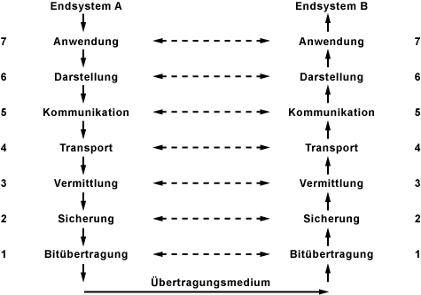
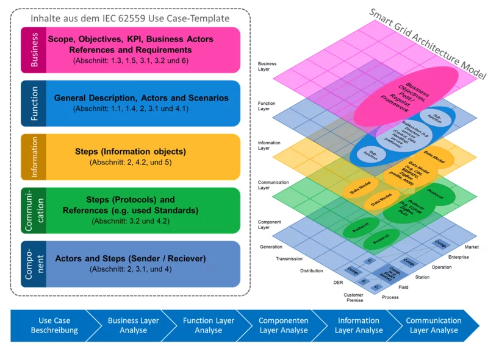
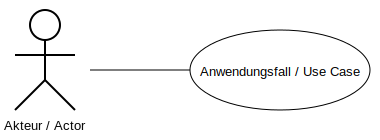
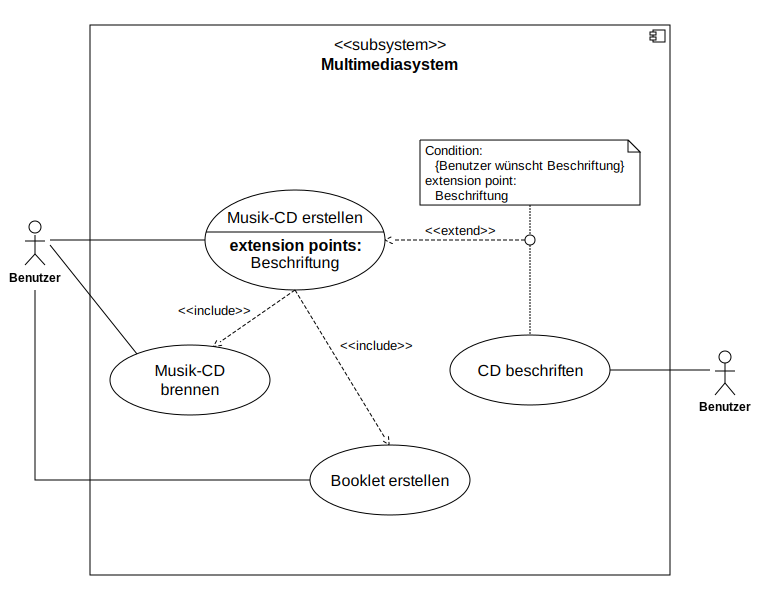
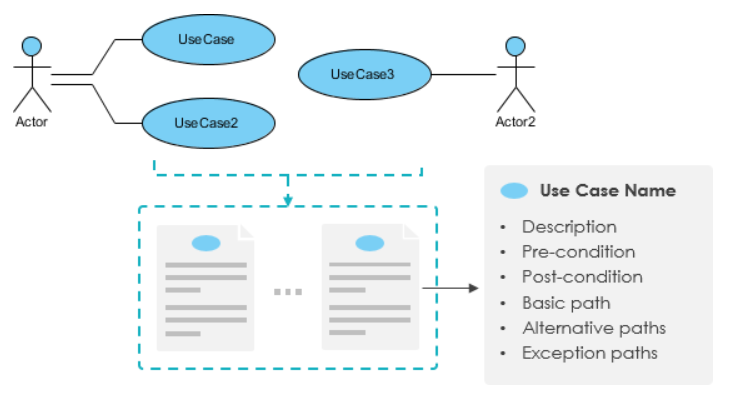
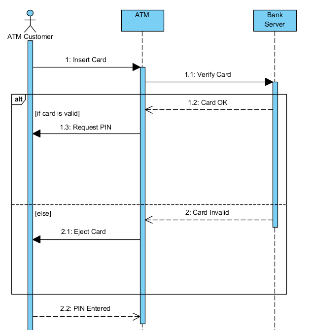

<!-- paginate: true -->


# 2 Use Case Entwicklung

<center>


</center>

---

## 🎯 Lernziele

In dieser Woche werden wir uns mit folgenden Inhalten auseinandersetzen.

* Welche Möglichkeiten gibt es die Anforderungen an ein IoT-System zu dokumentieren?
* Wie können UML Use Case Diagramm und UML-Sequenz-Diagramm dabei helfen?

---

## Herausforderungen bei der Entwicklung von IoT


### Klassische Produktentwicklung

* Zentralisiert
    * ein Produkt
    * eine Hardware Plattform
    * Ein/e Kund:in

* Requirements Engineering 
    * Anforderungserhebung
    * Anforderungsanalyse 
    * Anforderungsspezifikation
    * Anforderungsbewertung 


---

### IoT - System aus Systemen


* Die IoT-Lösung wird aus vielen (bestehenden) Komponenten orchestriert
* Komponenten werden für mehrere Lösungen gleichzeitig eingesetzt
* Problem: Es kann kein einzelnes Requirements Engineering für alle möglichen Lösungen und Komponenten durchgeführt werden
* Lösung: Konzentration aus Anwendungsfälle (Use Cases)
    * z.B. Temperatur-Alarm
    * z.B. Temperatur-Dokumentation


---


### Komplexität bei IoT-Projekten am Beispiel Smart Grid


###### https://www.mdpi.com/1996-1073/13/11/2852

---

#### Beispiel Vehicle2Grid

> Die Batterie des Fahrzeugs soll als Speicher eingesetzt werden und in Zeiten mit knappen Energieangebot Energie ins Netz einspeichern. Die Mobilitäts-Bedürfnisse der Nutzer:in dürfen dabei nicht eingeschränkt werden. 

---

### Interoperabilität



* zwei Systeme sind nur dann interoperabel, wenn sie  auf allen Schichten OSI-Modells miteinader im Einklang sind
* Open Systems Interconnection Model mit Fokus auf Datenübertragung in Netzwerken
* Ähnliche Ansätze für die Entwicklung von IoT-Geschäftsmodellen

---

### Komplexität bei IoT-Projekten am Beispiel Smart Grid

<center>



</center>

###### https://www.ffe.de/wp-content/uploads/2020/04/20200318_Veroeffentlichung_Anwendungshilfe-Use-Case-Methodik_final.pdf


---


### Vom Abstrakten zum Konkreten

* **Business layer:** Ziele, Qualitätskriterien, Abgrenzung, Beteiligte
* Function layer: Wer übernimmt welche Funktion?
* Information layer: Welche Information wird ausgetauscht?
* Component layer: Durch welche technischen Komponenten wird das wer dargestellt?
* Communication layer: Wie wird die Information ausgetauscht?


---

## 🧠 UML (Unified Modeling Language) Anwendungsfalldiagramm

 - **Modellierungssprache** zur Spezifikation, Konstruktion, Dokumentation und Visualisierung von Software-Teilen durch verschiedene Werkzeuge
- **Anwendungsfalldiagramm**  stellt das erwartete Verhalten eines Systems dar (**Wer kann was mit dem System machen?**)



---

### 🧠 UML Anwendungsfalldiagramm


- **Akteure** z.B. Kund:innen oder Administrator:innen aber auch ein anderes System
- **Anwendungsfälle** als Ellipsen. Beschreibung z. B. in einem Kommentar oder als Tabelle
- **Assoziationen** zwischen Akteuren und Anwendungsfällen (Linien)
- **Systemgrenzen** werden durch Rechtecke gekennzeichnet.


---

### Beispiel



- **Benutzer:in** ist an vier Anwendungsfällen interessiert, die ihrerseits in Beziehung stehen. 
- **Musik-CD erstellen** besteht aus zwei anderen Anwendungsfällen ```<includes>``` und kann optional durch einem dritten erweitert werden ```<extends>```


---

#### 🧠 Unterschied `<include>` und `<extends>`

* `<include>` Teilaspekt eines Anwendungsfall, der immer umgesetzt werden muss, um den übergeordnetem Anwendungsfall zu erfüllen
* `<extends>` optionale Erweiterung eines Anwendungsfalls

* `(Quizfrage auf Sakai beantworten)  <-extends- (Antwort mit ChatGTP finden)`
* `(Quizfrage auf Sakai beantworten)  -includes-> (Auf Sakai anmelden)`


---

### Use Case Diagram

- Grafische Darstellung der Rollen und derer Interessen

<center>


</center>

---

## 🧠 Anwendungsfall / Use Case

- Ebenfalls textuelle Beschreibung aus **Perspektive einer Rolle**
- Use Case Beschreibungen geben mehr Kontext zur Interaktion und stellen im Gegensatz zur user Story einen **ganzen Ablauf** dar, der zur erfolgreichen Anwendung des Produktes gehört
- Standardisierten Darstellung nach [Alistair Cockburn](https://de.wikipedia.org/wiki/Alistair_Cockburn)


<center>



</center>

---

### Anwendungsfall Energie Ausspeisen


|                                | Erklärung                                                                                                                                                                               | Beispiel                                                                                                                                         |
|--------------------------------|-----------------------------------------------------------------------------------------------------------------------------------------------------------------------------------------|--------------------------------------------------------------------------------------------------------------------------------------------------|
| Name und Identifikationsnummer | *Anwendungsfälle haben einen Namen und werden nach Sachgruppen geordnet durchnummeriert*                                                                                                  |  UC 2.02 Energie Ausspeisen                                                                                                                  |
| Beschreibung                   | *Hier erfolgt eine kurze Beschreibung, was im Anwendungsfall passiert.*                                                                                                                   | Sofern eine Energieabgabe angefordert wird und keine andere Bedingung dagegen steht (Fahrzeug vorhanden, ausreichend geladen, Nutzer:in einverstanden) wird der Ladeprozess umgekehrt. |

---

|                                | Erklärung                                                                                                                                                                               | Beispiel                                                                                                                                         |
|--------------------------------|-----------------------------------------------------------------------------------------------------------------------------------------------------------------------------------------|--------------------------------------------------------------------------------------------------------------------------------------------------|
| Beteiligte Akteure             | *Akteure sind beteiligte Personen oder Systeme außerhalb des beschriebenen Systems.*                                                                                                      | Fahrzeugnutzer:in, Fahrzeug, Ladesteuerung, Netzbetreiber                                                                                                                  |
| Status                         | *Der Status sagt aus, wie weit die Arbeit an dem Anwendungsfall gediehen ist*                                                                                                             | In Arbeit                                                                                                                                        |
| Verwendete Anwendungsfälle     | Wenn der Anwendungsfall auf andere Anwendungsfälle zurückgreift, werden diese Fälle hier aufgezählt.                                                                                    | UC 1.01 (Energie anfordern),  UC 3.01 (Ladevorgang überwachen),  UC 4.01 (Energieabgabe blockieren)                                                                                                        |

---


|                                | Erklärung                                                                                                                                                                               | Beispiel                                                                                                                                         |
|--------------------------------|-----------------------------------------------------------------------------------------------------------------------------------------------------------------------------------------|--------------------------------------------------------------------------------------------------------------------------------------------------|
| Auslöser                       | *Der fachliche Grund bzw. die Gründe dafür, dass dieser Anwendungsfall ausgeführt wird.*                                                                                                  | Netzengpass oder Energiemangel in Netz löst UC 1.01 (Energie anfordern) aus                                                                                        |
| Vorbedingungen                 | *Alle Bedingungen, die erfüllt sein müssen, damit dieser Anwendungsfall ausgeführt werden kann.*                                                                                           | Fahrzeug vorhanden und über Minimalstand geladen, kein Veto der Fahrzeugnutzerin oder übernutzung des Fahrzeuges                                                                                                                                            |

---


|                                | Erklärung                                                                                                                                                                               | Beispiel                                                                                                                                         |
|--------------------------------|-----------------------------------------------------------------------------------------------------------------------------------------------------------------------------------------|--------------------------------------------------------------------------------------------------------------------------------------------------|
| Invarianten                    | *Alle Bedingungen, die innerhalb und durch den Anwendungsfall nicht verändert werden dürfen, also auch in einem Misserfolgs- oder Fehlerszenario immer noch gewährleistet werden müssen.* | Dokumentation des Prozess, Mindestladestand.                                                                                               |
| Nachbedingung/Ergebnis         | *Der Zustand, der nach einem erfolgreichen Durchlauf des Anwendungsfalls erwartet wird.*                                                                                                  | Fortsetzung der Ladung (UC 2.01)                                                                 |

---

|                                | Erklärung                                                                                                                                                                               | Beispiel                                                                                                                                         |
|--------------------------------|-----------------------------------------------------------------------------------------------------------------------------------------------------------------------------------------|--------------------------------------------------------------------------------------------------------------------------------------------------|
| Standardablauf                 | *Hier wird das typische Szenario dargestellt, das leicht zu verstehen oder der am häufigsten vorkommende Fall ist.*                                                                       | Energie wird entsprechend der Anforderung ausgespeist.                      |
| Alternative Ablaufschritte     | *Dies sind Szenarien, die sich außerhalb des Standardablaufs auch bei der (versuchten) Zielerreichung des Anwendungsfalls ereignen können.*                                               | Abbruch durch Netzbetreiber, Fahrzeug oder Nutzer:in                                                                       |

---


|                                | Erklärung                                                                                                                                                                               | Beispiel                                                                                                                                         |
|--------------------------------|-----------------------------------------------------------------------------------------------------------------------------------------------------------------------------------------|--------------------------------------------------------------------------------------------------------------------------------------------------|
| Hinweise                       | *Kurze Erklärungen zum besseren Verständnis, Hinweise zu Nebeneffekten, Mengengerüsten soweit erforderlich und alles andere, das nicht weiter oben dargestellt werden kann.*              | keine                                                                                                                                            |
| Änderungsgeschichte            | *Versionierung, Name des Autors, Datum*                                                                                                                                                   | 0.01; 10.01.2022.; Julian Huber                                                                                                                  |
|                                |                                                                                                                                                                                         |                                                                                                                                                  |

---

### Beispiele


- [https://smart-grid-use-cases.github.io/](https://smart-grid-use-cases.github.io/docs/usecases/ebalance-plus/uc8/),  [EPRI](https://smartgrid.epri.com/Repository/Repository.aspx)

---

## Sequenz Diagramm

* Business layer: Ziele, Qualitätskriterien, Abgrenzung, Beteiligte
* **Function layer:** Wer übernimmt welche Funktion?
* Component layer: Durch welche technischen Komponenten wird das wer dargestellt?
* **Information layer:** Welche Information wird ausgetauscht?
* Communication layer: Wie wird die Information ausgetauscht?


---


### 🧠 UML-Sequenzdiagramm

- Stellt den Prozess der Interaktion zwischen **Objekten** (Komponenten) mittels Austausch von **Nachrichten** (Pfeilen) und **Lebenslinien** (Balken) dar
- [mermaid.live](https://mermaid.live/) ermöglicht solche Diagramme mit einer Markup-Language zu bauen




###### https://stackoverflow.com/questions/52231702/uml-sequence-diagram-auto-numbering-in-visual-paradigm

---

### Elemente eines  UML-Sequenzdiagramm

* Für einen Use Case sollte das Hauptszenario (und weitere wichtige) als UML-Sequenzdiagramm dargestellt werden
* Systeme sind Blackboxen 
* Fokus auf die Interaktion und 
* Wichtige Elemente
    * Externe Rollen/Komponenten
    * Nachrichten zwischen den Rollen
    * Antworten auf die Nachrichten
    * Schleifen, Iterationen, Alternativen

---

### Vom Use Case zum Sequenzdiagramm

- Auswahl eines Use Case und Szenarios
- Welche Rollen sind beteiligt?
- Welche weiteren Use Cases werden berührt?
* Am Beispiel UC 2.02 Energie Ausspeisen            


---

<center>


</center>


---

### Hinweise zum UML-Sequence Diagramm

* Im ersten Schritt ggf. noch unvollständig (nicht alle Antworten)
* Systeme teilweise zusammengefasst (Nutzer / SmartPhone-App / HMI Ladestation) (Ladesteuerung / Leistungselektronik in Wallbox)
* Definiert nicht den genauen Informationsgehalt der Nachrichten
* Definiert nicht (immer) wer die Nachricht absendet oder anfordert (push/pull)

---

```
sequenceDiagram

    Netzbetreiber->>Ladesteuerung: Energiemenge anfordern mit Zeitplan
    activate Ladesteuerung
    Ladesteuerung->>Fahrzeug: Ladestand abfragen
    activate Fahrzeug
    Fahrzeug-->>Ladesteuerung: Ladestand übermitteln
    deactivate Fahrzeug
    Ladesteuerung->>Nutzer: über Energieabgabe informieren
    Nutzer-->>Ladesteuerung: ok, ist nicht blockiert
    loop Every minute
        Ladesteuerung->>Nutzer: aktueller Zustand
        Ladesteuerung->>Netzbetreiber: aktueller Zustand
    end
    opt Extra response
        Nutzer->>Ladesteuerung: Energieabgabe stoppen
    end
    deactivate Ladesteuerung
```

###### https://mermaid.live/


---

## Offene Punkte

* Business layer: Ziele, Qualitätskriterien, Abgrenzung, Beteiligte
* Function layer: Wer übernimmt welche Funktion?
* **Component layer:** Durch welche technischen Komponenten wird das wer dargestellt?
* Information layer: Welche Information wird ausgetauscht?
* **Communication layer:** Wie wird die Information ausgetauscht?


---

## Weiterführende Literatur & Ressourcen 
 

- Die folgenden Ressourcen sind für diese Woche relevant:
     - [diagrams.net](https://www.drawio.com/) Tool zum erstellen von Grafiken
    - weitere [Beispiele](https://www.javatpoint.com/uml-use-case-diagram) für Use Case Diagrams
    - [Mermaid Auszeichnungssprache und Tool](https://mermaid.live/edit#pako:eNplkLGKwzAMhl8laLrSPEHmo1unbHc-irCV1GDLwZaHo-TdqyYtuFST-D4hpP8GNjmCAQzbgKV8e5wzRsOd1ka6kbikfNvRo46jZM9zxxjpk1b20tBTSChdJCw1UyRu3e_fhy2Nnkkujfo6NM5isA_Jb3TRC-TiUPCFV8PQQ6Qc0Tt9c3vDgFx1pYFBW0cT1iBGE1h1FKuk8Z8tDJIr9VAXXUfPWF6QnJeUz3tyW4A9LMg_KenIhKHQegdeIG06) zum Erstellen von Grafiken
    - [Mermaid Syntax Beispiele](https://mermaid.js.org/syntax/flowchart.html) für Grafiken
    - weitere [Beispiele](https://www.javatpoint.com/uml-sequence-diagram) für Sequence Diagrams

