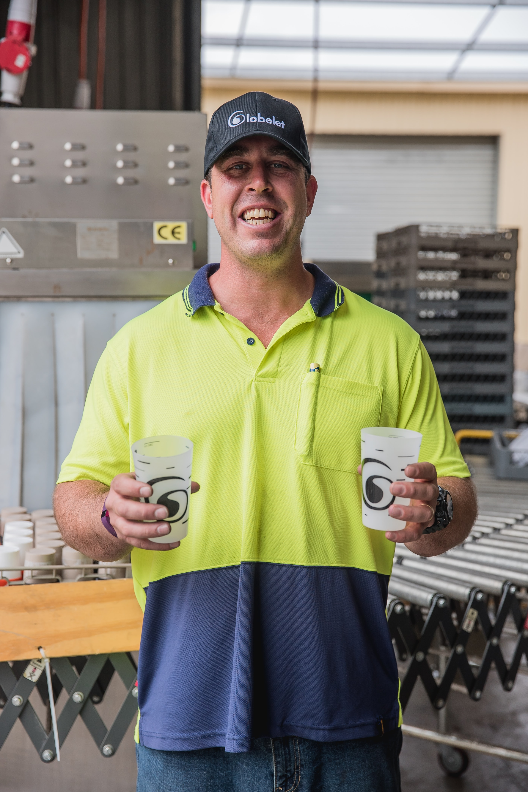

<!-- paginate: true -->

# Aufgaben 2: Use Case Entwicklung

---

## Vorstellung Projekt

* Herr Müller betreibt eine Produktionsfirma für Spritzguss-Erzeugnisse

---

* Um ein Kunststoff mit den richtigen Eigenschaften zu erzeugen, müssen verschiedene Plastikgranulate gemischt werden

---

* Dies erfolgt automatisiert über einer Mischanlage

---

* Herr Krauß ist der Herr über die Mischanlage.
* Er erkennt Probleme und Stillstände sofort, manch einer behauptet er könne Probleme sogar vorausahnen.
* Dies liegt auch an seinem herausragendem Gedächtnis. Herr Kraus weiß auch heute noch welche Granulate für die Becher bei der Fußball EM 2008 eingesetzt wurden.
* Zudem kümmert sich Herr Kraus um den Nachkauf von Granulaten, so dass diese nie ausgehen.
* Leider verabschiedet sich Herr Krauß nächstes Jahr in den wohlverdienten Ruhestand.

---

### Ihre Aufgabe

* Gemeinsam mit Ihren Kommilitonen entwickeln Sie eine IoT-Lösung, die Herr Müller und seine Kollegen nach dem Ausscheiden von Herrn Krauß bestmöglich unterstützt. 
* Da die gleiche Anlage auch an mehreren Produktionsstandorten steht, sollen Sie hierbei auch Skalierungs-Potentiale mitdenken.

---

### Systembeschreibung der Anlage

* Die Produktionsplanung beruht auf **Rezepten** für die **Flaschen**, diese geben für jeden **Dispenser** an, wie viel Gramm einzufüllen ist.
* Die Pellet Dispenser sind zylindrischen Rohre, die die richtigen Pellet-Farben für das aktuelle Rezept vorhalten.
    * Mittels eines **Schneckengewinde** kann jeder Pellet Dispenser eine vorbestimmte Menge von Pellets abfüllen. Hierbei kann es zu Schwankungen kommen. 
    * Jeder Pellet Dispenser verfügt über einen **Ultraschall-Sensor**, der den aktuellen Füllstand ungefähr abschätzen kann.
    * Nach jedem Abfüllprozess kann ein Pellet Dispenser seinen aktuellen Füllstand übermitteln
* Am Ende des Prozesses wird jede Flasche auf einer **Waage** gewogen. 

---

#### UseCase 1: Dashboard

- Die Schichtleiter:in möchte die Füllstände aller Dispenser in Echtzeit überwachen können. 
- Zudem soll der letzte Nachfüll-Zeitpunkt angezeigt werden.
- Zudem sollen alle abgefüllten Flaschen in einer Tabelle dokumentiert werden, so dass Falschen mit zu geringem Gewicht anhand ihrer Flaschennummer aussortiert werden können.

---

#### UseCase 2: Automatisierte Benachrichtigung

- Da die Schichtleiter:in nicht ständig neben dem Dashboard steht, möchte er über Probleme automatisiert gewarnt werden

- **Warnung**: Anzeige einer Benachrichtigung im Dashboard
    - für gewogene Flaschen
        - Gewicht weicht mehr als x g vom Zielgewicht ab
        - Zielgewicht und Abweichung wird zuvor über Dashboard eingegeben und kann geändert werden
    - für Dispenser
        - Füllstand eines Dispensers > 25%

- **Kritisch** = Anzeige im Dashboard + Benachrichtigung per akustischem Hinweis
    - Gewicht weicht mehr als x g vom Zielgewicht ab
    - Zielgewicht und Abweichung wird über Dashboard eingegeben

---

#### UseCase 3: Automatisches Wiederauffüllen

* Die Lagerhaltung der Firma soll über die IoT-Could informiert werden, welcher der Dispenser nachgefüllt werden soll, sobald sein Füllstand unter 25% fällt.
* Dazu wird ein JSON-Objekt mit Nachbestellung, Farbe der Pellets und Gruppenname an einen MQTT broker gesendet.

---

#### Use Case 4: Qualitätsmanagement

* Das Qualitätsmanagement möchte Statistiken über den Prozess abfragen können (z.B. alle Gewichtsabweichungen mit Datum)
* Denken Sie daran dass dazu die Daten nicht nur abgefragt, sondern zunächst auch abgespeichert werden müssen

---

## 🏆 P1: Fertigen Sie ein Use Case Diagramm an (6pkt)

- Sie können hierfür die folgende [Website](https://app.diagrams.net/) nutzen 
- Das zu entwickelnde System ist die IoT Cloud (node-red)
- Setzen Sie die folgenden Rollen ein: 
    - Dispenser (IoT-Device)
    - Schichtleiter (User)
    - Waage (IoT-Device)
    - Qualitätsmanagement (User)
    - Lagerhaltung (User)
- Halten Sie sich an die [formalen Regeln](https://www.uml-diagrams.org/use-case-diagrams.html) für UseCase Diagramme
- Zerlegen sie den UseCase 1: Dashboard in mindestens zwei UseCases mittels eines `<extends>` oder `<includes>`
- Speichern Sie das `svg`-Datei mit den Namen `P1-UseCaseDiagramm.svg` und laden Sie dieses in Sakai hoch
- Schreiben Sie ihre Vor- und Nachnamen in die Abgabe, um ihre Gruppenzugehörigkeit zu dokumentieren
- Laden Sie in der Folge immer mit dem gleichen Sakai-Account hoch

---

## 🏆 P2: Beschreiben Sie einen Use Case in einem Template (10pkt)

- Füllen Sie ein Use Case Template nach Alistair Cockburn für UseCase 3: Automatisches Wiederauffüllen aus
- Speichern Sie das `pdf`-Datei mit den Namen `P2-UseCaseBeschreibung.pdf`

---

## 🏆 P3: Fertigen Sie ein Sequenzdiagramm an (4pkt)

- Erstellen Sie ein Sequenzdiagramm für UseCase 3: Automatisches Wiederauffüllen. 
- Sie können den folgenden [Editor](https://mermaid.live/edit#pako:eNptkDFuwzAMRa_CcK18AQ8pCnRoCnTqVnhh5Z9YgCSmsoQiCHL30nazhdMH-R4B8speR3DPM34assdrkFORNGSyeonBo9vvn951yj29IUalJTua9JekgC7anh_CG-YlLwhNkEIJ_-gy6wztVscWh812dFiNlTZt9xg_0BGIdCqQumPHCSVJGO2K6yIMXCckDNxb_JbZ0pBvxkmr-nnJnvtaGhy38yj1fvG9iTFULR_bV9bnOD5L_lI15Chxxu0Pdk9jmA) nutzen
- Nutzen Sie die Komponenten 
    - Dispenser 
    - Lagerhaltung 
    - IoT Cloud
- Zeichen sie auch die Aktivitäten der Komponenten ein
- Nutzen Sie einen `loop`, um die wiederkehrenden Meldungen des Dispensers kenntlich zu machen
- Nutzen sie ein `opt`, um die Bedingtheit der Bedarfsanforderung kenntlich zu machen
- Die Syntax finden Sie [hier](https://mermaid.js.org/syntax/sequenceDiagram.html)
- Speichern Sie das `svg`-Datei mit den Namen `P3-SequenceDiagramm.svg`

