<!-- paginate: true -->


# 3 Datenstrukturen

<center>


</center>

---

## Beispiel: Smart Charging

<center>


</center>

---

* Business layer: Ziele, Qualitätskriterien, Abgrenzung, Beteiligte
* Function layer: Wer übernimmt welche Funktion?
* Component layer: Durch welche technischen Komponenten wird das wer dargestellt?
* **Information layer:** Welche Information wird ausgetauscht?
* Communication layer: Wie wird die Information ausgetauscht?

---

### Energiemenge anfordern mit Zeitplan

- Energiemenge und Zeitplan

<center>

| Von | Bis | Leistung in kW |
|:---:|:---:|:---:|
| 13:00 | 13:15 | 2.0 |
| 13:15 | 13:30 | 4.0 |
| 13:30 | 13:45 | 3.0 |

</center>


---

## Codierung von Datentypen

<center>

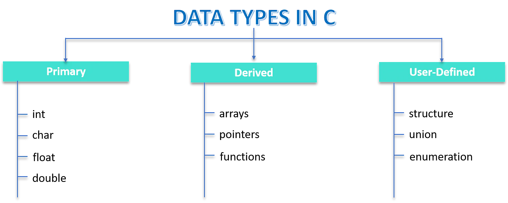

</center>


---

### Codierung von Text

<center>


</center>

---

#### Daten können in binären Code übersetzt werden

<center>


</center>


---

* Tabelle als CSV-Datei
    ```
    Von, Bis, Leistung in kW
    13:00, 13:15, 2.0 
    13:15, 13:30, 4.0 
    13:30, 13:45, 3.0 
    ```

* Text als ASCII
    ```
    01010110 01101111 01101110 00101100 00100000 01000010 01101001 
    01110011 00101100 00100000 01001100 01100101 01101001 01110011 
    ...
    ```


---

### Nachteile einfacher Textformate

- Nicht alle Daten können sinnvoll als Tabelle übertragen werden
  - Redundanzen (Sollen Tabellenköpfe immer übertragen werden?)
  - Hierarchien
- Moderne Datenübertragungs-Formate orientieren sich meist an der Objektorientierten Programmierung (OOP)

    ```
    Von, Bis, Leistung in kW, Datum
    13:00, 13:15, 2.0, 21.03.2023
    13:15, 13:30, 4.0, 21.03.2023
    13:30, 13:45, 3.0, 21.03.2023
    ```

---

### JavaScript

<center>

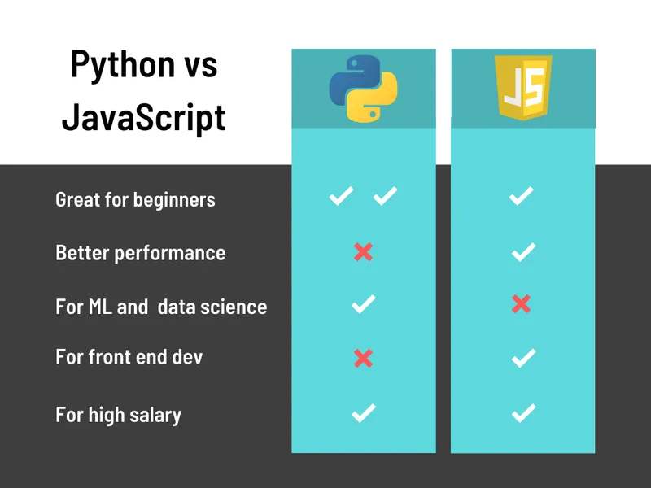

</center>

---

In JavaScript werden `const`, `var` und `let` verwendet, um Variablen zu deklarieren, aber sie haben einige Unterschiede in Bezug auf Scoping, Veränderbarkeit und Neuzuweisung:

* `var`:
  * Funktionsbereich oder globaler Bereich, nicht Blockbereich.
  * Kann innerhalb desselben Bereichs neu deklariert werden.
  * Wird an den Anfang ihres Funktions- oder globalen Bereichs gesetzt.
  * Veraltet

```javascript
var x = 10;
if (true) {
    var x = 20;
    console.log(x); // Outputs 20
}
console.log(x); // Outputs 20
```

---

* `let`:
  * Gilt im Block-Bereich
  * Kann nicht innerhalb desselben Bereichs neu deklariert werden, wer kann sich jedoch ändern


```javascript
let y = 10;
if (true) {
    let y = 20;
    console.log(y); // Outputs 20
}
console.log(y); // Outputs 10
```

--- 

* `const`:
  * Gilt im Block-Bbereich
  * Ähnlich wie `let`, aber mit der zusätzlichen Einschränkung, dass es nach der Deklaration nicht neu zugewiesen werden kann.
  * Muss bei der Deklaration mit einem Wert belegt werden.

```javascript
const z = 10;
// z = 20; // Error: Assignment to a constant variable
```

Im Allgemeinen wird empfohlen, standardmäßig `const` zu verwenden und nur dann `let` zu benutzen, wenn Sie wissen, dass sich der Wert der Variablen ändern wird. Dies hilft beim Schreiben von robusterem und vorhersehbarerem Code, da die Wahrscheinlichkeit versehentlicher Neuzuweisungen verringert wird.

---


#### Erzeugung eines zufälligen Temperaturwerts in node-red Knoten

```JS
//JavaScript in node-red
let randomTemp = (Math.random() * 50).toFixed(1);  // float mit einer Stelle

let timeIndex = Date.now(); // Spezieller Datentyp für Daten

msg.payload =  // Node-Red Nachricht als Dictionary
            {
               "uid" : 1,
                "timeStamp": timeIndex,
                "temp": randomTemp
            };

return msg;
```

---

#### Darstellung eines Datenpunkt als JavaScript Object Notation  (JSON)

```
Von, Bis, Leistung in kW, Datum
13:00, 13:15, 2.0, 21.03.2023
13:15, 13:30, 4.0, 21.03.2023
13:30, 13:45, 3.0, 21.03.2023
```

```python
msg.payload = {
  datum : "21.03.2023",
  leistungsstufen:[{
    "Start":"13:00",
    "Ende":"13:15",
    "Leistung in kW":2.0,
  },{
    "Start":"13:15",
    "Ende":"13:30",
    "Leistung in kW":4.0,
  },{
    "Start":"13:30",
    "Ende":"13:45",
    "Leistung in kW":3.0
  }]
}
```


---

## Objektorientierung


### 🎯 Lernziele

Nach dieser Einheit sind Sie in der Lage dazu
* Klassen und Objekte im Sinne der Objektorientierten Programmierung zu beschreiben


---

#### Komplexität bei IoT-Projekten am Beispiel Smart Grid


###### https://www.mdpi.com/1996-1073/13/11/2852

---

### 🧠 Objekte

- Objektorientierte Programmierung: Programmierparadigma mit Fokus auf Objekte, deren Eigenschaften und Fähigkeiten
- z.B. Objekt der Klasse SmartMeter
  - Attribute (Eigenschaften):
    - Zählernummer
    - Aktueller Messerwert 
    - Liste bisheriger Messerwerte
  - Methoden:
    - Mittelwert bilden
    - Messen
    - Letzten Messwert übermitteln


---

### 🧠 Klassen

* Die Klasse SmartMeter ist eine abstrakte Beschreibung aller denkbaren Objekte vom Typ `SmartMeter`
* Ein konkreter Objekt Smart Meter ist eine Instanz (Ausprägung) der Klasse Smart Meter


---

### Objektorientierte Programmierung

- Aufbauend auf strukturierter Programmierung (`if-else`, `for`, `function()`)
- Fokus erst auf das was (**Objekte**) dann erst auf das wie (Algorithmen)
- Erleichtert den Einsatz von **komplexem Code** und Austausch zwischen Entwickler:innen und Anwender:innen

---

#### 🧠 Objekte sind Instanzen von Klassen   


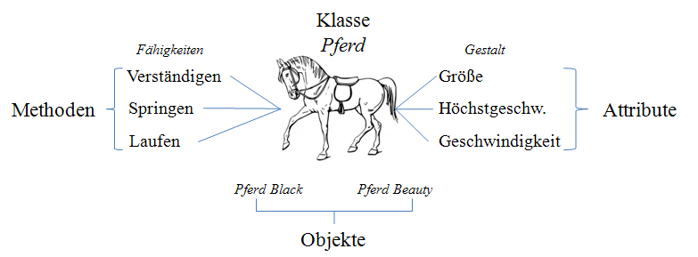

* Die Klasse Pferd beschreibt alle Pferde
* Objekte Black and Beauty sind zwei Instanzen der Klasse Pferd

---

#### 🧠 Attribute und Methoden 


* Die **Attribute** sind Variablen entweder mit elementaren Datentypen 
(int, str, float) oder wiederum Klassen
* Die **Methoden** sind (kleine) Algorithmen, die im Sinne der strukturierten Programmierung implementiert werden müssen (Prozeduren und Funktionen)

---

#### Sinnvolle Klassen

Kandidaten für Objekte und Klassen in der objektorientierten Analyse sind:
- Ein **Ding**, das sichtbar und beschreibbar ist
    - Reale Dinge: Sensor, SmartMeter, Thing, Fahrzeug...
- **Etwas**, das man sich **vorstellen** kann
    - Rollen: Nutzer:in, Energieversorger, ...
    - Spezifikationen: Temperaturmessung, Energieanforderung ...
- Etwas, das in **Taten** umgesetzt werden kann oder etwas nicht Gegenständliches
    - Ladesteuerung, ...

---

#### Umsetzung in Code

- Eine Klasse ist das allgemeine Beschreibung einer Klasse von Objekten:

```JS
// JavaScript
class Pferd {
    constructor(groesse, geschwindigkeit) {
        this.groesse = groesse;
        this.geschwindigkeit = geschwindigkeit;
    }
}
```

- Die Methode **```constructor()```** ist der **Konstruktor** und wird aufgerufen, sobald ein **Objekt** einer **Klasse** instanziiert wird. 
- Hier wird beispielsweise ein Objekt mit den **Attributen** **```groesse```** und **```geschwindigkeit```** erzeugt.


---


#### Objekte und Klassen 🧠

- Ein Objekt ist eine spezielle Ausprägung einer Klasse
- Um mit einer Klasse zu arbeiten werden Objekte der Klasse instanziiert

```JS
// JavaScript
const black = new Pferd("140 cm", '30 kmh');
const beauty = new Pferd("150 cm", '40 kmh');
  ```

- Die Klasse Pferd beschreibt allgemein das Verhalten jedes Pferdes!
- Hier werden zwei Objekte der Klasse Pferd angelegt
- Die beiden Pferde sind durch die Menge ihrer Attribute vollständig beschrieben


---

#### Methoden 🧠

- Prozeduren oder Funktionen 

```JS
// JavaScript
class Pferd {
    // [...]

    constructor(groesse, geschwindigkeit) {
        this.groesse = groesse;
        this.geschwindigkeit = geschwindigkeit;
    }

    laufen() {
        console.log(`Läuft mit ${this.geschwindigkeit}`);
        // [...]
    }
}

const black = new Pferd("140 cm", '30 km/h');
black.laufen();
//> "Läuft mit 30 km/h"
```

---

#### 🧠 Methoden & Funktionen

* Methoden sind Funktionen, die zu einer Klasse gehören
* Funktionen sind wieder aufrufbare Code-Einheiten, denen Argumente als Parameter übergeben werden können
* Funktionen geben einen Rückgabewert aus, der weiterverarbeitet werden kann


---

```JS
// JavaScript
function calculateMean(measurements) {
    /* A function that takes a list of values and returns the arithmetic mean */

    const mean = measurements.reduce((sum, value) => sum + value, 0) / measurements.length;
    return mean;
}

const result = calculateMean([1, 2, 3]);
```

```JS
// JavaScript
function functionName(parameter) {
    /* Docstring: Comment for documentation */

    // Calculations of the function
    return returnValue;
}
```

---


#### Beispiel Objekt Smart Meter

```JS
// JavaScript
// Class description in JavaScript
class SmartMeter {

    // Constructor definition to create an object of the class
    constructor(meterId) {
        // Attribute definition
        this.meterId = meterId;
        this.listOfMeasurements = [];
    }

    // Method definition
    calculateMean() {
        return this.listOfMeasurements.length > 0
            ? this.listOfMeasurements.reduce((sum, value) => sum + value, 0) / this.listOfMeasurements.length
            : 0; // Avoid division by zero
    }

    measure(value) {
        const measurement = value; // Assuming the value comes from somewhere
        this.listOfMeasurements.push(measurement);
        return measurement;
    }
}

// Example usage:
const smartMeterInstance = new SmartMeter("123456");
smartMeterInstance.measure(10);
smartMeterInstance.measure(15);
const meanValue = smartMeterInstance.calculateMean();
console.log(meanValue); // Output mean value based on measurements

```

---

```JS
// JavaScript
// Creating an object of the SmartMeter class
const smartMeter1 = new SmartMeter(123);

// Accessing the meterId attribute of the smartMeter1 object
console.log(smartMeter1.meterId);
// > 123

// Calling the measure method of the smartMeter1 object
smartMeter1.measure(2);
// An element has been added to the listOfMeasurements attribute
console.log(smartMeter1.listOfMeasurements);
// > [2]

smartMeter1.measure(4);
console.log(smartMeter1.listOfMeasurements);
// > [2, 4]

console.log(smartMeter1.calculateMean());
// > 3.0


```


---

#### Zugriff auf Attribute

* `<object>.<attribut>` oder bei JSON auch `<json_object>.["<attribut>"]`
```JS
// JavaScript
console.log(smartMeter1.meterId);
// > 123
```
* Objekte leben im Arbeitsspeicher
  * 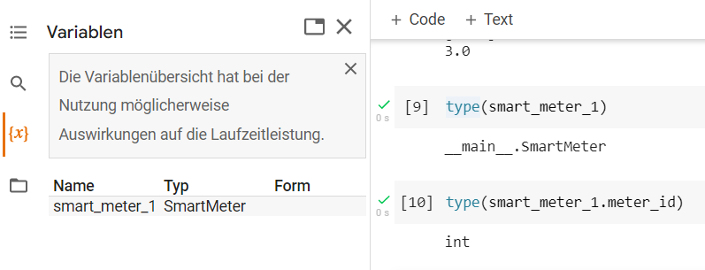

---

## Funktionen in node-red (JavaScript)

---

### `messages`

* [messages](https://nodered.org/docs/user-guide/messages) in node-red sind Objekte mit folgenden Attributen
  * `msg.payload` : Der eigentliche Inhalt der Nachricht als `JSON`
  * `msg.topic` : Ein optionales Attribut, das als Überschrift für die Nachricht dient
  * `msg_id` : Ein optionales Attribut, das als eindeutige Identifikation der Nachricht dient


```JS
{
    "_msgid": "12345",
    "payload": "..."
}
```

---

### `nodes`

- bei nodes sind vor allen deren Methoden (Aktionen) wichtig bei Ankommen einer `message` wird die in den Knoten definierte Funktion ausgeführt (bei `function`-`nodes` können wir diese selbst schreiben)

<center>

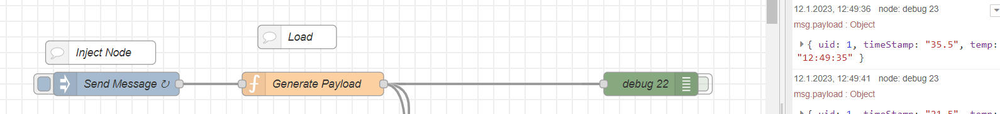

</center>


---

```JS
// JavaScript in node-red
// Die Eingehende Nachricht, msg wird immer übergeben
var uid = msg.payload.uid; // msg.payload["uid"]
var temp = msg.payload.temp;
var time = msg.payload.timeStamp ;
var timeReadable = new Date(time).toLocaleTimeString();
msg.payload = 
            {
               "uid" : uid,
                "timeStamp": temp,
                "temp": timeReadable
            };
// Standardmäßig wird die veränderte Nachricht ausgegeben
return msg;
```


---

#### Funktionen in JavaScript (allgemein)

```JS
// JavaScript 
function generate_payload(uid, temp, time) {
  var timeReadable = new Date(time).toLocaleTimeString();

    msg.payload = 
                {
                "uid" : uid,
                    "timeStamp": temp,
                    "temp": timeReadable
                };

    return msg;
}
```

---

#### Lokale und Globale Variablen

* Funktionen können Grundsätzlich nur mit Variablen arbeiten, die Ihnen übergeben werden

* Variablen, die **lokal** mit `let <variablenname>` gesetzt werden, sind nur innerhalb der Funktion sichtbar
* Soll eine Variable auch in anderen Funktionen nutzbar sein, muss Sie mittels spezieller Befehle als **globale** Variable gesetzt werden
* `global.set("<variablenname>", 100)` setzt `<variablenname>` auf `100`
* `global.get("<variablenname>")` gibt den Wert `100` zurück
* Bei node-red erfolgt dies über den [`context`](https://nodered.org/docs/user-guide/context)

---


## Serialisierung  

### 🎯 Lernziele

Nach dieser Einheit sind Sie in der Lage dazu
* Objekte mit Attributen als JSON-Datei darzustellen
* Objekte, JSON-Strings und Dictionaries zu unterscheiden


---

### Serialisierung von Objekten


* Zur Übertragung zwischen Systemen müssen Objekte unabhängig von der Darstellung im Arbeitsspeicher gemacht werden
* ASCII vs. UTF, 32 vs 64 Bit, Linux vs. Windows, etc...
* Serialisierung:
  * Objekt aus dem Arbeitsspeicher wird in eine Folge von Zeichen übersetzt
  * Austauschdateiformat (meist in Form einer Auszeichnungssprache)

---


* Sollen Objekte gespeichert oder Übertragen werden, sind in erster Linie die Attribute relevant:
```JSON
{"zaehlernummer": 123, "aktueller_messewert": 3, "messwerte": [2, 4]}
```


---

##### Dictionaries

- fundamentale Datenstruktur in [vielen](https://en.wikipedia.org/wiki/Comparison_of_programming_languages_(associative_array)) Programmiersprachen 
(vgl. HashMaps, HashTables, associative arrays)
- Assoziiert einen `<key>` mit einem `<value>`
- in Python und JavaScript: `{<key>:<value>}`

* gültige Datentypen für keys und values: 
  * string, number, boolean, list, another dictionary
```JavaScript
// JavaScript
const dict1 = {
    key0: {
        key1: 'value1',
        key2: ['value21', 'value22'],
        key3: 'value3'
    }
};
```

---

* Aufruf von Werten in einen Dictionary
```JavaScript
console.log(dict1.key0);
// > { key1: 'value1', key2: [ 'value21', 'value22' ], key3: 'value3' }

console.log(dict1["key0"]);
// > { key1: 'value1', key2: [ 'value21', 'value22' ], key3: 'value3' }
```

---

### JSON (JavaScript Object Notation)

* Auszeichnungssprache, welche Dictionaries als Zeichenkette abbildet
* für Menschen einfach zu lesen und zu schreiben und für Maschinen einfach zu parsen
* JSON baut auf zwei Strukturen auf:
  * Name/Wert Paare (Python: Dictionary)
  * Eine geordnete Liste von Werten (Python: List)


###### https://www.json.org/json-de.html

---

#### Beispiel JSON-Datei zur Beschreibung des Objekts Smart Meter

* Zeichenketten, die Objekte abbilden können
* Insbesondere Attribute

```JSON
{"zaehlernummer": 123, "aktueller_messewert": 3, "messwerte": [2, 4]}
```


---

#### ✍️ Aufgabe: Objekte in JSON übersetzen

```JS
// JavaScript
class SmartMeter {
  constructor(meter_id, einbau_datum) {
    this.meter_id = meter_id; // as string
    this.list_of_measurements = []; // list of integers
    this.einbau_datum = einbau_datum; // as string
  }
}

class Building {
    constructor(buildingId, smartMeters) {
        this.building_id = buildingId;
        this.smart_meters = smartMeters;
    }
}

let smart_meter_2 = new SmartMeter("234", "2.1.2025");
let building_1 = new Building("House 1", [smart_meter_2]);
```

---

#### Schritt 1

- Welche Klassen gibt es?
- Was sind deren Attribute?
- Welchen Datentyp haben diese?


#### Schritt 2

- In welcher Beziehung stehen die Klassen zueinander?
- "Innere" Klasse als Folge von Schlüssel-Wert-Paaren beschreiben
- "Äußere" Klasse als Folge von Schlüssel-Wert-Paaren beschreiben

#### Schritt 3
- "Innere" Klasse als Wert in "äußere" Klasse einfügen

#### Schritt 4

- JSON-Notation auf Richtigkeit überprüfen
- Hierbei helfen sogenannte [Linter](https://jsonlint.com/) 

---

```JSON
{"building_id": "House 1",
 "smart_meters": 
                [{"meter_id": "234", 
                  "list_of_measurements": [], 
                  "einbau_datum": "2.1.2025"}]
}
```
---

### JSON-Dateien als Austauschformat

* Objekte und damit die Struktur von JSON Dateien können innerhalb der Syntax willkürlich festgelegt werden
* Möchte man jedoch interoperable Systeme bauen, muss man die Schnittstellen fest definieren
* Protokolle legen fest, welche Strukturen möglich sind

###### https://nodered.org/docs/developing-flows/message-design

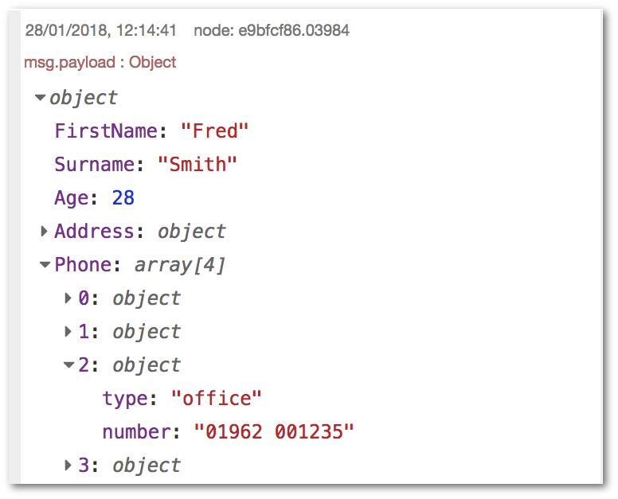

---


#### JSON und JavaScript-Objekt

* Zur Übertragung werden serialisierte Zeichenketten im JSON-Format genutzt
* Im Programm werden diese zu Objekten de-serialisiert

```JS
// JavaScript
class SmartMeter {
    constructor(meterId, list_of_measurements, einbau_datum) {
        this.meter_id = meterId;
        this.list_of_measurements = list_of_measurements;
        this.einbau_datum = einbau_datum;
    }
}

class Building {
    constructor(buildingId, smartMeters) {
        this.building_id = buildingId;
        this.smart_meters = smartMeters;
    }
}

// Create SmartMeter objects
const smartMeter1 = new SmartMeter("234", [], "2.1.2025");

// Create Building object
const buildingObject = new Building("House 1", [smartMeter1]);

console.log(buildingObject.building_id);
// > House 1
console.log(buildingObject.smart_meters[0].meter_id);
// > 234
```

---


---

#### Programmierschnittstellen

* API (application programming interface)
* Programmteil, der von einem Softwaresystem anderen Programmen zur Anbindung an das System zur Verfügung gestellt wird
* Zur Bereitstellung solch einer Schnittstelle gehört meist die detaillierte Dokumentation der Schnittstellen-Funktionen mit ihren Parametern auf Papier oder als elektronisches Dokument
* Häufig werden als JSON serialisierte Objekte übertragen


---

#### Alternativen

- Übertragung in Textform in anderen Auszeichnungssprachen ([YAML](https://de.wikipedia.org/wiki/YAML), [XML](https://de.wikipedia.org/wiki/Extensible_Markup_Language)) sind selbst-beschreibend
- Binärcodierung in Telegrammen meist daten-sparsamer


---


#### XML (Extensible Markup Language)

```XML
<?xml version="1.0" encoding="UTF-8"?>
<webio>
  <iostate>
    <sensor>
      <name>Temperatur</name>
      <number>0</number>
      <unit>°C</unit>
      <value>23.900000</value>
    </sensor>
    <sensor>
      <name>rel. Feuchte</name>
      <number>1</number>
      <unit>%</unit>
      <value>36</value>
    </sensor>
    <sensor>
      <name>Luftdruck</name>
      <number>2</number>
      <unit>hPa</unit>
      <value>992</value>
    </sensor>
  </iostate>
</webio>
```

---

```JSON
{
  "iostate":
  {
    "sensor":
    [
      {
        "name": "Temperatur",
        "number": 0,
        "unit": "°C",
        "value": 24.1
      },
      {
        "name": "rel. Feuchte",
        "number": 1,
        "unit": "%",
        "value": 35.9
      },
      {
        "name": "Luftdruck",
        "number": 2,
        "unit": "hPa",
        "value": 991.8
      }
    ]
  }
}
```

---

## UML-Klassendiagramm

<!-- _backgroundColor: white -->


- Das UML-Klassendiagramm ist ein weiteres Werkzeug aus der Familie der UML
- Es dient dazu Klassen und deren Beziehungen zu beschreiben
    - Oben: **Klassenname**
    - Mitte: **Attribute**
    - Unten: **Methoden** (da Funktionen mit ```()```)
- Pfeile beschreiben die Beziehungen
- Enthält **keine Ausprägungen** der Klassen


---


### Vererbung 

<!-- _backgroundColor: white -->

- Durch Vererbung können die **Attribute** und **Methoden** einer (Parent-)Klasse **an andere** (Child-)**Klassen weitergegeben** werden. 
- Neu implementiert werden müssen dann nur zusätzliche Datenelemente und Methoden. 
- Im UML-Klassendiagramm wird die Vererbung mit meinem im **leeren Dreieck endenden Pfeil** dargestellt.


---

### Kapselung (Geheimnisprinzip) 

- Nicht alle Eigenschaften und Methoden eines Objektes müssen/sollten von außen sichtbar oder aufrufbar sein
- UML erlaubt die Modellierung folgender Zugriffsarten durch ein Zeichen vor dem Attributs- oder Methodennamen:
    * **```+``` public**: Zugreifbar für alle Objekte,
    * **```-``` private**: Nur für Objekte der eigenen Klasse zugreifbar,
    * Es gibt noch weitere, die in Python nicht relevant sind (**```#``` protected** und **```~``` package**)


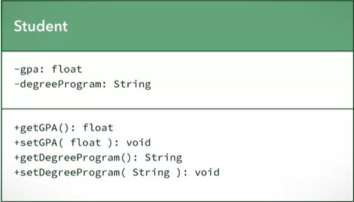

---

<!-- _backgroundColor: white -->

<center>


</center>


---

```
---
title: Class Diagram
---
classDiagram
    Device <|-- Sensor
    Device <|-- Actor
    class Device{
        + str: id
        - str: private_key
        + print_id()
        + encrypt_data()
        + transmit_data()
    }
    class Actor{
        + set_value()
    }    
    class Sensor{
        + get_value()
    }    
```


---

### Beziehungen zwischen Klassen 🧠

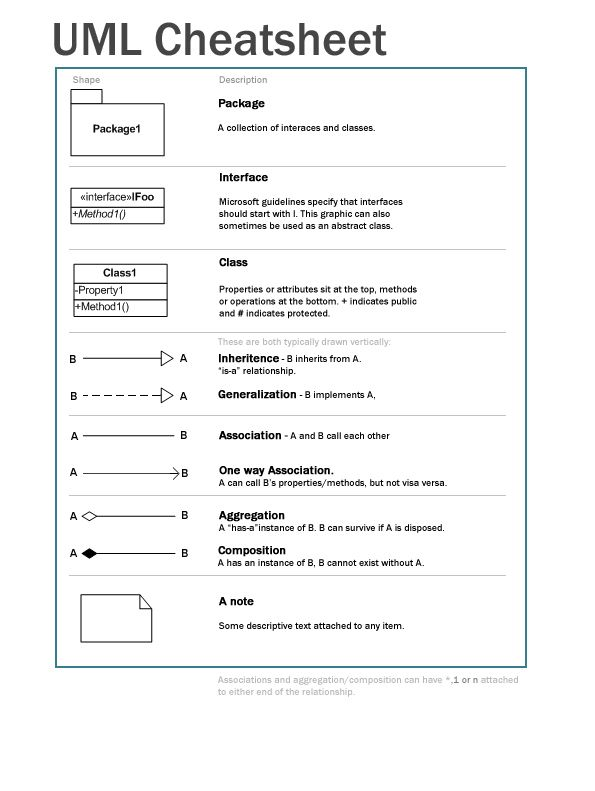

- Das UML-Klassendiagramm enthält noch weitere Komponenten. Wichtig sind im Folgenden:
    * **Klasse** (Class)
    * **Vererbung** (Inheritance)
    * **Assoziation** - Beziehung zwischen zwei oder mehr Klassen (Association - undirected)
    * **Aggregation** - Spezielle Assoziation, die eine Zuordnung ausdrückt
    * **Komposition** - Beziehung zwischen einem Ganzen und seinen Teilen
---

#### Aggregation und Komposition 🧠

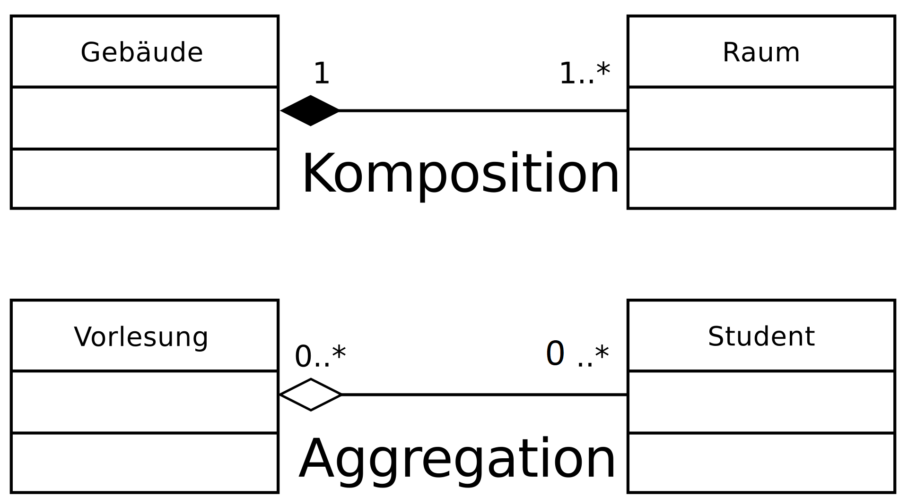

* Die Räume können ohne das Gebäude nicht existieren (Komposition)
* Die Studierenden existieren auch ohne die Vorlesung (Aggregation)

---

#### Multiplizitäten 🧠


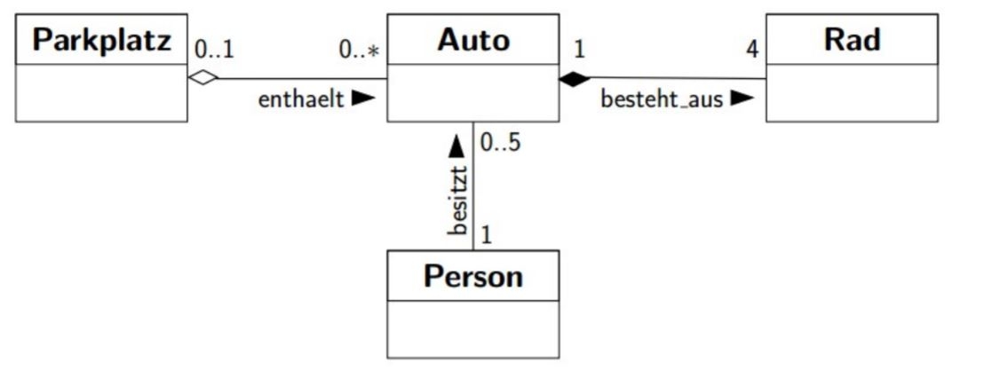


| Multiplizität | Bedeutung   |
|----------------|----------------|
|**1** |genau ein|
|__*__|viele, kein oder mehr, optional|
|__1..*__ |ein oder mehr|
|__0..1__|kein oder ein, optional|
|__m..n__ |m bis n
|__m..*__ |m bis unendlich |
|__m__ |genau n|


---


Die Leserichtung geht *von der Klasse weg*:

* *"Genau vier Räder gehören zu genau einem Auto!"*
* *"Ein Parkplatz enthält null bis unendlich viele Autos!"*
* *"Ein Auto steht auf einem oder keinem Parkplatz!"*

---


### Aufgabe

Gegeben ist der folgende Sachverhalt:

- Jede **Person** hat einen Namen, eine Telefonnummer und E-Mail. Jede Wohnadresse wird von nur einer Person bewohnt. Es kann aber sein, dass einige Wohnadressen nicht bewohnt sind. Den **Wohnadressen** sind je eine Strasse, eine Stadt, eine PLZ und ein Land zugeteilt. Wohnadressen können bestätigt werden und als Beschriftung (für Postversand) gedruckt werden.  Es gibt **zwei Sorten von Personen**: Student, welcher sich für ein Modul einschreiben kann und Professor, welcher einen Lohn hat. 
Der Student besitzt eine Matrikelnummer und eine Durchschnittsnote.

Modellieren Sie diesen Sachverhalt mit einem UML Klassendiagramm. Beachten Sie die Assoziation (bewohnt) zwischen Person und Adresse und deren Multiplizitäten. 

[diagrameditor](https://www.diagrameditor.com/) oder [mermaid](https://mermaid.live/)

---

#### Lösung

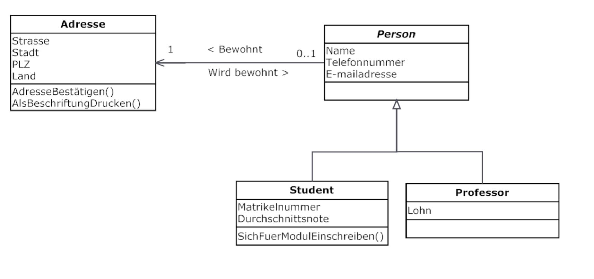


---

### Mit der Beschreibung als UML-Klassen-Diagramm beginnt die Implementierung


* Business layer: Ziele, Qualitätskriterien, Abgrenzung, Beteiligte
* **Function layer:** Wer übernimmt welche Funktion?
* Component layer: Durch welche technischen Komponenten wird das wer dargestellt?
* **Information layer:** Welche Information wird ausgetauscht?
* Communication layer: Wie wird die Information ausgetauscht?


---

#### Sequenz Diagramm


* wer ist beteiligt?
* welche Information wird wann ausgetauscht?

---

#### Klassen Diagramm

* wie wird dies Software-seitig abgebildet?
* z.B. Welche Felder hat eine Nachricht zur Energie-Anforderungen?
* Welche Interaktionsmöglichkeiten hat der Fahrzeugnutzer?

---


```
------
title: Lademanagement
---
classDiagram

    EnergieAnforderung -- Netzbetreiber
    Nutzer -- ChargingService
    EnergieAnforderung >-- ChargingService
    EFahrzeug <-- ChargingService
    Fahrzeug <|-- EFahrzeug
    EnergieAnforderung o-- EnergieBedarf

    class ChargingService{
        +laden()
        +energie_abgeben()
        +ueber_status_informieren()
    }
    class EnergieAnforderung{
        -string datum
    }
    class Netzbetreiber{
        +energie_anfordern()
    }
     class Fahrzeug{
        +str Kennzeichen
    }
    class EFahrzeug{
        +int ladestand
        +int zahler_entladung
        +ladestand_uebermitteln()
    }
    class Nutzer{
        +mindestladestand_angeben()
    }
    class EnergieBedarf{
        -int leistung
        -int start_zeitpunkt
        -int end_zeitpunkt
    }
```

###### https://mermaid.live/

---

### Fazit

* Klassen ermöglichen es Sachverhalte präzise zu beschreiben. Sie erleichtern die Informationstechnische Umsetzung von Ideen z.B.:
* `EFahrzeug`
  * Aufgabe mancher Objekte ist physikalische Objekte in der digitalen Welt abzubilden
* `ChargingService`
  * Aufgabe mancher Objekte ist es Dinge auszuführen (Services) - Einheit 4 - Architekturen

* `EnergieAnforderung`
  * Aufgabe mancher Objekte ist es Informationen zu übertragen (- Einheit 4 - Serialisierung)
