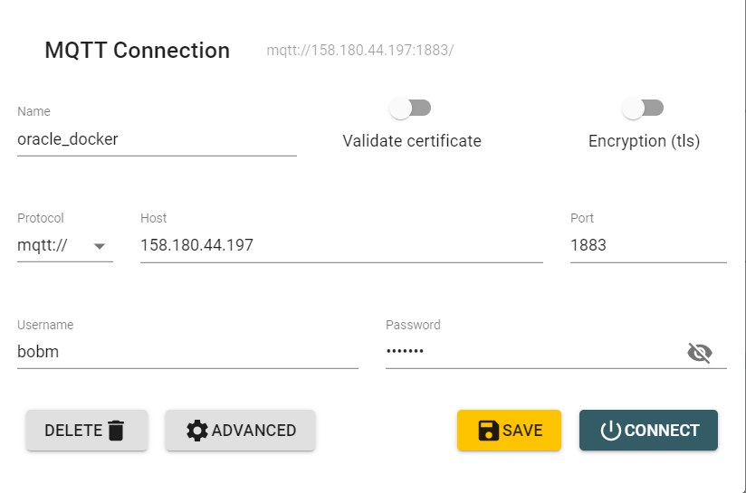
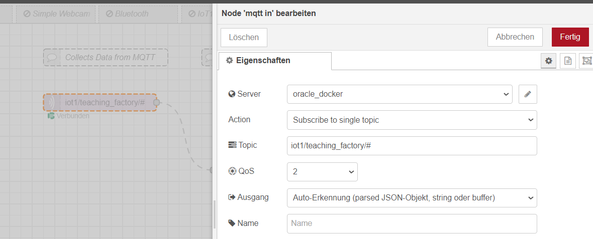
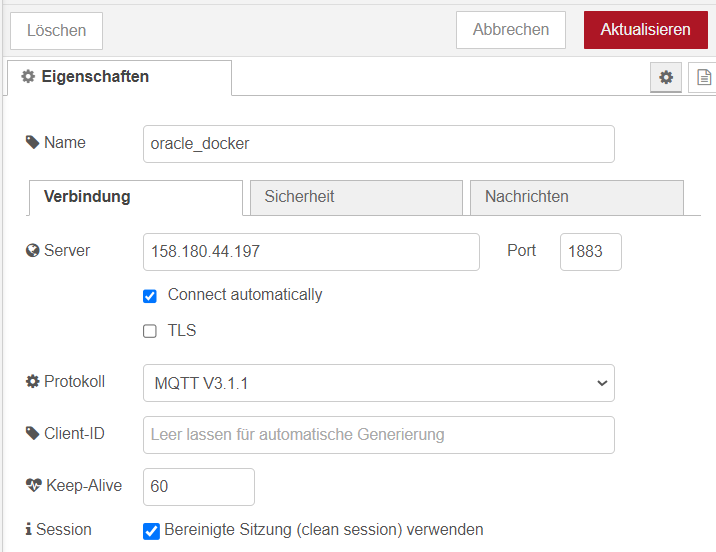
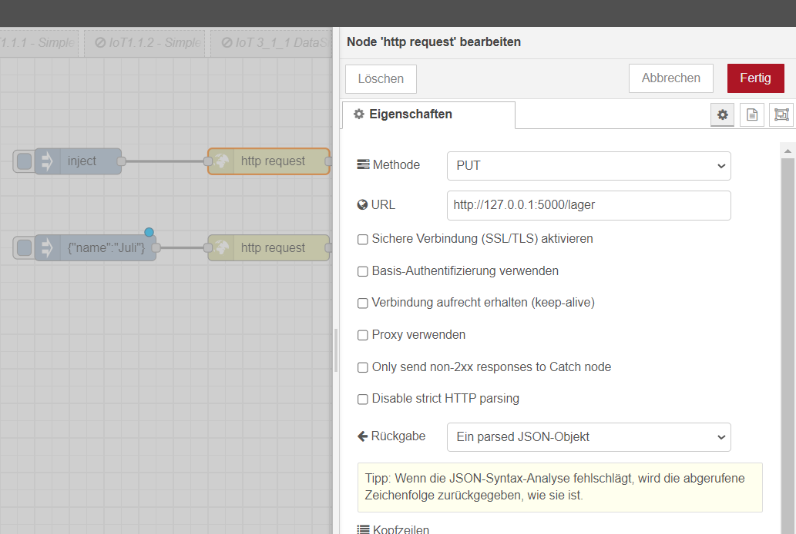
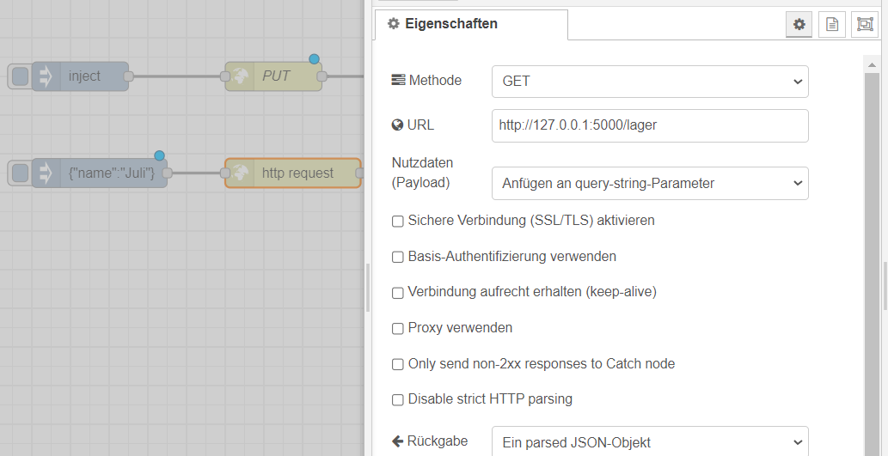

<!-- paginate: true -->

# Aufgaben 4: Architekturen

## MQTT

- Die Daten der Anlage werden an den folgenden MQTT-Broker gestreamt (sofern, diese in Betrieb ist)
  - `158.180.44.197:1883`
  
- Das Topic lautet `iot1/teaching_factory`
- Nutzen Sie den [MQTT-Explorer](http://mqtt-explorer.com/), um sich mit den Daten vertraut zu machen

---

## UseCase 3: Automatisches Wiederauffüllen

Die Lagerhaltung der Firma soll über die IoT-Could informiert werden, welcher der Dispenser nachgefüllt werden soll, sobald sein Füllstand unter 25% fällt. Um eine Überwachung aller Maschinen zentral zuzulassen wird ein eigener MQTT-Broker aufgesetzt auf welchen die Daten zusammengeführt werden.

Dazu wird von jedem  ein JSON-Objekt mit Nachbestellung, Farbe der Pellets und Gruppenname an einen MQTT-Broker gesendet.

---

## 🏆 P7: MQTT (6pkt)

- Legen Sie einen MQTT-Out und MQTT-In Knoten in einem `node-red`-flow an (oder nutzen Sie die bestehenden Knoten auf dem Flow aus Einheit 3)
- Verbinden Sie diesen mit dem folgenden MQTT-Broker 
- Veröffentlichen Sie eine Warnung, sobald die Temperatur für mehr als 5 Minuten über 20 Grad liegt
Topic `iot1/<gruppen_name>/temperature_warning`
- Hier solle ein JSON-Objekt übergeben werden, das die Zeitstempel und Werte der Temperatur seit dem Übertritt über 20 Grad enthält (mit jeder neuen Nachricht (jede Sekunde) wird der Wert aktualisiert und die Liste mit Werten verlängert)
- Befüllen Sie ein zweites Topic `iot1/<gruppen_name>/$names`, welches einmalig und nur bei Start des Flows ein `JSON` mit Ihren Namen enthält und für das ein `retain` gesetzt wird
  - Ersetzen Sie `<gruppen_name>` durch den Namen Ihrer Gruppe
  - Setzen Sie für `$names` ein String mit Ihren Nachnamen
- Nutzen Sie eine geeingete JSON-Stuktur, welche Vor- und Nachnamen für mehrere Personen enthält

---

---

---

- Speichern Sie den Flow als `MQTT.json`
- Speichen Sie eine funktionierende Aufzeichnung als Gif oder Video `MQTT.mp4/gif`

---

## 🏆 P8: REST (6pkt)

- Senden Sie ihrem Bedarf (vlg. 🏆 P6 UseCase 2) and folgende REST-Schnittstelle (Put)
- Der Bedarf entspricht einem JSON-Objekt
- Er wird gemeldet, sobald der Füllstand eines Dispensers unter 25% fällt
  - URI : `http://141.147.4.86:5000/lager`
  - Message Format: `{"name" : "<namen>","machine_id" : "<gruppenname>", "date": "2022-02-14", "granulate_color" : "green", "amount_in_g" : "11"}`
  - Diese Message soll mit Ihren Daten befüllt werden
- Zeigen Sie die Bestätigung und das geplante Lieferdatum für jeden Dispenser basierend auf der Antwort REST-API im Dashboard an

---

### REST-Put

- Sie müssen eine JSON-Objekt erstellen, das alle Daten des Dispensers enthält

---

### REST-Get

- Wenn Sie der Get-Schnittstelle ein Dictionary mit ihrem Namen übergeben erhalten Sie den letzten Eintrag zurück
- Damit können Sie den Erfolg des Put-Requests überprüfen
- Mit `{"name":"all"}` kommen alle Einträge zurück

---

- Speichern Sie den Flow als `REST.json`
- Speichen Sie eine funktionierende Aufzeichnung als Gif oder Video `REST.mp4/gif`

---

## Weiterführende Literatur & Ressourcen 

Die folgende Tools und Anleitungen helfen Ihnen beim bearbeiten der Aufgabe:

- [MQTT-Explorer](https://mqtt-explorer.com/): Um MQTT-Broker zu überwachen
- [Eclipse Mosquitto](https://mosquitto.org/): Um eigene MQTT-Broker zu betreiben

---

## 🤓  Richten Sie einen eigenen MQTT Broker ein

- Richten Sie sich Ihren eigenen [MQTT Broker](https://www.hivemq.com/) bei HiveMQ ein.
