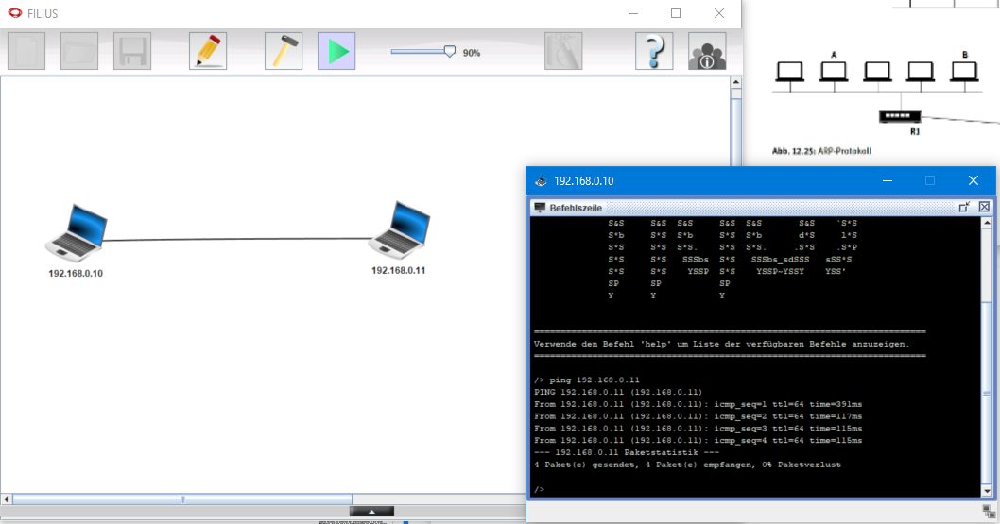
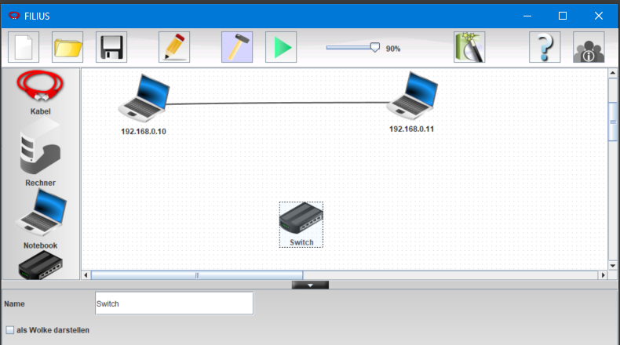
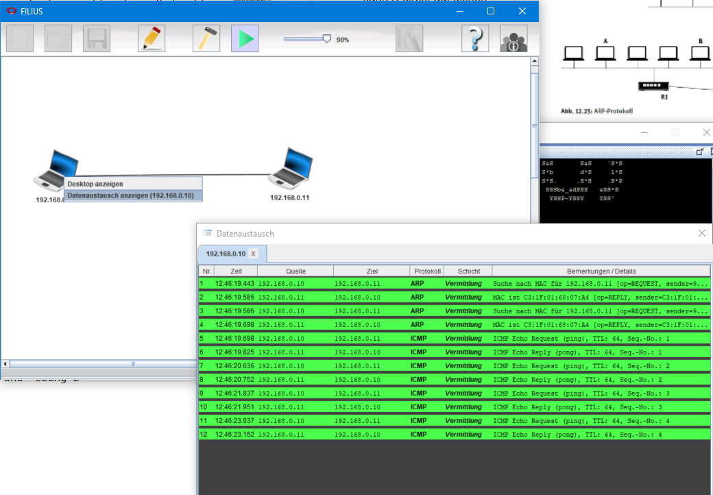

<!-- paginate: true -->

# Aufgaben 5: Netzwerke

## Filius




- Installieren Sie die [Java Runtime Environment](https://www.java.com/de/download/manual.jsp)
- Installieren Sie [Filius](https://www.lernsoftware-filius.de)
- [Skriptum](https://www.lernsoftware-filius.de/downloads/Einfuehrung_Filius_2015.pdf)

---


#### Entwurfsmodus




---

#### Aktionsmodus



---

#### ✍️ Netzwerkkonfiguration

- Bearbeiten Sie die Aufgaben 1-12, 21, 22 im [Skriptum](https://www.lernsoftware-filius.de/downloads/Einfuehrung_Filius.pdf)
- Hinweis: Einige Begriffe wurden in der neuen Version des Programms geändert z.B. `Echo-Client` vs. `Einfacher Client`, `Terminal` vs `Befehlszeile`
- Beantworten Sie dabei die folgenden Zusatzfragen
⌛ 45 Minuten


---

#### Zusatzfragen:

- A1: Was passiert, wenn die Subnetzmaske der zwei Rechner nicht übereinstimmt?
- A2a: An welche Physikalische Adresse wird die erste Nachricht auf Vermittlungssicht gesendet. Wofür steht diese?
- A2b: Würde eine Netzwerkkarte benötigt werden, um den localhost zu erreichen?
- A4: Welches Protokoll nutzt der Echoserver/Client auf der Transportschicht? Ist dieses verbindungs-orientiert oder nicht?
- A4: Welchen Port nutzt der Echo-**Client**?

---

## 🏆 P9: Shelly Plugs (10pkt)


* Soweit haben wir mit simulierten Daten gearbeitet
* Im Folgenden verbinden wir Funksteckdosen mit einem MQTT-Broker, um folgende Aufgaben zu lösen
* Anzeige des Leistungsverlaufs auf einem Dashboard (schließen Sie dazu einen beliebigen Verbraucher an die Steckdose an)
* Erstellen Sie einen Flow für die folgenden Aufgaben
* Speichen in einer CSV-Datei mit Zeitstempel (unix time) und Leistung (W)
* Senden Sie alle Ein- und Aus-Phasen mit Zeitstempel an einen MQTT-Broker `158.180.44.197:1883` unter dem Topic `iot1/<name1><name2>/start_stop`. Beachten Sie, dass einige Verbraucher auch im ausgeschalteten Zustand eine gewisse Leistungsaufnahme aufweisen. Dieser Schwellenwert soll nicht als "Eingeschaltet" betrachtet werden.
* Geben Sie einen Screenshot der Leistungsaufnahme `load.jpg/png`, des MQTT Brokers `start_stop.png` ,`flow_9.json` und `load.csv` ab


---

### Einrichten der Plug-S

- Im diesem Kapitel nutzen wir die Shelly-Plugs, um die Leistungsaufnahme zu messen
- Damit können wir z.B. den Betrieb der Teaching Factory überwachen
- [Documentation](https://shelly-api-docs.shelly.cloud/gen1/)
- Hinweis: Es kann sinvoll sein das Gerät, nach dem ersten initialisieren, upzudaten um die Konformität mit der Dokumentation zu garantieren. Dies ist vor allem beim Steuern der Shelly-Plugs von Vorteil.

---

#### 0 Zurücksetzen

Auf Werkseinstellungen zurücksetzen Sie können Ihr Shelly Produkt auf die Werkseinstellungen zurücksetzen, indem Sie die Taste 10 Sekunden lang gedrückt halten. Nach dem erfolgreichen Zurücksetzen auf die Werkseinstellungen blinkt die Shelly WLAN- LED-Anzeige rot/blau.

--- 

#### 1 Mit dem WLAN der Steckdose verbinden

- Ungesichertes WLAN-mit `shellyplug-s-...`
- im Browser, die folgende IP aufrufen: `http://192.168.33.1`
-  Internet & Security / Advanced Developer Settings / Enable MQTT
  * `URL: 158.180.44.197`
  * `PORT: 1883`
  * `USERNAME: <wie bisher>`
  * `PASSWORD: <wie bisher>`
- `SAVE` / `REBOOT`

---


#### 2 Steckdosen mit dem eigentlichen Netzwerk verbinden

* Mit dem Netzwerk verbinden
  * Name: `iot-wlan-2024` - bzw. Heimnetzwerk
  * Passwort `mci_lecture&42`
- Internet & Security / WIFI MODE - CLIENT / 
* ggf. statische IP-Adresse setzen (z.B. `192.168.162.137`) und notieren (falls man REST-Nutzen will)
* Adressbereich und Subnetzmaske muss passen (`IPCONFIG`), solange man im Zielnetz ist
* Bei der neuen Version muss der `DNS` und Standard-Gateway (z.B. ``192.168.1.1``) gesetzt werden

---

#### 3 MQTT Server mit MQTT-Explorer überprüfen

- Stellen Sie sicher, dass die Steckdose auf en MQTT-Broker senden kann
- verbinden Sie sich mit den Broker `158.180.44.197:1883`
- Nutzen Sie die [Dokumentation](https://shelly-api-docs.shelly.cloud/gen1/#shelly1-1pm-mqtt), um Ihre Daten zu finden

---

#### 4 MQTT Server mit node-red überprüfen

* Neuen Flow in node-red anlegen
* Analog zu Aufgabe mit den Namen MQTT-Knoten anlegen
* Für publish und subscribe
* Erreichbarkeit testen:
  * `URL: 158.180.44.197`
  * `PORT: 1883`
  * `USERNAME: `
  * `PASSWORD: `
* Vorsicht: Netzwerk muss mit dem Internet verbunden sein


---

#### 5 Grafik UI zur Lastanzeige aufbauen

*  Bauen sie ein Dashboard, welches die Leistungen der Steckdosen anzeigt
* Beschriften Sie dieses sinnvoll

---

#### 6 Datenspeicherung

* Speichern Sie die Leistungen mit Zeitstempel in einer fortlaufenden *.csv-Datei ab


---

#### 7 Start-Stop-Events

* Schreiben Sie eine Funktion, welches die Start-Stop-Events an den MQTT-Broker sendet, sobald der Verbrauch (Leistung) unter einen im Dashboard festgelegten Threshold fällt
* Topic `iot1/<name1><name2>/start_stop` 
* Struktur: `{"start": "2021-05-12T12:00:00"}` bzw. `{"stop": "2021-05-12T12:00:00"}`

---

#### 8 Steuerung über REST / MQTT 

* Die Steckdosen können auch über REST oder MQTT gesteuert werden
* Nutzen Sie die [Dokumentation](https://shelly-api-docs.shelly.cloud/gen1/#shelly1-1pm-mqtt), um die Steckdosen zu steuern
* Erstellen Sie ein Dashboard welches den Status der Steckdose anzeigt und diese auch fernsteuern kann


---

### Beispiel Flow

```JSON
[
    {
        "id": "4ad6479.c8cc3b8",
        "type": "mqtt in",
        "z": "4f7fa78b6913b2cd",
        "name": "power readings",
        "topic": "shellies/shelly1pm-BA1936/relay/0/power",
        "qos": "2",
        "datatype": "auto",
        "broker": "3ecd7f11.4d3dd",
        "nl": false,
        "rap": false,
        "inputs": 0,
        "x": 300,
        "y": 700,
        "wires": [
            [
                "13fb1305.e290fd"
            ]
        ]
    },
    {
        "id": "13fb1305.e290fd",
        "type": "debug",
        "z": "4f7fa78b6913b2cd",
        "name": "",
        "active": false,
        "tosidebar": true,
        "console": false,
        "tostatus": false,
        "complete": "payload",
        "targetType": "msg",
        "statusVal": "",
        "statusType": "auto",
        "x": 690,
        "y": 700,
        "wires": []
    },
    {
        "id": "5c2ed097.9529b",
        "type": "debug",
        "z": "4f7fa78b6913b2cd",
        "name": "",
        "active": false,
        "tosidebar": true,
        "console": false,
        "tostatus": false,
        "complete": "false",
        "x": 700,
        "y": 1270,
        "wires": []
    },
    {
        "id": "abe24fc8.c374f",
        "type": "comment",
        "z": "4f7fa78b6913b2cd",
        "name": "flow to accumulate power readings",
        "info": "",
        "x": 350,
        "y": 1230,
        "wires": []
    },
    {
        "id": "f1974e0c.c5bde",
        "type": "inject",
        "z": "4f7fa78b6913b2cd",
        "name": "Clear",
        "repeat": "",
        "crontab": "",
        "once": false,
        "onceDelay": 0.1,
        "topic": "",
        "payload": "",
        "payloadType": "num",
        "x": 389,
        "y": 1320,
        "wires": [
            [
                "70dee9e2.463c68"
            ]
        ]
    },
    {
        "id": "244f4b1.616beb4",
        "type": "mqtt in",
        "z": "4f7fa78b6913b2cd",
        "name": "Shelly - Energy",
        "topic": "shellies/shelly1pm-BA1936/relay/0/energy",
        "qos": "2",
        "datatype": "auto",
        "broker": "3ecd7f11.4d3dd",
        "nl": false,
        "rap": false,
        "inputs": 0,
        "x": 290,
        "y": 1270,
        "wires": [
            [
                "d0fc7a46.8e75a8"
            ]
        ]
    },
    {
        "id": "d0fc7a46.8e75a8",
        "type": "function",
        "z": "4f7fa78b6913b2cd",
        "name": "Total Energy",
        "func": "// Given current total energy from Shelly in msg.payload as a string\npayload = parseInt(msg.payload)\n// check that it has converted ok (so it is not not-a-number)\nif (!isNaN(payload)) {\n    let runningTotalEnergy = flow.get(\"runningTotalEnergy\") || 0\n    let previousShellyValue = flow.get(\"previousShellyValue\") || 0\n    // test whether the Shelly has reset since last input\n    if (payload < previousShellyValue) {\n        // yes it has, just add new value to the total\n        runningTotalEnergy += payload\n    } else {\n        // no so add the difference between this and last to the running total\n        runningTotalEnergy += payload - previousShellyValue\n    }\n    flow.set(\"previousShellyValue\", payload)\n    flow.set(\"runningTotalEnergy\",runningTotalEnergy)\n    // Convert watt/minutes to watt/hours\n    msg.payload = (runningTotalEnergy/60)\n} else {\n    // an illegal string passed in so ignore it, don't pass on anything\n    msg = null\n}\nreturn msg;",
        "outputs": 1,
        "noerr": 0,
        "x": 480,
        "y": 1270,
        "wires": [
            [
                "5c2ed097.9529b"
            ]
        ]
    },
    {
        "id": "c73eee2b.44d47",
        "type": "mqtt in",
        "z": "4f7fa78b6913b2cd",
        "name": "Shelly announcements",
        "topic": "shellies/#",
        "qos": "2",
        "datatype": "auto",
        "broker": "3ecd7f11.4d3dd",
        "nl": false,
        "rap": false,
        "inputs": 0,
        "x": 320,
        "y": 650,
        "wires": [
            [
                "13fb1305.e290fd"
            ]
        ]
    },
    {
        "id": "c2b8ddab.31cb4",
        "type": "mqtt out",
        "z": "4f7fa78b6913b2cd",
        "name": "",
        "topic": "",
        "qos": "2",
        "retain": "false",
        "respTopic": "",
        "contentType": "",
        "userProps": "",
        "correl": "",
        "expiry": "",
        "broker": "3ecd7f11.4d3dd",
        "x": 490,
        "y": 840,
        "wires": []
    },
    {
        "id": "fee0bdf6.ce384",
        "type": "inject",
        "z": "4f7fa78b6913b2cd",
        "name": "",
        "props": [
            {
                "p": "payload"
            },
            {
                "p": "topic",
                "vt": "str"
            }
        ],
        "repeat": "",
        "crontab": "",
        "once": false,
        "onceDelay": 0.1,
        "topic": "shellies/shellyplug-s-4022D882EF96/relay/0/command",
        "payload": "on",
        "payloadType": "str",
        "x": 290,
        "y": 800,
        "wires": [
            [
                "c2b8ddab.31cb4"
            ]
        ]
    },
    {
        "id": "7aeb348d.ebaa4c",
        "type": "inject",
        "z": "4f7fa78b6913b2cd",
        "name": "",
        "props": [
            {
                "p": "payload"
            },
            {
                "p": "topic",
                "vt": "str"
            }
        ],
        "repeat": "",
        "crontab": "",
        "once": false,
        "onceDelay": "1.5",
        "topic": "shellies/shellyplug-s-4022D882EF96/relay/0/command",
        "payload": "off",
        "payloadType": "str",
        "x": 290,
        "y": 840,
        "wires": [
            [
                "c2b8ddab.31cb4"
            ]
        ]
    },
    {
        "id": "4114738a.fe5d5c",
        "type": "inject",
        "z": "4f7fa78b6913b2cd",
        "name": "Report status",
        "repeat": "",
        "crontab": "",
        "once": false,
        "onceDelay": 0.1,
        "topic": "shellies/command",
        "payload": "update",
        "payloadType": "str",
        "x": 310,
        "y": 880,
        "wires": [
            [
                "c2b8ddab.31cb4"
            ]
        ]
    },
    {
        "id": "753c1c9e.1150c4",
        "type": "inject",
        "z": "4f7fa78b6913b2cd",
        "name": "ON",
        "props": [
            {
                "p": "payload"
            },
            {
                "p": "topic",
                "vt": "str"
            }
        ],
        "repeat": "",
        "crontab": "",
        "once": false,
        "onceDelay": 0.1,
        "topic": "",
        "payload": "on",
        "payloadType": "str",
        "x": 300,
        "y": 1080,
        "wires": [
            [
                "e4e6cfa1.b88ea"
            ]
        ]
    },
    {
        "id": "e4e6cfa1.b88ea",
        "type": "function",
        "z": "4f7fa78b6913b2cd",
        "name": "turn relay on/off",
        "func": "var x = msg.payload;\nvar IP = \"192.168.0.106\";\nmsg.url= \"http://\"+ IP + \"/relay/0\";\n\nmsg.payload = \"turn=\" + x;\nreturn msg;",
        "outputs": 1,
        "noerr": 0,
        "initialize": "",
        "finalize": "",
        "libs": [],
        "x": 540,
        "y": 1100,
        "wires": [
            [
                "cf4b0b9c.2e3788"
            ]
        ]
    },
    {
        "id": "f73044cd.de8df8",
        "type": "inject",
        "z": "4f7fa78b6913b2cd",
        "name": "OFF",
        "repeat": "",
        "crontab": "",
        "once": false,
        "onceDelay": 0.1,
        "topic": "",
        "payload": "off",
        "payloadType": "str",
        "x": 300,
        "y": 1120,
        "wires": [
            [
                "e4e6cfa1.b88ea"
            ]
        ]
    },
    {
        "id": "97ac4109.5ddb2",
        "type": "function",
        "z": "4f7fa78b6913b2cd",
        "name": "get device status",
        "func": "var IP = \"192.168.0.106\";\nmsg.url= \"http://\"+ IP + \"/status\";\n\n\nreturn msg;",
        "outputs": 1,
        "noerr": 0,
        "initialize": "",
        "finalize": "",
        "libs": [],
        "x": 550,
        "y": 1040,
        "wires": [
            [
                "cf4b0b9c.2e3788",
                "49dc3735dd137811"
            ]
        ]
    },
    {
        "id": "36814aad.047cb6",
        "type": "inject",
        "z": "4f7fa78b6913b2cd",
        "name": "",
        "props": [
            {
                "p": "payload"
            },
            {
                "p": "topic",
                "vt": "str"
            }
        ],
        "repeat": "5",
        "crontab": "",
        "once": false,
        "onceDelay": 0.1,
        "topic": "",
        "payload": "",
        "payloadType": "str",
        "x": 300,
        "y": 1040,
        "wires": [
            [
                "97ac4109.5ddb2"
            ]
        ]
    },
    {
        "id": "3434812a.ff7f9e",
        "type": "function",
        "z": "4f7fa78b6913b2cd",
        "name": "change mqtt update period",
        "func": "var x = msg.payload;\nvar IP = \"192.168.0.106\";\nmsg.url= \"http://\"+ IP + \"/settings\";\n\nmsg.payload = \"mqtt_update_period=\" + x;\nreturn msg;",
        "outputs": 1,
        "noerr": 0,
        "initialize": "",
        "finalize": "",
        "libs": [],
        "x": 580,
        "y": 1000,
        "wires": [
            [
                "cf4b0b9c.2e3788"
            ]
        ]
    },
    {
        "id": "cf4b0b9c.2e3788",
        "type": "http request",
        "z": "4f7fa78b6913b2cd",
        "name": "",
        "method": "POST",
        "ret": "obj",
        "paytoqs": "ignore",
        "url": "",
        "tls": "",
        "persist": false,
        "proxy": "",
        "insecureHTTPParser": false,
        "authType": "",
        "senderr": false,
        "headers": [],
        "x": 800,
        "y": 1090,
        "wires": [
            [
                "cf280268.e0c2a"
            ]
        ]
    },
    {
        "id": "cf280268.e0c2a",
        "type": "debug",
        "z": "4f7fa78b6913b2cd",
        "name": "",
        "active": false,
        "tosidebar": true,
        "console": false,
        "tostatus": false,
        "complete": "false",
        "x": 990,
        "y": 1220,
        "wires": []
    },
    {
        "id": "f25f81e4.86b0a",
        "type": "inject",
        "z": "4f7fa78b6913b2cd",
        "name": "MQTT update period",
        "props": [
            {
                "p": "payload"
            },
            {
                "p": "topic",
                "vt": "str"
            }
        ],
        "repeat": "",
        "crontab": "",
        "once": false,
        "onceDelay": 0.1,
        "topic": "",
        "payload": "5",
        "payloadType": "num",
        "x": 340,
        "y": 1000,
        "wires": [
            [
                "3434812a.ff7f9e"
            ]
        ]
    },
    {
        "id": "77129295.530c9c",
        "type": "comment",
        "z": "4f7fa78b6913b2cd",
        "name": "http requests",
        "info": "",
        "x": 290,
        "y": 960,
        "wires": []
    },
    {
        "id": "f717b6e4.beb698",
        "type": "mqtt in",
        "z": "4f7fa78b6913b2cd",
        "name": "Relay status",
        "topic": "shellies/shelly1pm-BA1936/relay/0",
        "qos": "2",
        "datatype": "auto",
        "broker": "3ecd7f11.4d3dd",
        "nl": false,
        "rap": false,
        "inputs": 0,
        "x": 290,
        "y": 750,
        "wires": [
            [
                "13fb1305.e290fd"
            ]
        ]
    },
    {
        "id": "70dee9e2.463c68",
        "type": "change",
        "z": "4f7fa78b6913b2cd",
        "name": "Reset energy counter",
        "rules": [
            {
                "t": "set",
                "p": "runningTotalEnergy",
                "pt": "flow",
                "to": "0",
                "tot": "num"
            }
        ],
        "action": "",
        "property": "",
        "from": "",
        "to": "",
        "reg": false,
        "x": 580,
        "y": 1320,
        "wires": [
            []
        ]
    },
    {
        "id": "9087142f.0b8a88",
        "type": "function",
        "z": "4f7fa78b6913b2cd",
        "name": "reboot device",
        "func": "var IP = \"192.168.0.106\";\nmsg.url= \"http://\"+ IP + \"/reboot\";\nreturn msg;",
        "outputs": 1,
        "noerr": 0,
        "initialize": "",
        "finalize": "",
        "libs": [],
        "x": 540,
        "y": 1160,
        "wires": [
            [
                "cf4b0b9c.2e3788"
            ]
        ]
    },
    {
        "id": "61fdbcd.868c344",
        "type": "inject",
        "z": "4f7fa78b6913b2cd",
        "name": "",
        "repeat": "",
        "crontab": "",
        "once": false,
        "onceDelay": 0.1,
        "topic": "",
        "payload": "",
        "payloadType": "str",
        "x": 300,
        "y": 1160,
        "wires": [
            [
                "9087142f.0b8a88"
            ]
        ]
    },
    {
        "id": "eb2a8afb.78f218",
        "type": "comment",
        "z": "4f7fa78b6913b2cd",
        "name": "mqtt",
        "info": "",
        "x": 270,
        "y": 610,
        "wires": []
    },
    {
        "id": "1a95afb6ebf89dc3",
        "type": "function",
        "z": "4f7fa78b6913b2cd",
        "name": "isolate_temp",
        "func": "msg.payload = msg.payload.temperature\n\nreturn msg;",
        "outputs": 1,
        "noerr": 0,
        "initialize": "",
        "finalize": "",
        "libs": [],
        "x": 1030,
        "y": 1080,
        "wires": [
            [
                "5c6a6ecfc93e43d0",
                "da47ee3e836961cc"
            ]
        ]
    },
    {
        "id": "5c6a6ecfc93e43d0",
        "type": "debug",
        "z": "4f7fa78b6913b2cd",
        "name": "",
        "active": true,
        "tosidebar": true,
        "console": false,
        "tostatus": false,
        "complete": "false",
        "x": 1170,
        "y": 1040,
        "wires": []
    },
    {
        "id": "44aff6509daff8eb",
        "type": "debug",
        "z": "4f7fa78b6913b2cd",
        "name": "",
        "active": true,
        "tosidebar": true,
        "console": false,
        "tostatus": false,
        "complete": "payload",
        "targetType": "msg",
        "statusVal": "",
        "statusType": "auto",
        "x": 1030,
        "y": 980,
        "wires": []
    },
    {
        "id": "49dc3735dd137811",
        "type": "http request",
        "z": "4f7fa78b6913b2cd",
        "name": "",
        "method": "POST",
        "ret": "obj",
        "paytoqs": "ignore",
        "url": "",
        "tls": "",
        "persist": false,
        "proxy": "",
        "insecureHTTPParser": false,
        "authType": "",
        "senderr": false,
        "headers": [],
        "x": 850,
        "y": 1040,
        "wires": [
            [
                "1a95afb6ebf89dc3",
                "44aff6509daff8eb"
            ]
        ]
    },
    {
        "id": "da47ee3e836961cc",
        "type": "ui_chart",
        "z": "4f7fa78b6913b2cd",
        "name": "",
        "group": "fbbb0e3ff7aee22c",
        "order": 0,
        "width": 0,
        "height": 0,
        "label": "chart",
        "chartType": "line",
        "legend": "false",
        "xformat": "HH:mm:ss",
        "interpolate": "linear",
        "nodata": "",
        "dot": false,
        "ymin": "",
        "ymax": "",
        "removeOlder": 1,
        "removeOlderPoints": "",
        "removeOlderUnit": "3600",
        "cutout": 0,
        "useOneColor": false,
        "useUTC": false,
        "colors": [
            "#1f77b4",
            "#aec7e8",
            "#ff7f0e",
            "#2ca02c",
            "#98df8a",
            "#d62728",
            "#ff9896",
            "#9467bd",
            "#c5b0d5"
        ],
        "outputs": 1,
        "useDifferentColor": false,
        "x": 1210,
        "y": 1100,
        "wires": [
            []
        ]
    },
    {
        "id": "3ecd7f11.4d3dd",
        "type": "mqtt-broker",
        "name": "paul_broker",
        "broker": "192.168.0.138",
        "port": "1883",
        "clientid": "",
        "autoConnect": true,
        "usetls": false,
        "protocolVersion": "4",
        "keepalive": "60",
        "cleansession": true,
        "birthTopic": "",
        "birthQos": "0",
        "birthPayload": "",
        "birthMsg": {},
        "closeTopic": "",
        "closeQos": "0",
        "closePayload": "",
        "closeMsg": {},
        "willTopic": "",
        "willQos": "0",
        "willPayload": "",
        "willMsg": {},
        "userProps": "",
        "sessionExpiry": ""
    },
    {
        "id": "fbbb0e3ff7aee22c",
        "type": "ui_group",
        "name": "Standard",
        "tab": "6552b14fe0a7d180",
        "order": 1,
        "disp": true,
        "width": "6",
        "collapse": false
    },
    {
        "id": "6552b14fe0a7d180",
        "type": "ui_tab",
        "name": "Thema3",
        "icon": "dashboard",
        "order": 2,
        "disabled": false,
        "hidden": false
    }
]
```
