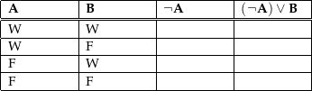
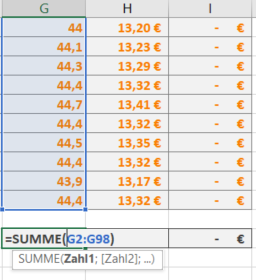
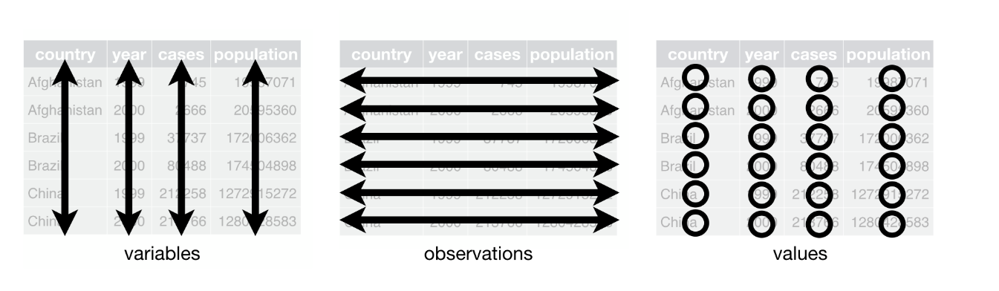
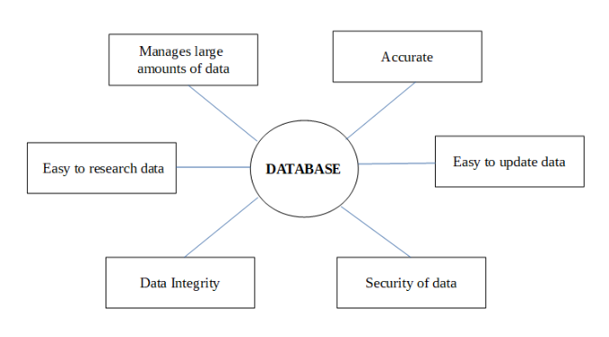
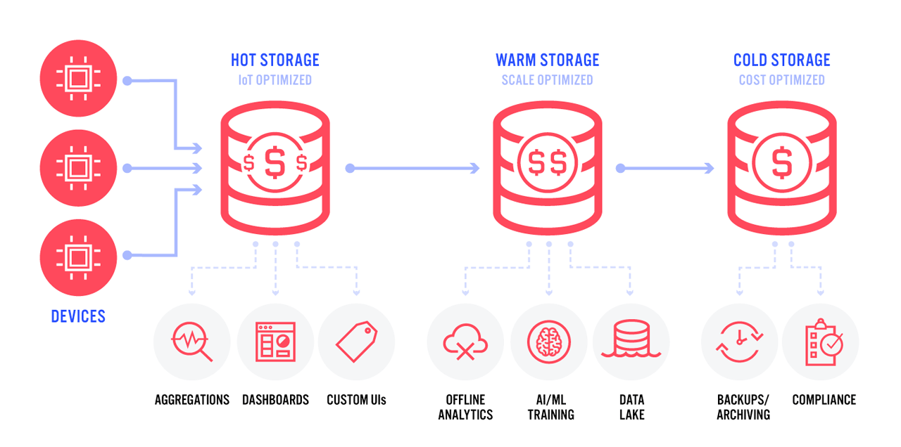
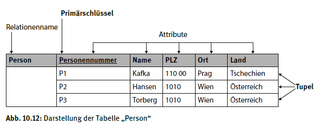
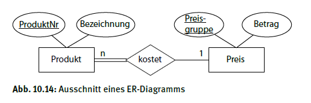
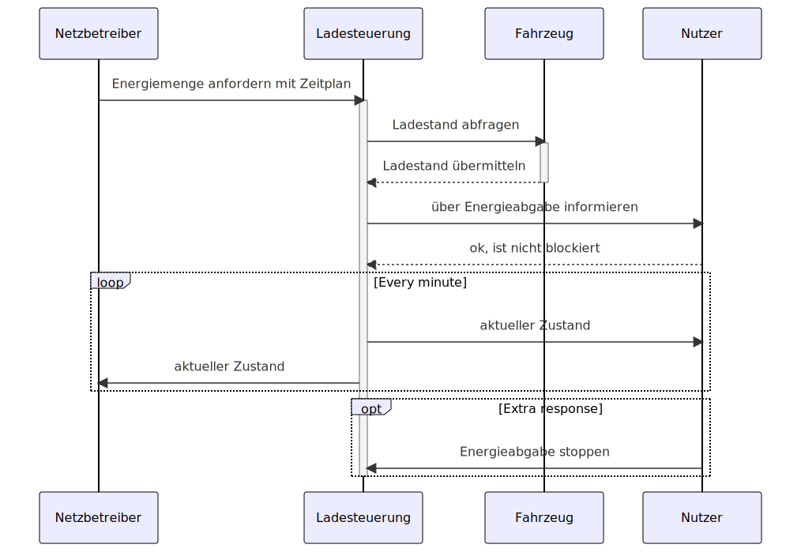
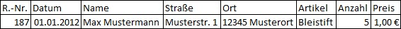
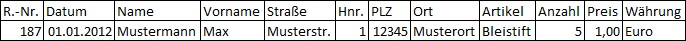

<!-- paginate: true -->


# Datenbanken

## Tabellen

### Steirische Völkertafel (um 1725)


###### https://de.wikipedia.org/wiki/V%C3%B6lkertafel_(Steiermark)


---

### 🎯 Lernziele

Nach dieser Einheit sind Sie in der Lage dazu
* Tabellen nach den tidy data Prinzipien anzulegen 
* Elemente einer Tabelle zu benennen
* Inhalte einer CSV-Datei erfassen


---

### 🧠 Tabelle 


* geordnete Anordnung von Zeilen und Spalten    
    * **Zeile** (row): waagerecht
    * **Spalte** (column): senkrecht (z. B. Feld, Parameter, Eigenschaft, Attribut, Stütze);
    * **Zelle** (cell): Schnittpunkt zwischen einer Zeile und einer Spalte


---

#### 🧠 Beispiele für Tabellen

* MS Excel 
* CSV-Datei
* Datenbank
* Wahrheitstabellen
* Periodensystem
* ...

---

#### 🧠 Wahrheitstabelle




 

* Spalten: Eingangswerte und zugehörige Ergebnisse
* Zeilen: Mögliche Eingangswerte / Konfigurationen
* Anwendung: Schaltlogiken und Steuerungen (z.B. Halbaddierer)

###### https://de.wikipedia.org/wiki/Wahrheitstabelle#/media/Datei:Construction_of_a_logical_value_table.gif

---

##### Beispiel: Use Case Energie Ausspeisen


 

---

##### ✍️ Aufgabe

Stellen Sie den folgenden Sachverhalt mittels boolescher Algebra und Wahrheitstabelle dar.

Energie soll dann aus-gespeist werden, wenn eine Anforderung stattfand und der Ladestand des Fahrzeuges über dem Mindest-Ladestand ist. Zudem in jedem Fall bei einem kritischen Engpass in der Stromversorgung.

Hierzu sind die folgenden drei Booleschen Variablen gegeben:

- ```energie_angefragt```: Es wurde Energie vom Netzbetreiber angefragt
- ```kritischer_notfall```:  Das Fahrzeug ist mit der Wallbox verbunden
- ```mindest_ladung_erfüllt```: Angabe ob Mindestladestand erreicht
- ```energie_wird_ausgespeist```: Ergebnis, ob Energie abgegeben wird

⌛ 10 Minuten

---

###### Lösung

Wie viele Zeilen werden benötigt?

- Überlegen Sie sich zunächst, wie viele Möglichkeiten es bei 3 Eingangsvariablen gibt und wie viele Zeilen Sie entsprechend vorsehen müssen


| ```energie_angefragt``` | ```kritischer_notfall``` | ```mindestladung_erfüllt``` | ```energie_wird_ausgespeist``` |
|---|---|---|---|
|  |  |  |  |
|  |  |  |  |
|  |  |  |  |
|  |  |  |  |
|  |  |  |  |
|  |  |  |  |
|  |  |  |  |
|  |  |  |  |

---

| ```energie_an``` | ```kritischer_n``` | ```mindestladung_er``` | ```energie_wird_ausgespeist``` |
|---|---|---|---|
| 0 | 0 | 0 |  |
| 0 | 0 | 1 |  |
| 0 | 1 | 0 |1|
| 0 | 1 | 1 |1|
| 1 | 0 | 0 ||
| 1 | 0 | 1 ||
| 1 | 1 | 0 |1|
| 1 | 1 | 1 |1|

---

| ```energie_an``` | ```kritischer_n``` | ```mindestladung_er``` | ```energie_wird_ausgespeist``` |
|---|---|---|---|
| 0 | 0 | 0 |0|
| 0 | 0 | 1 |0|
| 0 | 1 | 0 |0|
| 0 | 1 | 1 |0|
| 1 | 0 | 0 |0|
| 1 | 0 | 1 |1|
| 1 | 1 | 0 |1|
| 1 | 1 | 1 |1|

---

##### Alternative Darstellungsformen

```energie_wird_ausgespeist``` = ```kritischer_n``` $\lor$
 ( ```energie_an```$\land$ ```mindestladung_er```)


```JS
if ((energie_an < mindestladung_er) || kritischer_n) {
    // Your code here
    // Replace the following line with the actual code you want to execute when the condition is true
    // For now, it's a placeholder
    console.log("Condition is true");
}
```

---


#### Tabellenkalkulation



* Operationen auf tabularen Daten
* MS Excel, Google Sheets, ...
* Vermischt Daten, Darstellung und Berechnung und ist deswegen vor allem für einfache Probleme hilfreich

###### https://de.wikipedia.org/wiki/Tabellenkalkulation

---

### Tidy Data

> Happy families are all alike; every
unhappy family is unhappy in its 
own way - Leo Tolstoy

> Like families, tidy datasets are all alike
 but every messy dataset is messy in its own way. 
 Tidy datasets provide a standardized way 
 to link the structure of a dataset (its physical layout) 
 with its semantics (its meaning).  - Hadley Wickham

* Viele Funktionen erwarten ordentliche Daten
* Entspricht der Struktur von Datenbanken (Codd’s 3. Normalform)

###### http://vita.had.co.nz/papers/tidy-data.pdf, Codd 1990

---


#### Tidy Data - Beispiel




###### https://r4ds.had.co.nz/tidy-data.html

---

#### 🧠 Tidy Data - Regeln

* Jede Variable steht in einer eigenen Spalte.
* Jede Beobachtung/jeder Fall steht in einer eigenen Zeile.
* Jeder einzelne Wert steht in einer Zelle.

---


###### https://r4ds.had.co.nz/tidy-data.html

---

#### ✍️ Aufgabe: Tidy Data

Bringen Sie die folgende Tabelle in ein tidy-data Format, so dann man die Spalten auch nach Lampentyp filtern kann.

| Raum | Anzahl Deckenlampen / Installationsdatum | Anzahl Wandleuchten  / Installationsdatum |
|---|---|---|
| 1 | 5, 2000 | 3, 2010 |
| 2 | 4, 2001 | 2, 2021 |
| 3 | 3, 2020 | 3, 2021 |

⌛ 10 Minuten

---

| Raum | Lampentyp | Installationsdatum | Anzahl |
|---|---|---|---|
| 1 | Decke | 2000 | 5 |
| 2 | Decke | 2001 | 4 |
| 3 | Decke | 2020 | 3 |
| 1 | Wand | 2010 | 3 |
| 2 | Wand | 2021 | 2 |
| 3 | Wand | 2021 | 3 |

---


### 🧠 Comma Separated Values (CSV-Files)

- speichert Tabellen als einfache Textdatei
- Namenskonvention ```<file_name>.csv```
- kann mit Excel oder jedem Texteditor geöffnet werden

| Raum | Lampentyp | Installationsdatum | Anzahl |
|---|---|---|---|
| 1 | Decke | 2000 | 5 |
| 2 | Decke | 2001 | 4 |
| 3 | Decke | 2020 | 3 |
| 1 | Wand | 2010 | 3 |
| 2 | Wand | 2021 | 2 |
| 3 | Wand | 2021 | 3 |

---

#### 🧠 Beispiel CSV-Datei


```
Raum,   Lampentyp,  Installationsdatum, Anzahl 
1,      Decke,      2000,               5 
2,      Decke,      2001,               4 
3,      Decke,      2020,               3 
1,      Wand,       2010,               3 
2,      Wand,       2021,               2 
3,      Wand,       2021,               3 
```

* Jede Zeile ist eine Zeile
* Spalten werden durch Kommata getrennt
* Es können anstelle von ```,``` auch andere Trennzeichen verwendet werden (```;```, Tabstopp, ``` ```)
* Beachten Sie die Dezimalpunkte


--- 

#### Unschöne CSV-Datei


```csv
Raum,   Lampentyp,  Installationsdatum, Anzahl, Hersteller 
1,      Decke,      2000,               5,0   , Philips
2,      Decke,      2001,               4,0   , Philips; Osram
3,      Decke,      2020,               3,0   , Osram
1,      Wand,       2010,               NaN
2,      Wand,       2021,               2,0   , Osram
3,      Wand,       2021,               3,0   , Philips
```

* `,` als Separator und Dezimalpunkt
* ungleiche Anzahl von Spalten 
---

## Datenbanken


 


###### https://xkcd.com/1667/

---

### 🎯 Lernziele

Nach dieser Einheit sind Sie in der Lage dazu
* relationale Tabellen zu beschreiben
* sinnvolle Schlüssel für verknüpfte Relationen zu bestimmen
* die Atomarität und referenzielle Integrität einer Relation zu bewerten 


---

### Warum brauchen wir Datenbanken?




 

---

### Aufgaben von Datenbanken


* Middleware, die sich um Zugriffsrechte und Korrektheit der Daten kümmert
* Andere Software kann darauf zugreifen
* Damit dies funktioniert, müssen die Daten in einer sauberen Struktur vorliegen

---

### Lebenszyklus von Daten




 

---

* **Hot Storage**: Kurzfristige Speicherung von Daten zur Verarbeitung und Visualisierung. Häufig im Arbeitsspeicher (vgl. Dashboard bei node-red)
* **Warm Storage**: Langfristige Speicherung großer Datenmengen z.B. Dokumentenzentrierte Speicherung (z.B. mit tinyDB als JSON-Files. Schnelle Speicherung großer Datenmengen. Abruf erfordert Aufwand)
* **Cold-Storage**: Langfristige Speicherung der Daten in strukturierter Form (z.B. SQL-Datenbanken) für zuverlässigen Automatisierten Aufruf und Verarbeitung.

---


### Relationales Datenmodell 

| 🔑 `e-mail` | `Vorname` | `Telefonnummer` | `Straße` | `Nr`| `PLZ` |
| - | - | - | - | - | - |
| julian.huber@mci.edu| Julian  | 0043-x | Universitätsstr. | 15 | 6020|
| julian.huber@xyz.edu| Julian | 0043-x | Universitätsstr. | 15 | 6020|
| j.h@mci.edu| Julian  | 0049-x | Universitätsstr. | 15 | 6020|
| julian.huber@mci.edu| Julian | 0049-x | Universitätsstr.|  15 | 6020|

* Wie komme ich an alle Telefonnummern von genau einer Person?
* Wie viele eindeutige Personen sind das?
* Was wenn sich die Adresse ändert?

---


#### Atomarität 

- Eine wichtige Eigenschaft von relationalen Datenbanken ist, dass die Tabellenstruktur **nicht verschachtelt** ist 
- Tabellenzellen sind atomar, enthalten genau einen Wert und **keine Listen**.
* Jeder einzelne Wert steht in einer Zelle.

- Folgendes ist nicht erlaubt:

**Person:**

| 🔑 `e-mail` | `Vorname` | `Telefonnummer` | 
| - | - | - | 
| julian.huber@mci.edu| Julian | [0043-x, 0049-x] |

---

##### Atomarität durch Relationen

Um mehrere Telefonnummern zu hinterlegen würde man eine weitere Relation anlegen:

**Person:**

| 🔑 `e-mail` | `Vorname` |
| - | - | 
| julian.huber@mci.edu| Julian   | 

**Telefonnummer:**

| `person.e-mail` | 🔑 `Telefonnummer` | `Beschreibung` | 
| - | - | - | 
| julian.huber@mci.edu| 0043-x | Mobil Österreich |
| julian.huber@mci.edu| 0049-x | Mobil Deutschland |

* Primärschlüssel: Telefonnummer
* Fremdschlüssel: `person.e-mail`


---

#### Weitere Probleme in Tabellen

> dies ist keine ordentliche (tidy) Tabelle, da sich eine "Beobachtung" über mehrere Zeilen erstreckt

| 🔑 `e-mail` | `Vorname` | `Telefonnummer` | `Straße` | `Nr` | `PLZ` |
| - | - | - | - | - | - |
| julian.huber@mci.edu| Julian | 0043-x | Universitätsstr. | 15 | 6020|
| julian.huber@xyz.edu| Julian | 0043-x | Universitätsstr. | 15 | 6020|
| j.h@mci.edu| Julian | 0049-x | Universitätsstr. | 15 | 6020|
| julian.huber@mci.edu| Julian  | 0049-x | Universitätsstr. | 15 | 6020|


---

##### Lösung

- relationale Datenbank
- mehr als eine Tabelle jeweils für:
    - Person
    - Telefonnummern
    - Email-Adressen
    - Adressen


---

**Person**

| 🔑`id` | `Vorname` |
|:---:|:---:|
| 1 | Julian |


---

**Telefonnummern**

| `person.id` | 🔑 `Telefonnummer` |
|:---:|:---:|
| 1 | 0043-x |
| 1 | 0049-x |

---

**e-mail**

| `person.id` | 🔑 `e-mail` |
|:---:|:---:|
| 1 | julian.huber@mci.edu |
| 1 | julian.huber@xyz.edu |
| 1 | j.h@mci.edu |

---

**Adressen**

| `person.id` | 🔑 `Straße` | 🔑 `Nr` | 🔑 `PLZ` |
| - | - | - | - |
| 1 | Universitätsstr. | 15 | 6020|

* Die Adresse wird nur durch nur durch einen zusammengesetzten Schlüssel aus drei Attributen eindeutig bestimmt

---

- Änderung eines Namens oder einer Telefonnummer betrifft nur noch einen Eintrag in einer Tabelle


---

### Zusammenfassung Relationales Datenmodell 

* mit Abstand wichtigste und am weitesten verbreitete Datenbankmodell
* Datensätze (Entities) in **Tabellen** gespeichert und besitzen einen (Relationen)**Namen** und enthalten **Attribute**
* **Beziehungen** (Relationships) zwischen verschiedenen Datensätzen können ebenfalls in Tabellen gespeichert werden (z.B. wer hat welche Telefonnummern?)




 

---

### Schlüssel 

* Ein Schlüssel (engl.: key) ist ein Attribut oder eine Kombination mehrerer Attribute eines Objekttyps, um das Objekt (Tupel) eindeutig zu identifizieren. 
* Ein **Primärschlüssel** (engl.: primary key) ist ein Schlüssel, der tatsächlich primär dazu verwendet wird, Objekte eines Objekttyps eindeutig zu identifizieren. (🔑 oder unterstrichen)
* Schlüsselkandidat: Einzelnes oder Zusammensetzung an Attributen, die ebenfalls als Schlüssel eingesetzt werden könnten.


 

---

### ✍️ Aufgabe

Erstellen Sie die Relationen (Tabellen) zu den hier hervorgehobenen Objekten. Kennzeichnen Sie geeignete *Primärschlüssel* durch unterstreichen und fügen Sie in beide Relationen ein Beispiel ein?
- Jede **Person** hat einen Vor- und Nachnamen, eine Telefonnummer und E-Mail.
- Den **Wohnadressen** sind je eine Straße, eine Hausnummer, eine Stadt, eine PLZ, ein Land und eine Wohnungs-ID zugeteilt. 

⌛ 10 Minuten

---

#### Lösung


**Person:**

| `e-mail` | `Vorname` | `Name` | `Telefonnummer` |
| - | - | - | - |
| julian.huber@mci.edu| Julian | Huber | 0043-x |

**Wohnadresse:**

| `Straße` | `Nr.` | `Stadt` | `PLZ` | `Land`  |`Wohnungs-ID` |
| -| -|-| -| -| -|
| Universitätsstraße | 15 | Innsbruck | 6020 | Tirol | 1 |

> Was sind geeignete Schlüssel?

* Person: 🔑 `e-mail` kommt nur einmal vor.
* Wohnadresse: 🔑 Wohnungs-ID oder Kombination aus `Straße`, `Nr.` und `PLZ` (ggf. Land)

---

### Relationen zwischen Tabellen

* Jede **Wohnadresse** wird von nur einer Person bewohnt. Jede Person hat genau eine Wohnung.
* Wie lässt sich abbilden, dass eine Person eine Wohnung bewohnt?
* **Wohnadresse:**


| `person.e-mail` | `Straße`| `Nr.` | `Stadt` |  `PLZ` | `Land` | 🔑 `Wohnungs-ID` |
| - | -| -| -| -| -|  -| 
| jh@mci.edu | UniStr | 15 | Innsbruck | 6020 | Tirol |  1 | 

 

* Die Verbindung wird durch das Einfügen des Primärschlüssels der Relation Person (hier `person.e-mail`)  als **Fremdschlüsseln** in die Relation Wohnadresse realisiert.
* Damit ist eindeutig bestimmt welche Person die jeweilige Adresse bewohnt.

---

#### Mehrfachbeziehungen (Mehrere Personen in einer Wohnung)


**Person:**

| 🔑 `e-mail` | `Name` | `Telefonnummer` | ... |
| - | - | - | - |
| jh@mci.edu| Julian | 0043-x | |
| lm@mci.edu| Lieschen | 0043-x | |

**Wohnadresse:**

|🔑 `person.e-mail` | `Straße` | `Nr.` | `Stadt` |  `PLZ` | `Land` |`Miete`  | 🔑`W-ID` |
| - | -| -|  -| -| -| -|-|
| jh@mci.edu | UniStr | 15 | Innsbruck | 6020 | Tirol |  500 |1| 
| jh@mci.edu | UniStr | 10 | Innsbruck | 6020 | Tirol |  1000 |2|
| lm@mci.edu | UniStr | 10 | Innsbruck | 6020 | Tirol | 1000 |2|

 

---


#### Was bei der nächsten Mieterhöhung?


**Wohnadresse:**

| 🔑 `person.e-mail` | `Straße` | `Nr.` | `Stadt` |  `PLZ` | `Land` |`Miete`  |  🔑`W-ID` |
| - | -| -|  -| -| -| -|-|
| jh@mci.edu | UniStr | 15 | Innsbruck | 6020 | Tirol |  500 | 1 |
| jh@mci.edu | UniStr | 10 | Innsbruck | 6020 | Tirol |  **1000** | 2 |
| lm@mci.edu | UniStr | 10 | Innsbruck | 6020 | Tirol | **1200** | 2 |

 

* Gefahr von **Inkonsistenzen**
* Nicht alle relevanten Einträge werden geändert

---

#### Relationstabellen für Mehrfachbeziehungen

- **Person**: Bleibt gleich
- einfügen einer neuen Tabelle **Bewohnt:**


| 🔑`person.e-mail` | 🔑`wohnadresse.W-ID` | 
| - | - | 
| jh@mci.edu| 1 |
| jh@mci.edu| 2 | 
| lm@mci.edu| 2 | 

 

- **Wohnadresse:**


|  `Straße` | `Nr.` | `Stadt` |  `PLZ` | `Land` | `Miete`  | 🔑`W-ID` |
| -| -|-| -| -| -| -| 
| UniStr | 15 | Innsbruck | 6020 | Tirol |  500 | 1|
|  UniStr | 10 | Innsbruck | 6020 | Tirol |  **1200** |2|

 

---

#### Was tun, wenn es keinen passenden Schlüssel gibt?

- **Wohnadresse:**


| 🔑 `Straße` | 🔑`Nr.` | `Stadt` | 🔑 `PLZ` | `Land` | `Miete`  |
| -| -|-| -| -| -|
| UniStr | 15 | Innsbruck | 6020 | Tirol |  500 |
|  UniStr | 10 | Innsbruck | 6020 | Tirol |  1000 |

 

* Festlegung einer einzigartigen ID (Identifikationsnummer)

* **Wohnadresse:**


|🔑 `W-ID` |  `Straße` | `Nr.` | `Stadt` |  `PLZ` | `Land` | `Miete`  |
| - | -| -|-| -| -| -|
| 1| UniStr | 15 | Innsbruck | 6020 | Tirol |  500 |
| 2|  UniStr | 10 | Innsbruck | 6020 | Tirol |  1000 |

 

---


### Referenzielle Integrität

 

**Person:**

| 🔑 `e-mail` | `Vorname` | 
| - | - | 
| julian.huber@mci.edu| Julian   | 

**Telefonnummer:** (Primärschlüssel TelNr.; Sekundärschlüssel: e-mail)

| `person.e-mail` | 🔑 `Telefonnummer` | `Beschreibung` | 
| - | - | - | 
| julian.huber@mci.edu| 0043-x | Mobil Österreich |
| julian.huber@mci.edu| 0049-x | Mobil Deutschland |

 

---

#### Referenzielle Integrität

- Die Ausprägungen von `Telefonnummer.person.e-mail`  müssen auch als Werte in `person.e-mail` auftreten, andernfalls enthält der Fremdschlüssel in Telefonnummer einen ungültigen Wert. 

- Wird ein **Tupel von Person gelöscht**, so müssen auch **alle referenzierenden Tupel gelöscht** (oder geändert) werden, andernfalls ist die referenzielle Integrität verletzt und der Fremdschlüssel verweist auf ein nicht mehr existierendes Tupel.


---

## Entity Relationship Diagramme

---

### 🎯 Lernziele

Nach dieser Einheit sind Sie in der Lage dazu
* Entity-Relationship-Diagramme zu nutzen, um Sachverhalte zu modellieren
* Relationen der dritten Normalform hieraus abzuleiten


---

### Wie baut man funktionierende Relationen?

- Wir sind bis jetzt davon ausgegangen, dass Relationen bereits gebildet wurden. 
* Um in der Praxis eine Datenbank zu entwickeln, wird der Zusammenhang zunächst mit einem Entity-Relationship-Diagramm **modelliert**
* Für die Bildung von Relationen aus einer Menge von Attributen wird das Konzept der **Normalisierung** angewendet.
* Bei der Normalisierung (engl.: normalization) eines relationalen Schemas werden die Attribute derart auf Relationen verteilt, dass beim Einfügen, Löschen oder Ändern von Datensätzen **keine Inkonsistenzen** auftreten.
* Erst danach wird das Ergebnis in Software umgesetzt

---


### Schritt 1: Entity-Relationship-Diagramm  




 

Aus einem ER-Diagramm kann auf automatisierte Weise durch sechs Regeln ein Relationenschema in dritter Normalform erzeugt werden

* ⬛ **Entitätstypen** (als **Rechtecke** visualisiert) werden zu **Tabellen**. Der Name der Tabelle entspricht dem Namen des Objekttyps.
* ⚪ **Attribute** jedes Entitätstyps (als **Ovale** visualisiert) werden den entsprechenden Tabellen zugeordnet. Sie repräsentieren die **Spalten einer Tabelle**. 
* 🔹 Beziehungen (**Relationen**) zwischen Entitätstypen werden als Rauten gekennzeichnet und sinnvoll benannt

---


 

* **Multiplizitäten** lesen Sie sich wie beim UML-Klassendiagramm *"von den Entitäten weg"*: Ein Produkt hat genau einen Preis. Ein Preis kann bei verschiedenen Produkten eingetragen sein.
* zwei Schreibweisen
    * `1` eine, `n` bzw. `*` beliebig viele
    *  `<von>...<bis>`  z.B. `0...3`

###### Abweichende Darstellung: https://mermaid.js.org/syntax/entityRelationshipDiagram.html

---

#### Beispiel: Person und Wohnung


---

#### Beispiel: Use Case Energie Ausspeisen


 

---




 

---


* Welche Entitäten gibt es?
    * Netzbetreiber mit Energieanforderung
    * Wallbox (ggf. mehrere pro Standort?)
    * Fahrzeug
    * Energieabgabe (Zeitreihe)

---


---

#### 🏆 Aufgabe

Beschreiben Sie den folgenden Sachverhalt für eine Gebäudeverwaltung, die mehrere Gebäude betreut und diese verwalten will in einem ER-Diagramm mit geeigneten Multiplizitäten. Benutzen Sie nur atomare Schlüssel. Sie können dafür eigene IDs einführen

- Ein **Gebäude** kann aus einem (z.B. eine Halle) oder mehreren **Räumen** bestehen
- Es gibt **Türen** zwischen Räumen und nach außen
- Ein Gebäude hat eine **Adresse** bestehend aus Straße, Hausnummer, Postleitzahl und Stadt. Auf einer Adresse kann nur genau ein Gebäude stehen und umgekehrt.

⌛ 20 Minuten

--- 

##### Lösung


 

---

### Schritt 2: Ableitung von relationalen Schemata aus ER-Diagrammen


* Die *identifizierenden* Attribute werden zu Primärschlüsseln.
* *Mehrwertige Attribute* werden auf eigene Tabellen abgebildet. Dabei werden der Primärschlüssel des Objekttyps und das mehrwertige Attribut selbst zu den Spalten dieser neuen Tabelle (z.B. Adresse).
* Um *1:1-Beziehungen* (Beziehungen werden generell als Raute visualisiert) abzubilden, muss der Primärschlüssel eines der beteiligten Entitätstypen als Fremdschlüssel in die Tabelle des anderen Entitätstyps aufgenommen werden. Über den Fremdschlüssel lassen sich Datensätze dieser beiden Tabellen in Beziehung setzen.

---

#### 🧠 1:1-Beziehungen


 

###### könnte man auch der anderen Relation zuschlagen 

---

#### 🧠 1:n-Beziehungen


 

###### Die zweite Möglichkeit könnte zu Inkonsistenzen führen

---

#### 🧠 n:m-Beziehungen


 

---


#### Zusammenfassung

* Bei *1:n-Beziehungen* wird der Primärschlüssel des Entitätstyps auf der durch *1* gekennzeichneten Seite als Fremdschlüssel in die Tabelle des anderen Entitätstypen (auf der mit „n“ gekennzeichneten Seite) aufgenommen. Zusätzlich werden Attribute, die der Beziehung zwischen den beiden Entitätstypen direkt zugeordnet sind, ebenfalls in die Tabelle des Entitätstypen auf der „n-Seite“ der Beziehung aufgenommen. (z.B. Person mit vielen TelNr)
* Bei *n:m-Beziehungen* zwischen Entitätstypen wird jeweils eine eigene Tabelle gebildet. Der Tabellenname entspricht hierbei dem Beziehungsnamen.
Die Attribute dieser Tabelle sind die Primärschlüssel der an der Beziehung beteiligten Entitätstypen, sowie, falls vorhanden, die der Beziehung direkt zugeordneten Attribute.

[](http://www.ingo-bartling.de/info/klasse9/pdf/datenbank/9_uebungsaufgaben_er_l.pdf)


---

## Normalformen

* Implizites Ziel unser bisherigen Überlegungen ist es die Daten in die sogenannte 3. Normalform zu bringen
* wir kennen diese bereits aus den tidy-data-Prinzipien


###### https://en.wikipedia.org/wiki/Edgar_F._Codd

---

### Schritt 3: 0. Normalform

* gegeben wenn alle Informationen in einer Tabelle vorhanden



###### https://www.datenbanken-verstehen.de/datenmodellierung/normalisierung/nullte-normalform/

---

### Schritt 4:  1. Normalform

* 0.NF +  alle Informationen in einer Tabelle atomar vorliegen
* jede Information hat ihre eigene Tabellenspalte
* hier wird beispielsweise der Name aufgespalten



###### https://www.datenbanken-verstehen.de/datenmodellierung/normalisierung/

---

#### Abhängigkeiten


$A 	\to B \to C$

 


- $\to$: bestimmt eindeutig
- B ist funktional abhängig von A
- C ist transitiv abhängig von A

---

#### Funktionale Abhängigkeit

* $A \to B$
* $B$ is funktional abhängig von $A$, wenn für jeden Wert von $A$ 
höchstens ein Wert von $B$ auftreten kann

| `Raumnr.` | `Max. Personenzahl` |
|---|---|
| 024 | 40 |
| 505 | 30 |
| 503 | 20 |

* Die `Max. Personenzahl` is abhängig von der `Raumnr.`

###### es können aber auch andere Räume die gleiche Personenzahl haben

---

#### (Identifikation)schlüssel

* Ein Attribut $A$ für das gilt: Jedes Attribut der Tabelle ist von $A$ funktional abhängig

| 🔑 `Raumnr.` | `Max. Personenzahl` | `Fensterzahl` |
|---|---|---|
| 024 | 40 | 4|
| 505 | 30 | 3 |
| 503 | 20 | 2 |

* Für jede Raumnummer kann es je nur einen Wert von Personenzahl und Fensterzahl geben
* nur die Raumnummer bietet sich als Schlüssel an

---

#### Zusammengesetzte (Identifikation)schlüssel

* kein Attribut des Schlüssels $A$ ist von den übrigen $A$-Attributen funktional abhängig.

| 🔑 `Raumnr.` | 🔑`Gebäudenr.` | `Max. Personenzahl` | `Fensterzahl` |
|---| --- |---|---|
| 024 | MCI-4A | 40 | 4|
| 505 | MCI-4C | 30 | 3 |
| 503 | MCI-4C| 20 | 2 |
| 503 | MCI-4B| 20 | 2 |

* Für eine `Raumnr:` könnte es verschiedene `Gebäudenr.` geben.
* Für eine `Gebäudenr.` gibt es verschiedene `Raumnr.` 

---

#### Volle funktionale Abhängigkeit

* kein Attribut $B$ ist nur von einem Teil der Attribute des Schlüssels $A$ abhängig
* Gegenbeispiel. Das Baujahr hängt nur an der `Gebäudenr.`

| 🔑 `Raumnr.` | 🔑`Gebäudenr.` | `Max. Personenzahl` | `Baujahr Geb.` |
|---| --- |---|---|
| 024 | MCI-4A | 40 | 1850|
| 505 | MCI-4C | 30 | 1970 |
| 503 | MCI-4C| 20 | 1970 |

* Das Baujahr ist **nicht voll funktional**  abhängig vom kombinierten Schlüssel `Raumnr.` und `Gebäudenr.`
* Es wäre sinnvoll das Baujahr für jedes Gebäude in einer extra Tabelle zu speichern

---

#### Transitive (indirekte)Abhängigkeit


**Raum**

| 🔑 `Raumnr.` | 🔑`Gebäudenr.` | `Personenzahl` | `Raumkategorie` |
|---| --- |---|---|
| 024 | MCI-4A | 40 | groß|
| 505 | MCI-4C | 30 | mittel |
| 503 | MCI-4C| 20 | klein |
| 504 | MCI-4C| 20 | klein |

* `(Raumnr., Gebäudenr.)` $\to$ `Personenzahl`
* `Personenzahl.` $\to$ `Raumkategorie`
* Aber **nicht** `Raumkategorie` $\to$  `(Raumnr., Gebäudenr.)`
* Zwar kann es für jede Schlüsselkombination nur  einen Wert für die Raumkategorie geben. Allerdings wird diese bei genauerem hinsehen von der Personenzahl bestimmt!

---

### Schritt 5: 2. Normalform

* 1.NF + jedes Attribut, das nicht Teil des Schlüssel ist, ist von jedem Bestandteil des Schlüssels abhängig (volle funktionale Abhängigkeit)
* meist schon Ergebnis des ER-Diagramms


---

#### Verletzung der 2. Normalform

**Raum**

| 🔑 `Raumnr.` | 🔑`Gebäudenr.` | `Personenzahl` | `Baujahr Geb.` |
|---| --- |---|---|
| 024 | MCI-4A | 40 | 1850|
| 505 | MCI-4C | 30 | 1970 |
| 503 | MCI-4C| 20 | 1970 |

* Nur `Raumnr.` und `Gebäudenr.` sind gemeinsam der Schlüssel
* Das `Baujahr Geb.` ist alleine von der `Gebäudenr.` abhängig
* keine volle funktionale Abhängigkeit der aller Attribute vom Schlüssel
 
---

#### 2. Normalform

**Raum**

| 🔑 `Raumnr.` | 🔑`Gebäude.Gebäudenr.` | `Personenzahl` | 
|---| --- |---|
| 024 | MCI-4A | 40 |
| 505 | MCI-4C | 30 | 
| 503 | MCI-4C| 20 | 

**Gebäude**

|  🔑`Gebäudenr.` | `Baujahr Geb.` | 
| --- |---|
|MCI-4A | 1850 |
|MCI-4C | 1970 | 

* keine unnötigen "doppelten" Einträge

---

### Schritt 6:  3. Normalform

* 2.NF + kein Attribut, das nicht Teil des Schlüssel ist, von diesem *transitiv abhängig*
* jedes Nicht-Schlüssel-Attribut muss direkt vom Schlüssel hängen
* Es gibt weitere Normalformen, die in der Praxis keine Rolle spielen

---

#### Verletzung der 3. Normalform

**Raum**

| 🔑 `Raumnr.` | 🔑`Gebäudenr.` | `Max. Personenzahl` | `Raumkategorie` |
|---| --- |---|---|
| 024 | MCI-4A | 40 | groß|
| 505 | MCI-4C | 30 | mittel |
| 503 | MCI-4C| 20 | klein |
| 504 | MCI-4C| 20 | klein |

* Die `Raumkategorie` hängt nicht am Schlüssel, sondern an der `Max. Personenzahl`
* Die `Raumkategorie` is transitiv abhängig vom Schlüssel

---

#### 3. Normalform

**Raum**

| 🔑 `Raumnr.` | 🔑`Gebäudenr.` | `Max. Personenzahl` | 
|---| --- |---|
| 024 | MCI-4A | 40 | 
| 505 | MCI-4C | 30 | 
| 503 | MCI-4C| 20 |
| 504 | MCI-4C| 20 |

**Raumkategorien**

| `Raumkategorie` | 🔑 `Max. Personenzahl` | 
|---| --- 
| groß |  40 | 
| mittel |  30 | 
| klein | 20 |
    
---

### ✍️ Aufgabe


- Erstellen Sie die Relationen zu folgenden ER-Diagramm. Stellen Sie sicher, dass diese in der dritten Normalform vorliegen.
- Schreiben Sie die Relationen-Namen und die Attribute dazu auf und kennzeichnen Sie die Schlüssel-Attribute


---

* Produktionsdatum
    * 🔑 Flaschen ID
    * Datum
    * Rezept.Name
* Tag
    * 🔑 Datum
    * Wochentag
* Rezept
    * 🔑 Name
    * Datum
    * Beschreibung
    * Plangewicht (r)
    * Plangewicht (b)
    * Plangewicht (g)

