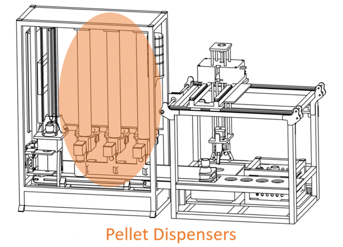
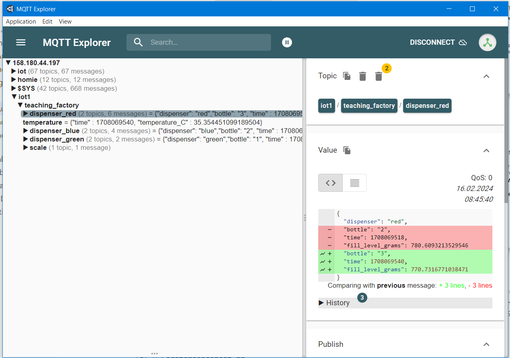
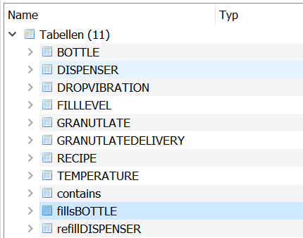

<!-- paginate: true -->

# Aufgaben 6: Datenbanken

## Systembeschreibung der Anlage

* Die Produktionsplanung beruht auf **Rezepten** (`iot1/teaching_factory/recipe`) für die **Flaschen**, diese geben für jeden **Dispenser** an, wie viel Gramm vom jeweiligen **Granulat** einzufüllen ist.
* Die Pellet Dispenser sind zylindrischen Rohre, die die richtigen Pellet-Farben für das aktuelle Rezept vorhalten.
* Mittels eines Schneckengewinde kann jeder Pellet-Dispenser eine vorbestimmte Menge von Pellets abfüllen. Hierbei kann es zu Schwankungen kommen. 

---

* Jeder Pellet Dispenser verfügt über einen Ultraschall-Sensor, der den aktuellen **Füllstand** ungefähr abschätzen kann
* Nach jedem **Abfüllprozess** kann ein Pellet Dispenser seinen aktuellen Füllstand übermitteln. Zu jeder Abfüllung kann über einen RFID-Tag erfasst werden, welche Flasche gerade abgefüllt wurde (`iot1/teaching_factory/dispenser_red`). Auch die Vibration unter jedem Dispenser während der Abfüllung kann erfasst werden. Diese wurde bereits zu einem einzelnen Indexwert verrechnet. 
* Am Ende des Prozesses wird jede Flasche auf einer **Waage** gewogen und der Zeitpunkt dokumentiert (`iot1/teaching_factory/scale/final_weight`)
* Die Temperatur in der Anlage wird ebenfalls erfasst (`iot1/teaching_factory/temperature`)
* Ein Vibrations-Sensor unterhalb der Flaschen-Vereinzelung kann die **Vibration** der Flaschen messen, um z.B. zu erfassen, ob eine Falsche einen Sprung hat (`iot1/teaching_factory/drop_vibration`)
---

 

  

- orientieren Sie sich an den Daten die über den MQTT-Broker kommen

---

## 🏆 P10: ER-Diagramm für die Erfassung von Prozessdaten (4pkt)

- Erstellen Sie ein ER-Diagramm zur  Erfassung von Prozessdaten mit den **fett** gedruckten Entitäten Achten Sie dabei auf die richtige Nutzung von Mutiplizitäten und kennzeichen Sie potentielle Schlüsselattribute.
- **Hinweis:** Schauen Sie sich die Aufgabenstellung von P14 und P15 an, um zu sehen, welche Daten benötigt werden. Andere nicht in der Aufgabenstellung genannte Daten können ignoriert werden.
- Anforderungen an die Datenbank:
    - Übergeordnetes Ziel der Datenbank ist es die Produktion im Nachhinein analysieren zu können.
    - Die Füllstände jedes **Dispensers** können im Zeitverlauf verfolgt werden. Ebenfalls können die **Nachfüll-Ereignisse** dokumentiert werden. 
    - Es können zeitgleich verschiedene **Rezepte** auf der Produktionslinie gefahren werden, sofern diese die gleichen **Granulate** nutzen. Entsprechend müssen die Rezepte und die Granulate in der Datenbank abgebildet werden.

---

- Granulate haben einen Typ, der die Eigenschaften bestimmt, einen Hersteller und eine Chargennummer, je nach Lieferung. Die Farbe des Granulats hängt nur vom Typ ab. 
- Jedes Rezept wird zu einem bestimmtem Datum angelegt und bestimmt die anzufüllende Menge eines jeden Granulat-Typs für die jeweiligen Dispenser. Zudem wird festgehalten, wie viele Flaschen des jeweiligen Rezeptes produziert werden sollen. Dies kann mit den bisher produzierten (nicht zu leichten) Flaschen mit dem Rezept abgeglichen werden.
- Flaschen können mittels einer ID identifiziert werden. Zudem ist zu jedem Behälter das Rezept bekannt.
- Nach dem Wiegevorgang kann für jede Flaschen der Zeitpunkt und das Endgewicht festgehalten werden.
- Zudem meldet die Qualitätskontrolle, ob eine Flaschen einen Sprung hat.
- Speichern Sie das ER Diagramm als `ER-Diagramm.svg`

---

## 🏆 P11: Relationen (10pkt)

- Nutzen Sie das ER-Diagramm, um Relationen in der dritten Normalform zu erstellen
- Legen Sie dazu eine Tabelle für jede Entität an. Diese soll die Primär- (unterstrichen) und Fremdschüssel (`<tabellenname.schlüssel>`) enthalten z.B.:

 

| FUELLSTAND |  |  |  |  |
|---|---|---|---|---|
| __`id`__ | `Datum` | `Zeit`  | `Fuellstand` | `DISPENSER.id` |
| *int* | *date* | *time* | *float* | *id* |

  

- Stellen Sie sicher, dass sich Ihre Tabellen in der 3. Normalform befinden!
- Speichern Sie die Relations-Tabellen als `Relationen.pdf`

--- 

## Hinweis:

- Mit [Mermaid](https://mermaid-js.github.io/mermaid/#/entityRelationshipDiagram) können Sie ER-Diagramme erstellen, die Informationen für beide Abgaben enthalten
- Es könnten zuletzt z.B. folgende Tabellen enthalten sein:

