<!-- paginate: true -->


# SQL - Stuctured Query Language

## Datenbanksysteme

 

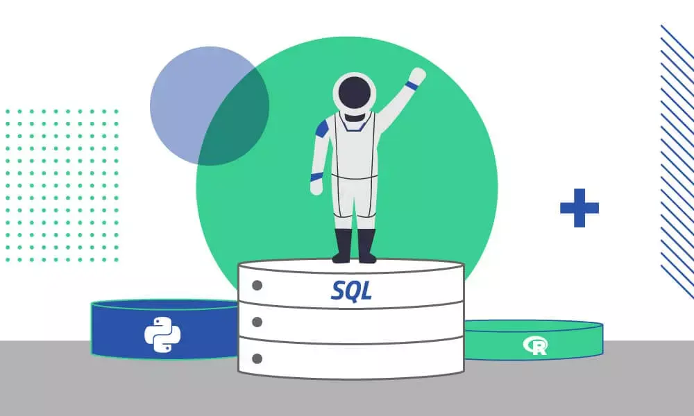

 

---


### 🎯 Lernziele

Nach dieser Einheit sind Sie in der Lage dazu

- SQL-Befehle ausführen, um Sachverhalte aus Datenbanken abzufragen
- sich selbstständig über komplexe SQL-Befehle zu informieren, um mit Datenbanken zu interagieren


---

## Datenbank-Management-Systeme

 

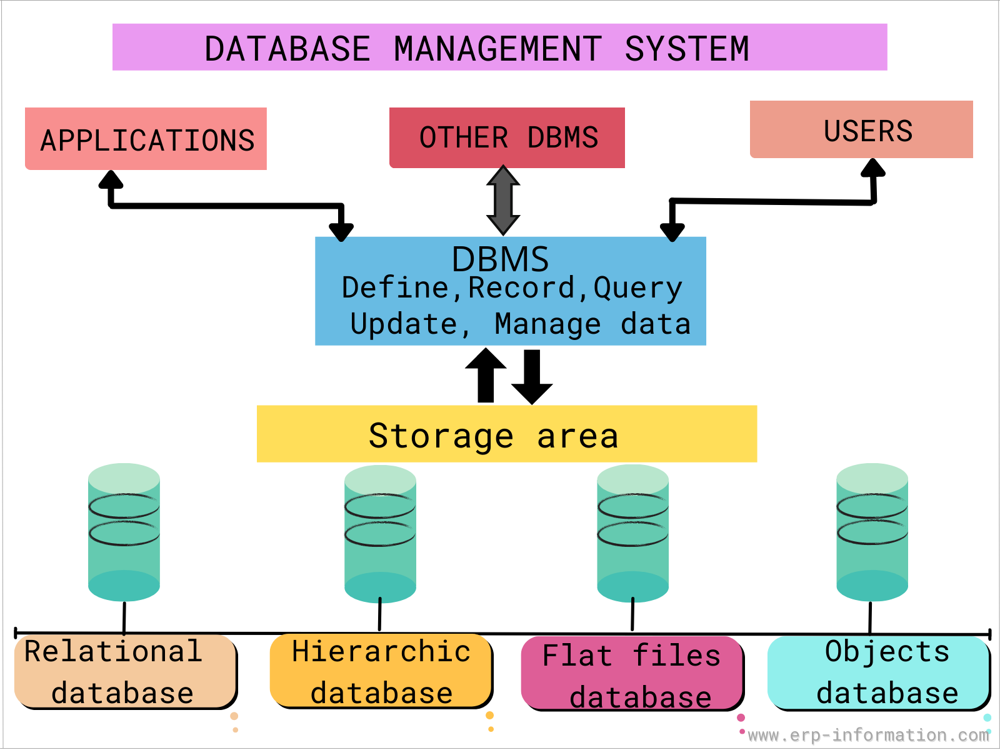

 

---

## SQL

* standardisierte Sprache zur Interaktion mit Database-Management Systems
* Data Query Language (DQL) – Abfrage und Aufbereitung der gesuchten Informationen
* Data Manipulation Language (DML
) – Datenmanipulation (Ändern, Einfügen, Löschen von Datensätzen
* Data Definition Language (DDL) – Definition des Datenbankschemas (Erzeugen, Ändern, Löschen von Datenbanktabellen, Definition von Primärschlüsseln und Fremdschlüsseln)
* Data Control Language (DCL) – Rechteverwaltung
* Transaction Control Language (TCL) – Transaktionskontrolle

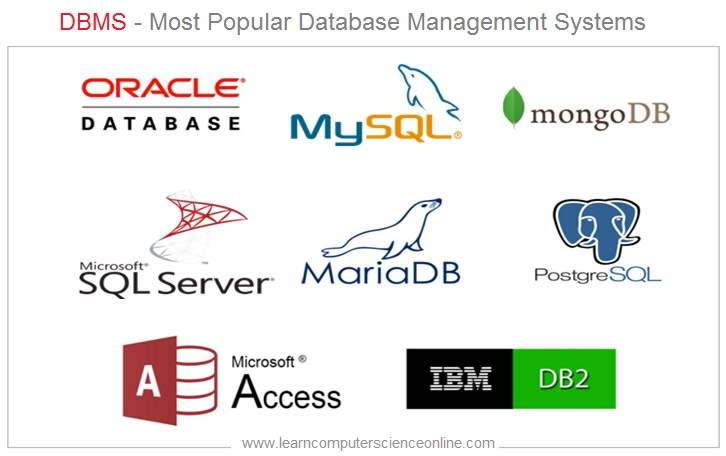


---

### Data Definition Language

* Anlegen neuer Tabellen
    * Tabellenname
    * Attribute und deren Datentyp
    * Womit dürfen die Attribute befüllt werden
    * Fremdschlüssel

---


---

**Fahrzeug**

| 🔑 ID | Hersteller  |
|---|---| 
| 123 | Tesla |
| 124 | BMW |

---

**Wallbox**

| 🔑 ID |
|---|
| A |

---


**Ladevorgang**

| 🔑 Fahrzeug.ID | 🔑 Wallbox.ID | 🔑 Zeitpunkt | Ladestand_kWh  |
|---|---|---|---|
| 123 | A | 2023-2-22 18:00 | 55 |
| 124 | A | 2023-2-23 18:00 | 30 |

---


### Datenbanktabellen

**Fahrzeug**

| 🔑 ID | Hersteller  |
|---|---| 
| 123 | Tesla |
| 124 | BMW |

- Anlegen einer Tabelle:
    `CREATE TABLE Fahrzeug (ID NUMERIC, Hersteller TEXT);`
    `CREATE TABLE <Tabellenname> (<Attribut1> <Datentyp>, <Attribut2> <Datentyp>);`

---

### DB Browser for SQLite

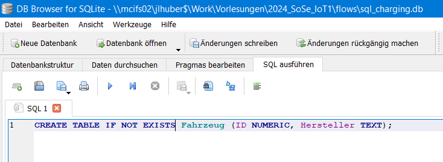

- [DB Browser for SQLite](https://sqlitebrowser.org/) erlaubt es SQLite Datenbanken zu öffnen und editieren

---


**Fahrzeug**

| 🔑 ID | Hersteller  |
|---|---| 
| 123 | Tesla |
| 124 | BMW |

- Löschen einer Tabelle:
    ```DROP TABLE Fahrzeug```
    ```DROP TABLE <Tabellenname>```
- Anlegen einer Tabelle:
    `CREATE TABLE IF NOT EXISTS Fahrzeug (ID INT NOT NULL PRIMARY KEY, Hersteller TEXT);;`
    `CREATE TABLE <Tabellenname> (<Attribut1> <Datentyp>, <Attribut2> <Datentyp>);`
- Festlegen des Primärschlüssels `PRIMARY KEY`
- Primärschlüssel darf beim Erstellen nicht leer gelassen werden `NOT NULL`
- `AUTOINCREMENT` automatisches Zählen der Keys bei neuem Eintrag

---

### Datentypen SQLite

- `TEXT`: Strings, z.B. auch Datum und Uhrzeit
- `NUMERIC`: Beliebige Zahlen
- `INTEGER`: Ganze Zahlen
- `REAL`: Gleitkommazahlen
- `BLOB`: Binary Large Object z.B. Bilder

###### https://www.sqlite.org/datatype3.html

---

#### Datentypen in anderen Datenbanken

| Data type | Access | SQLServer | Oracle | MySQL | PostgreSQL |
|---|---|---|---|---|---|
| **string (fixed)** | N/A | Char | Char | Char | Char |
| **string (variable)** | Text (<256) Memo (65k+) | Varchar | Varchar Varchar2 | Varchar | Varchar |
| **binary object** | OLE Object Memo | Binary (fixed up to 8K) Varbinary (<8K) Image (<2GB) | Long Raw | Blob Text | Binary Varbinary |

---

## Data Manipulation Language

**Fahrzeug**

| 🔑 ID | Hersteller  |
|---|---| 
| 123 | Tesla |
| 124 | BMW |

- Anlegen eines Tupels
    ```INSERT INTO Fahrzeug VALUES (123,"Tesla")```
    ```INSERT INTO Fahrzeug VALUES (124, "BMW");```
    ```INSERT INTO <Tabellenname>  VALUES (<WertAttribut1>,<WertAttribut2>)```


---

### Aufgabe

- legen Sie die folgende Tabelle an und befüllen Sie diese

**Ladevorgang**

| 🔑 Fahrzeug.ID | 🔑 Wallbox.ID | 🔑 Zeitpunkt | Ladestand_kWh  |
|---|---|---|---|
| 123 | A | 2023-2-22 18:00 | 55 |
| 124 | A | 2023-2-23 18:00 | 30 |

---

```SQL
-- Create the Ladevorgang table
CREATE TABLE Ladevorgang (
    Fahrzeug_ID INTEGER NOT NULL,
    Wallbox_ID TEXT NOT NULL,
    Zeitpunkt DATETIME NOT NULL,
    Ladestand_kWh REAL NOT NULL,
    PRIMARY KEY (Fahrzeug_ID, Wallbox_ID, Zeitpunkt)
);

-- Insert data into the Ladevorgang table
INSERT INTO Ladevorgang (Fahrzeug_ID, Wallbox_ID, Zeitpunkt, Ladestand_kWh)
VALUES 
    (123, 'A', '2023-02-22 18:00', 55),
    (124, 'A', '2023-02-23 18:00', 30);
```
---


## Datenabfragen 

- Wir wollen wissen, wie viel wann geladen wird. Unabhängig vom Fahrzeug.

**Ladevorgang**

| 🔑 Fahrzeug.ID | 🔑 Wallbox.ID | 🔑 Zeitpunkt | Ladestand_kWh  |
|---|---|---|---|
| 123 | A | 2023-2-22 18:00 | 55 |
| 124 | A | 2023-2-23 18:00 | 30 |

---

``` SELECT Zeitpunkt, Ladestand_kWh FROM Ladevorgang ```

| Zeitpunkt | Ladestand_kWh  |
|---|---|
| 2023-2-22 18:00 | 55 |
| 2023-2-23 18:00 | 30 |


---

### Abfragen aus Datenbanken (Tabellen)

- Wichtige Typen von Operationen sind:  
    - **Selektion** (engl.: selection): Auswahl einer Untermenge aller Tupel einer Tabelle
    - **Projektion** (engl.: projection): Auswahl einer Untermenge der Attribute einer Relation
    - **Verbund** (engl.: join): Verknüpfung von Tabellen anhand selektierter Attribute

 


 

---


### 🧠 SQL-Befehle


```SQL
SELECT <attribute> FROM <relation>
```

SELECT und FROM sind Schlüsselwörter der SQL-Sprache und werden deswegen großgeschrieben.

```SQL
SELECT * FROM Ladevorgang
```

 ```Ladevorgang``` ist der Name der Tabelle/Relation von der wir abfragen wollen. das ```*``` ist eine sogenannte Wildcard und bedeutet, dass wir alle Attribute der Tabelle ausgeben wollen.

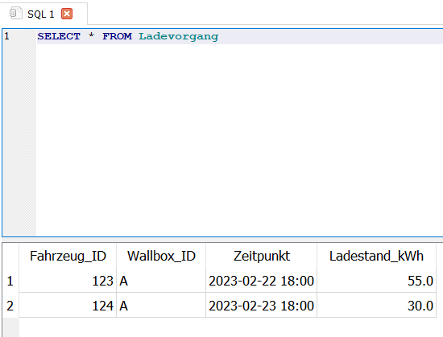

---


### 🧠  Projektion

Durch eine Projektion werden einzelne Attribute aus einer Tabelle abgefragt. Hierzu werden die Attribute hinter der SELECT genannt und mit einen Komma voneinander abgetrennt.

```SQL
SELECT Zeitpunkt FROM Ladevorgang
```

```
2023-02-22 18:00
2023-02-23 18:00
```

```SQL
SELECT Zeitpunkt, Ladestand_kWh FROM Ladevorgang
```

```
2023-02-22 18:00	55.0
2023-02-23 18:00	30.0
```

---

### 🧠 Selektion

Auswahl einer Untermenge aller Tupel einer Tabelle.
Die Selektion wird durch zusätzliche Schlüsselwörter hinter der Auswahl der Tabelle (FROM tips) angefügt.

Beispielsweise lässt sich die Ausgabe auf den ersten Eintrag begrenzen:

```
SELECT Zeitpunkt, Ladestand_kWh FROM Ladevorgang LIMIT 1
```

```
2023-02-22 18:00	55.0
```

---


### 🧠 Filtern


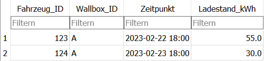


Eine besondere Art von Selektion ist das Filtern
Beim Filtern wird das Schlüsselwort ```WHERE``` genutzt. Darauf folgt eine logische Abfrage z.B. bezüglich des Attributs ```Fahrzeug_ID``` ob dieses den 123 `"No"` enthält.

```SQL
SELECT * FROM Ladevorgang WHERE Fahrzeug_ID=123
```

```
123	A	2023-02-22 18:00	55.0
```


---


### 🧠 Verbund / Join


Oft sind Informationen über mehrere Tabellen verteilt. z.B. wenn hier der Preis eines Produktes gefunden werden soll (INNER JOIN)


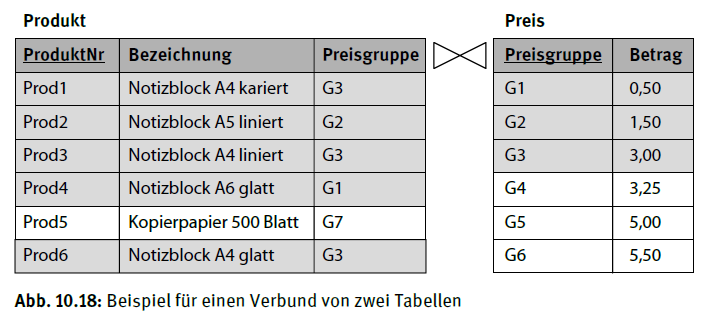

Hierzu müssen die beiden Tabellen in der SQL-Abfrage verbunden werden
```SQL
SELECT Produkt.ProduktNr, Preis.Betrag FROM Produkt JOIN Preis ON Produkt.Preisgruppe = Preis.Preisgruppe
```

---


#### Verschiedene SQL JOIN


- ```(INNER) JOIN```: Gibt Elemente zurück, die Werte in beiden Tabellen haben
* ```LEFT (OUTER) JOIN```: Gibt alle Werte aus der linken Tabelle und die Treffer aus der rechten Tabelle zurück.
* ```RIGHT (OUTER) JOIN```: Gibt alle Werte aus der rechten Tabelle und die Treffer aus der linkten Tabelle zurück.
* ```FULL (OUTER) JOIN```: Git alle Einträge zurück, auch wenn es keine Treffer gibt 

 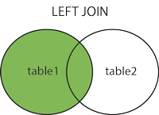 


###### [w3schools.com](https://www.w3schools.com/sql/sql_join.asp)

---


```SQL
SELECT Fahrzeug.Hersteller, Ladevorgang.Ladestand_kWh FROM Fahrzeug INNER JOIN Ladevorgang ON Fahrzeug.ID = Ladevorgang.Fahrzeug_ID;
```

```
Tesla	55.0
BMW	30.0
```

---

### View 

- Eine Sicht ist im Wesentlichen ein Alias für eine Datenbankabfrage. Sie kann wie eine Datenbanktabelle verwendet werden

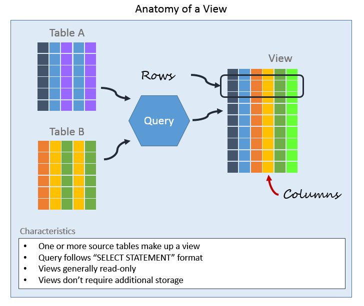

---

#### Beispiel View 

- z.B. wir wollen eine Software schreiben, die angibt, welches Auto gerade lädt. Dabei wollen wir nicht die technische `ID` sondern den `Hersteller` angeben

```
CREATE VIEW LadeFahrzeug AS
    SELECT Fahrzeug.Hersteller, Ladevorgang.Zeitpunkt
    FROM Fahrzeug
    INNER JOIN Ladevorgang
        ON Fahrzeug.ID = Ladevorgang.Fahrzeug_ID;
```

* `LadeFahrzeug` sieht aus, wie eine Tabelle mit den Attributen `Hersteller` und `Zeitpunkt` 

---

**LadeFahrzeug**


| 🔑 Fahrzeug.Hersteller | 🔑 Ladevorgang.Zeitpunkt |   
|---|---|
| Tesla | 2023-2-22 18:00 | 
| BMW |2023-2-23 18:00 | 

---

##  Löschen von Tabellen und Daten


- `DROP` entfernt Tabellen
    ```SQL
    DROP TABLE table_name
    ```


- `DELETE` entfernt Tupel
    ```SQL
    DELETE FROM Fahrzeug WHERE hersteller="Tesla" 
    ```

---

## Erweiterte Datenanalyse

- Wie groß sind die Batterien der Fahrzeuge?

```SQL
SELECT Fahrzeug_ID, MAX(Ladestand_kWh) FROM  Ladevorgang GROUP BY Fahrzeug_ID;
```

```
123	55.0
124	30.0
```

---

## 🤓 Zusatzmaterial:
- Es gibt noch viele weitere SQL-Befehle z.B. um Daten zu analysieren
- Machen Sie sich mit  dem Beispiel auf der folgenden [Website](https://www.w3schools.com/sql/sql_syntax.asp) vertraut
- Lösen Sie die [Aufgaben](https://www.w3schools.com/sql/exercise.asp?filename=exercise_select1)
    - [Select 1-3](https://www.w3schools.com/sql/exercise.asp?filename=exercise_select1)
    - [Where 1,3](https://www.w3schools.com/sql/exercise.asp?filename=exercise_where1) 
    - [Order By 1](https://www.w3schools.com/sql/exercise.asp?filename=exercise_orderby1)
    - [Wildcards](https://www.w3schools.com/sql/exercise.asp?filename=exercise_wildcards1)
    - [Delete 1](https://www.w3schools.com/sql/exercise.asp?filename=exercise_delete1)
- [Ausführliches SQL Tutorial](https://www.w3schools.com/sql/default.asp)
- `ChatGPT` ist gut darin SQL-Befehle zu schreiben, sofern man das Datenbankschema z.B. als `CREATE TABLE` Statement übergibt

---

### 🎯 Lernfortschritt

Nach dieser Einheit sind Sie in der Lage dazu
- SQL-Befehle ausführen, um Sachverhalte aus Datenbanken abzufragen
- sich selbstständig über komplexe SQL-Befehle zu informieren, um mit Datenbanken zu interagieren


---

## Datenbanksysteme in der Praxis


### Interaktion mit Datenbanksystemen

* Zugang häufig über IP-Adresse und Port
* Zugangsdaten: Benutzername und Passwort
* Grafische Admin-Software: 
    * z.B. Microsoft Access 2013, [phpmyadmin](https://www.phpmyadmin.net/), DB Broswer for SQLite
* Kommandozeile und SQL-Befehle
* Aus Software oder Programmiersprache (z.B. node-red, Google Colab, C#, ...)

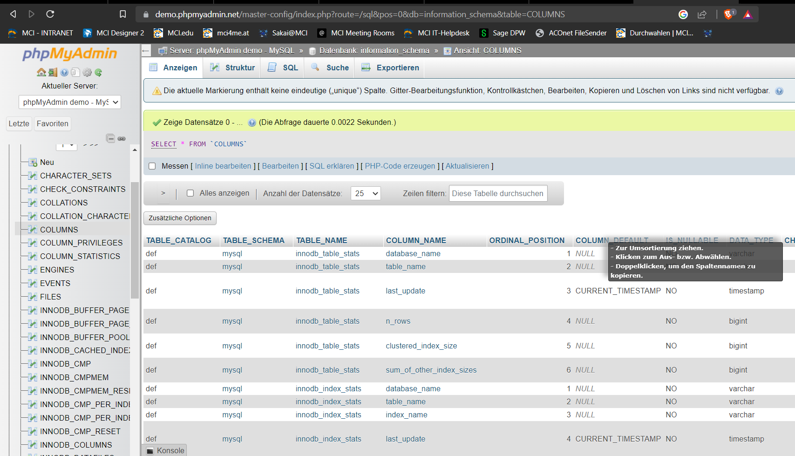

---

### (relationale) SQL-Datenbanken 

* Anwendung:
    * Strukturierte Daten in immer gleicher Form
    * Beziehungen zwischen den Daten sind wichtig
* Vorteile:
    * Sicherheit durch Zugriffsmanagement
    * AKID-Eigenschaften (Atomarität, Konsistenz, Isolation und Dauerhaftigkeit)
* Nachteile:
    * Probleme mit unstrukturierten Daten
    * Skalierbarkeit (laufen i.d.R. auf einem Server) 

---

#### Relevante SQL-Datenbanken 

- SQLite
- PostgreSQL
- MariaDB
- MySQL


---


### Dokumentenorientierte Datenbank und SQL-Datenbanken 

* Anwendung:
    * Große Mengen unstrukturierter Daten
* Vorteile:
    * Günstiger, da verteilte Systeme möglich
    * Skalierbar
    * Damit geringere Ausfallzeiten (kein Single-Point of Failure)
* Nachteile:
    * Weniger beherrschte Technologie
    * ggf. keine Ausreichenden AKID-Eigenschaften 

---

#### Relevante Dokumentenorientierte Datenbanken 

- Key-value stores: Amazon DynamoDB 
- Columnar databases
- Document-oriented database: MongoDB


--- 

### Zeitreihen-Datenbank

* Optimiert fürs das speichern und die Analyse von Zeitreihen wie Sensordaten
* Datensatz mit fixer Struktur: Zeitstempel, Wert, Metainformationen (Tags)
* Häufig auf Basis häufig spaltenorientierte NoSQL-Datenbanken

* Vorteile:
    * Funktionen für Zeitreihen (Mittelwert, Resampling)
    * Schnell
* Nachteile:
    * Begrenzter Funktionsumfang

---


- InfluxDB
- Prometheus


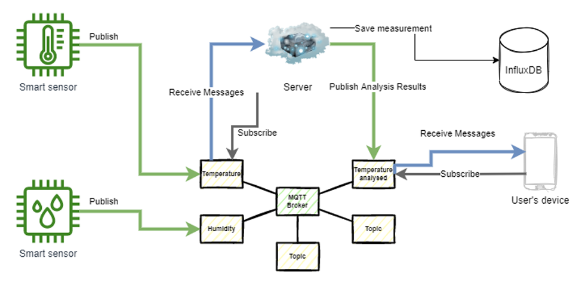


