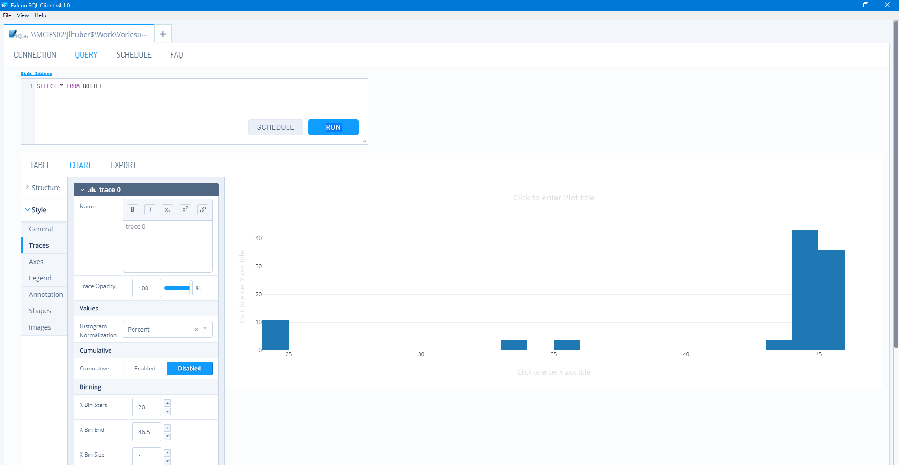
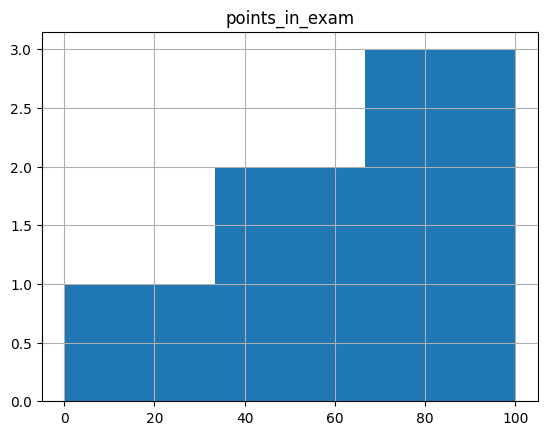

<!-- paginate: true -->


# Aufgaben 8: Visualisierung und Datenbanken

## Datengrundlage

- Als Ausgangspunkt für die folgenden Aufgaben dient eine neue Datenbank, da sich die welche Sie in den letzten Wochen erstellt haben, wahrschscheinlich unterscheiden.
- Laden Sie die neue Version der Datenbank `filled_tables.db` aus Sakai herunter

## 🏆 P14: UseCase 1: Dashboard (6pkt)

- Die Schichtleiter:in möchte die Füllstände aller Dispenser in Echtzeit überwachen können. 
<!-- - Zudem soll der letzte Nachfüll-Zeitpunkt angezeigt werden.-->
- Zudem sollen alle abgefüllten Flaschen in einer Tabelle dokumentiert werden, so dass Falschen mit zu geringem Gewicht anhand ihrer Flaschennummer aussortiert werden können.
- Die gleiche Tabelle soll anzeigen welche Flaschen einen Sprung haben
- Hierzu müssen Sie die Daten aus der Datenbank abfragen und in das Dashboard einbinden
* Laden Sie den Flow `dashboard_14.json` und ein Bild `dashboard_14.png` hoch

---

## 🏆 P15: Use Case 4: Qualitätsmanagement  (4pkt)

* Das Qualitätsmanagement möchte Statistiken über den Prozess abfragen können
* Denken Sie daran dass dazu die Daten nicht nur abgefragt, sondern zunächst auch abgespeichert werden müssen
* **Zeigen Sie die Spannweite, Min, Max und Mean für die folgenden Variablen an (Vibration und Füllmenge je Dispenser, Temperatur, Endgewicht)**
* Laden Sie den Flow `dashboard_14.json` und ein Bild `dashboard_14.png` hoch


---

## 🏆 P16: Use Case 4: Qualitätsmanagement (Optional)

- Installieren Sie [Falcon](https://github.com/plotly/falcon)  



---

- Erzeugen Sie ein Histogramm für die Füllmengen der Flaschen
    - beschriften Sie dieses ordentlich
    - Erklären Sie, wie die Verteilung zu Stande kommt

<!-- 
```
SELECT finalWeight,number, DISPENSERid, fillVibration FROM BOTTLE JOIN fillsBOTTLE on fillsBOTTLE.BOTTLEnumber = BOTTLE.number
```
-->

- Wie sieht der Temperaturverlauf über die Zeit aus?
- Gibt es einen Zusammenhang zwischen Temperatur und der Vibration während der Abfüllung?

<!-- 
```
SELECT temperature, TEMPERATURE.time, DISPENSERid, fillVibration  FROM fillsBOTTLE JOIN TEMPERATURE on TEMPERATURE.time = fillsBOTTLE.time
```
-->

- Gibt es einen Zusammenhang zwischen dem Füllstand in einem Dispenser und der Vibration während der Abfüllung?

- Gibt es einen Zusammenhang zwischen dem Füllstand in einem Dispenser und dem Fehler der Abfüllung?

- Erstellen Sie [Markdown Datei](https://dillinger.io/) in der Sie zum jeder Frage eine kurze Antwort schreiben und exportieren Sie diese als `Falcon_Analysis.pdf`

---

### Beispiel Markdown Datei

```md
# Überschrift

Beschreibung des Projektes ...

## Histogramm

Das Histogramm zeigt die Verteilung der Füllmengen der Flaschen.

Hierzu wurde folgende SQL-Abfrage verwendet:

``sql
FROM ...
``

Das Histogramm zeigt, dass die Füllmengen der Flaschen normalverteilt sind, solange keine Große Abweichung nach unten besteht. Diese kommt zustande, da ...



## Temperaturverlauf

Der Tempuraturverlauf wurde über einen Zeitraum von X Tagen ausgewertet, da sich hier ein wiederkehrendes Muster zeigt. ...

Hierzu wurde folgende SQL-Abfrage verwendet:

...

```

---

## Weiterführende Literatur & Ressourcen 

Die folgenden Ressourcen sind für diese Woche relevant:

- [DB Browser for SQLite](https://sqlitebrowser.org/) erlaubt es SQLite Datenbanken zu öffnen und grafisch, so wie mti SQL-Befehlen zu editieren
- [Falcon](https://github.com/plotly/falcon)   ist ein Werkzeug zur Datenanalyse und Visualisierung, welche direkt auf SQL-Datenbanken zugreifen kann. Das Falcon baut auf `ploty` auf, um interaktive Grafiken zu erzeugen. Bei fortgeschrittenen Python-Kenntnissen können Sie auch direkt mit `pandas` und `plotly` arbeiten.
- Markdown ist eine einfache Auszeichnungssprache, die es erlaubt Texte zu formatieren. Sie können diese z.B. in [Dillinger](https://dillinger.io/) schreiben und als PDF exportieren. Alternative können Sie auch jeden andern Texteditor verwenden, der PDF-Export unterstützt (z.B. Visual Studio Code).
