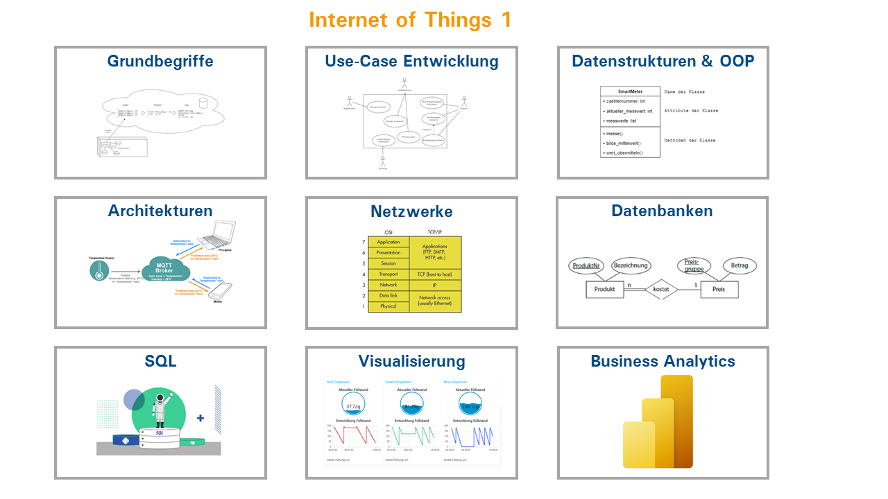
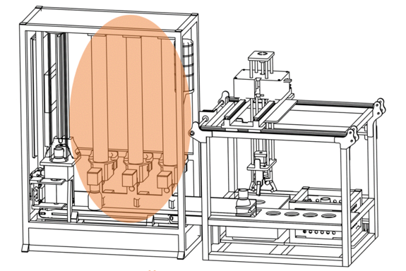
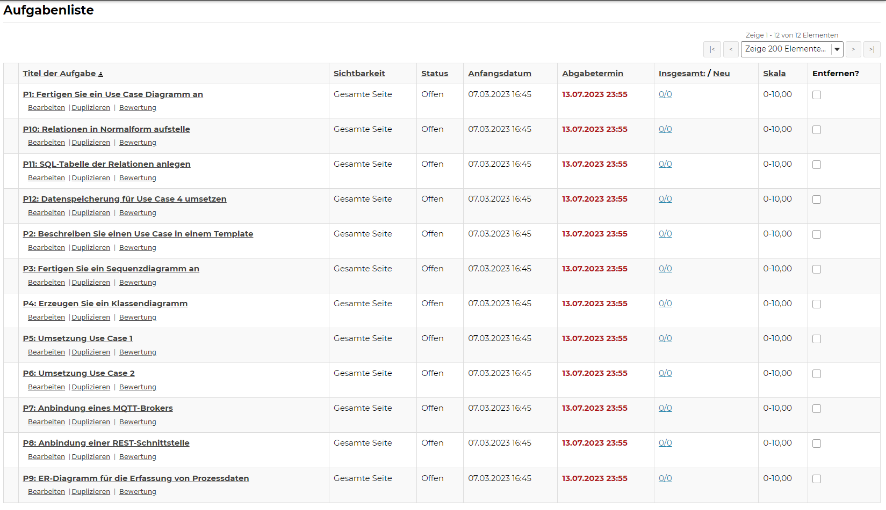

<!-- paginate: true -->

# Internet of Things

<!-- benötigt:  Rest-API für Bestellungen: https://github.com/jhumci/iot_rest,
                Teaching-Factory-Simulator https://github.com/jhumci/iot_simulator,
                MQTT: Broker z.B. https://github.com/jhumci/docker_iot -->
---

## Philosophie der Lehrveranstaltung

* Kompetenz zur Umsetzung eines IoT-Projekts
* ein übergeordneter Anwendungsfall
* zu jedem Thema
    * Impulsvortrag 
    * ggf. Übungsaufgaben
    * Projektarbeit

---

## Leistungsbewertung

- 89 %  **Projektabgabe**
    - zu zweit oder alleine
    - wird kontinuierlich erarbeitet
    - Sakai Abgaben
- 11 % **Zusatzaufgabe**
    - Es wir eine Weiterentwicklung der bestehenden Aufgaben vorgeschlagen
    - Die Aufgabenstellung wird als Markdown-Datei dokumentiert
    - Eine Saubere Musterlösung wird eingereicht

---

## Anforderungen an **P.X Zusatzaufgabe**

- Die Idee dieser Aufgabe, ist dass Sie sich aktiv in die Weiterentwicklung der Lehrveranstaltung einbringen
- Hierzu gibt es zwei Möglichkeiten:
    - Sie entwickeln eine neue Aufgabe, die in die Lehrveranstaltung integriert werden kann
    - Sie verbessern das bestehende Material, indem Sie z.B. in Inhalt zu einem Thema ergänzen oder verbessern
- In beiden Fällen geben Sie einen gezippten Ordner ab, der folgende Struktur hat:
    - `Beitrag.md` - Text welcher in das Skript eingefügt werden kann
    - `Loesung.md` - Text welcher die Musterlösung beschreibt (falls nötig)
    - `Musterlösung` - ein Ordner mit einer Musterlösung (falls nötig)
    - `Beispieldateien` - ein Ordner mit Beispieldateien (falls nötig)
    - `images` - ein Ordner mit in die Markdown-Datei eingebetteten Bildern (falls nötig)

###
---

<!--
## Terminübersicht

| Termin | Uhrzeit | Thema |
|---|---|---|
| 1 | 13:00 | 1 Grundbegriffe |
| 2 | 13:00 | Projektarbeit |
| 3 | 13:00 | 2 Use Case Entwicklung |
| 4 | 13:00 | Projektarbeit |
| 5 | 13:00 | 3 Datenstrukturen und OOP |
| 6 | 13:00 | Projektarbeit |
| 7 | 13:00 | 4 Architekturen für Kommunikationsparadigmen |
| 8 | 13:00 | Projektarbeit |
| 9 | 13:00 | 5 Netzwerke |
| 10| 13:00 | Projektarbeit |
| 11| 09:00 | 6 Datenbanken |
| 12| 13:00 | Projektarbeit |
| 13| 09:00 | 7 SQL |
| 14| 09:00 | Projektarbeit |
| 15| 13:00 | 8 Visualisierung |
| 16| 08:00 | Klausur |

-->