<!-- paginate: true -->

# Internet of Things

**SoSe 2023**
Dr. Julian Huber


---

## Data Analytics


###### https://www.qlik.com/us/data-analytics/data-science-vs-data-analytics

---

### Zieldefinition

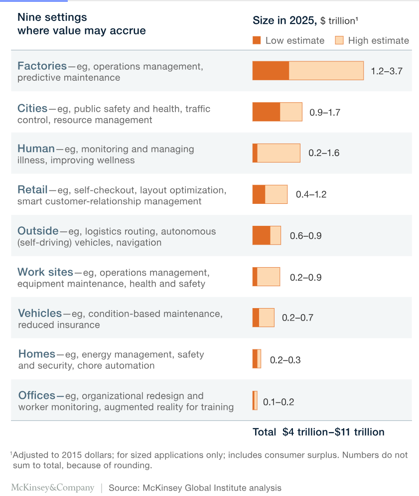

* Automatisierung: z.B. Intralogistik
* Bessere Entscheidungen: z.B. Predictive Maintenance
* nicht immer ist das Ziel schon vor der Datensammlung bekannt 

---

#### Intralogistik

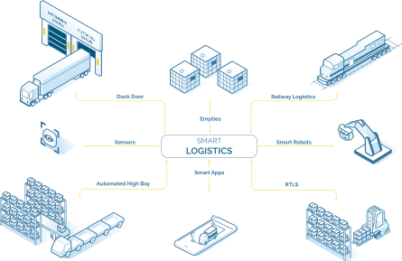

###### https://leogistics.com/internet-of-things/

---


#### Predictive Maintenance

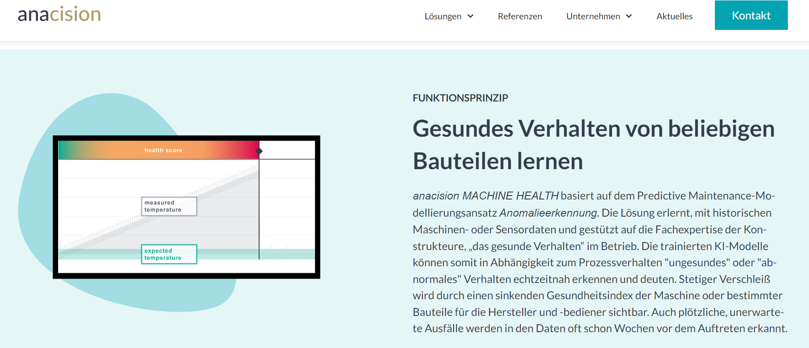


---

### Datensammlung

* Anbinden vorhandener Systeme
    * Maschinendaten mit [OPC UA](https://de.wikipedia.org/wiki/OPC_Unified_Architecture)
    * SPS-Daten z.B. über [MQTT](https://infosys.beckhoff.com/index.php?content=../content/1031/tf6701_tc3_iot_communication_mqtt/3518541195.html&id=) 
    * Bestehende Bussysteme z.B. Submetering Stromverbrauch
* Datenerfassung per Telemetrie (VL 8)
* AutoID (VL 5)

---

### Daten-Integration und Management

* Dokumentation von Rohdaten
* Vereinheitlichung und Vorverarbeitung
* Daten auf gemeinsamer Plattform (VL 7)
* Verknüpfbare Daten in gemeinsamer Datenstruktur (z.B. über Datenbankdesign)
* Zuverlässige Datenerfassung (VL 6) mit Qualitätskontrolle

---

#### Beispiel: Modern Data Stack


---

### Data-Exploration und Analyse

**Deskriptive Statistik**
- Beschreibung eines Datensatzes
- anhand von statischen Kennzahlen
- und Visualisierungen
- Berücksichtigung von Domänenwissen


---

## Datensätze und Variablentypen

- Datensätze sind Sammlungen von Beobachtungen
- gibt es verschieden Tabellen, müssen diese sinnvoll miteinander verknüpft werden (ggf. setzten wir wieder zusammen, was wird davor mühsam aufgetrennt haben)
- Variablen im Datensatz haben bestimmte Variablentypen, die bestimmen, was damit möglich ist


---

### ✍️ Aufgabe

- Wie lassen sich die folgenden Listen von Variablen
    - in aufsteigender Reihenfolge sortiert werden?
    - durch einen zentralen Wert beschrieben werden?
    - Beziehung zwischen zwei Werten beschrieben?


- ```gender = ["Male", "Female", "Female", "Female", "Male"]```
- ```education = ["M.Sc.", "B.Sc.", "B.Sc.", "PhD", "none"]```
- ```body_temperature_celsius = [37.85, 39.85, 38.85, 36.85, 37.85]```
- ```points_in_exam = [0, 100, 80, 80, 40]```


---


#### Nominale Variablen

- ```gender = ["Male", "Female", "Female", "Female", "Male"]```

- in aufsteigender Reihenfolge sortiert?
    * Es gibt keine inhärente Möglichkeit, sie in eine Reihenfolge zu bringen
- durch einen zentralen Wert beschrieben?
    * ``"Weiblich"`` ist der häufigste Wert (Modus)
- Was beschreibt die Beziehung zwischen zwei Werten?
    * Sie gehören zur gleichen Kategorie oder nicht

---


#### Ordinale Variablen

- in aufsteigender Reihenfolge sortiert?
    * ```education = ["none", "B.Sc.", "B.Sc.", "M.Sc.", "PhD",]```
- durch einen zentralen Wert beschrieben?
    * Modus
    * 50 % haben "B.Sc." oder weniger (Median)
- Was beschreibt das Verhältnis zwischen zwei Werten?
    * sie sind auf irgendeine Weise niedriger oder höher

---


#### Intervall-Skalierte Variablen

- in aufsteigender Reihenfolge sortiert?
    *  ```body_temperature_celsius = [36.85, 37.85, 37.85, 38.85, 39.85]```
- durch einen zentralen Wert beschrieben?
    * Modus, Median
    * arithmetisches Mittel $38.25=\mu=\frac{1}{n}\sum x_i$
- Wie wird die Beziehung zwischen zwei Werten beschrieben?
    * wir kennen den Abstand (Intervall) zwischen ihnen

---

#### Nominal-Skalierte Variablen

- in aufsteigender Reihenfolge sortiert?
    *  ```points_in_exam = [0, 40, 80, 80, 100]```
- durch einen zentralen Wert beschrieben?
    * Modus, Median, Mittelwert
- Was beschreibt das Verhältnis zwischen zwei Werten?
    * Wir kennen das Verhältnis zwischen (80 ist doppelt so hoch wie 40)

###### We cannot say this about the Celsius scale but the Kelvin scale


---


### Kenngrößen der Deskriptive Statistik

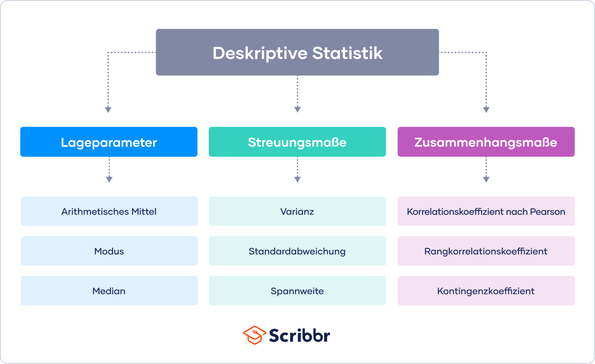

###### https://www.scribbr.de/statistik/deskriptive-statistik/

---

#### Lageparameter

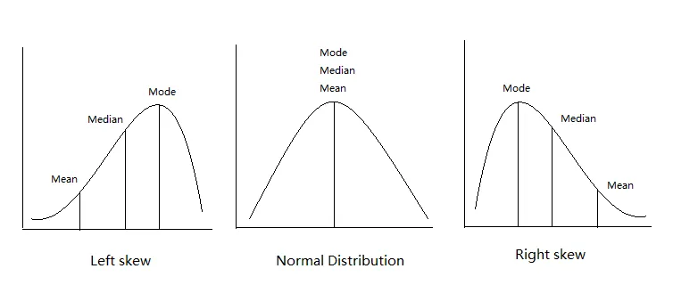

* mean / Mittelwert: Arithmetischer Mittelwert $\mu=\frac{1}{n} \sum_{i=i}^{n} x_{i}$
* median / Median: Wert der eine geordnete Liste von Werten in zwei Hälften teilt
* mode / Modus: Häufigster Wert in einer Liste von Werten


---

```Python
import pandas as pd
df = pd.DataFrame({"points_in_exam" : [0, 40, 60, 80, 80, 100] })

df.mean()   # 60 - was ist das gewichtete Mitte
df.median() # 70 - welche Punktzahl beschreibt den Durchschnittsstudent
df.mode()   # 80 - welche Punktzahl ist die häufigste
```


---

#### Streuungsmaße

* variance / Varianz: Summe der quadratischen vom Abweichungen von Mittelwert 
    $\sigma^2 = \frac{\sum_{i=1}^{n}(x_i - \mu)^2}{n}$
* standard deviation / Standardabweichung : $\sigma = \sqrt{\sigma^2}$
* Minimum und Maximum ergeben Spannweite

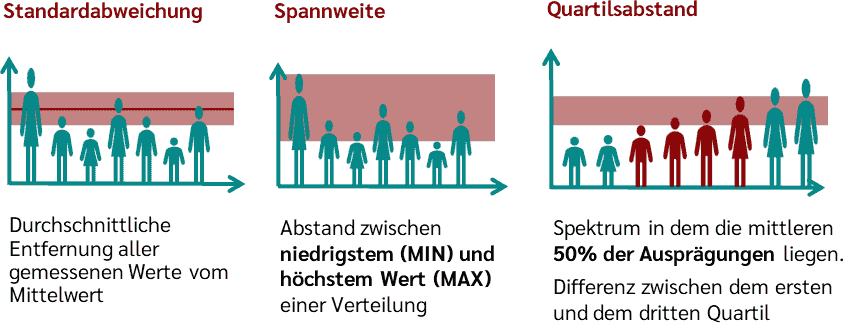

###### https://datatab.de/tutorial/standardabweichung-varianz-spannweite

---

```Python
import pandas as pd
df = pd.DataFrame({"Weigth" : [0, 40, 60, 80, 80, 100] })

df.var()            # 1280.0
df.std()            # 35.777088
df.max()-df.min()   # 100

```

---


#### Zusammenhangsmaße und Korrelation

- Wie gut kann ein lineares Modell den Zusammenhang der Variablen erklären
- Keine Aussage über Kausalität (Ursache-Wirkung-Beziehung)
- z.B. gemessen als Bravais-Pearson-Korrelationskoeffizient

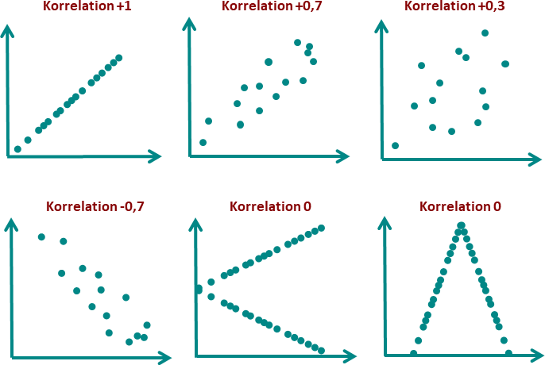


###### https://datatab.de/tutorial/korrelation

---


## Visualisierungen von Verteilungen


---

### Scatter Plot zweier Variablen

- lässt Aussage über Korrelation und Streuung zu

```Python
import pandas as pd
df =pd.DataFrame({"points_in_exam" : 
                    [0, 40, 60, 80, 80, 100],
                  "body_temperature_celsius" : 
                    [39.85, 37.85,  38.05, 36.85, 38.85, 38.35]})
import seaborn as sns

sns.regplot(data=df, 
                x="body_temperature_celsius", 
                y="points_in_exam",  scatter=True, 
                fit_reg=True)
df.corr(method='pearson') # -0.554871	
```

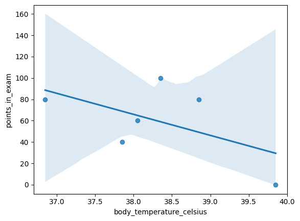


---

### Histogram

* angenäherte Darstellung der Verteilung
* Informationen über Varianz und Verteilung
* Daten einer einzelnen intervall-skalierten Variablen

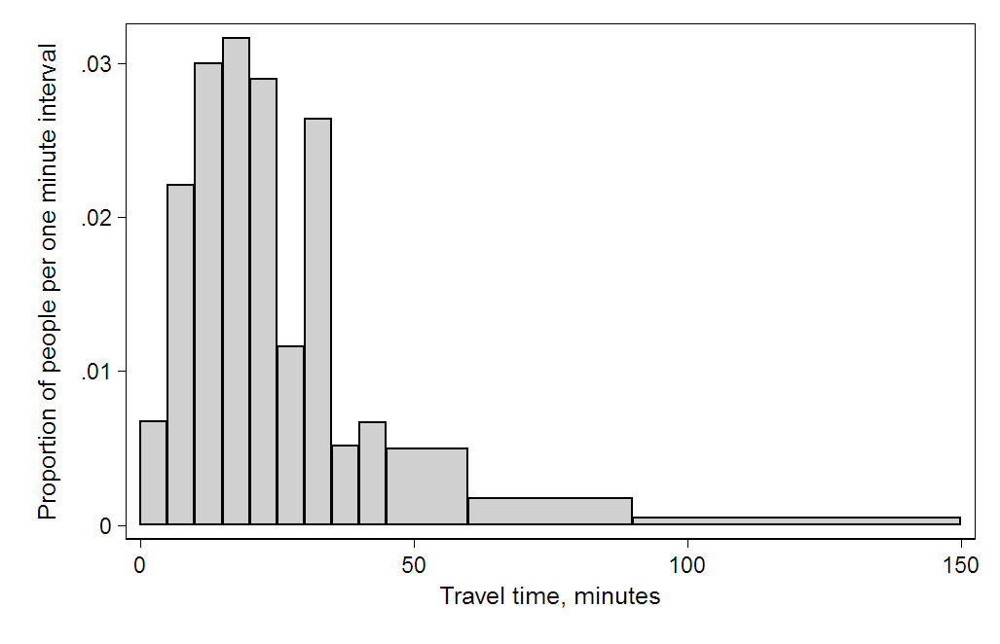


###### https://en.wikipedia.org/wiki/Karl_Pearson, https://en.wikipedia.org/wiki/Histogram

---

#### Konstruieren eines Histogramms

* Alle Werte der beobachteten Variable $x_i$ in eine Reihe von Intervallen einteilen.
* Zählen, wie viele Werte in jedes Intervall fallen (z. B. 5 % der Werte)
* Die Intervalle sind aufeinanderfolgend, überschneiden sich nicht und haben oft die gleiche Breite oder Größe.
* Stellt die Anzahl der Elemente im Intervall auf der y-Achse dar (dividiert durch den Stichprobenumfang für die relative Häufigkeit)


###### https://en.wikipedia.org/wiki/Histogram

---

```Python
import pandas as pd
df = pd.DataFrame({"points_in_exam" : 
                    [0, 40, 60, 80, 80, 100]})
df.hist(bins = 3)

bucket_0_bis_35 =   [0]
bucket_35_bis_65 =  [40, 60]
bucket_65_bis_100 = [80, 80, 100]
```

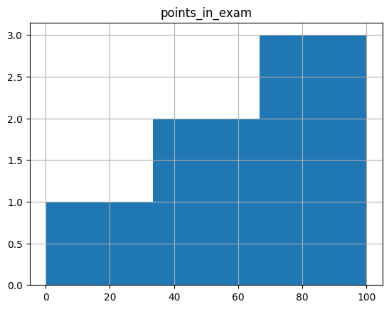


---

## Power-BI

- Datenanalyse-Tool von Microsoft
- Unterschiede zu Excel:
    - heterogene Datenquellen
    - Echtzeitfähig
    - Integration in MS Azure Cloud


###### https://zephyrnet.com/de/7-best-business-analytics-tools-you-must-learn/

---


---

### Datenquellen einbinden

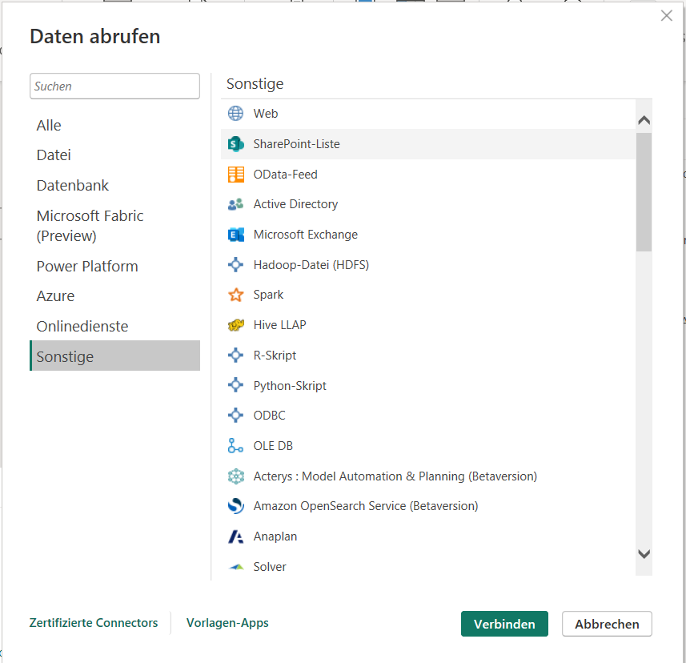

- Es lassen sich verschiedene Datenquellen einbinden
- SQLite Datenbanken erfordern zusätzlich einen Open Database Connectivity (ODBC) driver
- [Anleitung](https://youtu.be/v9OG5Ry5zDU?t=68)

###### https://youtu.be/v9OG5Ry5zDU?t=68


---

### Datenlogik Verknüpfen

- liegen verschiedene Tabellen oder Datenquellen vor
- Verknüpfung mittels drag-and-drop anhand der (Fremd-)Schlüssel
- z.B. `fuellstand.behaelter_id` mit `vibrationdata.behaelter_id`
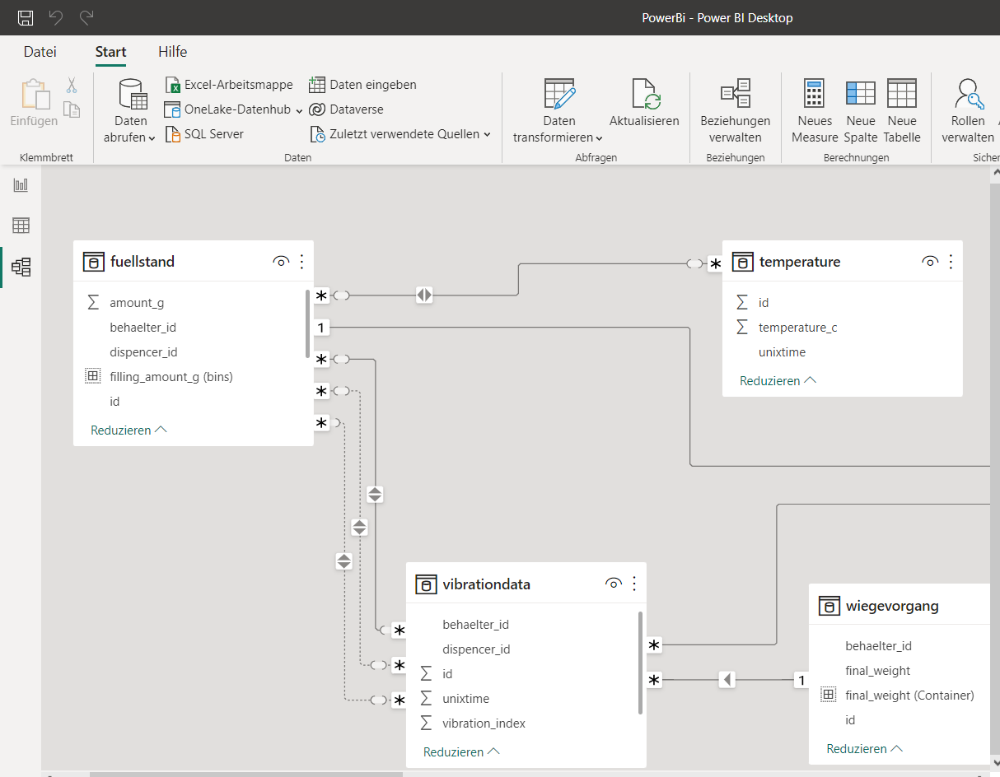

---

### Datenansicht

- entspricht Datenbank-Tabelle oder Excel
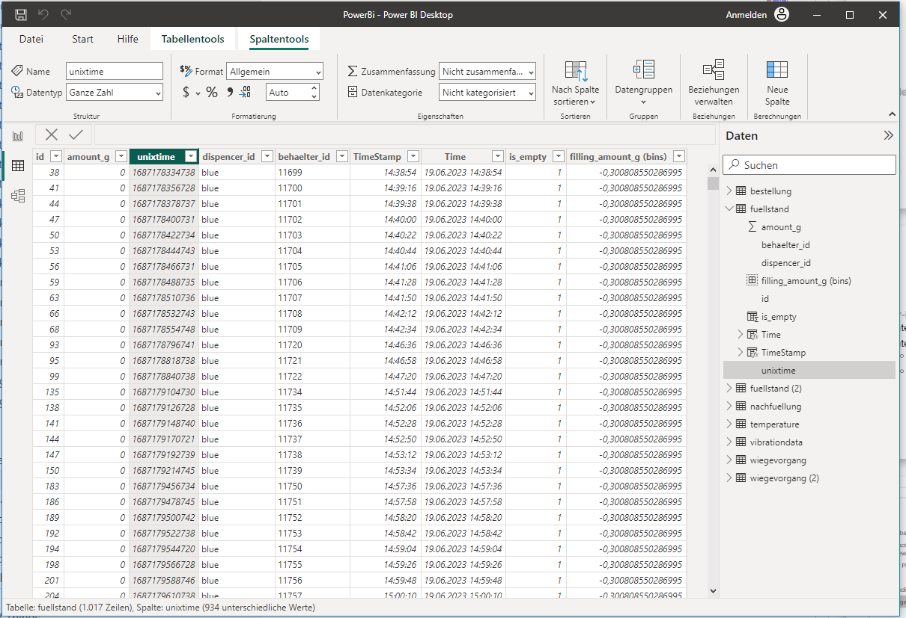

---

#### Einfügen neue Spalten

- Formel gilt automatisch für alle Beobachtungen
- Ergebnis wird als zusätzliche Spalte eingefügt
- Syntax ähnlich Excel, spaltennamen als `[<spaltennamen>]`
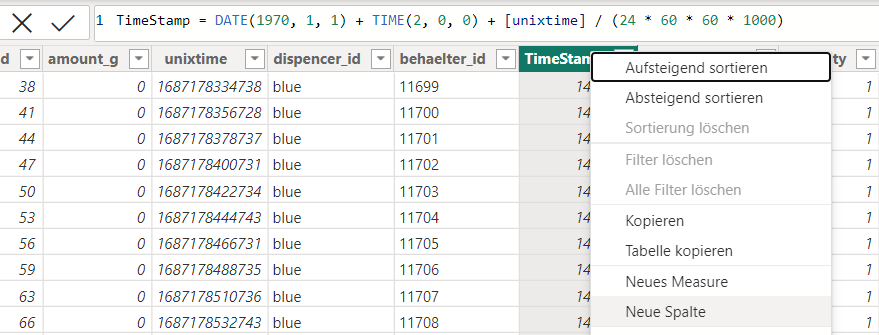

---

#### Einfügen Measures

- Fassen Informationen über mehrere Beobachtungen in der Tabelle zusammen
- z.B. Mittelwert oder Minimum
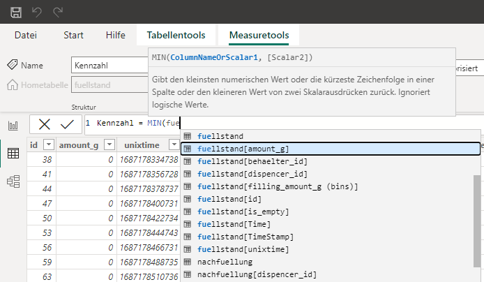

---

#### Einfügen Visualisierungen

- Es können verschiedene Tabs angelegt werden
- Visualisierungen werden in die Tabs positioniert
- Variablen werden zugeordnet
- Filtern oder Group-By möglich

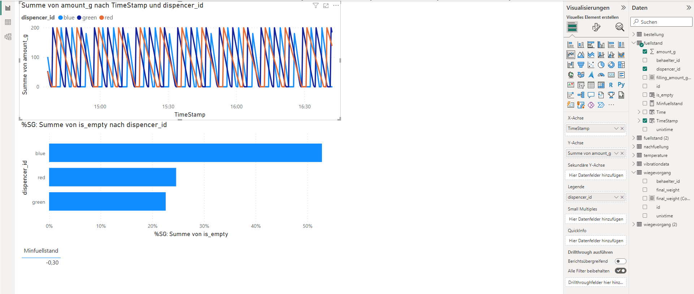

---


## 🏆 P1.1: Erstellen eines Dashboards

- Erstellen Sie anhand der von Ihnen gesammelten Daten (bzw. bereitgestellten Datenbank) ein Dashboard mit drei Tabs zu Beantwortung der folgenden Fragestellungen
- Beantworten Sie die Fragen explizit mit Textfeldern auf dem Dashboard und erklären Sie auch, wie Sie zu den antworten kommen.


---

### Vorbereitung
- Nutzen Sie die letztes Semester erstellte SQLite Datenbank (Sakai)
- [Binden Sie Ihre Datenbank mit dem ODBC Treiber ein](https://youtu.be/v9OG5Ry5zDU?t=68)
- Legen Sie in den relevanten Tabellen zwei neue Spalten an und legen Sie einmal ein Format mit Datum und einmal nur mit Uhrzeit Fest:
 `Time = DATE(1970, 1, 1) + TIME(2, 0, 0) + [unixtime] / (24 * 60 * 60 * 1000)`
 `TimeWithDate = DATE(1970, 1, 1) + TIME(2, 0, 0) + [unixtime] / (24 * 60 * 60 * 1000)`
- Verknüpfen Sie die Daten sinnvoll

---

### Tab 1: Abfüllprozess

- Wie groß sind die Dispenser? Sind alle Dispenser gleich groß? (Automatische Berechnung und z.B. Anzeige in Tabelle auf Dashboard, damit diese Auswertung auch bei anderen Datensätzen funktionieren würde. Erklärung: Wie ermitteln Sie die Größen aus den Daten)
- Anzeige des Verlauf der Dispenser-Füllstände und der Temperatur über die Zeit (schön formatiert!)
- Gegeben alle vorhandenen Messzeitpunkte. Wie häufig ist jeder der Dispenser leer, wenn er eigentlich gerade abfüllen sollte? (Zeigen Sie den Anteil für jeden der Dispenser grafisch an)
    - *Hinweis: Hierzu können Sie eine neue Spalte anlegen, die immer 1 ergibt, wenn der Dispenser noch gefüllt ist und sonst 0.*
- Wie ist der Füllstand der drei Dispenser verteilt (Abbildung: [Histogram](https://www.youtube.com/watch?v=9kp2Nu_LuXg), Erklärung: Wie kommt das zu Stande?)


---

### Tab 2: Qualitätskontrolle

- Wie verteilen sich die Endgewichte der Flaschen? (Abbildung: Histogramm mit 100 Gruppen, Erklärung: Wie kommt diese Verteilung zu Stande?)
- Geben Sie den Mean und Median und Standardabweichung des Endgewichts im Dashboard aus. Erklärung: Was vermuten Sie ist das Zielgewicht der Produktion?
- Zeigen Sie eine Tabelle für die Endkontrolle an
    - Definieren sie sinnvolle Spalten, welche angeben, ob Flaschen zu leicht oder zu schwer sind
    - z.B. $\text{zu schwer}: w > \mu + x \cdot \sigma$ oder mit manuell bestimmten Werten
- Text mit Überlegungen
    - Bestimmen Sie für jede zu leichte Flasche auf welche Farbe hier wahrscheinlich fehlt. Und stellen Sie dies ansprechend dar.
    - Können Sie auf bestimmen, wie viel welcher Farbe jeweils in welcher Menge fehlt (schwierig)?

---

### Tab 3: Fehleranalyse

- Zeigen Sie die Spannweite, Min, Max und Mean für die folgenden Variablen an (Vibration, Füllmenge, Temperatur, Endgewicht)
- Bonus:
    - Untersuchen Sie die Korrelation des Endgewichts mit anderen folgenden Faktoren und zeigen Sie die Scatter-Plots an und kommentieren Sie daneben, ob Sie eine Korrelation erkennen was Sie sehen
    - Endgewicht über Temperatur
    - Endgewicht über Vibration nach nach Dispenser ID
    - Endgewicht über Minimum der Vibration
    - Bonus: [Korrelations-Koeffizient ausrechnen](https://www.c-sharpcorner.com/article/how-to-get-correlation-coefficient-in-power-bi/)

----

### Bonus: Klassifikationsmodell

- Sie werden beauftragt ein Modell zu entwickeln mittels deren Hilfe man den Wiegeprozess am Ende der Abfüllanlage einsparen und dennoch die Qualität sicherstellen kann.
- Nutzen Sie Ihre bisherigen Analysen, um eine Logik zu erstellen, die es zulässt zu leichte Flaschen mit hoher Wahrscheinlichkeit auszusortieren
- Legen die eine neue Spalte `Wahrscheinlich_zu_leicht` in einer geeigneten Tabelle an und implementieren Sie dort Ihre Logik. 


---

### Abgabe

- erstellen Sie vier Screenshots, (eines zu jedem zu jedem Dashboard) und einem der die Tabelle mit Ihrer Klassifikations-Logik darstellt
    - `Abfüllprozess.jpg`
    - `Qualitätskontrolle.jpg`
    - `Fehleranalyse.jpg`
    - `Klassifikationsmodell.jpg` (rein optional)

---

### Bewertung

- max. 4pkt pro Aufgabe
- 3pkt davon insgesamt für Design

