<!-- paginate: true -->

# Internet of Things


Dr. Julian Huber


---

## 2 unix


---

## 2.1 Unix-Systeme

### 🎯 Lernziele

Nach dieser Einheit sind Sie in de Lage dazu

* Anwendungsgebiete von unixoiden Systemen zu nennen
* die Kernelemente eines unixoiden Systems zu beschreiben
* [Empfehlenswerter Online Linux Kurs](https://www.youtube.com/watch?v=Y17KTiJLcyQ&list=PLIhvC56v63IJIujb5cyE13oLuyORZpdkL&index=3)

---

### Anwendungsfelder


---

#### Real Time Operating Systems auf Mikrocontrollern

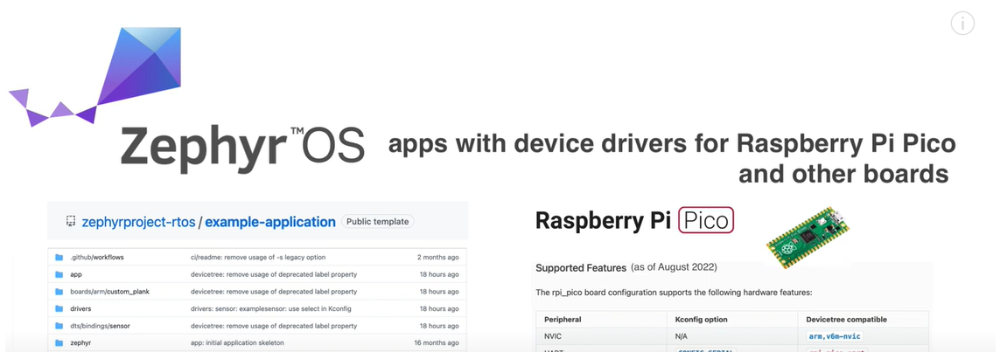

###### https://www.cnx-software.com/2021/02/23/fuzix-unix-like-operating-system-ported-to-raspberry-pi-pico-and-esp8266/

---

#### Supercomputer

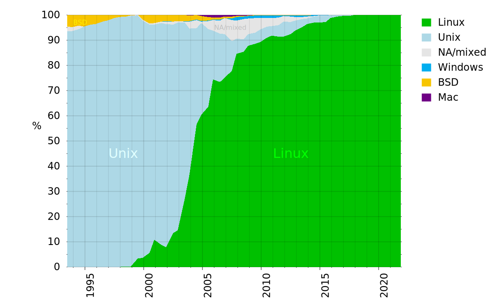

###### https://upload.wikimedia.org/wikipedia/commons/0/0d/Operating_systems_used_on_top_500_supercomputers.svg

---

#### Webserver

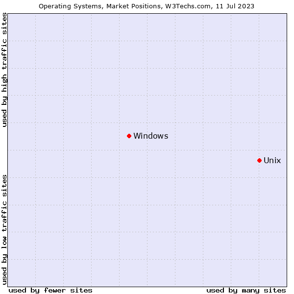

###### https://w3techs.com/technologies/details/os-linux

---

#### Smartphones


###### https://en.wikipedia.org/wiki/Usage_share_of_operating_systems#/media/File:World_Wide_Smartphone_Sales.png

---

### Kernelemente eines unixoiden Systems


**Kernel** - interagiert mit der Hardware und erledigt die meisten Aufgaben wie Speicherverwaltung, Aufgabenplanung und Dateiverwaltung.

**Shell** - Nuzterinterface. Wenn Sie an Ihrem Terminal einen Befehl eingeben, interpretiert die Shell den Befehl und ruft das gewünschte Programm auf. Die Shell verwendet für alle Befehle eine Standardsyntax.


---


**Befehle und Hilfsprogramme** - Es gibt verschiedene Befehle und Hilfsprogramme, die Sie bei Ihren täglichen Aktivitäten verwenden können. `cp`, `mv`, `cat` und `grep` usw. sind einige Beispiele für Befehle und Hilfsprogramme. Es gibt über 250 Standardbefehle und zahlreiche weitere, die durch Software von Drittanbietern bereitgestellt werden. Alle Befehle sind mit verschiedenen Optionen ausgestattet.

**Dateien und Verzeichnisse** - Alle Daten von Unix sind in Dateien organisiert. Alle Dateien sind dann in Verzeichnissen organisiert. Diese Verzeichnisse sind wiederum in einer baumartigen Struktur organisiert, die als Dateisystem bezeichnet wird.

---


### Benutzerverwaltung 

* Die Anmeldung erfolgt mit einem bestimmten Nutzer
    * Multiuser-Betrieb
        * mehrere Nutzer:innen nutzen einen PC parallel
        * Prozesse beeinflussen sich nicht
    * Sicherheit
* **Read:** Sichtbarkeiten (z.B. Konfigurations-Dateien)
* **Write:** Änderungen an Dateien (z.B. Passwort ändern)
* **Execute:** Bestimmte Programme darf nicht jede Nutzer:in ausführen (z.B. neue Software installieren)


###### [Linux-Praxisbuch](https://de.wikibooks.org/wiki/Linux-Praxisbuch/_Benutzerverwaltung)

---

#### Superuser / root / Administrator

- Nutzer mit Admin-Rechten auf alle Dateien
- Standardmäßig werden Befehle nicht als solcher ausgeführt
- mittels `sudo <befehl>` können befehle als super user aus


---

#### Gruppen

Jeder Benutzer ist einer Hauptgruppe zugeordnet, kann daneben aber auch Mitglied weiterer Gruppen sein. Der Zugriff auf gewisse Hardware oder Dienste ist auf die Mitglieder einer bestimmten Gruppe beschränkt. So dürfen z.B. nur Benutzer, die zur Gruppe "audio" gehören, Klänge über die Soundkarte ausgeben. Möchte man nun einem Benutzer die Berechtigung für die Soundkarte geben, so erreicht man dies, indem man ihn in die Gruppe "audio" aufnimmt.


###### https://wiki.ubuntuusers.de/Benutzer_und_Gruppen/

---


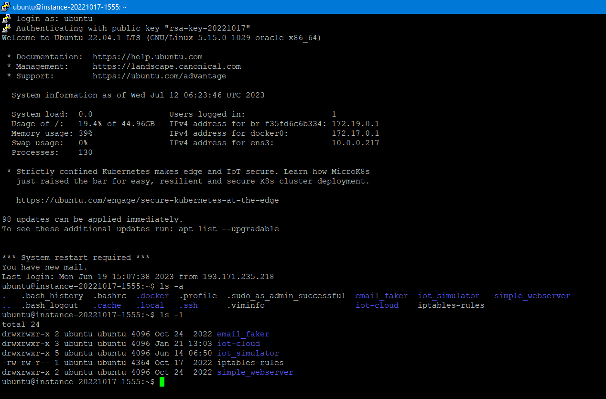


---

### Wichtige Aufgaben von Betriebssystemen

* Dateiverwaltung (Kapitel 1.2)
* Verzeichnisse  (Kapitel 1.3)
* Nutzerverwaltung (Kapitel 1.4)
* Abstraktion von Hardware durch Treiber (Kapitel 4)


---

## 2.2 Dateiverwaltung 


### 🎯 Lernziele

Nach dieser Einheit sind Sie in der Lage dazu

* Pfade in Windows und Unix-Systemen zu nutzen
* Absolute und relative Pfade zu unterscheiden

---

**Physikalisch liegen die Daten nicht zwangsweise nebeneinander**

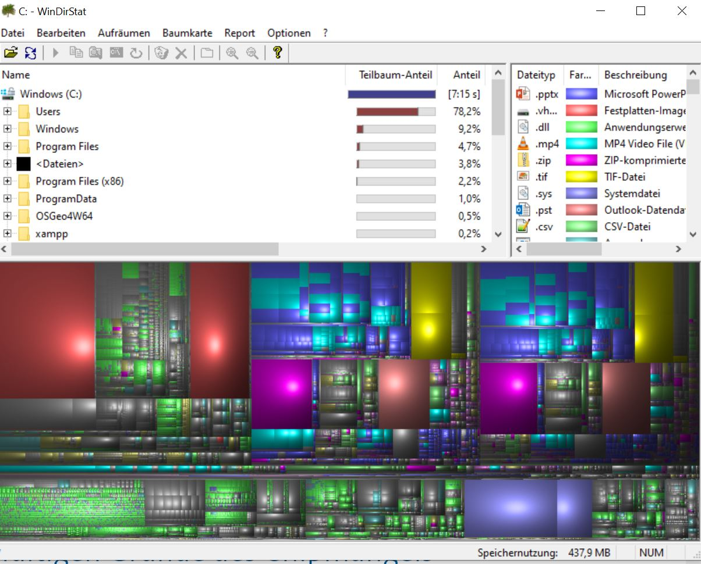


---

### Dateisysteme

* dienen zur Organisation der Daten auf Speichermedien
* führen ein Belegungsverzeichnis zur Verwaltung der belegten und der unbenutzten und defekter Datenblöcke (vergleichbar mit einer **Inventarliste**).

* Jedes Verzeichnis beschreibt die darin enthaltenen Dateien mit Speicherort
* Für jede Datei werden als **Metadaten**
    * Namen
    * Größe
    * Modifikationsdatum
    * Berechtigungsinformation
    * etc.

---

#### Beispiele

<!-- _backgroundColor: white -->
<!-- _color: black -->

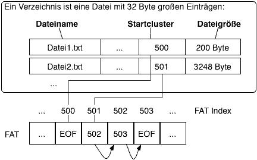

###### https://mezdata.de/betriebssystem/020_dateisysteme/


- FAT,ext3/ext4: Linux
- XFS: Linux und IRIX
- NTFS/ReFS: Microsoft Windows
- HFS+: Mac OS ab 8.1 und Mac OS X/​OS X/​macOS

---

#### Formatierung von Datenträgern

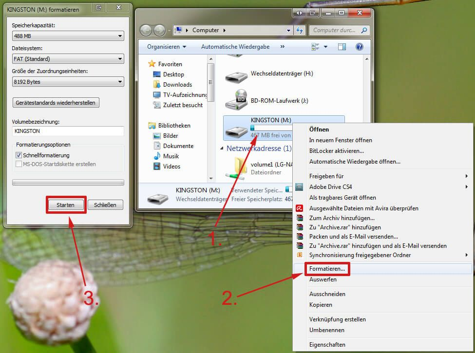


---

### Verzeichnisse & Pfade


* Die Dateien werden meist mithilfe von Verzeichnissen (engl.: directory, folder) organisiert, welche die Funktion eines Inhaltsverzeichnisses übernehmen


###### https://techmixx.de/windows-10-ganzer-pfad-im-datei-explorer/

---

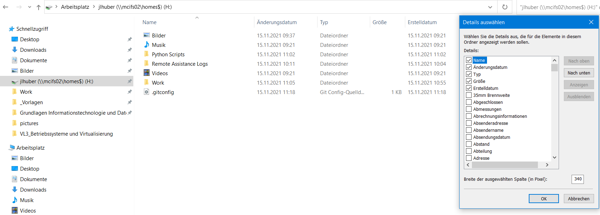


---

#### Der UNIX-Verzeichnisbaum

- Verzeichnisbaum erstreckt sich oft über mehrere physikalisch unterschiedliche Laufwerke. Es gibt also keine Laufwerksbuchstaben oder benannte Laufwerke.
- [was liegt wo?](https://openbook.rheinwerk-verlag.de/unix_guru/node21.html)
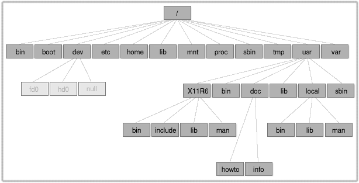

---

#### Everything is a file

- z.B. beschreibt `/dev/hd0` eine Festplatte als Bitfolge
- Um diese zu nutzen, muss sie zuerst in Dateisystem eingebunden (gemounted) werden
- `mount /dev/sdb1 /mnt/harddrive`


---

#### 🧠 Pfadnamen

* Wurzelverzeichnis ```/```: Wurzel aller anderen Verzeichnisse
* Benutzerverzeichnis `~`: Abkürzung zum Verzeichnis in dem die Daten des aktuellen Nutzers liegen z.B. `home/user1`
* Aktuelles Arbeitsverzeichnis `pwd`: Verzeichnis in dem wir uns gerade befinden
* Hierarchischer Aufbau

```
/home/user1/
|-- projekt_1
|   -- daten
|-- projekt_2 
|   -- daten
```

---

#### Unix-Namens-Konventionen

* Meistens enthalten Verzeichnisse keine `.`
* Dateien haben meist Endungen, die auf die Verwendung rückschließen lassen: `filename.txt`, `script.py`, `bild.jpg`
* Namen sind case-sensitive: `filename.txt` `!=` `FileName.txt`
* Dateien mit führendem Punkt sind versteckt `.hiddenfile.txt`
* Verwenden Sie `_` und `-` anstelle von Leerzeichen ` ` 
* keine Sonderzeichen (`$%&<>:"/\|?*`)

---

#### Absolute und relative Pfade

```
/home/user1/
|-- projekt_1
|   -- daten
|-- projekt_2  <-- Aktuelles Arbeitsverzeichnis
|   -- daten
```

* Absoluter Pfad is vollständig und gilt von überall im Computer: 
```/home/user1/projekt_2/daten```
* Relativer Pfad geht vom aktuellen Arbeitsverzeichnis aus z.B.
    * Arbeitsverzeichnis `pwd`: ```/home/user1/projekt_2/```
    * Relativer Pfad zum Unterverzeichnis ```/daten```
    * Relativer Pfad zum parallelen Verzeichnis ```..\projekt_1\```   

---

### Interaktion über Unix Shell

```
ubuntu@instance-20221017-1555:~/iot-cloud$
<current_user>@<current_host>:<current_working_dir>$ <befehl>
```

* Befehle zur Navigation
    * `ls`: Alle Dateien und Ordner im Verzeichnis anzeigen
    * `cd <pfad>`: in Verzeichnis <pfad> wechseln
    * `cd ..`: ein Verzeichnis nach oben wechseln
    * `ls -l`: Alles wird ausführlich angezeigt
    * `ps`Laufende Prozesse
    * `nano` einfacher Texteditor

---


#### Navigation in der Shell


```shell 
ubuntu@instance-20221017-1555:~$ ls
email_faker  iot-cloud  iot_simulator  iptables-rules  simple_webserver
ubuntu@instance-20221017-1555:~$ cd email_faker/
ubuntu@instance-20221017-1555:~/email_faker$ cd /home/ubuntu/iot-cloud/
ubuntu@instance-20221017-1555:~/iot-cloud$ cd ~/iot-cloud/
ubuntu@instance-20221017-1555:~/iot-cloud$
ubuntu@instance-20221017-1555:~/iot-cloud$ pwd
/home/ubuntu/iot-cloud
```

---

## 2.3 Rechtemanagement


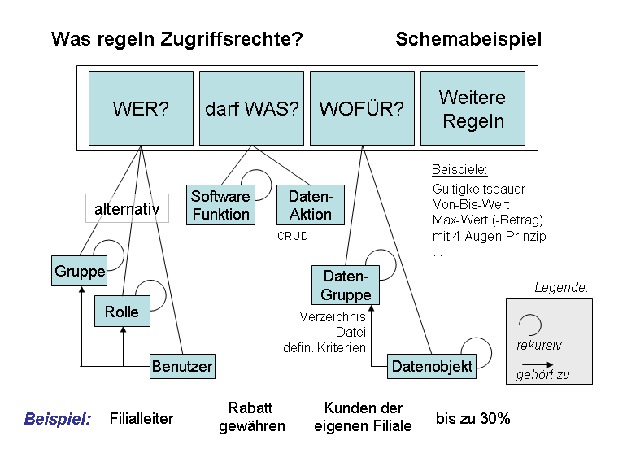

###### https://upload.wikimedia.org/wikipedia/de/1/19/Zugriffsrecht.png

---

### 🎯 Lernziele

Nach dieser Einheit sind Sie in der Lage dazu

* Berechtigungen von Dateien zu interpretieren
* Berechtigungen von Dateien zu verändern

---

### Anzeigen von Berechtigungen

```
ubuntu@instance-20221017-1555:~/iot_simulator$ ls -l
total 48224
drwxrwxr-x 2 ubuntu ubuntu     4096 Jun 19 15:08 __pycache__
-rw-rw-r-- 1 ubuntu ubuntu      529 Jun 19 15:00 config.py
-rw-rw-r-- 1 ubuntu ubuntu     1478 Jan 23 13:44 control_mechanims.py
-rw-rw-r-- 1 ubuntu ubuntu 49331840 Jul 12 07:11 example.log
drwxrwxr-x 2 ubuntu ubuntu     4096 Jun 14 06:50 experimental
-rw-rw-r-- 1 ubuntu ubuntu     4863 Jun 19 13:59 facory_parts.py
-rw-rw-r-- 1 ubuntu ubuntu     2361 Jun 14 06:42 main.py
```

* die 2-10 Buchstaben zeigen die Berechtigungen für `den angemeldeten user` / `dessen Gruppe` / `jeden`
    * `r` read: Lesen der Datei
    * `w` write: Ändern der Datei
    * `x` execute: Datei als Prozess ausführen

###### user darf alles, jeder lesen

---

#### Anlegen eines neues Verzeichnis und Datei

- Neue Verzeichnis: `mkdir <verzeichnis_name>`
- Neue Datei mit Text-Inhalt: `echo <text> > <file_name>`

```
ubuntu@instance-20221017-1555:~$ mkdir test_for_unix
ubuntu@instance-20221017-1555:~$ cd test_for_unix/
ubuntu@instance-20221017-1555:~/test_for_unix$ echo foobaa > mynewfile.txt
ubuntu@instance-20221017-1555:~/test_for_unix$ ls -l
total 4
-rw-rw-r-- 1 ubuntu ubuntu 7 Jul 12 07:24 mynewfile.txt
```

* Nutzer und Gruppe dürfen lesen `r` und schreiben `w` alle anderen nur lesen `r` 

---

#### Ändern von Rechten

- Rechte anpassen: `chmod <who><what> <file_name>`
- Print eines Dateiinhalts (lesen): `cat <file_name>`

```
ubuntu@instance-20221017-1555:~/test_for_unix$ chmod a+w mynewfile.txt
-rw-rw-rw- 1 ubuntu ubuntu 7 Jul 12 07:24 mynewfile.txt

ubuntu@instance-20221017-1555:~/test_for_unix$ cat mynewfile.txt
foobaa

ubuntu@instance-20221017-1555:~/test_for_unix$ chmod a-r mynewfile.txt
--w--w--w- 1 ubuntu ubuntu 7 Jul 12 07:24 mynewfile.txt

ubuntu@instance-20221017-1555:~/test_for_unix$ cat mynewfile.txt
cat: mynewfile.txt: Permission denied
```


###### [Andere Notationen für chmod](https://wiki.ubuntuusers.de/chmod/)

---

#### Superuser / root

- Nutzer mit Admin-Rechten (`+wrx`) auf alle Dateien
- Standardmäßig werden Befehle nicht als solcher ausgeführt
- mittels `sudo` können befehle als super user aus

```
ubuntu@instance-20221017-1555:~/test_for_unix$ sudo cat mynewfile.txt
foobaa
```

---

## 2.4 Shell Basics


### 🎯 Lernziele

Nach dieser Einheit sind Sie in der Lage dazu

* Projekte von github mittels Shell klonen
* Dateien mittels Shell zu manipulieren
* Python Skripte mittels Shell auszuführen

---

### Shell-Skripte

- Shell-Befehle können in Skripten (`*.sh`) gespeichert und ausgeführt werden
- Jedes Shell-Skript startet mit `#!/bin/sh`

```
$ echo '#!/bin/sh' > my-script.sh
$ echo 'echo Hello World' >> my-script.sh
$ chmod 755 my-script.sh
$ ./my-script.sh
Hello World
$
```


---

### Umgebungsvariablen

- konfigurierbare Variablen in Betriebssystemen, die oft Pfade zu bestimmten Programmen oder Daten enthalten, sowie bestimmte Daten und Einstellungen, die von mehreren Programmen verwendet werden können. 
- Alle Variablen anzeigen: `env`
- Wert einer Variablen ausgeben: `echo $<variable_name>`


```
ubuntu@instance-20221017-1555:~/test_for_unix$ env
SHELL=/bin/bash
PWD=/home/ubuntu/test_for_unix
LOGNAME=ubuntu
...
ubuntu@instance-20221017-1555:~/test_for_unix$ echo $HOME
/home/ubuntu
```

---

#### PATH-Variable

Nach der Installation eines Befehlszeilenprogramms können Sie es möglicherweise nur in demselben Verzeichnis wie das Programm ausführen. Mit Hilfe einer Umgebungsvariablen namens `PATH` können Sie ein Befehlszeilenprogramm von jedem beliebigen Verzeichnis aus ausführen.

Die PATH-Variable enthält eine Liste von Verzeichnissen, die das System vor der Ausführung eines Befehls überprüft.

```
echo $PATH
/usr/local/sbin:/usr/local/bin:/usr/sbin:/usr/bin:/sbin:/bin:/usr/local/games:/usr/games
```

---

#### Prozesse

- Ausführung eines Programms erzeugt einen Prozess
- Script anlegen: `nano  background_process.sh`
```bash
#!/bin/bash
# This script will run in the background and simulate some work

echo "Script started with PID $$"
for i in {1..10}; do
    echo "Iteration $i - PID: $$"
    sleep 2
done
echo "Script finished"
```

- Ausführbar machen `chmod +x background_process.sh`
- Starten `./background_process.sh &`, `&` für im Hintergrund
- Auflisten des Prozesse `ps aux | grep background_process.sh` und filtern nach `background_process.sh`

---

#### Weitere wichtige Funktionen

- [Auflisten und Unterbrechen von Prozessen](https://wiki.ubuntuusers.de/Shell/Prozesssteuerung/)
- [Anlegen von Diensten](https://wiki.ubuntuusers.de/Howto/systemd_Service_Unit_Beispiel/)

---

### Secure Shell (SSH)

- kryptografisches Netzwerkprotokoll für den sicheren Betrieb von Netzwerkdiensten über ein ungesichertes Netzwerk. Seine wichtigsten Anwendungen sind Fernanmeldung und Befehlszeilenausführung. [Wiki](https://en.wikipedia.org/wiki/Secure_Shell)
- [PuTTY](https://www.putty.org/) - a free SSH and telnet client for Windows
- Verbindung über IP und Port (Standardport für SSH ist 22)

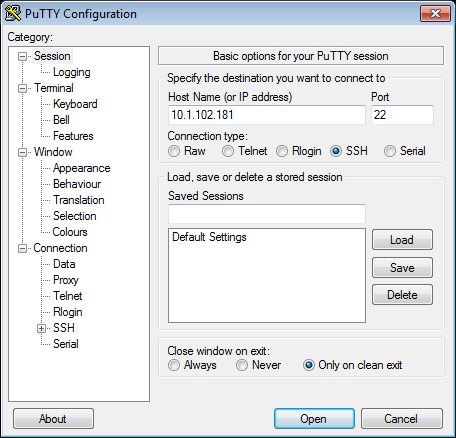

###### https://www.thomas-krenn.com/de/wiki/PuTTY


---


## 🏆 P2.1: Bereiten Sie einen Raspberry Pi vor


- in den Folgenden Aufgaben möchten wir ein System schaffen, welches die Teaching Factory mittels IoT-Lösungen um weitere Sensoren ergänzt
- Hierzu setzen wir ein zweites System, neben der SPS-Steuerung auf

---


- Ihre Aufgabe ist es Raspberry PI OS 32 auf einem der Raspberries 3B zu installieren
- Stellen Sie sicher, dass Sie das OS in der Version **32-Bit Raspbian GNU/Linux 11 (bullseye)** installieren -
- Sie werden diese Installation *headless* vornehmen. Das bedeutet, dass nur über SSH auf den Raspberry zugegriffen wird und dieser über kein eigenes Display verfügt. Dies ist bei vielen IoT-Edge-Devices der Fall
    - [Installationsanleitung mit RaspberryPi Imager](https://www.raspberrypi.com/documentation/computers/getting-started.html#using-raspberry-pi-imager)
        - Geben Sie ein Hostname, Username und Passwort an, und notieren Sie sich alles
    - Weitere Einstellungen mittels SSH [Headless](https://www.raspberrypi.com/documentation/computers/configuration.html#setting-up-a-headless-raspberry-pi) vornehmen


---

### Verbindung mittels SSH putty

- Verbinden Sie den RasPi und Ihren PC via Ethernet-Kabel
- Installieren [PuTTY](https://www.putty.org/
) oder nutzen Sie die SSH-Verbindung über die die [Power-Shell](https://www.heise.de/tipps-tricks/SSH-unter-Windows-10-nutzen-4224757.html)
    - Alternativ können Sie auch die [SSH-Erweiterung](https://marketplace.visualstudio.com/items?itemName=ms-vscode-remote.remote-ssh) für VS-Code nutzen
- Hierzu brauchen Sie Nutzername und Passwort, dass Sie bei der Installation vergeben haben
- Sie erreichen den RasPi über seine IP oder über den Hostname `raspberrypi.local`, wenn Sie direkt per Kabel verbunden sind
- Der Standardport für SSH ist `22`
- ggf. tritt der Fehler `Host does not exist` auf
    - Lösung: In der Regel kann dieser Fehler durch Abwarten und Neustart des Raspis behoben werden
    - Sollte die Verbindung nach kurzer Zeit wieder abbrechen, liegt ein Problem mit dem (fehlenden) DHCP-Server vor
    - In diesem Fall müssen Sie entweder eine statische IP-Adresse vergeben oder die beiden Geräte über einen Router verbinden
- Optional: [Feste IP vergeben](https://www.elektronik-kompendium.de/sites/raspberry-pi/1912151.htm) und über diese ansprechen


---


### Diverse Einstellungen

können sie auch unter `sudo raspi-config` vornehmen, im Folgenden werden wir aber alles über die Kommandozeile erledigen


###### https://www.raspberrypi.com/documentation/computers/configuration.html#the-raspi-config-command-line-interface

---

### 🏆 P2.2: Verbindung mit eduroam

### Anleitung: Verbindung mit WLAN

- [eduroam-WLAN](https://www.elektronik-kompendium.de/sites/raspberry-pi/2205191.htm)
    - :warning: Hier wird das Passwort als Klartext abgelegt!
    - Andere WLans können ebenfalls in der [wpa_supplicant.conf](https://www.elektronik-kompendium.de/sites/raspberry-pi/1912221.htm) angelegt werden
    - Empfehlung `wpa_supplicant`
- Land einstellen nicht vergessen!
- mci4me-Benutzerkennung
    - Studierende: `dj1234@mci4me.at`
    - MCI-Personal: `jed@mci4me.at`

---

#### Schritt 1:  Konfigurationsdatei für Netzwerkschnittstellen

`sudo nano /etc/network/interfaces`

Hier **nur** folgendes Eintragen:

```
allow-hotplug wlan0
iface wlan0 inet manual
wpa-conf /etc/wpa_supplicant/wpa_supplicant.conf
```

> Erlaubt dem System, das WLAN-Interface `wlan0` automatisch zu aktivieren
> `iface wlan0 inet manual` manuelle Konfiguration anstelle von `ifup` und `ifdown`
> Gibt dabei die Konfigurationsdatei für `wpa_supplicant` an

---

#### Schritt 2: Konfigurationsdatei für `wpa_supplicant`

`sudo nano /etc/wpa_supplicant/wpa_supplicant.conf`

Folgendes ergänzen und dabei `<hash>` mit dem Paswort-Hash (Schritt 4) ersetzen. Besser ist es ggf. zunächst das Passwort im Klartext einzutragen und die Verbindung zu testen.


```
ctrl_interface=DIR=/var/run/wpa_supplicant GROUP=netdev
update_config=1
country=AT

network={
   ssid="eduroam"
   proto=RSN
   key_mgmt=WPA-EAP
   eap=PEAP
   identity="jlh@mci4me.at"
   password=hash:<hash>
   phase1="peaplabel=0"
   phase2="auth=MSCHAPV2"
}
```

---

#### Schritt 3: WPA-Supplicant starten

`sudo wpa_supplicant -i wlan0 -c /etc/wpa_supplicant/wpa_supplicant.conf`

- Fehler: `rfkill: WLAN soft blocked`
    - Blocklist anzeigen: `rfkill list`
    - Um soft block zu deaktivieren: `rfkill unblock wifi`
    - Wlan aus- und einschalten `sudo ifdown wlan0` and `sudo ifup wlan0`
    - Status anzeigen: `iwconfig`
- weitere Fehler können ggf. durch Neustart der Netzwerk-Services behoben werden
    - `sudo systemctl restart NetworkManager.service`
    - `sudo systemctl restart NetworkManager`
    - `sudo systemctl restart wpa_supplicant.service`
- Verbindung testen: `ping www.google.com`

---

#### Schritt 4: Erstellen einen gehashten Passwords

- Hashen des Passworts:
   `echo -n <plaintext_password_here> | iconv -t utf16le | openssl md4`
- Anpassung `wpa_supplicant.conf`
   `sudo nano /etc/wpa_supplicant/wpa_supplicant.conf`
   
```shell
network={
      ssid="eduroam"
      scan_ssid=1
      priority=1
      key_mgmt=WPA-EAP
      eap=PEAP
      identity="<abbreviation>@mci4me.at"
      anonymous_identity="anonymous@mci4me.at"
      password=hash:<your_hash>
      phase1="peaplabel=0"
      phase2="auth=MSCHAPV2"
   }
```

---

#### Schritt 5: Einbindung in ein VPN

- Wenn Ihr RasPi im eduroam-Netzwerk ist, können Sie ihn nicht direkt über dieses erreichen, sondern müssen weiterhin eine Kabelverbindung nutzen
- Eine gute Möglichkeit dies zu vermeiden ist die Einrichtung eines VPNs, in dem sich dann sowohl der RasPi als auch Ihr PC befinden und mittels dessen Sie sich auf den RasPi verbinden können, sofern beide irgendwo im Internet sind
- Die einfachste Lösung hierzu ist die Einrichtung von [Tailscale](https://tailscale.com/)


---

### 🏆 P2.4: Installation von node-red

- Zudem werden Sie node-js und node-red installieren. Aktivieren Sie auch den Autostart damit node-red und die flows starten sobald der RasPi bootet
- [Installationsanleitung](https://nodered.org/docs/getting-started/raspberrypi), zuvor muss der raspi über eine Internetverbindung verfügen
- Achten Sie darauf auf `Autostart on boot` zu aktivieren

- tldr; 
    `bash <(curl -sL https://raw.githubusercontent.com/node-red/linux-installers/master/deb/update-nodejs-and-nodered)`
    `sudo apt install build-essential git curl`
    `sudo systemctl enable nodered.service`

---

#### Hintergrund: `systemd` und `systemctl` 

- mit dem letzten Befehl starten sie einen Service, der automatisch beim Booten gestartet wird
- `systemd` ist ein System- und Sitzungs-Manager (Init-System), der für die Verwaltung aller auf dem System laufenden Dienste über die gesamte Betriebszeit des Rechners, vom Startvorgang bis zum Herunterfahren, zuständig is
- `systemctl` ist ein Kommandozeilenwerkzeug für systemd. Mit Hilfe von systemctl können Befehle an systemd gesendet werden, z.B. zum Steuern von Units, zum Abfragen des Status, zum Herunterfahren des Systems etc.
- Beispiel für das Einrichten einen Python [Programms als Service](https://medium.com/codex/setup-a-python-script-as-a-service-through-systemctl-systemd-f0cc55a42267)


--- 

### 🏆

- Vergeben sie eine neue Umgebungsvariable `GROUPNAME` mit Ihrem Gruppennamen
- Erstellen Sie einen node-red flow mit einem Heartbeat, anhand dessen sich der Online-Status ihres RasPis überprüfen lässt. Das beutet dass alle 60 Sekunden eine `1` auf folgendem Topic veröffentlicht wird:
    - `raspis/<GROUPNAME>/heartbeat`
    - Hierbei soll [dynamisch](https://nodered.org/docs/user-guide/environment-variables) die Umgebungsvariable `GROUPNAME` im Topic berücksichtigt werden - **Vorsicht:** Schauen Sie unter der Überschrift `Running as a service`, um sicherzustellen, dass node-red als service gestartet wird
    - Damit immer der letzte Heartbeat nachvollzogen werden kann, muss die MQTT-Message auf [retain](https://cookbook.nodered.org/mqtt/publish-retained-message) gesetzt werden

---

### MQTT-Broker

- Verbinden Sie diesen mit dem folgenden MQTT-Broker 
    - URL: `158.180.44.197`
    - PORT: `1883`
    - USERNAME: `bobm`
    - PASSWORD: `letmein`
    - Vorsicht: Das Netzwerk muss mit dem Internet verbunden sein.

--- 

### Bewertung

- 6 pkt: Heartbeat Message zu Zeitpunkt während der Vorlesung
- 10 pkt: Heartbeat Message zu Zeitpunkt außerhalb der Vorlesung (anderes Netzwerk)
    - die Daten werden nicht gespeichert, stattdessen muss die Nachricht per *retain* Eigenschaft von MQTT-Broker gespeichert werden
- 2 pkt: Demonstration, dass RasPi sich beim Einschalten selbst zum MQTT-Broker verbindet und dokumentieren Sie das mittels **Video** (hierzu muss node-red als Service gestartet werden)
- 2 pkt: Last-Will Nachricht, die beim Herunterfahren des RasPis gesendet wird unter `raspis/<GROUPNAME>/lastwill` - stimmen Sie sich hierzu ab, in welchem Format die Uhrzeit gesendet wird
- 4 pkt: Dashbord, dass den Online-Status und die letzte Nachricht mit Uhrzeit anzeigt. Dies soll für alle RasPis unabhängig vom Gruppenname automatisiert funktionieren dokumentiert mittels **Screenshot**

---

## Appendix

---

### The Unix Shell

Everything following ```$``` is what the user enters
```console 
username:$ ls -l test.txt
```

* ```ls``` **command**: ls for list files
* ```-l``` **option**: for long - makes it verbose
* ```test.txt``` **argument** - to what file do we want to do the command

* ```<text>``` We use ```<>``` for placeholders

---

#### Trouble Shooting

**Important commands**

- ```$ man bash``` - user manual
- ```$ man -h``` - list of common options
- ```$ help <command>``` - help for an command

**Common causes for problems**
- pressing ```Enter``` before finishing the command
- Command runs longer than expected

**Solutions**

- Cancel command: [Ctrl] + [C]* / *[Strg] + [C]* 
- Sometimes: [Ctrl] + [D]* or *[q]* 

---

#### File Handling

- ```$ ls``` - Prints files and directories in the current directory; try -a -l -h options Preceding dots ( . ) denote „hidden“ files

- ```$ touch <filename>``` - Creates a file named „filename“ No specific file endings required (but you should use them for clartiy)

- ```$ cat <filename>``` - Print content of filename to stdout

- ``` $ rm <filename>``` - Removes file „filename“

- ```$ nano <filename>``` - Opens a file in a text editor

---

#### Working with directories

- ```$ pwd``` - Prints the working (current) directory 
    - alternatively denotes your home folder 
    - Home is the default directory after login/start of the shell
    - Example: /home/bob
    - The first „/„ specifies the root directory of all directories (for simplicity you can think of „C:„ under windows)
    - „/home“ is the default folder for user accounts (C:\Users)

- ```$ mkdir <dirname>``` - Creates directory „dirname“
- ```$ rmdir <dirname>``` - Removes directory „dirname“

---

#### Moving between directories

- ```$ cd <dirname>``` - Changes from current directory to dirname
    - Must be a relative path (to local path)
    - or absolute path (starting from root)

- ```$ cd .. ``` - Changes into the parent directory

- ```$ mv <old> <new>``` - Moves or renames files and folders
    - Renames „old“ into „new“
    - Works for folders and files
```$ cp <source> <destination>``` - Copies „source“ to destination


---


### Nachschlagewerke

- https://openbook.rheinwerk-verlag.de/unix_guru/
- https://wiki.ubuntuusers.de/Startseite/


---

# Troube-Shooting

## Probleme beim Aufrecht-Erhalten des SSH-Verbindung

- Teilweise bricht bei peer2peer Verbindung zwischen PC und RasPi die Verbindung nach einiger Zeit ab 
- [Fehlerbeschreibung](https://forums.raspberrypi.com/viewtopic.php?t=358318): Vermutlich startet Bookworm keinen eigenen [DHCP-Server](https://www2.hs-fulda.de/~klingebiel/nbs-kolloquium/dhcp/#:~:text=Der%20Dienst%20DHCP%2DServer%20wird,IP%2DAdressen%20automatisch%20zugewiesen%20werden.) mehr
Lösungen:
    - Installation von Version Bullseye
    - Einrichtung DHCP-Server auf PC, RasPi oder Nutzung eines Routers

---

### Stabil unter Raspbian GNU/Linux 11 (bullseye)

```
pi@raspberrypi:~ $ cat /etc/os-release
PRETTY_NAME="Raspbian GNU/Linux 11 (bullseye)"
NAME="Raspbian GNU/Linux"
VERSION_ID="11"
VERSION="11 (bullseye)"
VERSION_CODENAME=bullseye
ID=raspbian
ID_LIKE=debian
HOME_URL="http://www.raspbian.org/"
SUPPORT_URL="http://www.raspbian.org/RaspbianForums"
BUG_REPORT_URL="http://www.raspbian.org/RaspbianBugs"

```

---

### Eventuell hilfreich

* Hilft nicht immer, aber oft:
    `sudo ethtool --set-eee eth0 eee off`
* Feste IP vergeben und über diese Ansprechen
    * `sudo nano /etc/dhcpcd.conf`
    * `interface eth0`
    * `static ip_address=...`
* Feste IPs vergeben

---

## Weitere Nützliche Befehle

- `hostname -I`: IP anzeigen

---

### Screen

* Häufig stehen wir vor dem Problem, dass wir eine SSH-Verbindung aufrecht erhalten wollen, aber der Prozess, den wir starten, wird beendet, sobald die Verbindung unterbrochen wird
* Oder wir haben einen Prozess, der lange dauert und wir wollen nicht, dass er unterbrochen wird und gleichzeitig weiterarbeiten
* Screen ist ein Fenstermanager zur Verwendung mit textbasierten Eingabefenstern (Textkonsole). Hierbei ist es möglich, innerhalb eines einzigen Zugangs (zum Beispiel über ein Terminal oder einer Terminalemulation) mehrere virtuelle Konsolensitzungen zu erzeugen und zu verwalten.
* Installation `sudo apt-get install screen`
* Start: ```screen```

[Quelle](https://wiki.ubuntuusers.de/Screen/)

---

### Wichtige Befehle

Die drei wichtigsten Befehle bzw. Tastenkombinationen, die man kennen sollte, sind:

* `Strg + A` , gefolgt von `C` zum Erstellen eines neuen Fensters (siehe auch Unterschied zwischen Sitzung und Fenster)
* `Strg + A` , gefolgt von `        ` zum Wechseln zwischen den einzelnen Fenstern einer Sitzung
* `Strg + A` , gefolgt von `D` zum Trennen (detach) der Verbindung zur aktuellen Sitzung, die Sitzung läuft dann im Hintergrund weiter

Eine Übersicht über alle Tastenkürzel erhält man mit `Strg + A` , gefolgt von `?`.

Eine Sitzung beendet man, indem man die dort laufende Shell beendet, also entweder mit dem Befehl `exit` oder durch Drücken von `Strg + D`.

