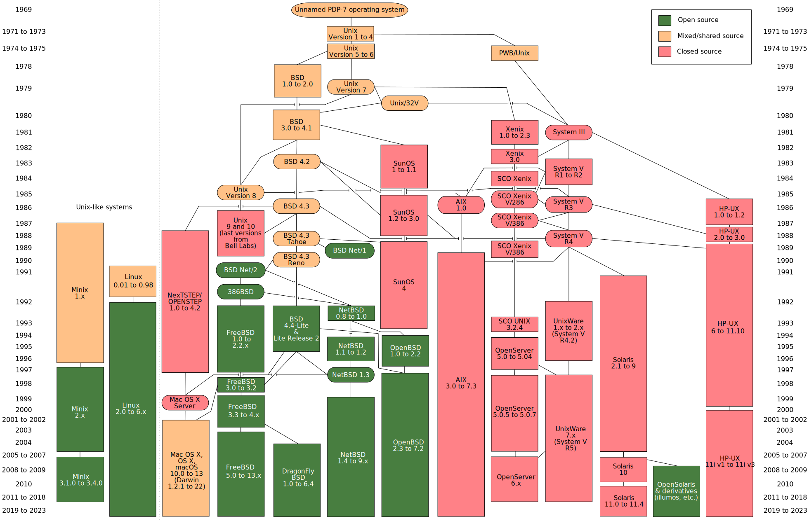
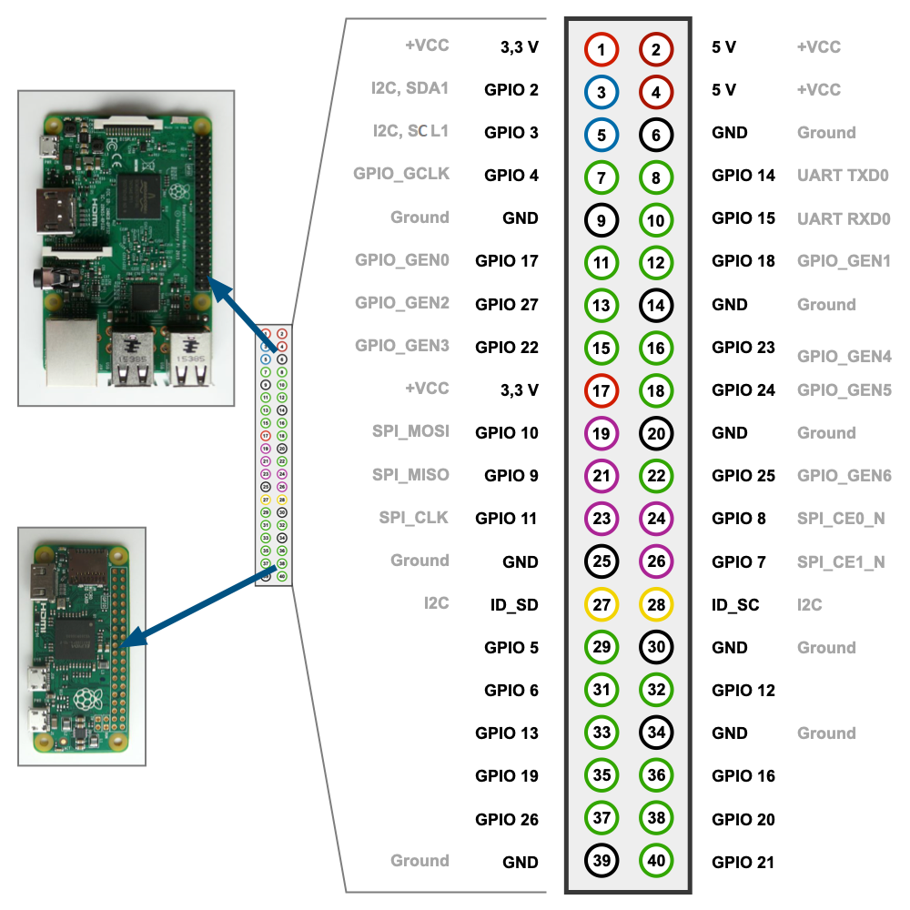
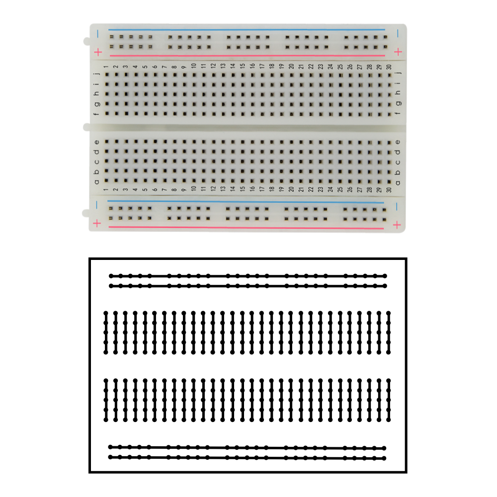
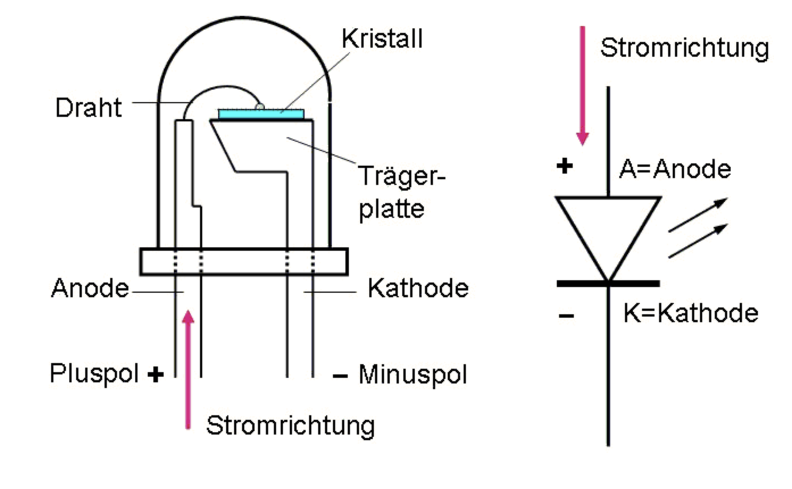
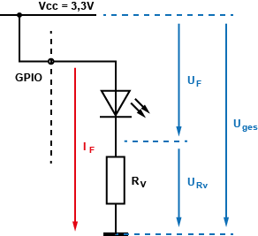
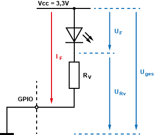
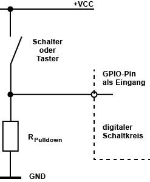
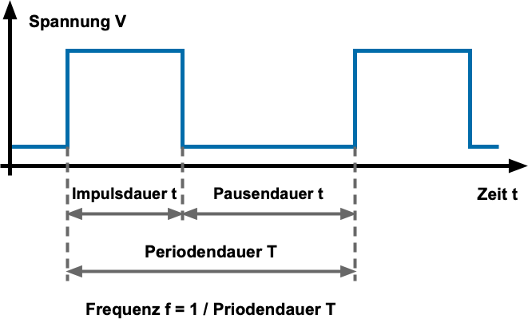
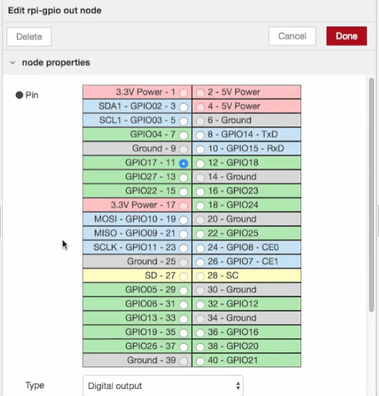

<!-- paginate: true -->

# Internet of Things

Dr. Julian Huber

---

## 3 General Purpose Input/Output GPIO-Schnittstellen

---

## Pin-Übersicht

- VCC Voltage Common Connector: Spannungs- Versorgung $5$ oder $3.3 \,\text{V}$
     - Alles unter $0,8\,\text{V}$ ist low
     - alles über $1,3\,\text{V}$ ist high
- Ground: $0 \,\text{V}$
- Einige GPIOs können als Busleitungen genutzt werden: UART, SPI, I2C

###### https://www.elektronik-kompendium.de/sites/raspberry-pi/2002191.htm

--- 

###  General Purpose Input/Output

* GPIO arbeiten von $2...16 \,\text{mA}$
* GPIOs können binär gelesen und geschaltet werden

---

#### Konfiguration unter unix

* [Everything is a file](https://www.elektronik-kompendium.de/sites/raspberry-pi/2202101.htm) - auch die Menüs / Konfigurationen
* Als Ein- oder Ausgang definieren
    * `ls /sys/class/gpio` - Directory zur Konfiguration
    * `echo 17 > /sys/class/gpio/export` - Aktiviert GPIO 17
    * `ls /sys/class/gpio` - zeigt, dass dieser nun aktiviert ist
    * `echo in > /sys/class/gpio/gpio17/direction` - Setzt diesen als Eingang
    * `echo out > /sys/class/gpio/gpio17/direction` - Setzt diesen als Ausgang
* Wert setzen bei Ausgang:
    `echo 1 > /sys/class/gpio/gpio17/value` - Setzt auf "high"
    `echo 0 > /sys/class/gpio/gpio17/value`- Setzt auf "low"
* Wert lesen:
    `cat /sys/class/gpio/gpio17/value`

---

### Breadboards

- Steckplatine für Systemtest und Prototyping
- vier Reihen für Spannungsversorgung
- weitere Raster sind längs verbunden 

###### https://www.elektronik-kompendium.de/sites/praxis/bauteil_steckbrett.htm

---

### Leuchtdioden

- Langes Bein: Anode

###### https://nawi-werft.de/bausteine/led-ansteuern/

---

### Ausgang verschalten

<!-- _backgroundColor: white -->
<!-- _color: black -->

* links: LED an Masse 
    * GPIO auf high > LED an
* rechts: LED an VCC
    * GPIO auf low > LED an

 

###### https://www.elektronik-kompendium.de/sites/raspberry-pi/2102181.htm

---

#### Vorwiderstand $R_v$ berechnen

<!-- _backgroundColor: white -->
<!-- _color: black -->

* Zielstrom für GPIOs: $2...16 \,\text{mA}$
* LED hat Vorwärtsspannung $U_F = 2.0 V$ und Vorwärtsstrom $I_F = 20 mA$
* Berechnung von $R_v$
    * Mit Ziel auf $I = 10 mA$
    * Die übrige Spannung muss an $R_V$ abfallen
    * $R_v = \frac{3.3V - 2.0V}{10mA}=130 \Omega$
    * nächst höheren Widerstand wählen

---

### Aufgabe

- Test der LED
    - LED auf Breadboard platzieren
    - LED Widerstand zwischenschalten
    - Mit (1) und (6) verbinden für konstante Spannungsversorgung
- Test der GPIO
    - (1) mit GPIO 17 (11) tauschen
    - GPIO 17, wie oben beschrieben schalten

---

### GPIO-Eingang mit Taster/Schalter und Pullup-Widerstand

<!-- _backgroundColor: white -->
<!-- _color: grey -->

- Unbeschaltet oszillieren die GPIOs zwischen den Zuständen
- Grundzustand des Eingangs bei offenem Schalter: `high`
- Durch schließen: `low`
- $4{,}7~k\Omega$ als Standardwert
- (RaspBerry Pis haben eingebaute Widerstände, die aktiviert werden können)

###### https://www.elektronik-kompendium.de/sites/raspberry-pi/2110081.htm, https://www.elektronik-kompendium.de/sites/raspberry-pi/2006051.htm

---

#### GPIO-Eingang mit Taster/Schalter und Pulldown-Widerstand

<!-- _backgroundColor: white -->
<!-- _color: grey -->

- Grundzustand des Eingangs: `low`
- Durch schließen: `high`
-  der Regel $10~k\Omega$

---

#### Zusammenfassung Schalter und Taster

- In der Praxis tendiert man dazu, GPIO-Eingänge mit einem Pullup-Widerstand mit +VCC zu verbinden und gegen Ground (GND) zu schalten
- Erfordert Negation in der Software
- Werte von $10$ bis $100~k\Omega$
- [GPIO-Eingang mit Taster/Schalter und Querwiderstand](https://www.elektronik-kompendium.de/sites/raspberry-pi/2110081.htm)
- [Mehr zu Pull-Up vs Pull-Down](https://www.elektronik-kompendium.de/sites/raspberry-pi/2006051.htm)

---

## Pulsweitenmodulation

* (große) RasPis verfügen nur über digitale und keine Analoge Ein- und Ausgänge
* Einige Verbraucher (z.B. Motoren, LEDs) kann man über PWM quasi-analog steuern
* Hierzu muss man $T$ und $t$ geeignet setzen

 

###### https://www.elektronik-kompendium.de/sites/kom/0401111.htm

---

## GPIOs mit node-red

* Erweiterung: [`node-red-node-pi-gpio`](https://flows.nodered.org/node/node-red-node-pi-gpio)
* Pin auswählen
* Typ (Input / Output / PWD)
    * Payloads: `1` / `0` 
    * bei PWD: $\frac{t}{T}\cdot 100\%=$`0` - `100`
* Widerstandstyp wählen

---

## 🏆 P3.1: Aufbau eine Schaltung für eine Heart-Beat Überwachung

- Entscheidend für viele IoT-Use Cases ist eine hohe Datenqualität. Deswegen entwickeln wir zunächst ein System, welches eine Überwachung des Betriebszustands erleichtert

---

- Die Überwachung des Heartbeats soll mit Hardware-Komponenten erweitert werden
- Neben dem Heartbeat in 60 Sekunden Abstand, soll eine Heartbeat-Meldung auch auf Knopfdruck ausgelöst und versendet werden
- Empfangene (eigene) Heartbeats (über das MQTT-Topic) lassen eine Kontroll-LED für 3 Sekunden leuchten
- Sie können des RaspPi und NodeRed über die IP oder hostname im Browser ansprechen (ggf. muss hierfür IP und Subnetzmaske der Netzwerkverbindungen angepasst werden)

---

- Abgabe:
    - 2pt: Geben Sie ein Video ab, bei dem Sie die LED einmal über die Shell schalten
    - 4pt: Geben Sie ein Video ab, das das Auslösen eines Heartbeats und die Reaktion der LED dokumentiert. Dokumentieren Sie auch die MQTT-Nachrichten z.B. über den MQTT-Explorer oder die node-red debug Konsole
    - 2pt: Skizzieren Sie die Schaltung und Ihren Rechenweg zum Festlegen der Widerstände
    - 2pt: erweitern Sie die Schaltung LED, die Leuchtet und langsam dunkler wird, nachdem wie lange der letzte Heartbeat her ist. Hierzu benötigen Sie eine [Pulsweitenmodulation](https://www.elektronik-kompendium.de/sites/raspberry-pi/2802081.htm), die sie auch über [node-red](https://flows.nodered.org/node/node-red-node-pi-gpio) einstellen können, geben Sie hierzu einen flow mit dem namen `heartbeat-pwm.json` ab
