<!-- paginate: true -->

# Internet of Things


Dr. Julian Huber


---

## 4 Bussysteme


---


## Bussysteme am Beispiel I²C


- VCC Voltage Common Connector: Spannungs- Versorgung  $5$ oder $3.3 \,\text{V}$
     - Alles unter $0.8\,\text{V}$ ist low
     - alles über $1.3\,\text{V}$ ist high
- Ground: $0 \,\text{V}$
- Busleitungen: UART, SPI, I2C


###### https://www.elektronik-kompendium.de/sites/raspberry-pi/2002191.htm

---

### Bussysteme

* Informationen werden serialisiert und als Folge von binären Zuständen übertragen
* Sensor: Aktueller Luftdruck ist $101180~Pa$
* Übertragung der Daten: Binärdarstellung des Integers `0001 10001011 00111100`
* Folge von Spannungsänderungen am GPIO

---


### I²C-Bus

* Zwei Leitungen SCL (Serial Clock) und SDA (Serial Data)
* Beim Senden einer Nachricht zieht SCL auf den 0 Pegel und beginnt dann den Takt anzugeben
*  Auslesen wenn `SCL` auf `High` ist
* `W/R`: sendet der liest der Master
* `ACK`: Antwort des Slaves
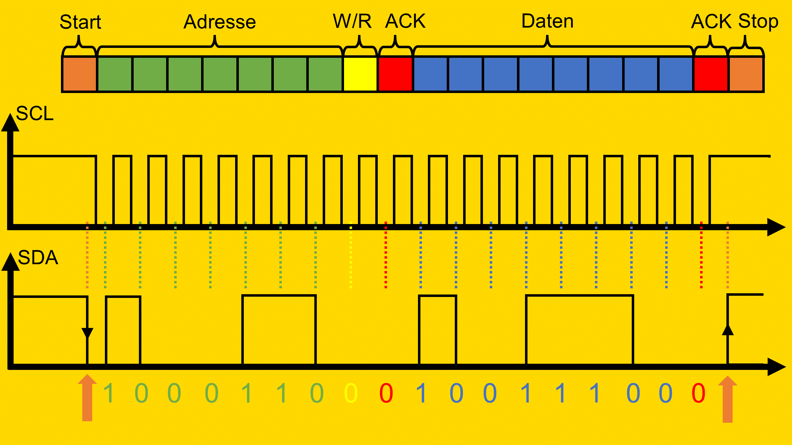

###### http://fmh-studios.de/theorie/informationstechnik/i2c-bus/#img6

---

#### Zusammenspiel von SDA und SCL

* Mit jedem Takt auf der Taktleitung wird ein Datenbit übertragen
* SDA darf nur geändert werden, wenn SCL auf `Low` liegt

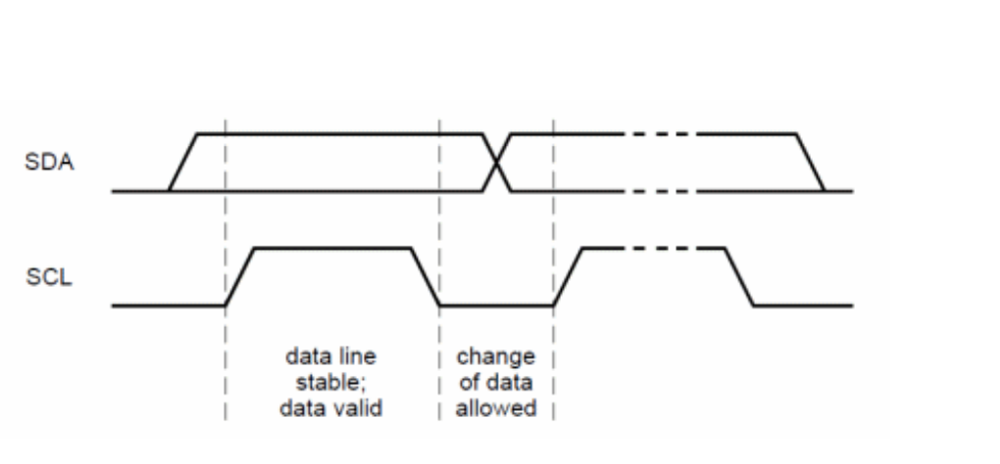


---


#### Start und Stop Bedingungen

* Jeder I2C-Befehl wird mit einer Start-Bedingung eingeleitet und mit einer Stop-Bedingung beendet
* Während dieser Bedingungen muss SCL `High` sein
    * Wechselt SDA nun von `High` > `Low` : START
    * Wechselt SDA nun von `Low` > `High` : STOP

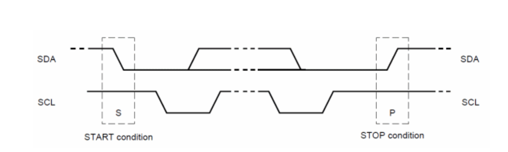

---

#### Acknowledge

* Daten werden in 8-bit Paketen übertragen (byte-weise)
* Jedes Byte wird mit einem Acknowledge-Bit (ACK) vom Empfänger bestätigt 
* ACK signalisiert, dass der Slave das nächste Byte verarbeiten kann

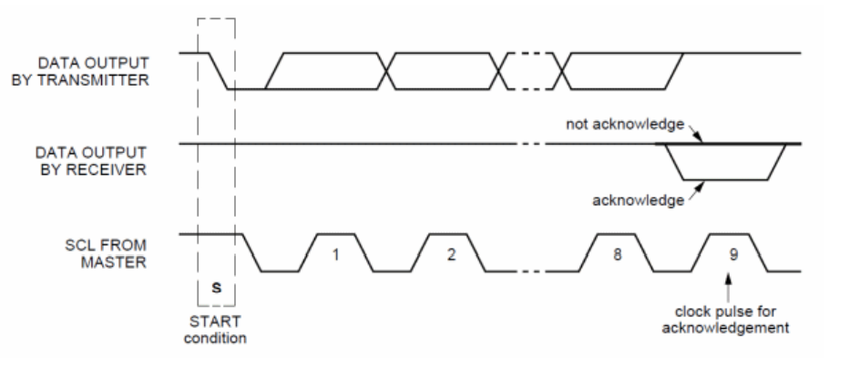

---

#### Datenübertragung

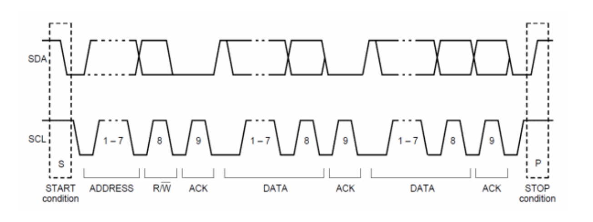

---


#### Details

* Single-Master-Slave-Architektur: Ein Master (RasPi) steuert den Buszugriff
* Half-Duplex: Kommunikation in beide Richtungen möglich, doch nicht gleichzeitig
* Daten: Informationsgehalt der Daten auf Anwendungsschicht (z.B. binär-condierter Druck in Pa) kann variieren.

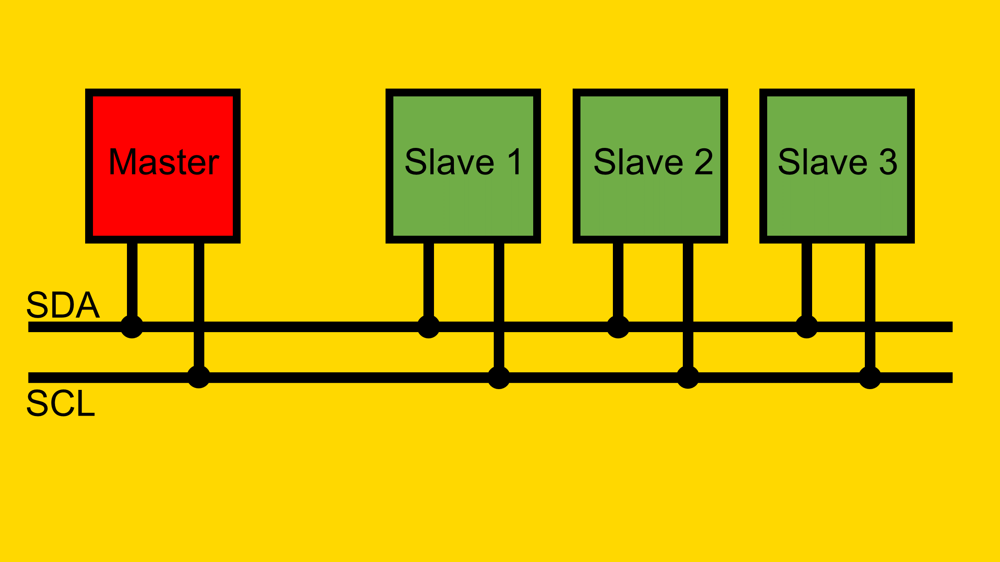

---

#### Verschaltung

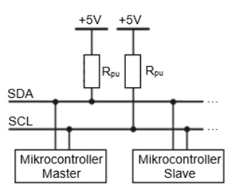

- Bei mehreren Slaves und/oder hohen Übertragungsgeschwindigkeiten wird ein Pullup-Widerstand notwendig
- $R_{pu}=4.3 ... 10\, \text{k}\Omega$

---

### Weitere Bussysteme

**Serial Peripheral Interface (SPI)**


* Single-Master-Slave-Architektur
* Zwei Datenleitungen erlauben Full-Duplex

**Universal Asynchronous Receiver Transmitter (UART)**


* Asynchroner Transfer ohne gemeinsame Clock
* z. B. RS-232 oder EIA-485

---


## Interaktion mit Transmittern

- Enthalten Sensor, Verstärker und ggf. A/D-Wandler, Steuerungslogiken

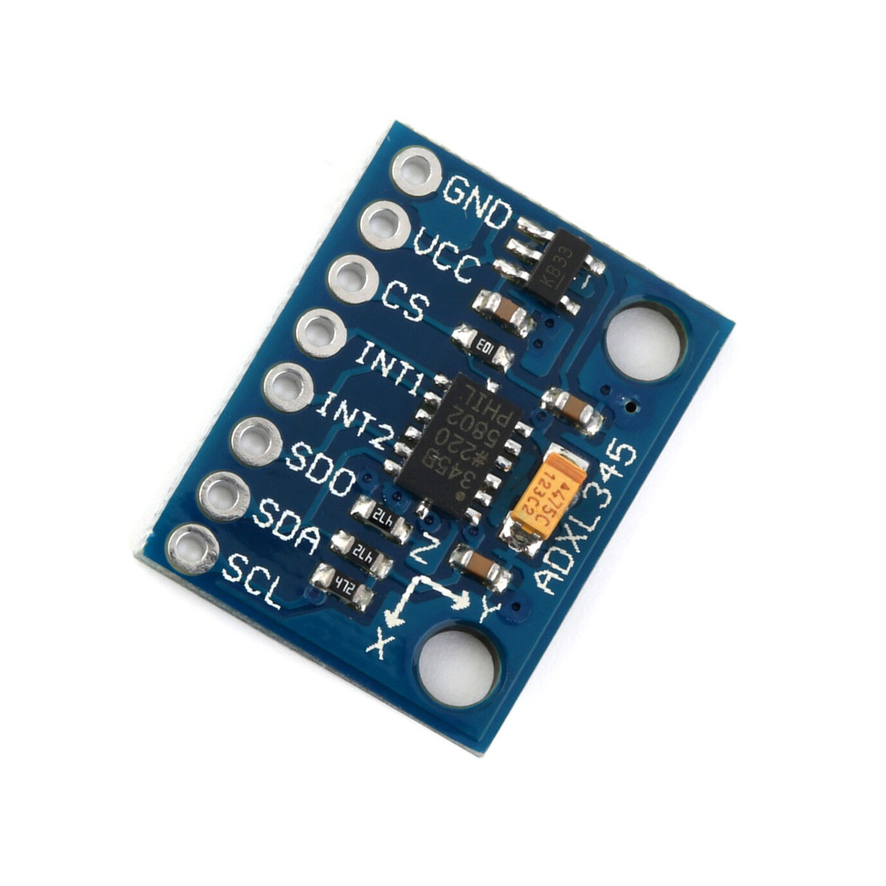

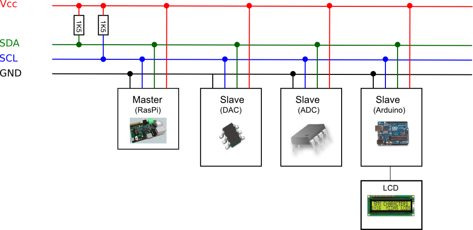

---

## Interaktion mit Transmittern am Beispiel I²C

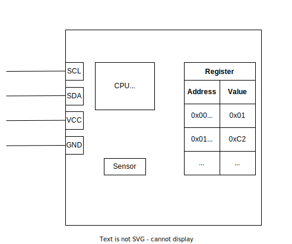

- CPU verhandelt schreibt (Sensordaten) und liest Register
- i.d.R. liegt alles als 8-Bit Binärcode vor
- CPU verhandelt Datenübertragung mit Bus
- Bei I²C geht die Kommunikation vom Master aus
    - Welche Slave Adresse?
    - Welches Register?
    - Lesen oder Schreiben?
        - Wenn schreiben: Welcher Wert?

---

### Register

- Enthalten einen Speicher (Register)  
    - anhand derer sie konfiguriert werden können
    - und Werte ausgelesen werden

```
Address     Value (8 Bit)       |   Name            Erklärung   

0x00        11100101            |   DEVID           Name des Geräts
0x31        00000000            |   DATA_FORMAT     Was bedeutet der Binärcode
0x32        00000000            |   DATAX0          Beschleunigungswert in X-Richtung (0/1)
0x34        00000000            |   DATAY0          Beschleunigungswert in Y-Richtung (0/1)  
0x36        00000000            |   DATAZ0          Beschleunigungswert in Z-Richtung (0/1)                      
```

- Während mache Felder nur gelesen werden könne (`DEVID`, `DATAX0`), können andere auch auch gesetzt werden (`00000000`)

###### https://www.analog.com/media/en/technical-documentation/data-sheets/ADXL345.pdf

---

### Beispiel: MPU-6000 und MPU-6050

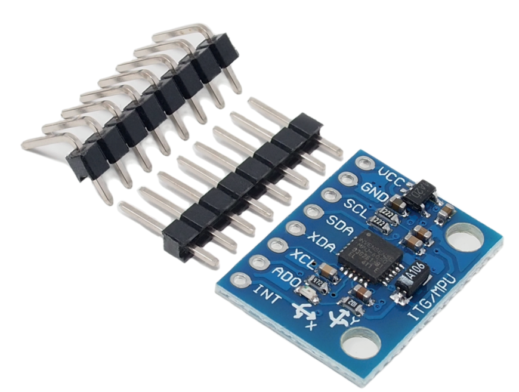

- Gyroskop: Misst Drehung in ($\text{°/s}$) 
- Beschleunigungssensor: Misst Beschleunigung in  ($\text{g}$) 

- [Datenblatt Breakout-Board](https://cdn.shopify.com/s/files/1/1509/1638/files/GY-521_6-Achsen_Gyroskop_und_Beschleunigungssensor_Datenblatt_AZ-Delivery_Vertriebs_GmbH_b35673f3-1fb8-423c-a533-524c216d92dd.pdf?v=1627564500)
- [Register-Map des Sensor](https://invensense.tdk.com/wp-content/uploads/2015/02/MPU-6000-Register-Map1.pdf)

---

## 🏆 P4.1: Anschluss eines Sensors


- Vibrationen und Bewegungen in Maschinen lassen häufig Rückschlüsse auf Prozessqualität und Wartungsbedarfs zu
- Um solche Informationen so sammeln binden wir einen Beschleunigungssensor ein


---

- Bauen Sie ein Dashboard auf, welches die Werte von X, Y, Z-Achse in sekündlicher Auflösung als Line Chart in [$mg$](https://en.wikipedia.org/wiki/G-force#) visualisiert
- Übermitteln Sie die Werte außerdem an einen MQTT-Broker
- Ressourcen
    - [ADXL345 Beschleunigungsmesser](https://www.analog.com/media/en/technical-documentation/data-sheets/ADXL345.pdf) oder [MPU6050](https://cdn.shopify.com/s/files/1/1509/1638/files/GY-521_6-Achsen_Gyroskop_und_Beschleunigungssensor_Datenblatt_AZ-Delivery_Vertriebs_GmbH_b35673f3-1fb8-423c-a533-524c216d92dd.pdf?v=1627564500)
    - [Anleitung für Micro Python](https://how2electronics.com/interfacing-adxl345-accelerometer-with-raspberry-pi-pico/)

---

### Hilfestellung 

den I2C-Bus über die Konsole aktivieren (ssh, raspi-config)
- mittels `node-red-contrib-i2c` oder Shell

Aus Datenblatt
- Standard-Adresse
- Registerpositionen
- Wie viele Bytes sollen gelesen werde
- Umwandlung der RawBytes in Dezimalzahl
- Höhe der Pull-Widerstände

---

### MQTT-Broker


- Verbinden Sie diesen mit dem folgenden MQTT-Broker 
    - URL: `158.180.44.197`
    - PORT: `1883`
    - USERNAME: `bobm`
    - PASSWORD: `letmein`
    - Vorsicht: Das Netzwerk muss mit dem Internet verbunden sein.


---

### Abgabe

- 2pt: Node-Red flow, welcher den Sensor konfiguriert, damit dieser Werte ermittelt (alternativ kann dies auch mittels shell-skript vorgekommen werden (nächste Folie)) wählen Sie hierbei die sensibelst mögliche Einstellung (`4.1_acceleration_config.json`)
- 4pt: Node-Red flow, welcher die Daten periodisch abfragt , die Werte umwandelt und visualisiert (`4.2_acceleration.json`)
- 2pt: Daten werden auf MQTT-Broker übertragen
- 2pt: Bauen sie eine Funktion ein, dass nur Daten an den Broker gesendet werden, wenn sich die Werte in signifikanten Ausmaß ändern


---

### Aufbau der Konfiguration I²C-Bus am Master (RasPi)

- Aufbau der Schaltung laut Datenblatt 
    Spannung ~3.3V
- Welche Pins werden genutzt?
- Was ist die gewünschte Übertragungsrate des Bus (Default: $100 000~\frac{Baud}{s}$)? (`CLK`) (meist definieren die Breakout-Boards die Rate in ihrem Datenblatt)


---

#### Schaltung für MPU-6000 und MPU-6050

- [Datenblatt des Transmitters](https://cdn.shopify.com/s/files/1/1509/1638/files/GY-521_6-Achsen_Gyroskop_und_Beschleunigungssensor_Datenblatt_AZ-Delivery_Vertriebs_GmbH_b35673f3-1fb8-423c-a533-524c216d92dd.pdf?v=1627564500)

- Schaltung
    - `SDA`: Pin `3`
    - `SCL`: Pin `5`
    - `VCC`: Pin `1`
    - `GND`: Pin `6`
    - Pulldown-Widerstände: `10kOhm` zwischen `SDA` und `VCC` sowie `SCL` und `VCC` (optional)

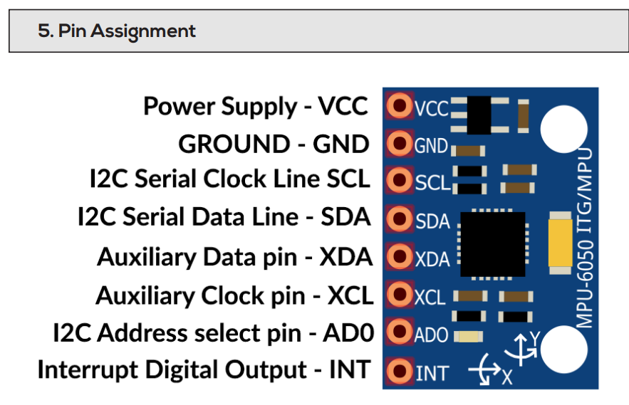

---

### Finden des MPU auf I²C-Bus

- I²C aktivieren: `sudo raspi-config` -> `Interfacing Options` -> `I2C` -> `Yes` --> `sudo reboot`
- Gerät an Adresse `0x68` wird erkannt
- i.d.R. sollten hier keine weiteren Einstellungen nötig sein

```
pi@raspberrypi:~ $ i2cdetect -y 1
     0  1  2  3  4  5  6  7  8  9  a  b  c  d  e  f
00:                         -- -- -- -- -- -- -- --
10: -- -- -- -- -- -- -- -- -- -- -- -- -- -- -- --
20: -- -- -- -- -- -- -- -- -- -- -- -- -- -- -- --
30: -- -- -- -- -- -- -- -- -- -- -- -- -- -- -- --
40: -- -- -- -- -- -- -- -- -- -- -- -- -- -- -- --
50: -- -- -- -- -- -- -- -- -- -- -- -- -- -- -- --
60: -- -- -- -- -- -- -- -- 68 -- -- -- -- -- -- --
70: -- -- -- -- -- -- -- --
```

---

#### Bei Problemen ggf. die Baudrate anpassen

- Der Master gibt die Baudrate vor (Geschwindigkeit der Datenübertragung über `SCL`). Die nicht jeder Transmitter beherrscht jede Baudrate
anpassen laut Datenblatt bis 400 kHz [Seite 5](https://invensense.tdk.com/wp-content/uploads/2015/02/MPU-6000-Register-Map1.pdf)
- [Anleitung: Baudrate bei RasPi anpassen](https://www.raspberrypi-spy.co.uk/2018/02/change-raspberry-pi-i2c-bus-speed/#:~:text=I2C%20Baudrate%20Values&text=For%20this%20reason%20I%20would,which%20images%20could%20be%20updated.) 

---

### Validierung ob es das richtige Gerät ist

- Wenn der Eingang `AD0` Eingang des Breakout Boards auf `Ground` liegt, dann ist die Adresse `0b1101000` : `0x68` : $104$
- [siehe Datenblatt](https://www.kollino.de/download/datenblatt-gy-521-mpu6050/)
    


---

### Abfragen von Werten

- `i2cget <busnr> <devicenr> <register>`
- `i2cget 1 0x68 0x3b` gibt noch `0x00` zurück, da nicht konfiguriert
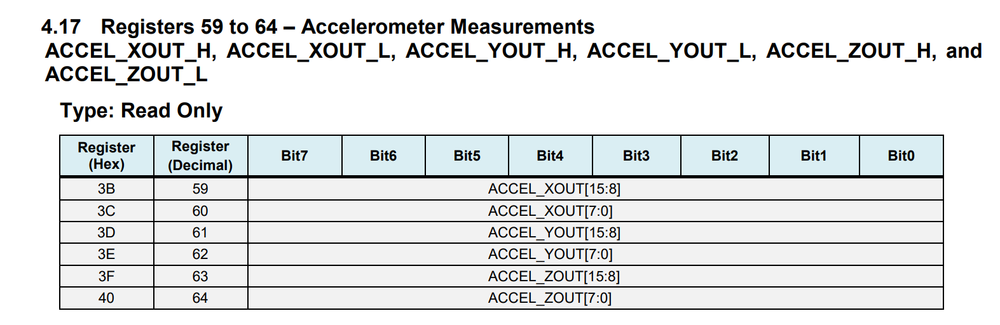
- In der [Register Map](https://invensense.tdk.com/wp-content/uploads/2015/02/MPU-6000-Register-Map1.pdf) des Sensors finden wir die Adresse des Registers, welches die Beschleunigungswerte enthält
- Ebenso Temperatur und Drehgeschwindigkeit

--- 

### Konfiguration

- Aus Energiespargründen ist der MPU6050 im Auslieferungszustand in einem Schlafmodus
- Dieser muss zunächst deaktiviert werden
- Je nach Transmitter, wird nicht automatisch in das Wertregister geschrieben
- zunächst wird der MPU6050 durch den Eintrag einer Null in das `Power Management 1` (`0x6B`) Register geweckt [siehe Datenblatt Seite 40](https://www.kollino.de/download/datenblatt-gy-521-mpu6050/)

---

#### In Schreibmodus wechseln

- der MPU6050 erzeugt dann kontinuierlich Ergebnisse für Beschleunigung, Gyroskop und Temperatur, wenn der Eintrag im `Power Management 1` (`0x6B`) Register auf `0x00` gesetzt wird

- Anpassung der Power Management
    - `i2cget 1 0x68 0x6B` gibt noch `0x40` zurück (ist noch im Schalfmodus)
    - Zum Setzen eines Registers `i2cset <busnr> <devicenr> <register>`
    - `i2cset 1 0x68 0x6B 0x00` setzt den Wert auf `0x00`
    - `i2cget 1 0x68 0x6B` gibt jetzt `0x00` zurück
- Der Transmitter ist jetzt im Schreibmodus

---

### Abfragen von Werten

- über die Registerpostionen können nun die Werte abgefragt werden
`i2cget -y 1 0x68 0x3c` 
- in der [Register Map](https://invensense.tdk.com/wp-content/uploads/2015/02/MPU-6000-Register-Map1.pdf) sind die Adressen und Werte beschrieben
- Hilfestellung zum Umrechnen findet sich auch in folgenden [Arduino-Beispiel](https://wolles-elektronikkiste.de/mpu6050-beschleunigungssensor-und-gyroskop)

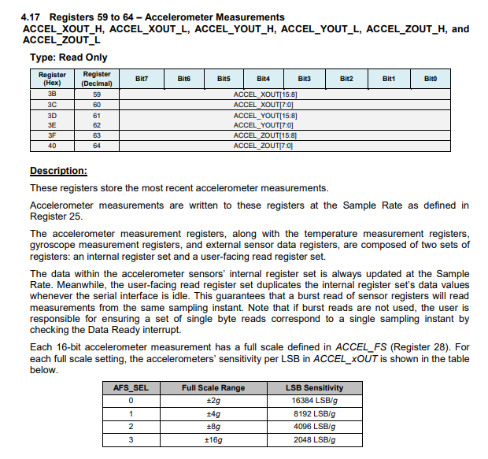

---

#### Zusammensetzen der Werte

- Für jede Achse gibt es zwei Register, welche die Werte der Beschleunigungswerte enthalten
- Somit können Werte mit einer Auflösung von 16 Bit abgefragt werden (Auflösung $2^{16}$)
- Wir müssen diese Werte noch zusammensetzen
```JS
1000 0011           // high byte z.B. ACCEL_XOUT[15:8]
          0100 1010 // low byte z.B. ACCEL_XOUT[7:0]
1000 0011 0100 1010 // 2-Byte Wert
```

- Setzen Sie dies in einer node-red Funktion um

---

#### Zusammensetzen der Werte

- Um die beiden Bitfelder in einer Binärzahl zusammenzufassen müssen wir das High-Byte um 8 Stellen nach links verschieben und dann mit dem Low-Byte addieren


```JavaScript
// high byte
let high_byte = msg.payload[0];
// low byte wird direkt übernommen
let low_byte = msg.payload[1];

// High byte vor Addition um 8 Stellen nach Links verschieben
// Bitweise Operation 0001 << 8 -> 1 0000 0000
// High byte vor Addition um 8 Stellen nach Links verschieben
let twosComplement = (high_byte << 8) + low_byte;

msg.payload = twosComplement;

return msg
```

---

#### Interpretieren der Werte


- Der niedrigste Wert, der im 2-Byte Wert `twosComplement` entspricht $-2 \text{ g}$, der höchste $+2 \text{ g}$ (doppelte Erdbeschleunigung) (die könnte über das Register `ACCEL_CONFIG` geändert werden)

---

#### 2-Byte Wert in interpretierbare Zahl umwandeln

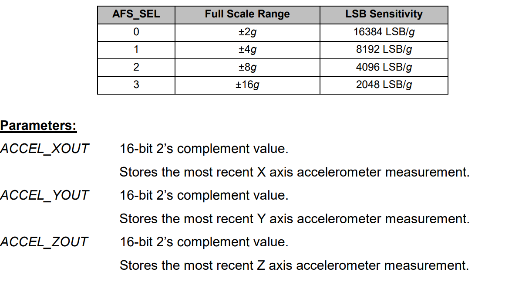

- In `twosComplement` ist der Wert der Beschleunigung gespeichert
- Laut Datenblatt wird hier eine Zahlendarstellung namens [Zweierkomplement](https://de.wikipedia.org/wiki/Zweierkomplement) verwendet


---

##### Umwandeln des Zweierkomplement

- Zahlendarstellung, welche in der Informatik verwendet wird
- äußerst effizient, da nur eine einzige Zahlendarstellung für positive und negative Zahlen verwendet wird

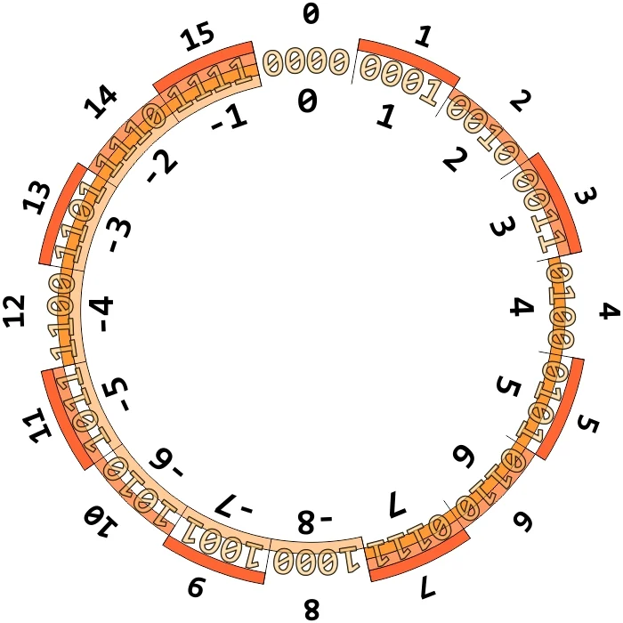

---

##### Umwandeln des Zweierkomplement

* Die Zahlendarstellung ist abhängig von der Anzahl der Bits
* Input: Zahl ist ein 4-Bit Wert, Zahl ist positiv $3$
    * Zahl in Binärzahl umwandeln
        * $3_{10}$ = `0b0011`
* Input: Zahl ist ein 4-Bit Wert, Zahl ist negativ $-3$
    * Zahl in Binärzahl umwandeln
        * $3_{10}$ = `0b0011`
    * Invertieren der Bits
        * `0b0011` -> `0b1100`
    * Addieren von 1
        * `0b1100` + `0b0001` = `0b1101`
* Wir benötigen die Umkehrung vom Zweierkomplement zu einem Integer

---

##### Beispiel Java-Script für 4 Bit (siehe Abbildung)

```javascript
// Beispiel mit 4 Bit-Länge
// Wir wissen aus der Abbildung, dass dies -2 darstellt
let twosComplement = 0b1110;

// Überprüfung
// Was wäre das Ergebnis, wenn es eine normale Binärzahl wäre?
console.log("Twos Complement binary:",  twosComplement);
// Was ist das Vorzeichen?
console.log("Twos Complement sign bit:",  twosComplement >> 3);

// Variable für den Integer-Wert
let integerValue;
// Right-Shifting um 3 Stellen, damit wir nur das Vorzeichen-Bit (MSB) erhalten
// Wenn das MSB 1, ist es eine negative Zahl (siehe Zahlenkreis)
if (twosComplement >> 3) {
    // Invertieren der Bits (~) und Addieren von 1, um den Wert zu erhalten
    // Da JS mit einem Half-Byte arbeitet, müssen wir die letzten 4 Bits mit 0 maskieren (0xF)
    integerValue = -((~twosComplement + 1) & 0xF);
} else {
    // Im positiven Fall können wir den Wert direkt übernehmen
    integerValue = twosComplement;
}

console.log("Integer Value:", integerValue);
```

*Vorsicht*: Der Code ist für einen [JS-Compiler](https://www.programiz.com/javascript/online-compiler/) und nicht für einen node-red flow geschrieben!

---

##### Beispiel Java-Script für 2 Byte (wie beim Sensor)

```javascript
// high byte
let high_byte = 0xFF;

// low byte wird direkt übernommen: 11011000
let low_byte = 0xFF;

// High byte vor Addition um 8 Stellen nach Links verschieben
let twosComplement = (high_byte << 8) + low_byte;

// Ueberprüfung
// Was wäre das Ergebnis, wenn es eine normale Binärzahl wäre?
console.log("Twos Complement binary:",  twosComplement);
// Was ist das sign bit? Einfach um 15 Stellen nach rechts schieben, damit nur das übrig bleibt
console.log("Twos Complement sign bit:",  twosComplement >> 15);

// Convert the twosComplement to its integer value
let integerValue;
if (twosComplement >> 15) {

    // If the most significant bit is 1, it's a negative number
    // Dieses Mal müssen wir die letzten 16 Bits mit 0 maskieren (0xFF)
    integerValue = -((~twosComplement + 1) & 0xFF);

} else {
    // If the most significant bit is 0, it's a positive number
    integerValue = twosComplement;
}

console.log("Integer Value:", integerValue);
```

- Dies muss nun in einem node-red Knoten umgesetzt werden

---

### Umwandeln des Integer-Wertes in die Einheit

- Die Einheit der Beschleunigung ist `g`
- Wir haben die Werte auf +/- 2g eingestellt, sofern  [Register 28](https://invensense.tdk.com/wp-content/uploads/2015/02/MPU-6000-Register-Map1.pdf) nicht verändert wurde
- Die Werte werden als `16 Bit` signed Integer übertragen
- Wir bekommen also Werte zwischen `-32768` (entspricht $-2g$) und `32767` (entspricht $+2g$)
- Entsprechend brauchen wir ein Funktion, die den Integer-Wert in die Einheit umrechnet

---

#### Umwandeln des Integer-Wertes in die Einheit

```JS

// Get raw signed int between -32768 and 32767
let raw_int = msg.payload;

// set max g value from config
let max_g_value = 2;

// map to g value (we have 16 bit, so we divide by 32768)
// Der Betragsmäßig größte mögliche Wert ist 32767.
// Diesen normieren wir auf 2g, indem wir durch 32768 teilen und mit 2g multiplizieren
msg.payload = raw_int *max_g_value / 32768;

return msg
```

---

#### Vollständige Lösung

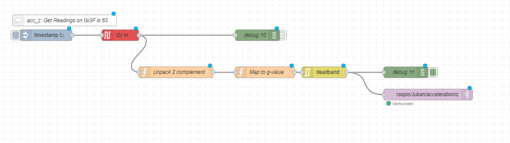

* Ein Filter-node `deadband` lässt nur die Nachrichten durch, die größere Änderungen Z-Achse haben als 0.1g
* Ein MQTT-node sendet die Nachrichten an den Broker

---

<!-- 
#### Unpack 2 complement

```json
[
    {
        "id": "a95f66185cb35105",
        "type": "function",
        "z": "bf72231f0ebc330c",
        "name": "Unpack 2 complement",
        "func": "\n// high byte\nlet high_byte = msg.payload[0];\n\n// low byte wird direkt übernommen: 11011000\nlet low_byte = msg.payload[1];\n\n// High byte vor Addition um 8 Stellen nach Links verschieben\n// Bitweise Operation 0001 << 8 -> 1 0000 0000\n// High byte vor Addition um 8 Stellen nach Links verschieben\nlet twosComplement = (high_byte << 8) + low_byte;\n\n// Ueberprüfung\n// Was wäre das Ergebnis, wenn es eine normale Binärzahl wäre?\n//console.log(\"Twos Complement binary:\", twosComplement);\n// Was ist das sign bit? Einfach um 15 Stellen nach Rechts schieben, damit nur das übrig bleibt\n//console.log(\"Twos Complement sign bit:\", twosComplement >> 15);\n\n// Convert the twosComplement to its integer value\nlet integerValue;\nif (twosComplement >> 15) {\n\n    // If the most significant bit is 1, it's a negative number\n    integerValue = -((~twosComplement + 1) & 0xFF);\n} else {\n    // If the most significant bit is 0, it's a positive number\n    integerValue = twosComplement;\n}\n\nmsg.payload = integerValue;\n\nreturn msg",
        "outputs": 1,
        "noerr": 0,
        "initialize": "",
        "finalize": "",
        "libs": [],
        "x": 580,
        "y": 920,
        "wires": [
            [
                "99983c8f8d511862"
            ]
        ]
    }
]
```


---

-->

## Appendix (alte Version für ADXL345)

### Auffinden der vorhandenen Slaves

* Welche Adresse hat der Transmitter z.B. `0x53` (Hexcode) = `0b01010011` (Binary code) = $83$ auf der Busleitung (z.B. aus Datenblatt)
* In unix shell `i2cdetect 1` (Zahl für Bus-Nummer)
    ```
    [root]$ i2cdetect -y 1
        0  1  2  3  4  5  6  7  8  9  a  b  c  d  e  f
    00:          -- -- -- -- -- -- -- -- -- -- -- -- --
    10: -- -- -- -- -- -- -- -- -- -- -- -- -- -- -- --
    20: -- -- -- -- -- -- -- -- -- -- -- -- -- -- -- --
    30: 30 -- -- -- -- -- 36 -- -- -- -- -- -- -- -- --
    40: -- -- -- -- -- -- -- -- -- -- -- -- -- -- -- --
    50: 50 -- 52 53 -- -- -- -- -- -- -- -- -- -- -- --
    60: -- -- -- -- -- -- -- -- -- -- -- -- -- -- -- --
    70: -- -- -- -- -- -- -- --
    [root]$
    ```

###### https://linuxhint.com/i2c-linux-utilities/


---


### Auffinden der vorhandenen Slaves

* Welche Adresse hat der Transmitter z.B. `0x53` (Hexcode) = `0b01010011` (Binary code) = $83$ auf der Busleitung (z.B. aus Datenblatt)
* In unix shell `i2cdetect 1` (Zahl für Bus-Nummer)
    ```
    [root]$ i2cdetect -y 1
        0  1  2  3  4  5  6  7  8  9  a  b  c  d  e  f
    00:          -- -- -- -- -- -- -- -- -- -- -- -- --
    10: -- -- -- -- -- -- -- -- -- -- -- -- -- -- -- --
    20: -- -- -- -- -- -- -- -- -- -- -- -- -- -- -- --
    30: 30 -- -- -- -- -- 36 -- -- -- -- -- -- -- -- --
    40: -- -- -- -- -- -- -- -- -- -- -- -- -- -- -- --
    50: 50 -- 52 53 -- -- -- -- -- -- -- -- -- -- -- --
    60: -- -- -- -- -- -- -- -- -- -- -- -- -- -- -- --
    70: -- -- -- -- -- -- -- --
    [root]$
    ```

###### https://linuxhint.com/i2c-linux-utilities/


---


### Bei unzuverlässiger Verbindung 
[Baudrate](https://www.raspberrypi-spy.co.uk/2018/02/change-raspberry-pi-i2c-bus-speed/#:~:text=I2C%20Baudrate%20Values&text=For%20this%20reason%20I%20would,which%20images%20could%20be%20updated.) anpassen laut Datenblatt 400 kHz


---

#### Hexadezimal-Chart

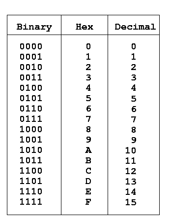

```
Bin <> Hex: Direkt ablesbar, da immer 4 Bit genau eine Stelle
0b 0101 0011
0x    5    3

Bin <> Dec: Nicht direkt ablesbar!
0b 0101 0011

0b   0  1   0  1 0 0 1 1
   128 64  32 16 8 4 2 1 
       64  +  16  +  2+1= 83
               
```

* Windows Taschenrechner mit Programmierer-Modus
* Papier bereitlegen!


---

#### Standard-Adressen

- RasPi 3B+ hat zwei I²C-Busse: `0` und `1`
    - `0` ist für interne Kommunikation reserviert
    - `1` ist für externe Kommunikation reserviert
- ADXL345: `0x53` 
- ITG/MPU: `0x68` 

---

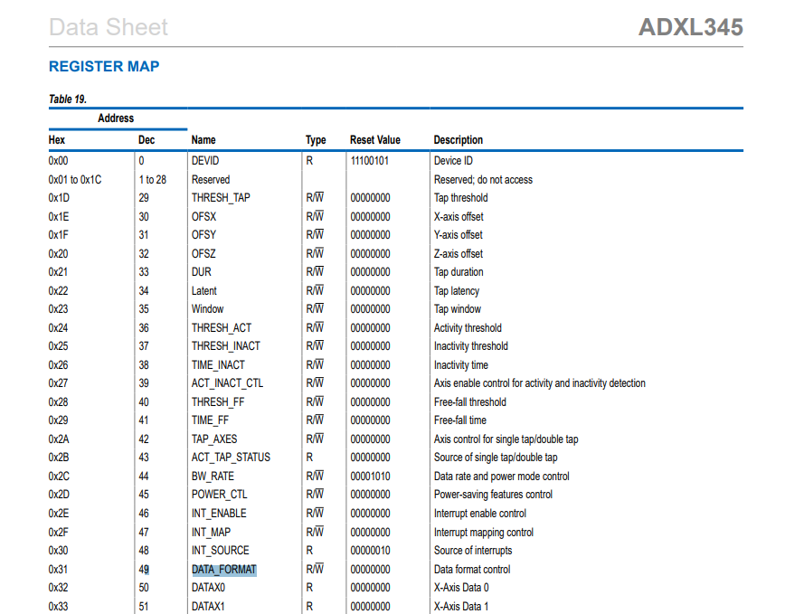

---

### Konfiguration und Abfrage Transmitter über Master

```
1.Read the device register 0x0 (Device ID)
[root]$ i2cget 1 0x53 0x0
0xE5

2.Write the device register 0x31 (Data Format) of slave device 0x53 to define the measurement range
[root]$ i2cset 1 0x53 0x31 0x1

3.Read back the device at register 0x31 and verify the data should be 0x1.
[root]$ i2cget 1 0x53 0x31
0x1
```

* Die genauen Anforderungen an die Konfiguration sind i.d.R. mehr oder weniger klar den Datenblatt zu entnehmen
* z.B. Powerstatus, Datenformat, Messbereich, Auflösung, Filter, etc. muss ggf. gesetzt werden, bevor Messwerte abgefragt werden können

###### https://www.analog.com/media/en/technical-documentation/data-sheets/ADXL345.pdf

---

### Beispiel: Temperaturfühler MCP9808

* [Datenblatt](http://ww1.microchip.com/downloads/en/DeviceDoc/25095A.pdf) 
* i.d.R. sind die Sensoren auf Breakout-Boards montiert
    * Diese machen die Anschlüsse über Steckverbindungen zugänglicher
    * Spannungsversorgung

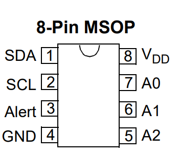

---

#### Adresse herausfinden

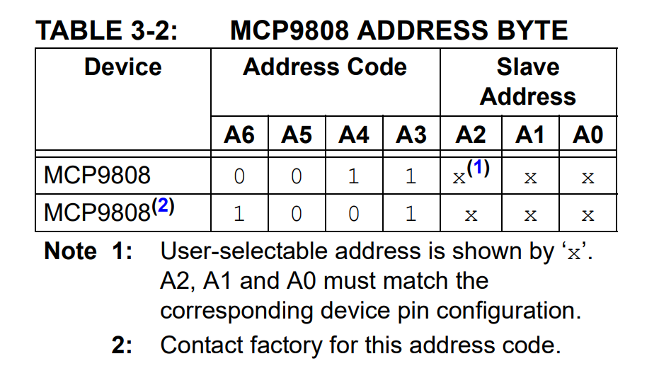

* Wenn `A0` bis `A3` nicht gesetzt: `0b 001 1000`/ `0x18` / $24$ 


---

#### Register-Adressen für Temperatur

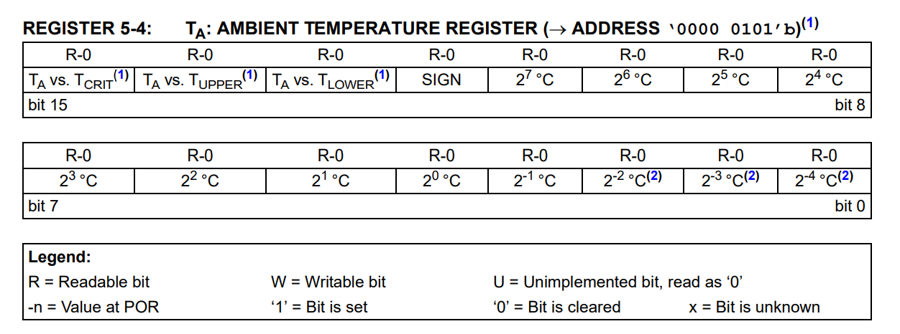

* Register `0b 0000 0101` / `0x5` / $5$ muss ausgelesen werden
* Insgesamt werden 16 Bit ( 8 Byte) bereitgestellt 

---

* Adresse: `0x18` - $25$
* Register: `0x5` - $5$
* Anzahl der Bytes: `2`
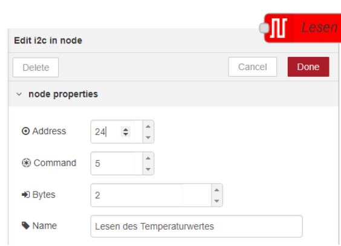


---

> The digital word is loaded to a 16-bit read-only Ambient temperature register (TA) that contains 13-bit temperature data in [two’s complement format](https://de.wikipedia.org/wiki/Zweierkomplement).

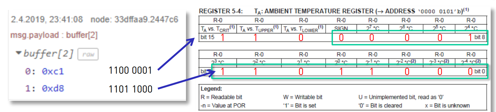

* Buffer sind Zwischenspeicher, die meist binäre Daten enthalten
* Als nächstes müssen die binär codierten Daten in eine sinnvolle Temperatur umgewandelt werden

---

#### Umwandlung des Nachricht (in node-red function node)

⚠️ nur gültig für positive Temperaturen

```JS
// high byte
// maskieren der relevanten Bits: 0000 1111
// Bitweise Operation 11000001 & 00001111 -> 0001
high_byte = msg.payload[0] & 0x0f;

// low byte wird direkt übernommen: 11011000
low_byte = msg.payload[1];

// High byte vor Addition um 8 Stellen nach Links verschieben
// Bitweise Operation 0001 << 8 -> 1 0000 0000
// 1 11011000
new_payload = (high_byte << 8 ) + low_byte;

// Skalieren, da LSB 2^(-4) = 16
// 29.5 °C
msg.payload = new_payload / 16;


return msg;
```

---

### [Beispiel im JS Online Compiler](https://www.programiz.com/javascript/online-compiler/)
```JS
// high byte
// maskieren der relevanten Bits: 0000 1111
// Bitweise Operation 11000001 & 00001111 -> 0001

let high_byte = 0xc1;
let low_byte = 0xd8;

high_byte = high_byte & 0x0f;

// low byte wird direkt übernommen: 11011000
low_byte = low_byte;

// High byte vor Addition um 8 Stellen nach Links verschieben
// Bitweise Operation 0001 << 8 -> 1 0000 0000
// 1 11011000
let new_payload = (high_byte << 8 ) + low_byte;

// Skalieren, da LSB 2^(-4) = 16
// 29.5 °C
new_payload = new_payload / 16;
//new_payload = new_payload >> 4;
    
console.log(new_payload);
```

---

### Bibliotheken

* In der Regel gibt es für Sensoren vorgefertigte Bibliotheken für die gängigen Hardwaresysteme und verschiedene Programmiersprachen

```Python
# z.B. CircuitPython auf Raspberry Pi Pico
import time
import board
import adafruit_mcp9808
i2c = board.I2C()  # uses board.SCL and board.SDA
# i2c = board.STEMMA_I2C()  # For using the built-in STEMMA QT connector on a microcontroller
# To initialise using the default address:
mcp = adafruit_mcp9808.MCP9808(i2c)
# To initialise using a specified address:
# Necessary when, for example, connecting A0 to VDD to make address=0x19
# mcp = adafruit_mcp9808.MCP9808(i2c_bus, address=0x19)

while True:
    tempC = mcp.temperature
    print("Temperature: {} °C ".format(tempC))
    time.sleep(2)
```

---

```Python
# Simple demo of of the ADXL345 accelerometer library.  Will print the X, Y, Z
# axis acceleration values every half second.
import time

# Import the ADXL345 module.
import Adafruit_ADXL345

accel = Adafruit_ADXL345.ADXL345(address=0x54, busnum=2)

# You can optionally change the range to one of:
# For example to set to +/- 16G:
#accel.set_range(Adafruit_ADXL345.ADXL345_RANGE_16_G)

print('Printing X, Y, Z axis values, press Ctrl-C to quit...')
while True:
    # Read the X, Y, Z axis acceleration values and print them.
    x, y, z = accel.read()
    print('X={0}, Y={1}, Z={2}'.format(x, y, z))
    # Wait half a second and repeat.
    time.sleep(0.5)
```

* [Adafruit_Python_ADXL345](https://github.com/adafruit/Adafruit_Python_ADXL345)


---

```Python
import time
import board
import adafruit_mpu6050

i2c = board.I2C()  # uses board.SCL and board.SDA
mpu = adafruit_mpu6050.MPU6050(i2c)

while True:
    print("Acceleration: X:%.2f, Y: %.2f, Z: %.2f m/s^2"%(mpu.acceleration))
    print("Gyro X:%.2f, Y: %.2f, Z: %.2f degrees/s"%(mpu.gyro))
    print("Temperature: %.2f C"%mpu.temperature)
    print("")
    time.sleep(1)
```
* [Adafruit_CircuitPython_MPU6050](https://github.com/adafruit/Adafruit_CircuitPython_MPU6050)

* [CircuitPython on Raspberry 3](https://www.digikey.com/en/maker/projects/circuitpython-on-linux-and-raspberry-pi/2aac644c44f1418e987417b229a67c23#:~:text=Installing%20CircuitPython%20Libraries%20on%20Raspberry,Pi%203%20or%20Pi%20Zero.)


---

### Shell Script

- optional können Sie die Konfiguration auch mittels Shell-Skriptes ausführen
- Ausführbare Datei, die Shell Befehle enthält, die nacheinander ausgeführt werden, wenn das Skript aufgeführt wird
- Startet immer mit `#!/bin/sh`


[Anleitung](https://www.shellscript.sh/)

```
$ echo '#!/bin/sh' > my-script.sh
$ echo 'echo Hello World' >> my-script.sh
$ chmod 755 my-script.sh
$ ./my-script.sh
Hello World
```

---

## Musterlösung für ITG/MPU 

- [Datenblatt des Transmitters](https://cdn.shopify.com/s/files/1/1509/1638/files/GY-521_6-Achsen_Gyroskop_und_Beschleunigungssensor_Datenblatt_AZ-Delivery_Vertriebs_GmbH_b35673f3-1fb8-423c-a533-524c216d92dd.pdf?v=1627564500)

- Schaltung
    - `SDA`: Pin `3`
    - `SCL`: Pin `5`
    - `VCC`: Pin `1`
    - `GND`: Pin `6`
    - Pulldown-Widerstände: `10kOhm` zwischen `SDA` und `VCC` sowie `SCL` und `VCC`

---

### Vorraubsetzung

- Gerät an Adresse `0x68` wird erkannt
- i.d.R. sollten hier keine weiteren Einstellungen nötig sein

```
pi@raspberrypi:~ $ i2cdetect -y 1
     0  1  2  3  4  5  6  7  8  9  a  b  c  d  e  f
00:                         -- -- -- -- -- -- -- --
10: -- -- -- -- -- -- -- -- -- -- -- -- -- -- -- --
20: -- -- -- -- -- -- -- -- -- -- -- -- -- -- -- --
30: -- -- -- -- -- -- -- -- -- -- -- -- -- -- -- --
40: -- -- -- -- -- -- -- -- -- -- -- -- -- -- -- --
50: -- -- -- -- -- -- -- -- -- -- -- -- -- -- -- --
60: -- -- -- -- -- -- -- -- 68 -- -- -- -- -- -- --
70: -- -- -- -- -- -- -- --
```

---

### Validierung ob es das richtige Gerät ist

- Wenn der Eingang `AD0` Eingang des Breakout Boards auf `Ground` liegt, dann ist die Adresse `0b1101000` : `0x68`
[siehe Datenblatt](https://www.kollino.de/download/datenblatt-gy-521-mpu6050/)
    

---

### Abfragen von Werten

- `i2cget 1 0x68 0x3b` gibt noch `0x00` zurück, da nicht konfiguriert

- In der [Register Map](https://invensense.tdk.com/wp-content/uploads/2015/02/MPU-6000-Register-Map1.pdf) des Sensors finden wir die Adresse des Registers, welches die Beschleunigungswerte enthält
- Ebenso Temperatur und Drehgeschwindigkeit

--- 

### Konfiguration

- zunächst wird der MPU6050 durch den Eintrag einer Null in das `Power Management 1` (`0x6B`) Register geweckt
- der MPU6050 erzeugt dann kontinuierlich Ergebnisse für Beschleunigung, Gyroskop und Temperatur
- `i2cget 1 0x68 0x6B` gibt noch `0x40` zurück
- `i2cset 1 0x68 0x6B 0x00` setzt den Wert auf `0x00`
- `i2cget 1 0x68 0x6B` gibt jetzt `0x00` zurück

---

### Abfragen von Werten

- über die Registerpostionen können nun die Werte abgefragt werden
`i2cget -y 1 0x68 0x3c` 
- in der [Register Map](https://invensense.tdk.com/wp-content/uploads/2015/02/MPU-6000-Register-Map1.pdf) sind die Adressen und Werte beschrieben
- Hilfestellung zum Umrechnen findet sich auch in folgenden [Arduino-Beispiel](https://wolles-elektronikkiste.de/mpu6050-beschleunigungssensor-und-gyroskop)


---

### Zusammensetzen der Werte

- Um die beiden Bitfelder in einer Binärzahl zusammenzufassen,


```JavaScript
// high byte
let high_byte = msg.payload[0];
// low byte wird direkt übernommen
let low_byte = msg.payload[1];

// High byte vor Addition um 8 Stellen nach Links verschieben
// Bitweise Operation 0001 << 8 -> 1 0000 0000
// High byte vor Addition um 8 Stellen nach Links verschieben
let twosComplement = (high_byte << 8) + low_byte;

msg.payload = twosComplement;

return msg
```

---

### Umwandeln des Zweierkomplement

- Zahlendarstellung, welche in der Informatik verwendet wird
- äußerst effizient, da nur eine einzige Zahlendarstellung für positive und negative Zahlen verwendet wird


---

#### Beispiel Java-Script für 4 Bit (siehe Abbildung)

```javascript
// Beispiel mit 4 Bit
let twosComplement = 0b1110;

// Ueberprüfung
// Was wäre das Ergebnis, wenn es eine normale Binärzahl wäre?
console.log("Twos Complement binary:",  twosComplement);
console.log("Twos Complement sign bit:",  twosComplement >> 3);


// Convert the twosComplement to its integer value
let integerValue;
// Right shift of the most significant bit (sign bit) to check whether it's a negative number
if (twosComplement >> 3) {
    // If the most significant bit is 1, it's a negative number
    integerValue = -((~twosComplement + 1) & 0xF);
} else {
    // If the most significant bit is 0, it's a positive number
    integerValue = twosComplement;
}

console.log("Integer Value:", integerValue);
```

---

#### Beispiel Java-Script für 2 Byte (wie beim Sensor)

```javascript
// high byte
let high_byte = 0xFF;

// low byte wird direkt übernommen: 11011000
let low_byte = 0xFF;

// High byte vor Addition um 8 Stellen nach Links verschieben
let twosComplement = (high_byte << 8) + low_byte;

// Ueberprüfung
// Was wäre das Ergebnis, wenn es eine normale Binärzahl wäre?
console.log("Twos Complement binary:",  twosComplement);
// Was ist das sign bit? Einfach um 15 Stellen nach rechts schieben, damit nur das übrig bleibt
console.log("Twos Complement sign bit:",  twosComplement >> 15);

// Convert the twosComplement to its integer value
let integerValue;
if (twosComplement >> 15) {

    // If the most significant bit is 1, it's a negative number
    integerValue = -((~twosComplement + 1) & 0xFF);

} else {
    // If the most significant bit is 0, it's a positive number
    integerValue = twosComplement;
}

console.log("Integer Value:", integerValue);
```


---

### Umwandeln des Integer-Wertes in die Einheit

- Die Einheit der Beschleunigung ist `g`
- Wir haben die Werte auf +/- 2g eingestellt
- Die Werte werden als 16 Bit Integer übertragen
- Wir bekommen also Werte zwischen `-32768` (entspricht $-2g$) und `32767` (entspricht $+2g$)
- Entsprechend brauchen wir ein Funktion, die den Integer-Wert in die Einheit umrechnet


---

<!-- 
#### Unpack 2 complement

```json
[
    {
        "id": "a95f66185cb35105",
        "type": "function",
        "z": "bf72231f0ebc330c",
        "name": "Unpack 2 complement",
        "func": "\n// high byte\nlet high_byte = msg.payload[0];\n\n// low byte wird direkt übernommen: 11011000\nlet low_byte = msg.payload[1];\n\n// High byte vor Addition um 8 Stellen nach Links verschieben\n// Bitweise Operation 0001 << 8 -> 1 0000 0000\n// High byte vor Addition um 8 Stellen nach Links verschieben\nlet twosComplement = (high_byte << 8) + low_byte;\n\n// Ueberprüfung\n// Was wäre das Ergebnis, wenn es eine normale Binärzahl wäre?\n//console.log(\"Twos Complement binary:\", twosComplement);\n// Was ist das sign bit? Einfach um 15 Stellen nach Rechts schieben, damit nur das übrig bleibt\n//console.log(\"Twos Complement sign bit:\", twosComplement >> 15);\n\n// Convert the twosComplement to its integer value\nlet integerValue;\nif (twosComplement >> 15) {\n\n    // If the most significant bit is 1, it's a negative number\n    integerValue = -((~twosComplement + 1) & 0xFF);\n} else {\n    // If the most significant bit is 0, it's a positive number\n    integerValue = twosComplement;\n}\n\nmsg.payload = integerValue;\n\nreturn msg",
        "outputs": 1,
        "noerr": 0,
        "initialize": "",
        "finalize": "",
        "libs": [],
        "x": 580,
        "y": 920,
        "wires": [
            [
                "99983c8f8d511862"
            ]
        ]
    }
]
```

-->

#### Map to g-value

```JavaScript

// Get raw int
let raw_int = msg.payload;

// set max g value from config
let max_g_value = 2;

// map to g value (we have 16 bit, so we divide by 32768)
msg.payload = raw_int / 32768*max_g_value;

return msg
```

