<!-- paginate: true -->

# Internet of Things


Dr. Julian Huber


---

## 5 Auto-ID

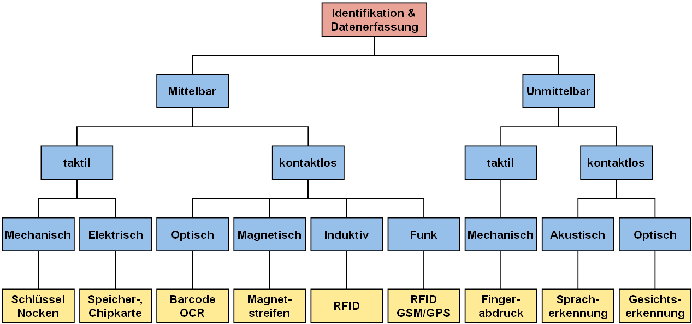


---


---

**Motivation**

* Welche Flasche wird gerade abgefüllt?
* klare Durchgängigkeit von Daten (was, wann, wo?)
* Alle Objekte sollen sich selbst automatisiert identifizieren können
* Hohe Stückzahlen
* Im besten Fall keine Stromversorgung nötig

---


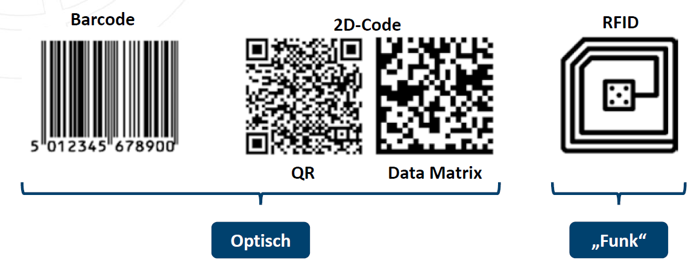

###### Pistorius 2020

---

## 5.1 Optische Verfahren

---

### 1-D Barcode (Linear)

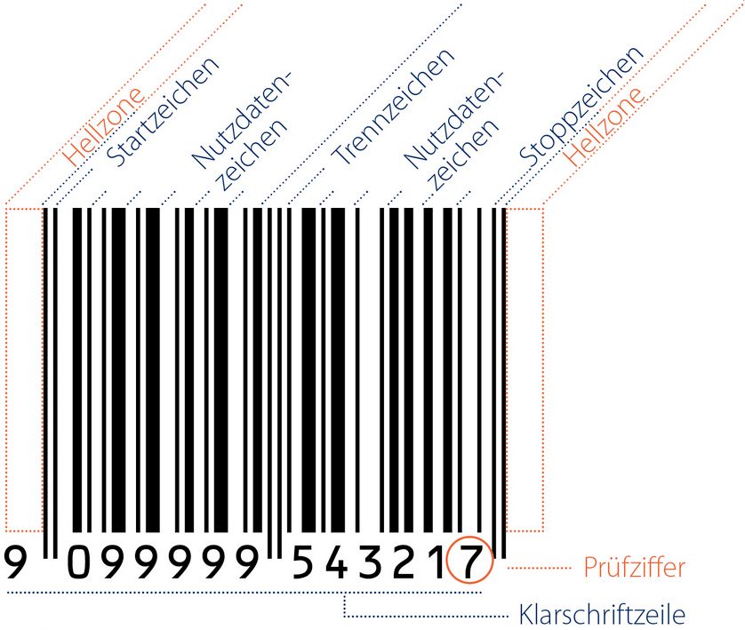

-  Menschen-verständliche Zahlendarstellung unter dem Code
- begrenzter Informationsinhalt
- Je nach Lesegerät muss ein bestimmter Winkel eingehalten werden
- [weitere Beispiele](https://barcode.tec-it.com/de/DataMatrix_Business_vCard)


---

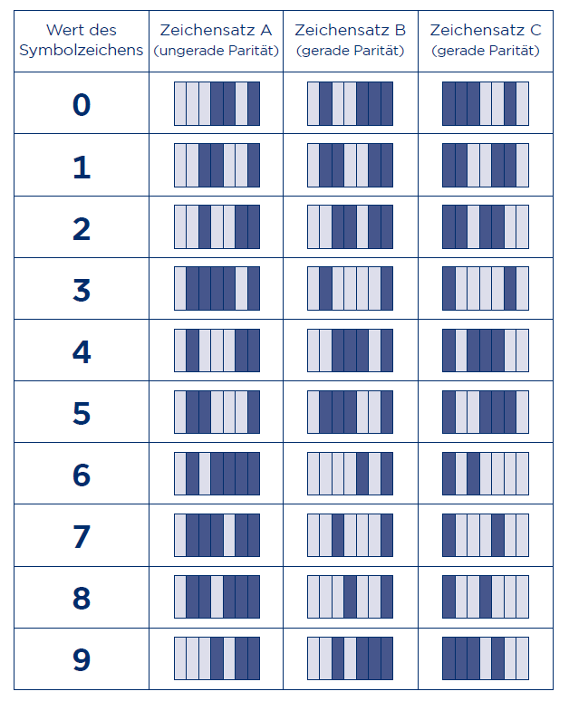

- z.B. EAN-13-Barcode mit 13 Bytes

---

### 2-D QR-Code


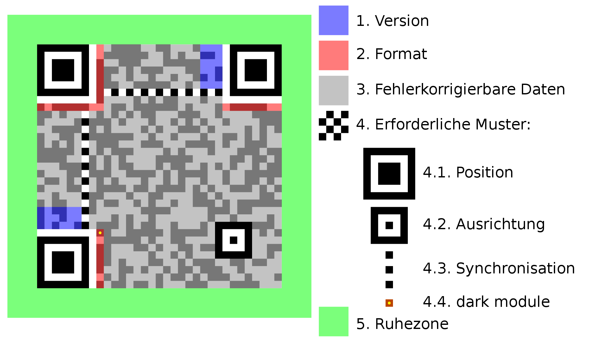

- Robuster durch Redundanz
- Größerer Informationsinhalt (z.B. 2953 Bytes)
- Mindestanforderungen an Bildqualität
- [Veritasium-Video on QR-Codes](https://www.youtube.com/watch?v=w5ebcowAJD8)

---

### Erstellen und Lesen von Bar- und QR-Code

- Software zum Lesen und erstellen liegt in vielen Open Source Software Lösungen vor
- node-red
    - [Generator](https://flows.nodered.org/node/node-red-contrib-qrcode-generator)
    - [Reader](https://flows.nodered.org/node/node-red-contrib-qrdecode)
- Python
    - [Generator](https://pypi.org/project/qrcode/)
    - [Reader](https://medium.com/@basuroyrohan/decoding-qr-codes-in-real-time-with-opencv-python-a-practical-guide-72e2b095ea91)


---

## 5.2 Wireless RFID (Radio-Frequency Identification)

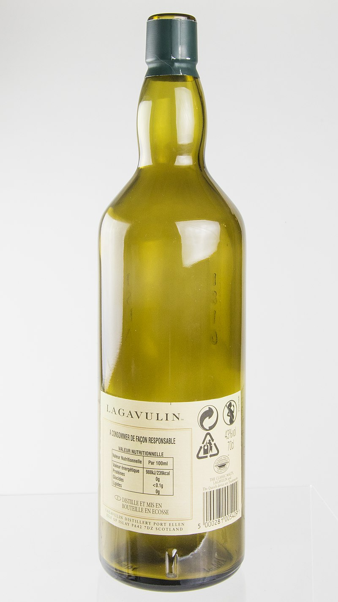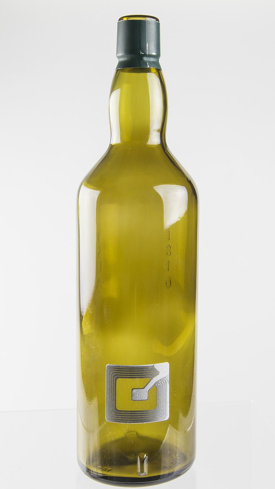

---

### Unterscheidungsmerkmale

<center>

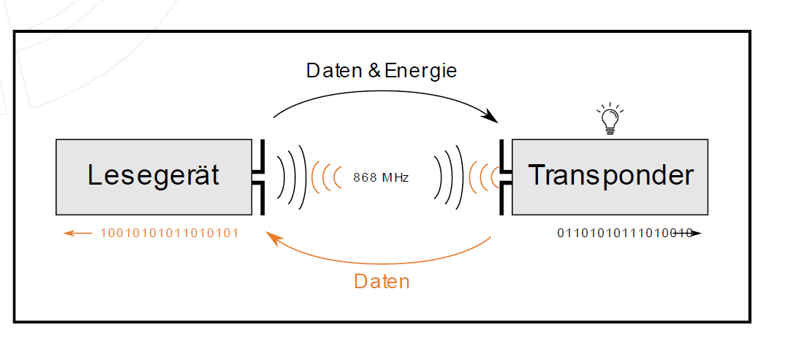

</center>

* **Transponder**: Antenne, einer elektrischen Schaltung zum Empfangen und Senden (Transceiver) und einem digitalen Schaltkreis mit Speicher
* **Lesegerät** (Reader, kann auch schreiben) erzeugt ein hochfrequentes elektromagnetisches Wechselfeld
* **Charakteristika**: Taktfrequenz, Übertragungsrate, Lebensdauer, Kosten pro Einheit, Speicherplatz, Lesereichweite und Energieversorgung (passiv, aktiv, halb-aktiv)


###### Finkenzeller.2015

---

#### Energieversorgung

* Passive RFID-Transponder versorgen sich aus den Funksignalen des Abfragegerätes.
    * kurze Reichweite
    * günstig
* Aktive RFID-Transponder mit eigener Energiequelle für die Versorgung eines Mikrochips und des Rücksignals
    * höhere Reichweite
    * Berechnungsfunktionen


---

#### Frequenz 

<center>

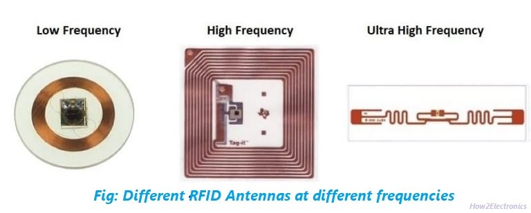

</center>

* Low Frequency (LF = 125kHz)
    * geringe Übertragungsraten und Abstände (<10 cm) 
    * günstig
* High Frequency (HF 13,56 MHz)
    * hohe Übertragungsraten
    * kleiner und einfacher ausfallen
    * bis 1 m (z.B. **NFC**)
* Ultra High Frequency (UHF 433 MHz)
    * bis 10 m
    * am stärksten wachsendes Feld


---

<center>

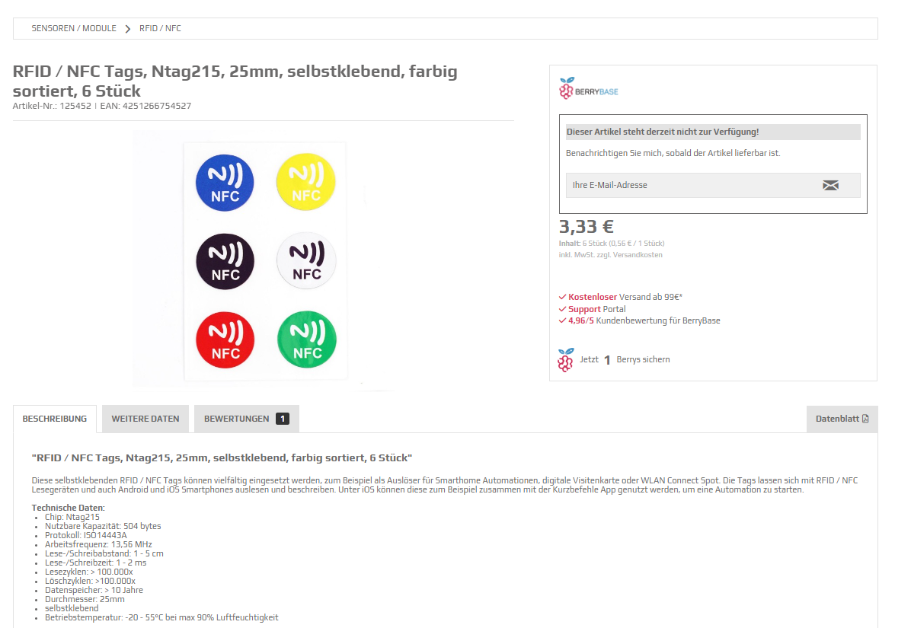

</center>


----

#### NFC (Near Field Communication) Bertriebsmodi

<center>


</center>

###### https://www.st.com/content/st_com/en/support/learning/essentials-and-insights/connectivity/nfc.html, Laden bis 1W

---

#### Relevante Standards für NFC-Tags

<center>

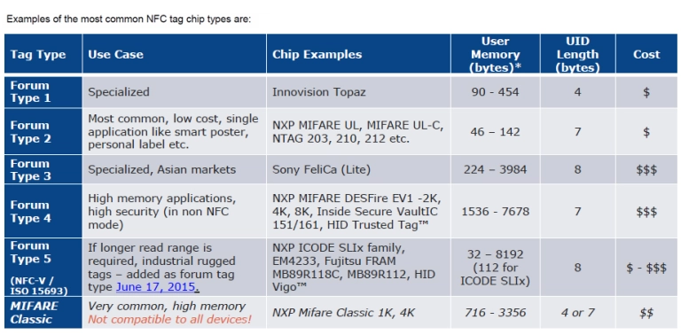

</center>

- NFC Forum Types: Herstellerübergreifende Standardisierung 
- [Mifare](https://de.wikipedia.org/wiki/Mifare): Produkt des Niederländischen Herstellers NXP Semiconductors (10 Milliarden Karten und 150 Millionen Kartenlesegeräte)


###### https://www.shopnfc.com/en/content/6-nfc-tags-specs, https://nfc-forum.org/build/specifications

---

### Datenstruktur

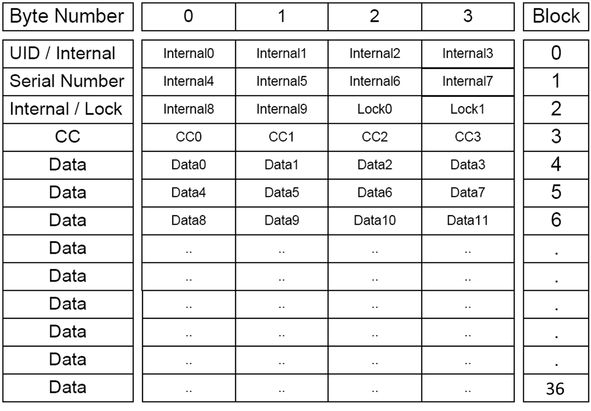

* Anstelle von Register-Adressen werden Blöcke verwendet
* Ein Block ist eine festgelegte Einheit von Speicherplätzen, z. B. 4 Bytes.
* Jeder Block hat eine eindeutige Blocknummer (z. B. Block 0, Block 1, …), die wie eine Adresse funktioniert.
* Einige Blocks sind vorbelegt für bestimmte Funktionen (z. B. Block 0 für die Seriennummer (Unique ID) des Transponders)

###### https://www.amebaiot.com.cn/en/nfc-intro/, Capability Containers (CC) - Metadaten (Type, Length, etc,.)

---

#### Mifare-classic

* Vier Blöcke werden als Sektore zusammengefasst, die unterschiedliche Berechtigungen haben können
* Der letzte Block jedes Sektors (Sektor-Trailer) beschrit die Zugriffsrechte und enthält die Schlüssel

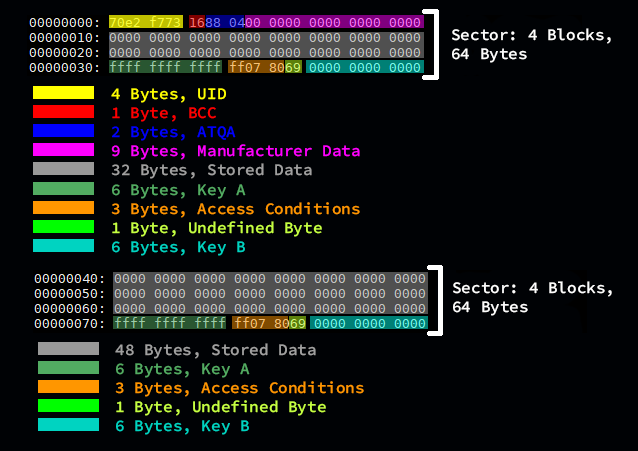

###### https://docs.onion.io/omega2-docs/using-rfid-nfc-expansion.html

---

##### Sicherheitskonzepte

**Key A und Key B**
* Zwei geheime Schlüssel (je 6 Bytes), die zum Schutz der Sektordaten verwendet werden und die nicht lesbar sind.
    * Key A: Wird typischerweise für allgemeine Authentifizierung und Zugriff auf Daten genutzt.
    * Key B: Kann zusätzliche oder erweiterte Berechtigungen definieren (optional).
* Access Conditions
    * Beschreiben die Zugriffsrechte für jeden Block im Sektor.
    * Beispiele:
        * Lesen/Schreiben erlaubt.
        * Nur Lesen erlaubt.
        * Keine Aktion erlaubt (Schreibschutz).
    * Die Zugriffsrechte hängen von der erfolgreichen Authentifizierung mit Key A oder Key B ab.

---

**UID (Unique Identifier)**
* Eine eindeutige Seriennummer, die jede Mifare Classic Karte besitzt.
* Wird oft im Block 0 des ersten Sektors gespeichert.
* Kann 4, 7 oder 10 Bytes lang sein, abhängig von der Kartenversion.

**BCC (Block Check Character)**
* Eine Prüfsumme, die zur Überprüfung der UID verwendet wird.
* Stellt sicher, dass die UID korrekt und unverändert ist.

**ATQA (Answer To Request, Type A)**
* Ein kurzer Antwortcode, den die Karte sendet, wenn sie von einem RFID-Leser angefragt wird.
* Enthält Informationen über den Kartentyp und einige technische Eigenschaften (z. B. Größe des Speichers).

**Manufacturer Data**
* Im Block 0 gespeicherte Daten, die bei der Herstellung der Karte festgelegt werden.
* Beinhaltet Informationen wie den Hersteller und die UID der Karte.

---

#### Weitere Unterscheidungsmerkmale 

* Verschlüsselung zum Auslesen (vgl. VL 6)
* Modulations- und Kodierungsverfahren
* Bulk-Erkennung mehrere Transponder gleichzeitig
* Antikollisions- oder Multi-Zugangsverfahren 

---


## 5.4 Praxis: RFID mit Python

* PN532 NFC RFID Module
* bei direktem Anschluss an I²C keine Pull-Up-Widerstände nötig

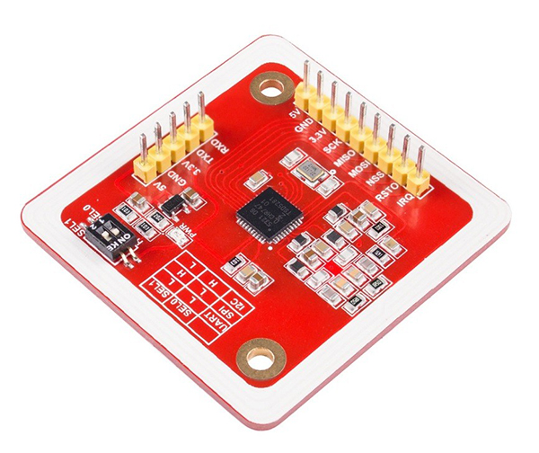
* [Datasheet](https://www.nxp.com/docs/en/nxp/data-sheets/PN532_C1.pdf)
* [Anleitung](http://wiki.sunfounder.cc/index.php?title=PN532_NFC_RFID_Module)
* [PN532 User Manual ](https://www.nxp.com/docs/en/user-guide/141520.pdf)

###### http://wiki.sunfounder.cc/index.php?title=PN532_NFC_RFID_Module

---

### Sicherstellen ob Board funktioniert


- Anschluss an i²C Bus 
- Anschluss an 5V und GND
- Stellen der Dip-Switches auf `10`
* ` i2cdetect -y 1` zeigt die Adresse des Moduls an:  `0x24`


---

### Wechseln auf SPI-Bus

* Stellen Sie die Dip-Switches auf dem Board auf `01`
* [Kabel](https://pinout.xyz/pinout/spi) an  `SPI0`:  `MOSI`, `MISO`, `SCLK`, `CE0` (SS), `5V` und `GND`
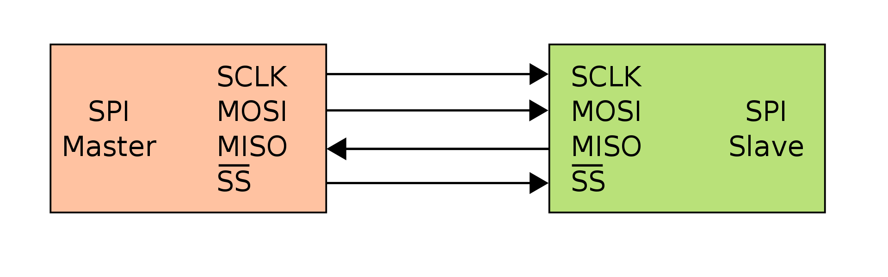
*  enable SPI: `sudo raspi-config` -> `Interfacing Options` -> `SPI` -> `Yes` --> `sudo reboot`


---

### Testen mittels Python

* Am besten starten wir mit einem neuen Python-Projekt auf dem Raspberry Pi
* Um einen besseren Code-Editor zu haben verbinden wir und mit [VS Code](https://code.visualstudio.com/)
* Wir können dann in unserer Virtuellen Umgebung die pn532-Bibliothek via Terminal installieren
    `sudo pip3 install adafruit-circuitpython-pn532`
* Die Library stellt verschiedene [Beispiele](https://github.com/adafruit/Adafruit_CircuitPython_PN532/blob/main/examples/pn532_simpletest.py) bereit
* Zudem sollte aller Code den Sie brauchen in folgenden [Git-Repository](https://github.com/jhumci/pn532_iot_example) zu finden sein, zum clonen des Repository müssen Sie ggf. [git installieren](https://www.geeksforgeeks.org/how-to-install-git-on-raspberry-pi/)
* Funktioniert mit *blauen Tags* und *weißen Karten*
---

#### VS Code Remote Development

- Updaten des RasPi: `sudo apt update && sudo apt upgrade -y`
- Installieren des Remote Development Extension Pack auf dem lokalen Rechner
- Anpassen der `~/.ssh/config` auf dem lokalen Rechner

<center>

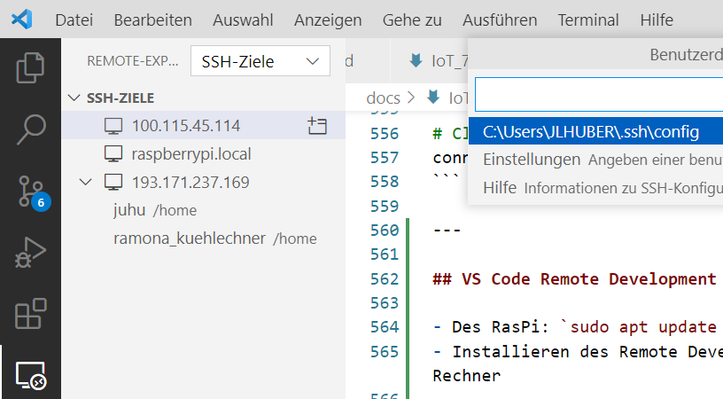

</center>

---

* Inhalt der `~/.ssh/config`

    ```
    Host <ip>
    HostName <ip/hostname>
    User <user>
    PasswordAuthentication yes
    ```
* Verbinden mit dem RasPi über VS Code (Remote-Host in neuem Fenster öffnen)
* ggf. Terminal öffnen, dieses sollte nun mit dem RasPi verbunden sein
* Links in die Ordner-Struktur von VS-Code navigieren und auch hier den Ordner auf dem RasPi öffnen

---

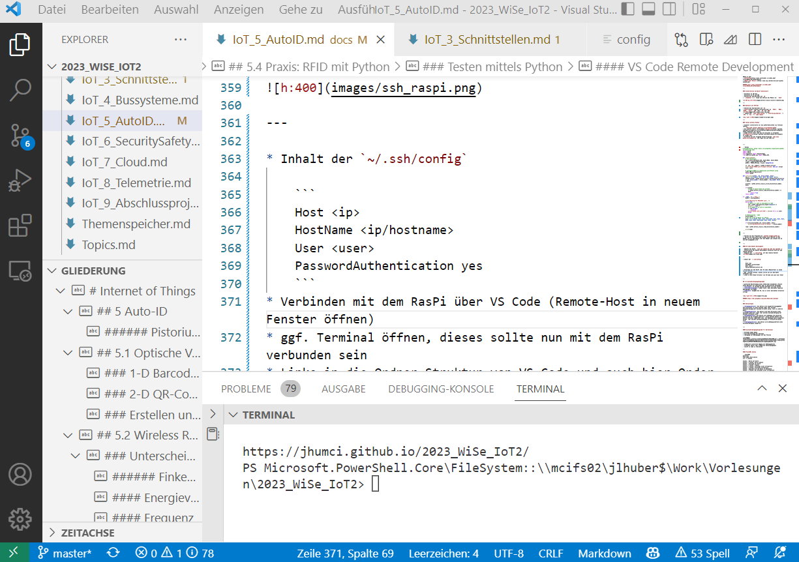

---


#### Auslesen einer Karte

* Erstellen Sie das folgende Python-Programm `sudo nano read_all_blocks.py` und fügen Sie den Code ein


```Python
# SPDX-FileCopyrightText: 2021 ladyada for Adafruit Industries
# SPDX-License-Identifier: MIT
# Documentation: https://docs.circuitpython.org/projects/pn532/en/latest/api.html

"""
This example shows connecting to the PN532 with I2C (requires clock
stretching support), SPI, or UART. SPI is best, it uses the most pins but
is the most reliable and universally supported.
After initialization, try waving various 13.56MHz RFID cards over it!
"""

import board
import busio
from digitalio import DigitalInOut
from adafruit_pn532.spi import PN532_SPI

def config_pn532():
    # SPI connection:
    spi = busio.SPI(board.SCK, board.MOSI, board.MISO)
    cs_pin = DigitalInOut(board.D8)
    pn532 = PN532_SPI(spi, cs_pin, debug=False)

    ic, ver, rev, support = pn532.firmware_version
    print("Found PN532 with firmware version: {0}.{1}".format(ver, rev))

    # Configure PN532 to communicate with MiFare cards
    pn532.SAM_configuration()
    return pn532

def read_block(pn532, uid, block_number):
    key_a = bytes([0xFF, 0xFF, 0xFF, 0xFF,0xFF, 0xFF])
    authenticated = pn532.mifare_classic_authenticate_block(uid = uid, block_number = block_number , key_number =0x60, key = key_a)
    
    # Read to ensure data was written
    block_data = pn532.mifare_classic_read_block(block_number)
    
    return block_data

if __name__ == "__main__":
    pn532 = config_pn532()

    print("Waiting for RFID/NFC card...")
    while True:
        # Check if a card is available to read
        uid = pn532.read_passive_target(timeout=0.5)
        print(".", end="")
        # Try again if no card is available.
        if uid is None:
            continue
        print("Found card with UID:", [hex(i) for i in uid])
        break

    for block_number in range(0,4):
        block_data = read_block(pn532, uid, block_number)
        hex_values = 'x'.join([f'{byte:02x}' for byte in block_data])
        print(F"Data in Block {block_number} is:")
        print(hex_values)
        print("\n")
```

---

##### Output

```
Found PN532 with firmware version: 1.6
Waiting for RFID/NFC card...
.Found card with UID: ['0xd4', '0x55', '0xc1', '0x29']
Data in Block 0 is:
d4x55xc1x29x69x08x04x00x62x63x64x65x66x67x68x69


Data in Block 1 is:
00x00x00x00x00x00x00x00x00x00x00x00x00x00x00x00


Data in Block 2 is:
00x01x02x03x00x01x02x03x00x01x02x03x00x01x02x03


Data in Block 3 is:
00x00x00x00x00x00xffx07x80x69xffxffxffxffxffxff
```

---


[Repository mit Default Keys](
https://github.com/XaviTorello/mifare-classic-toolkit/blob/master/README.md)

---

```
  00   00   00   00   00   00   ff   07   80   69   ff   ff   ff   ff   ff   ff
+-----------------------------+--------------+----+-----------------------------+
|  0 |  1 |  2 |  3 |  4 |  5 |  6 |  7 |  8 |  9 | 10 | 11 | 12 | 13 | 14 | 15 |
+-----------------------------+--------------+----+-----------------------------+
|            Key A            | Access Cond  |    |            Key B            |
|          (6 bytes)          |  (3 bytes)   |    |          (6 bytes)          |
+-----------------------------+--------------+----+-----------------------------+
```

* Key A: Üblicherweise Lesen - mandatory 
* Key B: Üblicherweise Schreiben - optional
* Erklärung: für [MIFARE CLASSIC 1K/4K](https://shop.sonmicro.com/Downloads/MIFARECLASSIC-UM.pdf)
* Byte 9 für User
* Access Bits bei Auslieferung: `0xFF0780`
* Für die Verschlüsselung werden auch die Sektor-Blöcke selbst mit den Keys nicht-lesbar gemacht

---

* Wir behelfen uns, indem wir ohne die Sektoren-Beschreibung zu ändern in den Block 2 schreiben
* Erstellen Sie das folgende Python-Programm `sudo nano pn532_iot_example.py` und fügen Sie den Code ein


```Python
# Documentation: https://docs.circuitpython.org/projects/pn532/en/latest/api.html
import board
import busio
from digitalio import DigitalInOut
from adafruit_pn532.spi import PN532_SPI

def config_pn532():
    # SPI connection:
    spi = busio.SPI(board.SCK, board.MOSI, board.MISO)
    cs_pin = DigitalInOut(board.D8)
    pn532 = PN532_SPI(spi, cs_pin, debug=False)

    ic, ver, rev, support = pn532.firmware_version
    print("Found PN532 with firmware version: {0}.{1}".format(ver, rev))

    # Configure PN532 to communicate with MiFare cards
    pn532.SAM_configuration()
    return pn532

def write_block(pn532, uid, block_number, data):
    key_a = bytes([0xFF, 0xFF, 0xFF, 0xFF,0xFF, 0xFF])
    authenticated = pn532.mifare_classic_authenticate_block(uid = uid, block_number = block_number , key_number =0x60, key = key_a)

    written = pn532.mifare_classic_write_block(block_number, data)

    if written:
        # Read to ensure data was written
        if pn532.mifare_classic_read_block(block_number) == data:
            return True
    return False
```

---

```Python
if __name__ == "__main__":
    pn532 = config_pn532()

    print("Waiting for RFID/NFC card...")
    while True:
        # Check if a card is available to read
        uid = pn532.read_passive_target(timeout=0.5)
        print(".", end="")
        # Try again if no card is available.
        if uid is None:
            continue
        print("Found card with UID:", [hex(i) for i in uid])
        break

    # Communication - Code
    block_number = 2
    # You can write 16 Bytes in a Block
    data = bytes([0x00, 0x01, 0x02, 0x03,0x00, 0x01, 0x02, 0x03,0x00, 0x01, 0x02, 0x03,0x00, 0x01, 0x02, 0x03])

    if write_block(pn532,uid, block_number, data):
        print("Successfully wrote in block: ", block_number)

    read = pn532.mifare_classic_read_block(block_number)

    print(read)
```

---

* Starten Sie das Programm mit `python3 example_pn532.py`
*  Halten Sie eine Karte oder Blauen Chip (Mifare) an den Reader und ihr Smartphone über den Reader und schauen Sie ob die UID ausgegeben wird
* Nun, da wir sinnvolle Code-Bausteine haben, können wir eine Anwendung implementieren


---

## 5.5 Zustandsübergangsdiagramme

* grafische Beschreibung eines *Endlichen Automaten* (Finite State Machine) mit endlicher Zahl an definierten Zuständen
* **Zustand**: In welchem Zustand befindet sich das System
* **Zustandsübergang**: findet statt, wenn bestimmte logische Bedingungen vorliegen
* **Aktion**: Ausgabe des EA, die in einer bestimmten Situation erfolgt


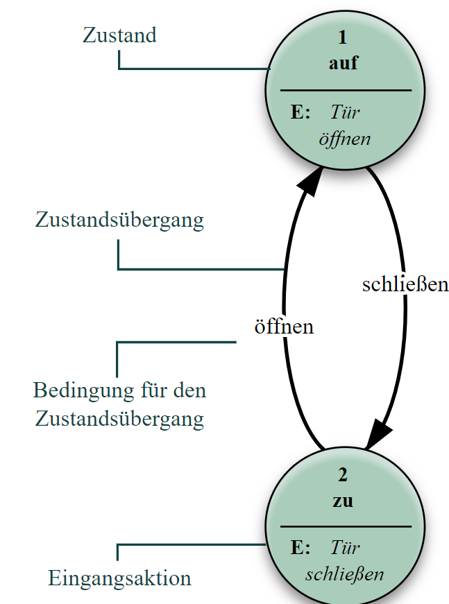

###### https://de.wikipedia.org/wiki/Endlicher_Automat

---

### Aktionstypen

* **Eingangsaktion**: Die Aktion wird ausgeführt/ausgegeben beim Eintreten in einen Zustand (egal über welchen Zustandsübergang der Zustand erreicht wurde, falls es mehrere gibt).
* **Ausgangsaktion**: Die Aktion wird beim Verlassen eines Zustandes generiert (egal über welchen Zustandsübergang der Zustand verlassen wird).
* **Eingabeaktion**: Die Aktion wird abhängig vom aktuellen Zustand und der Eingabe generiert. Einem Zustand können also mehrere Aktionen zugeordnet sein, die abhängig davon ausgeführt werden, über welchen Zustandsübergang er erreicht/verlassen wird.
* **Übergangsaktion**: Die Aktion wird abhängig/während eines Zustandsübergangs ausgeführt


---

#### Zustandsübergangsdiagramm für Kartenleser

* Zustände haben Namen (z.B.: `State 1`)
* eine Beschreibung der Aktionen
* Übergänge mit Bedingungen auf den Pfeilen

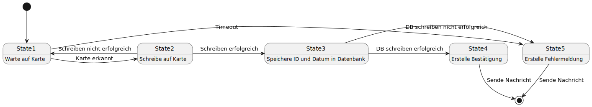

- ermöglicht sinnvollen Umgang mit Abhängigkeiten
- vermeidet Fehler oder ermöglicht Fehlermanagement
- leicht in Code zu übersetzen

---


#### PlantUML Syntax

```plantUML
@startuml
hide empty description
[*] --> State1

State1 : Warte auf Karte
State1 -> State2: Karte erkannt
State2 : Schreibe auf Karte
State1 -> State5: Timeout
State1 <- State2: Schreiben nicht erfolgreich
State2 -> State3: Schreiben erfolgreich
State3 : Speichere ID und Datum in Datenbank
State3 -> State5: DB schreiben nicht erfolgreich
State3 -> State4: DB schreiben erfolgreich
State4: Erstelle Bestätigung
State5: Erstelle Fehlermeldung
State4 --> [*]: Sende Nachricht
State5 --> [*]: Sende Nachricht
@enduml
```


###### //www.plantuml.com/plantuml/png/TP71QiCm44Jl_eez5toecrnCAI6uXLBe9OKUIW-AFR55fBMHLuV-J_-aFrOvSemmvEHTtinunEv6KKwyDLcd6n3i83_KOAoT7aJtd7tTVLEUFz51bE0-o-ANIleCFf3o9tgRfeLSjKKP0S6T5RD4NWJdeUuSz34rhxpRaZwqHUzbYNtCbzYhdubrtGd1dNhJEeHbbXTBqaCgJuMHKi33jCE1NYlot52bn5lIF0tWe-BpB4xhLNiQRzTO6pOhmwfnL3oxKM0CQ8zH_dv5jvxRRERRXB-WCt0Mfaa4cykLmhN2Yy0Dw5s5tqt5ve3RV1TsRyq_


---

#### Beispiel-Implementierung in Python

```Python
import logging

# Initialize logger
logging.basicConfig(level=logging.DEBUG)

class StateMachine:
    def __init__(self):
        self.current_state = 'State0'
        self.states = {
            'State0': State0(self),
            'State1': State1(self),
            'State2': State2(self),
            'State3': State3(self),
            'State4': State4(self),
            'State5': State5(self)
        }

    def run(self):
        while self.current_state not in ['State5']:
            state = self.states[self.current_state]
            state.run()  # Run the current state

class State:
    def __init__(self, machine):
        self.machine = machine

    def run(self):
        raise NotImplementedError("State must implement 'run' method.")

class State0(State):
    def run(self):
        logging.info("Initializing RFID reader...")
        
        # Simulate RFID reader initialization (replace with actual initialization code)
        init_successful = True  # Simulate success
        
        if init_successful:
            logging.info("RFID reader initialized successfully.")
            self.machine.current_state = 'State1'  # Transition to State1
        else:
            logging.error("Failed to initialize RFID reader.")
            self.machine.current_state = 'State5'  # Transition to State5
```


---


## 🏆 P5.1: Smarte Abfüllanlage


- Im bisherigen System welchen Flaschen abschnittsweise mit dem gleichen Rezept befüllt
- zudem sind Flaschen nicht individuell nachverfolgbar
- um kurzfristiger auf Anpassungen in Bedarf reagieren zu können führen wir in der Folge in Auto-ID-System ein

---

- Folgendes [Git-Repository](https://github.com/jhumci/pn532_iot_example) stellt Ihnen die wichtigsten Komponenten zur Verfügung
- Ihre Aufgabe ist es die Abfüllanlage zu erweitern. Die Dispenser sollen nun dynamisch das einzigartige Rezept für jede Flasche abfüllen.
- Sie Implementieren dazu zwei Stationen im Produktionsprozess:         

---

### Station 1: Flaschen ID schreiben

- Flasche mit `Flaschen_ID` beschreiben (RFID-Tag) bevor die Flasche in die Abfüllstation kommt
- Wählen Sie hierzu das erste Byte im zweiten Block aus, um die `Flaschen_ID` zu speichern
- Hierbei soll die erste Flasche in der Datenbank Tabelle `Flasche` gewählt werden, welche noch einne `0` in `Tagged_Date` hat
- Nach dem Schreiben der ID soll die Flaschen-ID in der Datenbank getagged werden (indem `Tagged_Date` mit dem aktuellen Unix-Time-Stamp befüllt wird.)

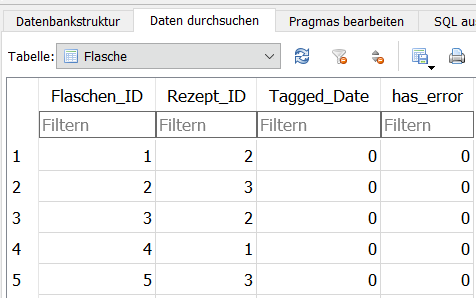

---

### Station 2: Abfüllen

- Die Station dient dazu die Rezepte zu einer Flasche abrufen bevor die Flasche an einem Dispenser ankommt
- Die Flaschen und Rezepte für die Flaschen liegen in der bereitgestellten Datenbank unter der Tabelle `Rezept_besteht_aus_Granulat`
- Geben Sie die `Flaschen_ID` und die Menge der relevanten Granulate als Sinnvolle Meldung in der Kommandozeile aus

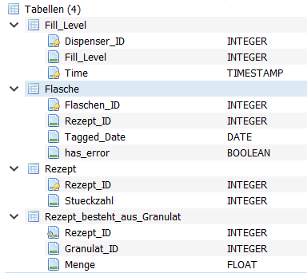

---


#### Abgabe

- Geben Sie einen Link zu einem Öffentlichen **Git-Repository** ab, in dem Sie die beiden Stationen implementiert haben
- 5pt: Station 1: Schreiben Sie ein Python-Modul `station1.py`, das den RFID-Tag der Flaschen-ID mit der ersten noch nicht vergebenen Flaschen-ID beschreibt. Geben Sie ein Log-File `station1.log` ab, das das Starten der Station und das Schreiben der Flaschen-ID dokumentiert (im erfolgreichen und nicht erfolgreichen Fall)
- 5pt: Station 2: Schreiben Sie ein Python-Modul `station2.py`, das anhand der RFID-Tags der Flaschen-ID die richtige Menge ermittelt. Geben Sie ein Log-File `station2.log` ab, das for Füllmengen für zwei verschiedene Flaschen dokumentiert
- 2pt: Zeichnen Sie ein Zustandsübergangsdiagramm für beide Stationen, für ein funktionierendes Fehlermanagement und fügen Sie dieses in die `README.md` des Repositories ein
- 2pt: Bauen sie die beiden Module in je ein eine sinnvolle State-Machine für ein Fehlermanagement ein, damit z.B. wenn der RFID Tag zu früh entfernt wird

--- 


**Hinweis**:
- Es ist einfacher erst kleine Test-Programme zu Interaktion mit der Datenbank und den RFID-Reader zu schreiben, bevor Sie die Module in die State-Machine einbauen
- Warten Sie hiervor ggf. die Vorlesung in Software Engineering ab

---

#### Abgabe Bonus (2pt)


- 2pt: Für alle korrekt abgefüllten Flaschen wird ein QR-Code erstellt, welche die ID und den Rezept-Nummer und das Datum enthält


---

## SQLite mit Python

### Aufrufen einer Tabellenstruktur

```Python
import sqlite3
from datetime import datetime, timedelta


# Connect to the SQLite database
conn = sqlite3.connect("flaschen_database.db")
cursor = conn.cursor()

data = cursor.execute('''
    SELECT * from Flasche;
    
''')

fetch_result = cursor.fetchall()

# Returns as list of tuples with fid, rid, data, error
for fid_rid_data_error in fetch_result:
    print(f" Flasche: {fid_rid_data_error[0]}, Rezept : {fid_rid_data_error[1]}, Datum: {fid_rid_data_error[2]}, Fehler : {fid_rid_data_error[3]}")
```

---

### Ändern eines bestehenden Eintrags
```Python
import sqlite3

# Connect to the SQLite database
conn = sqlite3.connect("flaschen_database.db")
cursor = conn.cursor()

# Function to update has_error value for a specific Flaschen_ID
def update_has_error(flaschen_id, has_error):
    try:
        cursor.execute("UPDATE Flasche SET has_error = ? WHERE Flaschen_ID = ?", (has_error, flaschen_id))
        conn.commit()
        print(f"Updated has_error for Flaschen_ID {flaschen_id} to {has_error}.")
    except Exception as e:
        conn.rollback()
        print(f"Error occurred while updating has_error for Flaschen_ID {flaschen_id}: {e}")

# Example usage: Update has_error for Flaschen_ID 1 to True
update_has_error(1, True)

# Close the connection
conn.close()
```


---


## 5.3 Indoor Positioning Systems


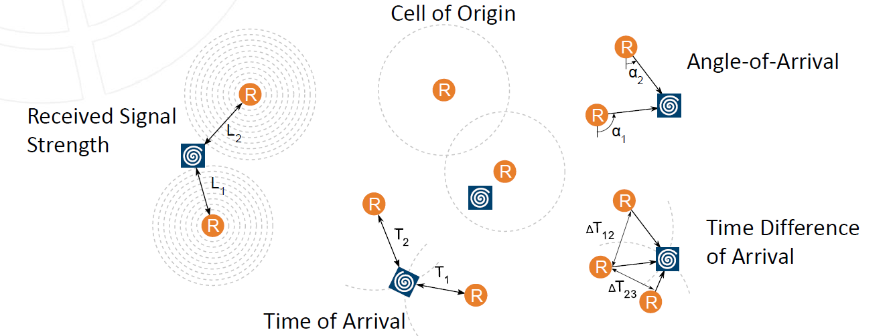

###### Quelle: [Finkenzeller.2015]


---

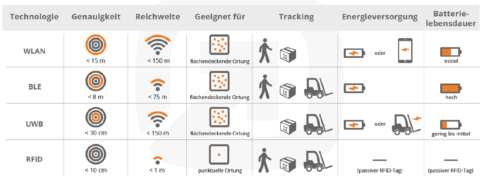


---

### Beispiel: Basierend auf Received Signal Strength Indication


###### https://www.hackster.io/news/indoor-positioning-using-arduino-and-machine-learning-in-4-easy-steps-295d39e5e7c9
