<!-- paginate: true -->

# Internet of Things


Dr. Julian Huber


---

## 6 Security & Safety

> The S in IoT Stands for Security

---

## 6.1 Ziele der IT-Sicherheit

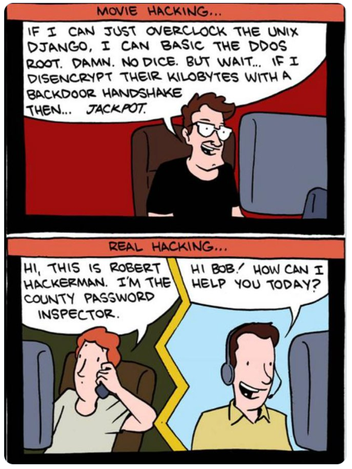

---

### 🎯 Lernziele

Nach dieser Einheit sind Sie in der Lage dazu
* interne und externe Bedrohungen für die IT-Sicherheit zu benennen
* die vier Basisziele von IT-Sicherheit zu benennen, beschreiben und sinnvolle Beispiele für organisatorische oder technische Maßnahmen zu deren Erreichung zu beschreiben


---

### 🧠 Wichtigkeit von IT-Sicherheit und Datenschutz

* Datenschutz ist kein Selbstzweck
* Daten beeinflussen Modell der Welt, die wiederum Entscheidungen beeinflussen
    * Zahlen auf Rechnung
    * Kreditvergabe
    * [Social Scoring Systems](https://www.bertelsmann-stiftung.de/fileadmin/files/aam/Asia-Book_A_03_China_Social_Credit_System.pdf)

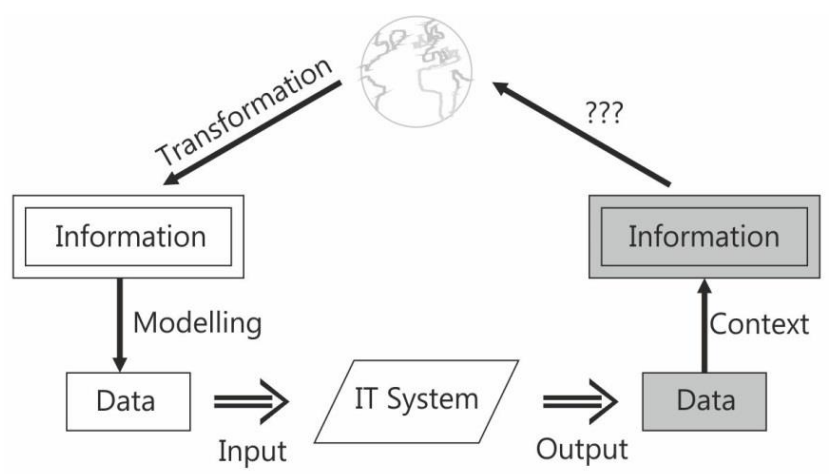


###### http://www.bc-witt.de/download/VL2022-1a.pdf


---

### Informationstechnische Bedrohungen

* **zufällige Ereignisse** 
(z.B. höhere Gewalt, [Bit-Flip](https://radiolab.org/episodes/bit-flip))
* **unabsichtliche Fehler** 
(z.B. Übertragungs- oder Bedienungsfehler)
* **passive Angriffe** ohne Änderung am laufenden IT-System (z.B. Abhören oder Mitlesen) und 
* **aktive Angriffe** mit Änderungen an Daten oder am Zustand des IT-Systems (z.B. Datenverfälschung)


###### Witt

---

### 🧠  Security and Safety

* **Safety**: Der Schutz vor internen, zufälligen und unbeabsichtigten Ereignissen wird 
    * Verfügbarkeit
    * Zuverlässigkeit
    * Fehlertoleranz
    * Korrektheit
* **Security**: Schutz vor externen, beabsichtigten Angriffen
    * passive Angriffen (z.B. Abhören)
    * aktive Angriffen (z.B. Manipulation)


---

#### Safety: Beispiel Verfügbarkeit bei Sensoren


---

### 🧠  Mehrseitigkeit

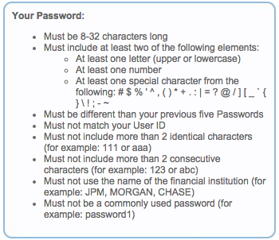 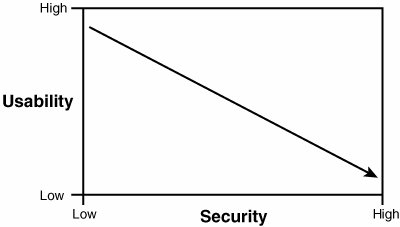 

###### https://www.reddit.com/r/webdev/comments/3qdx1u/password_requirements_dont_do_this/


---

### Sicherheitsziele

* Confidentiality (Vertraulichkeit)
* Integrity (Integrität)	
* Availability (Verfügbarkeit)
* Authenticity (Authentizität)

---


#### 🧠  Vertraulichkeit

- **geheime** Information soll für unberechtigte Dritte **unzugänglich** sein
* Technisch: 
    * z.B. **Verschlüsseln** einer Email, Whatsapp-Nachricht
* Organisatorisch: 
    * z.B. Zugang zur Datenbank nur für bestimmten **Personenkreis**
* Bedrohung: Datendiebstahl
    * Passwortdatenbanken
    * Industriespionage
    * Whistleblower


###### https://www.security-insider.de/fuenf-tipps-fuer-das-perfekte-passwort-a-1111114/

---

#### 🧠  Daten-Integrität

* die **Unverändertheit** von Daten ("Originalzustand") ist **nachweisbar**
* Kein nachträgliches Einfügen, Verändern oder Löschen von Zeichen
* Technisch: 
    * z.B. **Übertragungsfehler** eines IP-Pakets
* Organisatorisch: 
    * z.B. **Wahlbetrug**
* Lösung:
    * **Prüfsummen und Hashfunktionen** (später mehr)

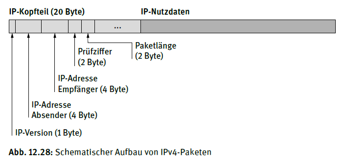

---

#### 🧠 Authentifikation

* nachweisliche **Identifikation** eines Benutzers oder eines Kommunikationspartners

* Technisch: 
    * z.B. **Passwort**, Fingerabdruck
* Organisatorisch: 
    * z.B. **PostIdent, A-Trust**
* Bedrohung: Datendiebstahl
    * **Identitätsdiebstahl**

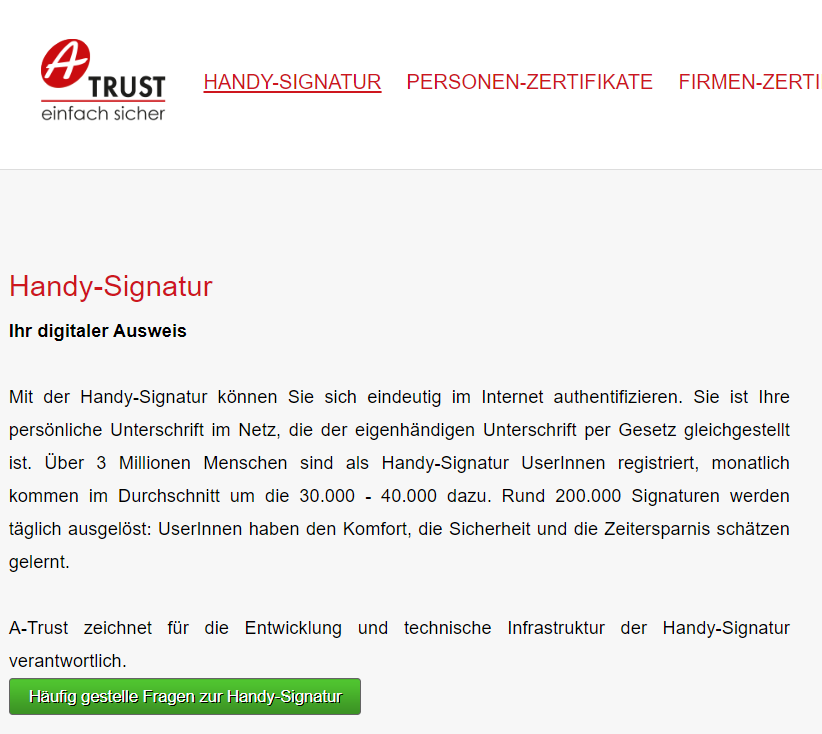

###### https://www.a-trust.at/de/handy-signatur/?t


---

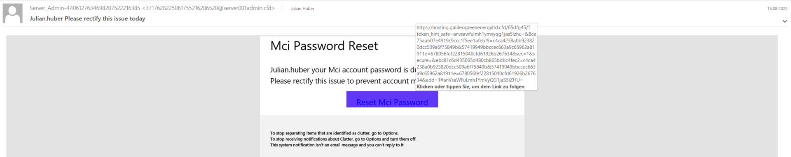


---

#####  Phishing

- Kunstwort aus *password* und *fishing* bezieht.
- Nutzer:in wird z.B. mit Emails aus gefälschte Webseiten gelockt
* [Fake Emails](http://deadfake.com/)
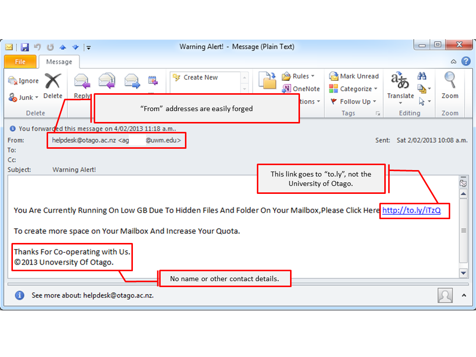

---

####  Verfügbarkeit 

- Dienste sollen stets zur Verfügung stehen
.png)

* Technisch: 
    * Benachrichtigung über Ausfall
    * z.B. Redundanz von Hardware

* Risiken
    * *schlechte* Software
    * Denial-of-Service-Angriffe (DOS)

---

##### Denial-of-Service-Angriffe 


- der angegriffene Rechner von dem Angreifer mit einer großen Anzahl von Anfragen **überflutet**
* Typischerweise werden DoS-Angriffe über ein **Botnetz** durchgeführt
* Rechnern sind mittels Schadprogrammen unter die Kontrolle eines Angreifers und führen Aufgaben für diesen durch

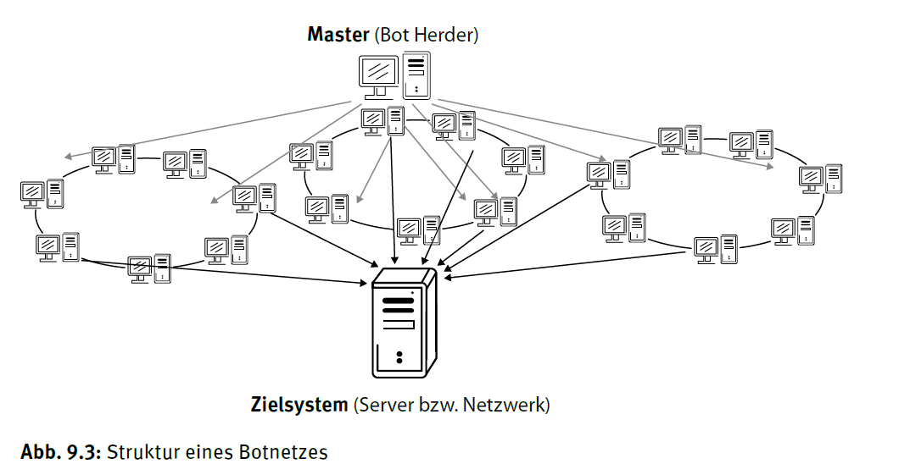

---


- z.B. **Mirai** (2016) vor allem aus Geräten in privaten Haushalten: WLAN-Zugangspunkte, Internet-Router, IP-Kameras und Smart-TVs.
* Twitter, Netflix, PayPal und Spotify in den US für einen Tag außer Kraft gesetzt.
* Problem: **Standardpasswort** der Geräte wurde nie verändert

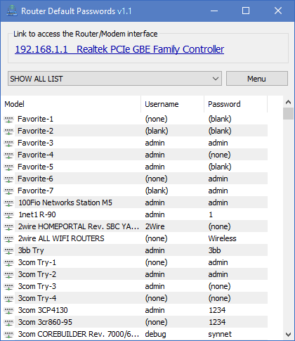


---
 

```Python
# How to DoS
import requests # http request

url = "https://mci.edu" # place URL here

while True: # Für immer

    request = requests.get(url) # HTTP request
```

---


## 6.2 Kryptografische Hash-Funktionen

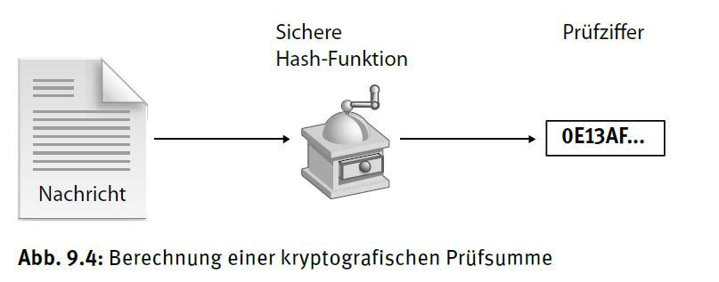


---


### 🎯 Lernziele

Nach dieser Einheit sind Sie in der Lage dazu

* die Eigenschaften von Prüfsummen und Hash-Funktionen zu beschreiben
* Funktionen auf ihre Eignung als Prüfsumme zu bewerten
* die Sicherheit von Passwörtern gegenüber verschiedenen Angriffen zu bewerten

---

### 🧠  Datenintegrität durch Prüfsummen


* **Ziel:** Ist die Nachricht unverändert?
* Wie stellen wir sicher, dass die Nachricht (IP-Nutzdaten) vollständig ist, ohne sie zweimal zu verschicken?

---

#### Lösung: Even-Bit

* Nachricht: ```1011 101```
* Prüfsumme: z.B. Alle Nachrichten werden mit dem letzten Bit auf eine gerade Zahl von `1` aufgefüllt 
* ```1011 101 1```
* Einfach, aber nur hilfreich bei kurzen Nachrichten
* und einfach-Fehlern
* Alternativen wie Blocksicherung und [Hamming Code](https://de.wikipedia.org/wiki/Hamming-Code)

---

#### Lösung: Hash-Funktionen


- Hash-Funktionen generieren aus beliebig vielen Daten einen wesentlich **kürzeren** (128 bis 512 Bit) und **eindeutigen Wert** (Hash-Wert, Prüfsumme)
* kryptografische Hash-Funktionen sind **nicht umkehrbar**, das heißt, der erzeugte Hash-Wert lässt keine Rückschlüsse auf die ursprünglichen Daten zu
* Anwendungen (u.a.)
    * Speichern von Passwörtern (Vertraulichkeit)
    * Identifikation von Software (Authentizität)

---

##### Moderne Hash-Funktionen

* Ziel: Möglichst unterschiedliche Ergebnisse und gleichzeitig wenig Information!
* z.B. SHA-2/3 (secure hash algorithm) oder MD5
* Bilden Hash-Werte mit definierter Länge
* Auch kleine Änderungen im Input haben große Auswirkungen

```Python
SHA224("Franz jagt im komplett verwahrlosten Taxi quer durch Bayern") =
49b08defa65e644cbf8a2dd9270bdededabc741997d1dadd42026d7b

SHA224("Frank jagt im komplett verwahrlosten Taxi quer durch Bayern") =
58911e7fccf2971a7d07f93162d8bd13568e71aa8fc86fc1fe9043d1
```


---

### Authentifikation durch Kenntnis eines Geheimnisses

- Ziel: Ist die Nutzer:in wirklich sie selbst?
* Beispiele:
    * Login mit Nutzername und **Passwort**
    * Einmalkennwort: **TAN-Listen** (Transaktionsnummern)
    * Besitz eines bestimmten Gegenstands: **Chipkarte**
    * Körperliche Merkmale: Retina oder **Fingerabdruck**-Scan

---

* **Fingerabdruckscanner** (kapazitiv, optisch, ultraschall)
* **Multifaktorauthentifizierung**
    * Chipkate + Pin
    * Login mit Nutzername und **Passwort** + Bestätigung am Smart Phone mit Einmalkennwort


---

#### 🧠  Speicherung von Passwörtern

* Passwörter werden vom Nutzer eingegeben, aber nicht (wie hier dargestellt) im Klartext in der Datenbank (z.B. der Website) gespeichert.
* Stattdessen werden die Passwörter durch eine Hash-Funktion "gejagt" und der so erzeugte Hash-Wert abgelegt
* Die Hash-Funktion erzeugt **reproduzierbar** aus einem *Schlüssel* den gleichen *Hash*. Aus dem *Hash* kann jedoch nicht auf den Schlüssel rückgeschlossen werden.

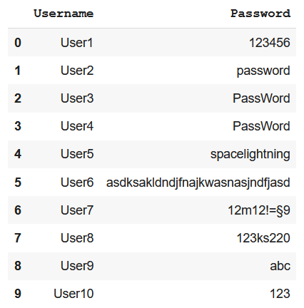

---


---

```Python
import hashlib
print("Hash für 'password' ist: " + hashlib.md5(b'password').hexdigest())
print("Hash für 'Password' ist: " +hashlib.md5(b'Password').hexdigest())

# Hash für 'password' ist: 5f4dcc3b5aa765d61d8327deb882cf99
# Hash für 'Password' ist: dc647eb65e6711e155375218212b3964
```

Es werden also nur die Hash-Werte der Passwörter werden gespeichert. Hier am Beispiel mit dem [MD5-Hash-Algorithmus](https://de.wikipedia.org/wiki/Message-Digest_Algorithm_5).

Allerdings werden solche Datensets häufig vom Hackern erbeutet.

[Notebook Datensicherheit- und Datenschutz](https://github.com/jhumci/SBT_GID/blob/main/SBT_7_Verschluesselung.ipynb)

---


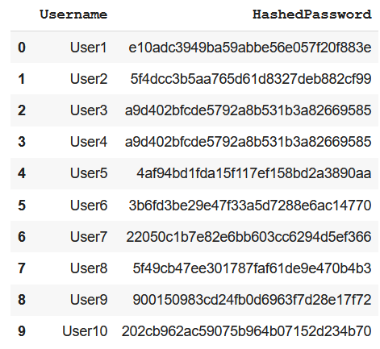

- Sie können einfach herausfinden, ob eines ihrer Passwörter von Hackern erbeutet wurde indem Sie auf der folgenden [haveibeenpwned.com](https://haveibeenpwned.com/) ihre Email-Adresse eingeben.

---

##### Aufgabe

* Überprüfen Sie ob Daten Ihrer Accounts gestohlen wurden
* Hausaufgabe: Falls Sie betroffen sind, ändern Sie das Passwort bei dem Dienst und allen anderen Diensten bei denen Sie das selbe Passwort  genutzt haben.

⌛ 2 Minuten

---


- Angreifer können sich auch mit diesen Hashes Zugriff auf Ihr Konto verschaffen, sofern Sie kein starkes Passwort haben

- Weg 1: **Brute Force**
    - Die simpelste Art ein Passwort zu knacken ist der Brute Force Ansatz. Dabei werden einfach alle möglichen Zeichenkombinationen durchprobiert und dann durch bekannte Hashfunktionen gejagt, und nach Übereinstimmungen gesucht.
    * Dies Vorgehen kommt mit zunehmender Passwortlänge und verschiedenen Zeichen schnell an seine Grenzen.

---

🧠 

* Weg 2: **Wörterbuchangriff**
    * Anstelle einem zufällig erzeugten Vektor $combinations$ werden bekannte Passwörter (z.B. aus den oben genannten Leaks) und darauf basierende Kombinationen getestet.
    * Hiermit sind auch typische Ideen wie p4ssword, password123 etc leicht angreifbar.

---


Beispiele auf dem [RockYou](https://github.com/brannondorsey/naive-hashcat/releases/download/data/rockyou.txt)-Datenset:


```
123456
12345
123456789
password
iloveyou
princess
1234567
[...]
```

---


---

##### Praktische Implikationen zum Speicherung von Passwörtern


- Nie Passwörter mehrfach verwenden!
- Stattdessen einen Passwortmanager nutzen
- Dieser muss mit einem starken Master-Passwort geschützt werden

---


- **Was ist ein gutes Master-Passwort**
    * Kann das Password zufällig geknackt werden?
        * Unwahrscheinlich: $26^{25} = 2.3677383e^{35}$

    * Was passiert hier bei einem Wörterbuchangriff?
        * Angenommen es ist bekannt, das ein Passwort aus vier Worten besteht und das Wörterbuch die 10.000 häufigsten Worten besteht
        * $10000^4 = 1e^{16}$

    * Wie kann das Passwort weiter verstärkt werden
        * Verwendung seltener Worte (Dialekt)
        * Ergänze um Sonderzeichen **in** den Wo_rt*en!


---


## 6.3 Vertraulichkeit durch Verschlüsselung

* Authentifikation sorgt dafür, dass nur berechtigte Personen definierte Aktionen durchführen dürfen
* Verschlüsselung sorgt dafür, dass nur berechtigte Personen Information aus den Daten ableiten können

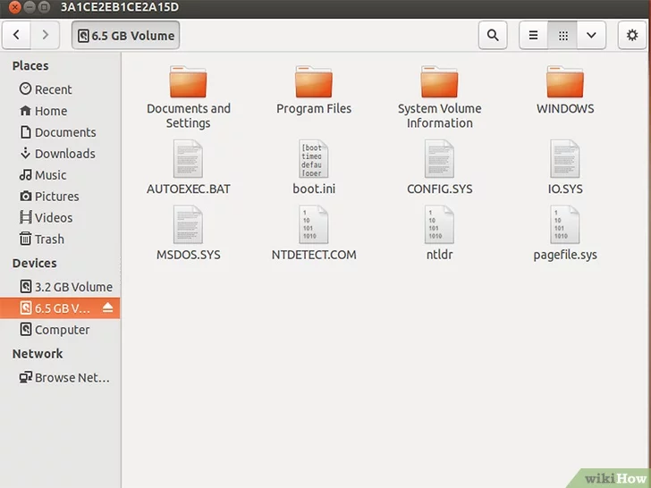

---

### 🧠 Verschlüsselung als Verfahren zur Vertraulichkeit

- eine im **Klartext** (plaintext) vorliegende Information nach einer bestimmten Methode und unter der Einbeziehung eines Schlüssels in eine scheinbar sinnlose Zeichenfolge umgewandelt
* Die resultierende Zeichenfolge (**Chiffre** /chiphertext) kann durch Anwendung des richtigen Schlüssels wiederum in den Klartext zurückverwandelt werden

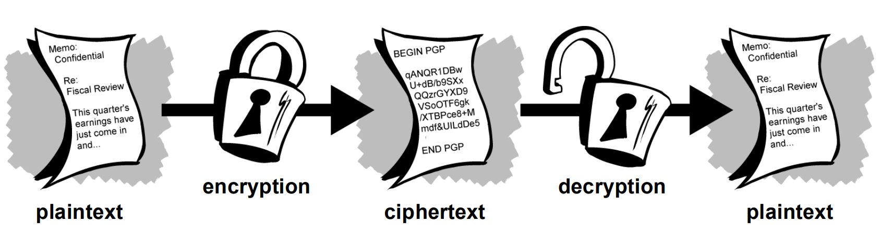

###### https://courses.cs.vt.edu/cs5204/fall09-kafura/Papers/Security/IntroToCryptography.pdf

---

### 🧠 Symmetrische Verschlüsselung

* Es gibt einen gemeinsamen **key**
* dieser ver- und entschlüsselt die Nachricht
* Dieser muss vorab auf einem sicheren Weg geteilt werden 

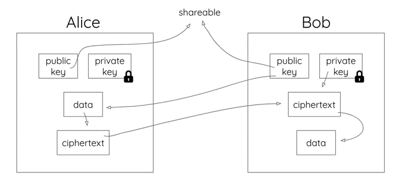

---

#### Beispiel Caesar-Chiffre


- Data: ```dies ist ein Text```
- Schlüssel: Verschiebungsfaktor ```3```
- Ciphertext: ```GLHV LVW HLQ WHAQ```

1) 

[Notebook Datensicherheit- und Datenschutz](https://github.com/jhumci/SBT_GID/blob/main/SBT_7_Verschluesselung.ipynb)

---


### 🧠 Asymmetrische Verschlüsselung

* Jeder Nutzer:in hat ein Schlüssel**paar**
* Eine Nachricht, die mit einem der beiden Schlüssel verschlüsselt wurde, kann **nur mit dem jeweils anderen** Schlüssel wiederum entschlüsselt werden


---

#### Ablauf

* Alice gibt Bob vorab ihren **public key**
* Bob verschlüsselt die Nachricht an Alice mit Ihrem **public key**
* Da nur Alice ihren **private key** hat, kann nur Sie die Nachricht entschlüsseln


---

#### Erzeugung von Schlüsselpaaren am Beispiel Rivest–Shamir–Adleman

* Die Asymmetrische Verschlüsselung basiert auf ähnlichen Prinzipien, wie wie Hash-Funktion (Einwegfunktion)
* Ist der **private key** bekannt, kann die mit dem **public key** verschlüsselte Nachricht leicht entziffert werden
* Es gibt verschiedene Algorithmen solche Schlüsselpaare zu erzeugen.


---

Bei der Chiffrierung wird die Nachricht als Zahl $m$ (`int`) mit dem öffentlichen Schlüssel $(e,n)$ zum Geheimtext $c$ verschlüsselt:

$c = m^e \mod n$

Zur Entschlüsselung benötigt man den privaten Schlüssel $(d,n)$:

$m = c^d \mod n$


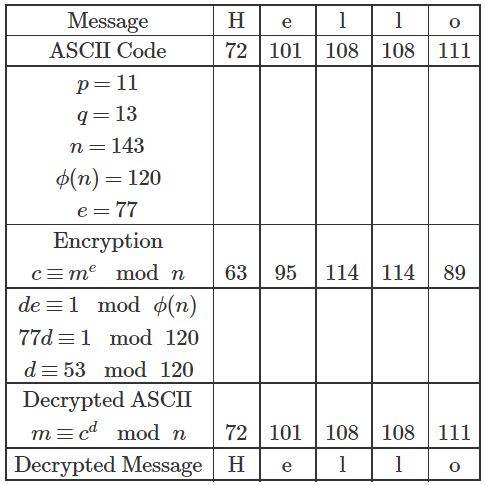


---

##### Grundidee

* Die Modulo-Funktion ist eine gute Einwegfunktion
    * *Verschlüsselung:* $72^{77} \mod 143 = c$, ist schnell und einfach zu berechnen
    * *Entschlüsselung:* $m = 63^d \mod 143 = 0$,  es gibt viele Zahlen die genau durch 143 teilbar sind, zuvor müsste mann alle möglichen Zahlen für `d` durchprobieren
* Grundlage sind zwei Primzahlen $p$ und $q$, die geheim bleiben müssen und von denen nur das Produkt $n$ bekannt und Teil der Schlüssels ist
    * $p \cdot q = n$, lässt sich schnell berechnen
    * aus $n$ die möglichen Kandidaten für `p` und `q` zu finden ist viel aufwändiger (Primzahlfaktorisierung)

* [Link zur Implementierung](https://github.com/jhumci/SBT_GID/blob/main/SBT_7_Verschluesselung.ipynb)

---

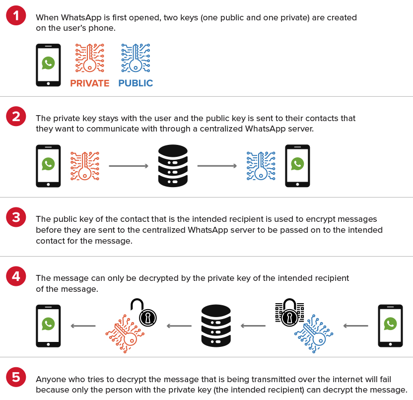


---

### 🧠 Authentifizierung mittels TLS (Transport Layer Security) 


* Protokoll zur **Authentifizierung** und Verschlüsselung von Internetverbindungen
* zuvor Secure Sockets Layer (SSL)
* Zur verschlüsselten Kontaktaufnahme mit dem Server benötigen wir dessen **public key**
* Woher können wir sicher sein, dass wir wirklich mit dem Sever kommunizieren und nur dieser unsere Nachricht entschlüsseln kann? 

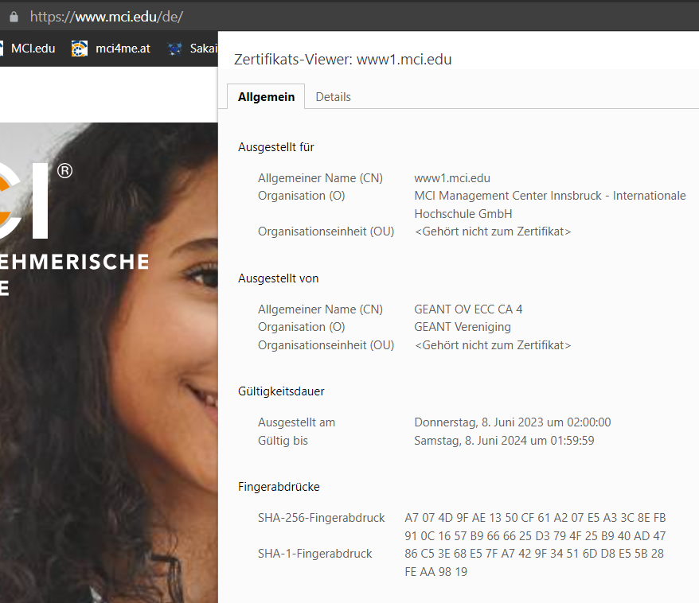

---


###### https://www.elektronik-kompendium.de/sites/net/1706131.htm


---

#### TLS-Zertifikate 

* koppeln Identität (z.B. Name, Organisation, URL etc.) an einen **public key**
* Weltweit gibt es weit über 700 Zertifizierungsstellen (Certificate Authority, CA)
* Auch die CA besitzt ein (Wurzel- oder Stamm-) Zertifikat, das in Browsern und Betriebssystemen hinterlegt ist. Mit diesem kann überprüft werden, ob die das Zertifikat wirklich von der Zertifizierungsstellen erstellt wurde (Chain of Trust)
* Beispiele für Zertifikate:
    [Uni Innsbruck](https://www.uibk.ac.at/zid/servicekatalog/servicebeschreibungen/digitale-zertifikate.html#:~:text=Alle%20Mitarbeiterinnen%20und%20Mitarbeiter%20der,%40uibk.ac.at.) z.B. für Digitale Signaturen
    [Email-Verkehr mit PGP](https://de.wikipedia.org/wiki/Pretty_Good_Privacy)
    [CertManger](https://cert-manager.com/customer/ACOnet/idp/clientgeant)
    ID Austria

---

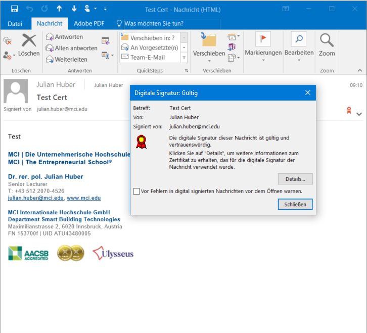

---

#### Verschlüsselung mit TLS

<!-- _backgroundColor: white -->
<!-- _color: black -->

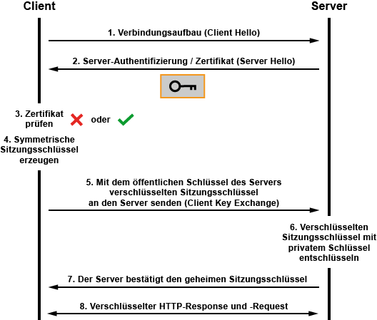

###### https://www.elektronik-kompendium.de/sites/net/1811281.htm

* Funktioniert in der Anwendung reibungslos und im Notfall auch ohne Zertifikat
* (leider) gibt es eine Vielzahl von unterschiedlichen Datenformaten zum Zertifikat- und Schlüsseltausch
* i.d.R. eine Textdatei, die neben einem Zertifikat auch Root-CA-Zertifikate und private Schlüssel enthalten kann


---

##### Self-signed Certificates 

* Nicht immer lohnt sich der organisatorische und finanzielle Aufwand einer Zertifikat-Erstellung
* z.B. bei Verbindungen innerhalb einer Organisation können Zertifikate selbst erstellt und signiert werden [](https://de.wikibooks.org/wiki/MQTT-Broker_einrichten/_Broker_TLS)
    ```
    $ tree .
    .
    ├── broker
    │   ├── broker.crt # 6. öffentliches Zertifikat zu broker.key mittels ca.crt
    │   └── broker.key # 5. privater Schlüssel
    ├── ca
    │   ├── ca.crt # 2. öffentliches Zertifikat der Certificate Authority basierend auf ca.key 
    │   └── ca.key # 1. privaten Schlüssel für die CA mit Passwort, wer beides hat kann Zertifikate unterscheiben
    └── client
        ├── client.crt # 4. öffentliches Zertifikat zu client.key mittels ca.crt
        └── client.key # 3. privater Schlüssel
    ```

---

##### Absichern einer MQTT-Verbindung mittels TLS

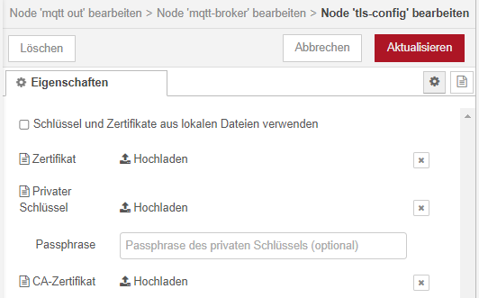

* wird kein Zertifikat und Schlüssel hinterlegt, kann dennoch TLS-aktiviert, um verschlüsselt übertragen zu werden
* allerdings ist dann nicht sichergestellt, dass der Empfänger der Empfänger ist
* [Anleitung Self-signed Certificates](http://www.steves-internet-guide.com/mosquitto-tls/)

---

### Secure Shell 

* [SSH (Secure Shell)](https://de.wikipedia.org/wiki/Secure_Shell) z.B. verschlüsselte Verbindungen zwischen Unix-System und auch passwort-loses Anmelden
* Auf dem lokalen Rechner (Client) wird ein Schlüsselpaar erstellt
* Der **public key** wird auf das Zielgerät übertragen
* Nur wer über den **private key** verfügt, kann eine Nachricht so verschlüsseln, dass die **public key** sie öffnen kann
* Damit ist der Login gesichert (Authentifizierung) und ein sicherer Schlüsseltausch kann gewährleistet werden (Vertraulichkeit)


---

#### Anleitung

* [Schlüsselpaar erzeugen](https://www.heise.de/tipps-tricks/SSH-Key-erstellen-so-geht-s-4400280.html) - Optional mit Kennwort
    * mit PuTTy
    * OpenSSH: `ssh-keygen -o -a 100 -t ed25519`
    * In der Cloud-Anwendung (VL7)
* Unter unix liegen die bekannten Hosts hier
` cd ~/.ssh/known_hosts`
* Unter Windows hier `C:\Users\%USERNAME%\.ssh\known_hosts`
* der Private-Key verbleibt immer auf dem Rechner
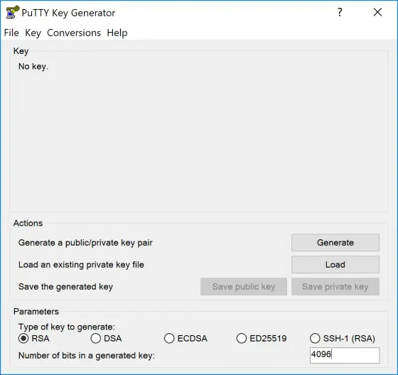


---

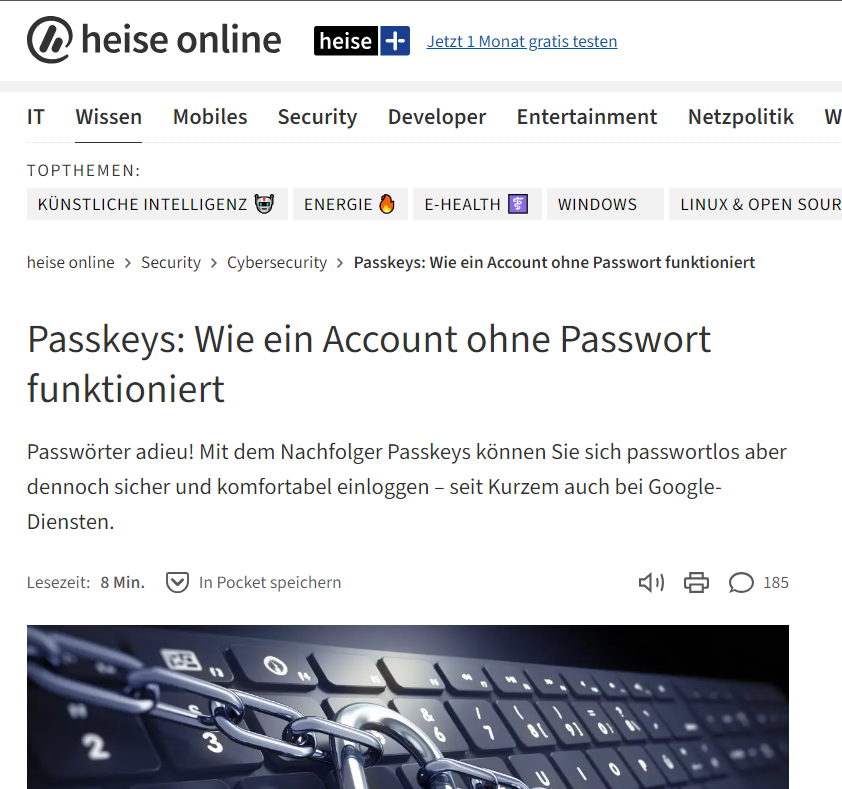

###### https://www.heise.de/hintergrund/Bestandsaufnahme-Passwort-Nachfolger-Passkeys-9048722.html

---

## 6.4 Firewalls

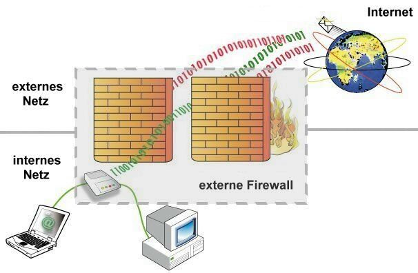

---

### 🎯 Lernziele

Nach dieser Einheit sind Sie in der Lage dazu
* die Funktionsweise von Firewalls beschreiben
*  Regeln für Paketfilter formulieren und interpretieren

---


### 🧠 Firewalls


* schützt Rechnernetz oder einen einzelnen Computer vor unerwünschten Netzwerkzugriffen
* Netzwerkzugriff zu beschränken, basierend auf Absender oder Ziel (IP-Raum) und genutzten Diensten (Ports)


---

### Position des Firewalls

* Personal Firewall (auch Desktop Firewall)
    * freier konfigurierbar, wenn neues Programm hinzukommt, 
    welches eine Freigabe benötigt.
* externe Firewall (auch Netzwerk- oder Hardware-Firewall)
    * von innen weniger gut angreifbar


---

#### Personal Firewall


---

#### externe Firewall


---


### 🧠 Level des Firewalls

.svg)

---

* Netzwerkschicht z.B. (IP)-Paketfilter
    * Regel für Netzwerkverkehr basierend auf IP-Protokoll
        * Woher kommt der Zugriff (IP)
        * Wohin geht der kommt der Zugriff (IP + Port/Dienst)
        * Problem: alle Daten können durch beliebigen Port
* Anwendungsschicht z.B.
    * Contentfilter: Bestimmte Inhalte (z.B. interaktive Elemente von Websites) werden herausgefiltert
    * Deep Packet Inspection: Inhalte  der Pakete werden untersucht
    * Problem: Aufwendig, müssen up-to-date sein


---

#### 🧠 Allowlist and Blocklist bei Paketfiltern

* Allowlist (Whitelist)
    * Default: Alles wird geblockt
    * Liste mit zulässigen Verbindungen
    * z.B. Ticket-System des IT-Department erhält nur Mails der eigenen Firma
* Blocklist (Blacklist)
    * Alles wird erlaubt
    * Liste mit geblockten Inhalten
    * z.B. Zensur von Facebook in China

---

### 🧠 Firewall Regeln


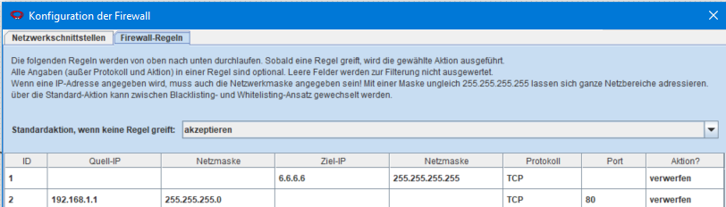

- Standardaktion **akzeptieren**: es folgt eine Blocklist (Verbindungen, die verworfen werden)


---


- Quell-IP: Anfragen von diesen IPs von außen werden untersucht

---


- Ziel-IP: Anfragen an diese Netzwerk-IP werden untersucht

---


- Netzmaske: 
    - Soll nur genau eine IP behandelt werden: ```255.255.255.255```
    - Oder alle aus einem bestimmten Bereich: ```255.255.255.0```

---


- Protokoll: Sollen nur Pakete behandelt werden, die zu einem bestimmten Protokoll gehören UDP (verbindungslos) oder TCP (verbindungsorientiert)

---


- Port: Soll nur ein bestimmter Port / Dienst blockiert werden (z.B. Mailserver)

---

## 🏆 P6.1: Firewall Konfiguration

---

### Bauen Sie das folgende Netzwerk auf

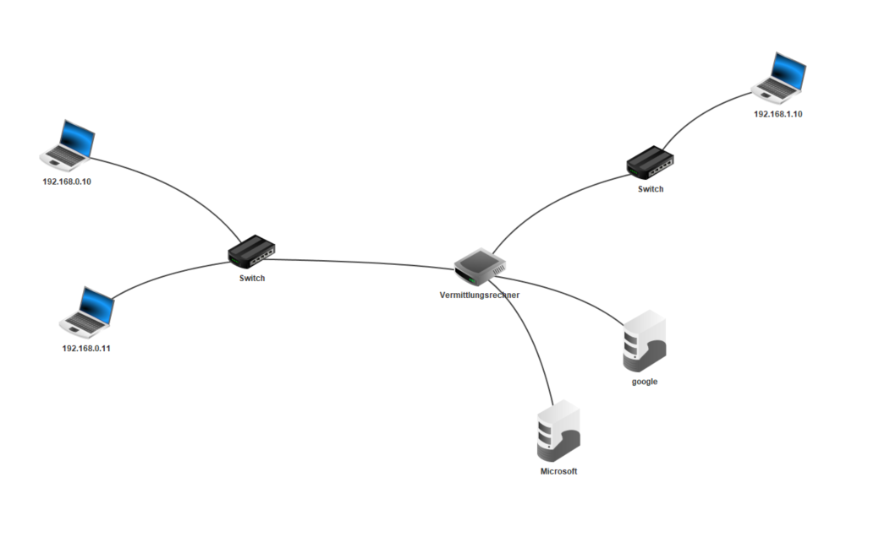

---

#### Beschreibung des Netzwerks

* Links:
    - Netzwerk mit zwei Rechnen
* Rechts:
    - Netzwerk mit einem Rechner
* Ein Verbindungsrechner mit vier Netzwerkkarten
* Folgende Webserver:
    * google mit IP: 8.8.8.8
     * Microsoft mit IP: 6.6.6.6
* Alle Rechner mit Webbrowser und Befehlseingabe
* Beide Webserver mit Texteditor und Webserver (starten)

Sie können das Ergebnis auch [hier](https://github.com/jhumci/SBT_GID/blob/main/filius/FireWall-Example.fls) herunterladen

---

- Stellen Sie sicher, dass Sie beide Webserver von allen PCs anpingen können (Sicherungsschicht)
    - Befehlszeile: ```ping <ip>```
- Stellen Sie sicher, dass Sie beide Webserver von allen PCs über den Webbrowser erreichen (Anwendungsschicht)


---

### ✍️ Aufgabe 1

- Sie sind die Zensurbehörde eines Open-Source-fanatischen Unternehmens und möchten Ihrer Belegschaft verbieten Software von Microsoft zu nutzen
- Sie haben Kontrolle über den einzigen Verbindungsknoten im des Netzwerks. Richten Sie eine externe Firewall ein, welche den Zugriff aller Netzwerkteilnehmer auf den Microsoft-Server verhindert
- Sie wollen auch den Zugriff verhindern, sollte Microsoft weitere Server mit anderer IP-Adresse hinter dem Gateway aufbauen
- Überprüfen Sie den Zugriff über ping und Webbrowser. Ist das Ziel über beide Wege unerreichbar? Was schließen Sie daraus?
- Auf welchem OSI-Level arbeitet die Firewall


---

#### Aufgabe Lösungshinweise

- Die Default-Einstellung ist Akzeptieren
- Blockieren Sie den Gateway zum Microsoft-Server (```6.6.6.1``` ), wenn sie sicher gehen wollen oder nur den Microsoft-Server (`6.6.6.6`)
- Als Netzmaske können Sie ```255.255.255.0``` eingeben. Was sind die Implikationen der Auswahl?


---

#### Aufgabe 1 - Lösung


* per Ping ist die Adresse noch erreichbar. Der Firewall greift also ab einem OSI-Lever höher als die Sicherungsschicht
* Über die Netzmaske lassen sich ganze IP-Bereiche Sperren 
* Die Maske ```255.255.255.0``` sperrt nur die ausgewählte IP-Adresse
* Netzwerkschicht z.B. Paketfilter

---

#### Sperren genau einer IP-Adresse

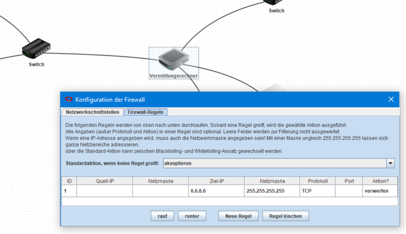


---

### ✍️ Aufgabe 2

- Ebenfalls in Filius!
- Im Netzwerk ```192.168.1.1``` befindet sich nur ein RasPi, welcher Daten erfasst und auf einen öffentlichen MQTT-Broker unter `7.8.9.10` weiterleiten soll
- Öffnen Sie zudem den Port 22 für einen eingehenden SSH-Zugriff von außen
- Stellen Sie sicher, dass der RasPi gar keine anderen Websites Aufrufen kann


---

### Bewertung

- 4pkt: Laden sie je ein Screenshot für die Firewall-Einstellungen beider Aufgaben hoch


