<!-- paginate: true -->

# Internet of Things


Dr. Julian Huber


---

## 5 Cloud


---

## Definitionen

**On-Premises**

- Installation, Betrieb und Management der **IT-Infrastruktur** in den eigenen Räumlichkeiten
- Betrieb einer geeigneten **Plattform** für die Anwendungen (Datenbanken, Virtuelle Maschinen,  etc.)
- Auswahl, ggf. Anpassung und Wartung der **Software**


---


#### Cloud-Computing


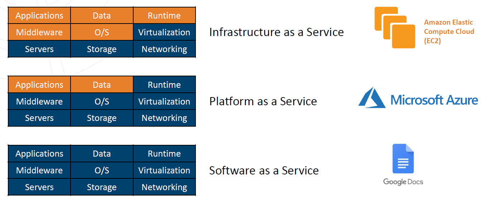

###### Blau wird durch den Cloud-Anbieter gestellt

---


### Infrastructure as a Service


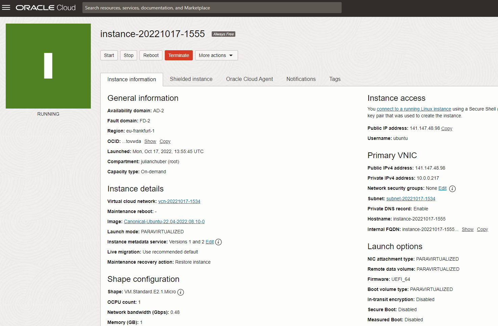

- Hardware wird nicht mehr selbst betrieben
- meist virtualisiert: Auf einem Server laufen diverse Betriebssysteme z.T. diverser Kunden
- Hohe Skalierbarkeit: Leistung kann an Bedarf angepasst werden


---

### Platform as a Service

- Cloud-Anbieter stell eine Ökosystem (Plattform) bereit mittels derer Verschiedene Anwendungen verknüpft werden können
- Anbindung eigener (Could-fremder) Anwendungen ist möglich
- Eigene Anwendungen werden auf der Plattform entwickelt

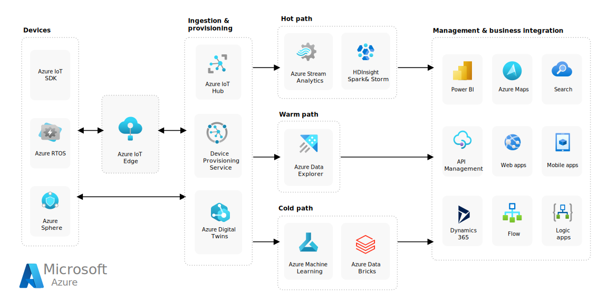

---

#### Risiko: Vendor Lock-In


###### https://techcrunch.com/2022/08/17/google-cloud-will-shutter-its-iot-core-service-next-year/

---

### Software as a Service

- Schlüsselfertige Software steht bereit
- Beispiel: Auf [HiveMQ Cloud](https://www.hivemq.com/cloud/) kann ein MQTT-Broker gemietet werden

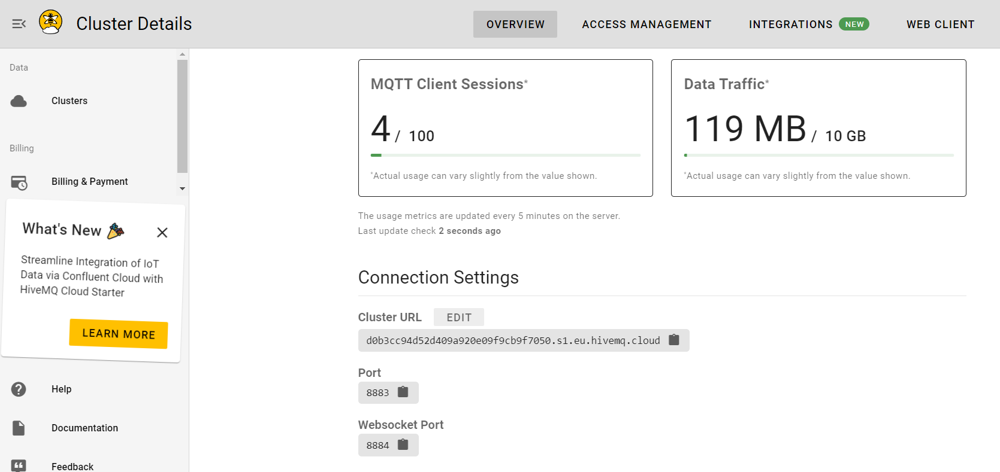

###### https://console.hivemq.cloud/clusters/free/

---

####  Risiko Vertrauen


* Sind Mitarbeitende und Prozesse des Anbieters vertrauenswürdig?
* Gibt es den Anbieter in 5 Jahren noch?

---

## IaaS: Virtuelle Maschinen

- Legen Sie sich einen kostenlosen [Microsoft Azure for Students Account](https://azure.microsoft.com/de-de/free/students) an
- stellen Sie sicher, dass Sie **keine Kreditkarte** hinterlegen, damit keine Kosten entstehen
- Neben einem Startguthaben gibt es dauerhaft kostenlose Dienste

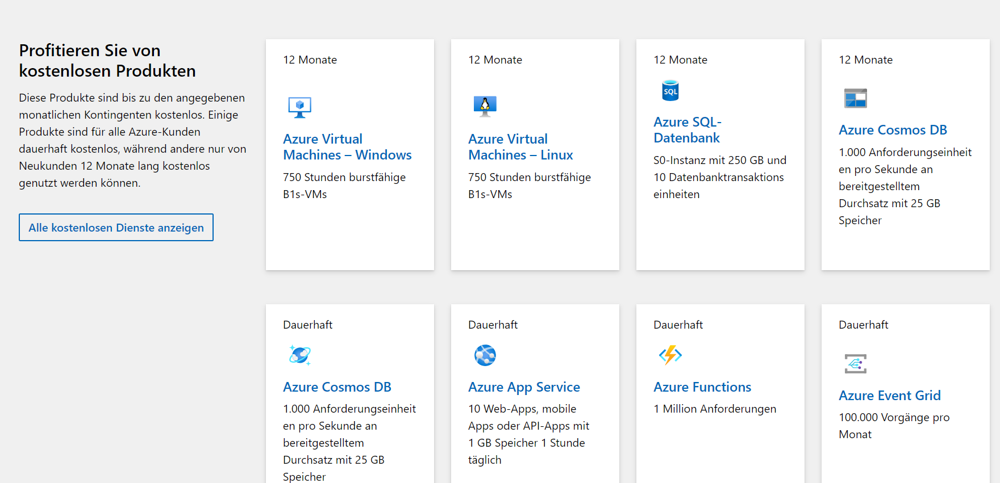


---

### Virtuellen Computer anlegen

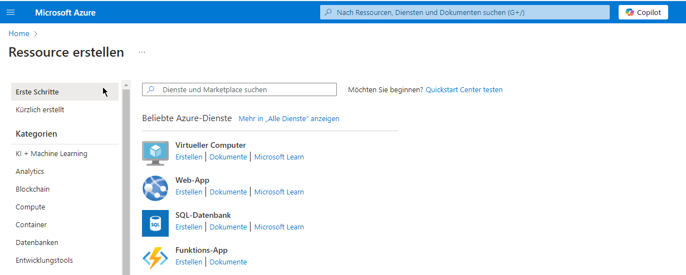

---


### Kostenlose Größe B1 auswählen

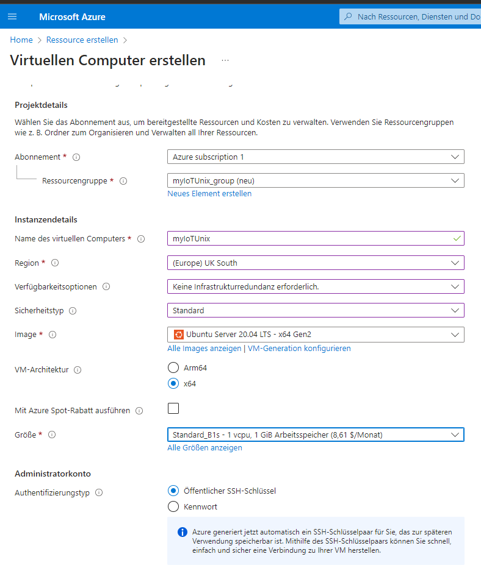

---

### Username festlegen und Schlüsselpaar generieren und speichern

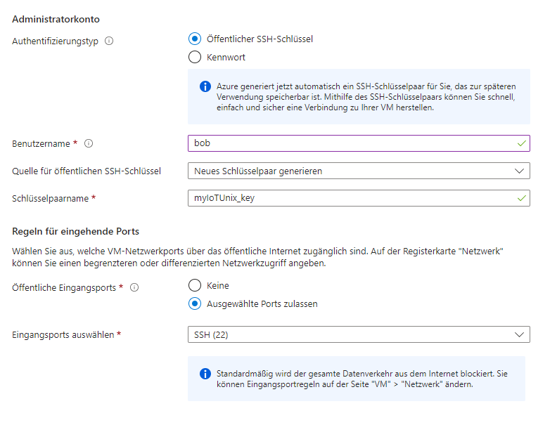

---

### Fertige VM mit Public IP

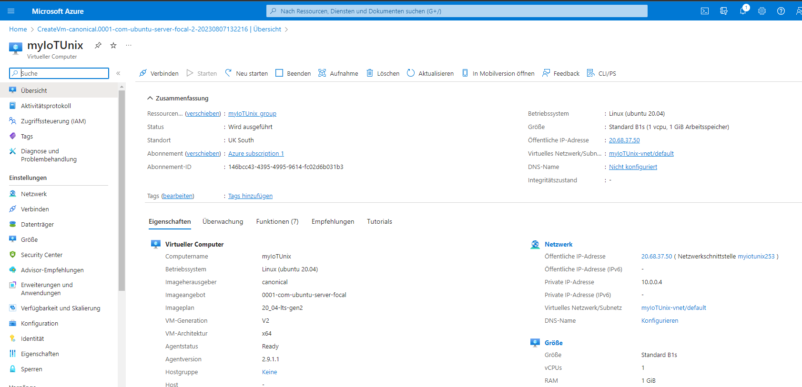

---

### Firewall-Regeln


---

### Verbindung per SSH

- Interaktion über VS-Code Remote-Extension oder
- [Putty](https://www.putty.org/) zum Speichern und Ausführen von SSH-Verbindungen
- [WinSCP](https://winscp.net/eng/download.php) zur Datenübertragung per FTP und SSH


---

#### Putty

- leider liegt unser Key in einem ungeeigneten Format (`*.pem`) vor 
- Wir können diesen mit [PuTTyGen](https://www.host-telecom.com/guides/error-unable-to-use-key-file-when-using-putty/) in ein `*.ppk` Format umwandeln
    * `Conversions/Import key`
    * `Save private key`

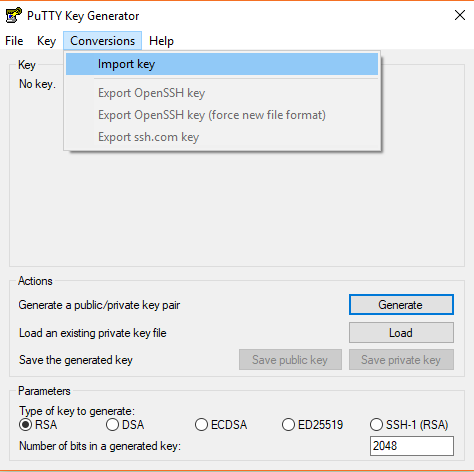

---

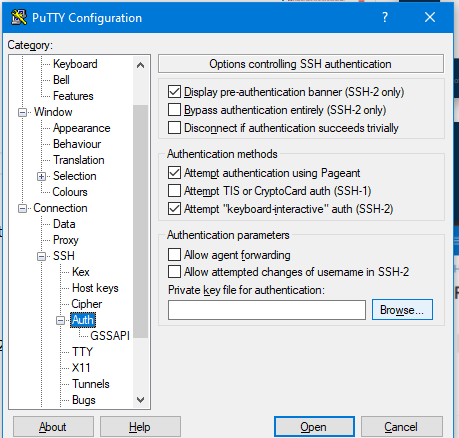

- öffentliche IP bei `Hostname` eingeben
- Key-Datei  unter `SSH/Auth` angeben
- Name für die Verbindung unter `Saved Sessions` definieren und `Save`
- verbinden mittels `Open`

---

### ✍️ Aufgabe: 'Hello World'-Website


---

### Webserver installieren


- Einfügen der Zwischenablage erfolgt in Putty mittels Rechtsklick!
- Software des Webservers installieren
    `sudo apt-get install apache2`


---

### Setup HTML File

- Die Index-Seite der Website liegt unter `/var/www/html/`
    `cd /var/www/html/`
    `ls -l`
- Hier liegt schon eine Datei `index.html` die wir zunächst löschen
    `sudo rm index.html`
- Nun können wir sie mit dem Texteditor `nano` neu erstellen und anpassen
    `sudo nano index.html`
- Wenn die Datei schreibgeschützt ist, müssen wir uns erst die Schreibrechte verschaffen zudem muss der Service des HTTP-Servers in der Lage sein auf die Datei zuzugreifen
    `sudo chmod 775 index.html`


---

#### Beispiel-Website

```
<!DOCTYPE html>
<html>
<head>
    <title>Hello World!</title>
</head>
<body>
    <h1>Hello World!</h1>
</body>
</html>
```


---

### Portfreigaben einrichten

- Alle eigenenden TCP-Verbindungen auf Port 80  zulassen


---

### Die Website ist nun erreichbar

- `<public_ip>:80`
- `http://<public_ip>/`

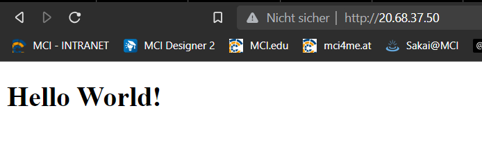

---

## Virtualisierung

* Entsprechend können wir die verschiedenen Dinge mit unserer VM anfangen
    * Blogs
    * Nextcloud
    * Datenbanken
    * MQTT-Broker
    * ...
* Jedes Mal müssten wir andere Eingriffe im Betriebssystem vornehmen
* Stattdessen hat sich das Konzept der Container-Virtualisierung durchgesetzt
* Dies funktioniert auch auf lokalen Windows-Rechnern und RasPis


---

### Containervirtualisierung mit Docker

<center>

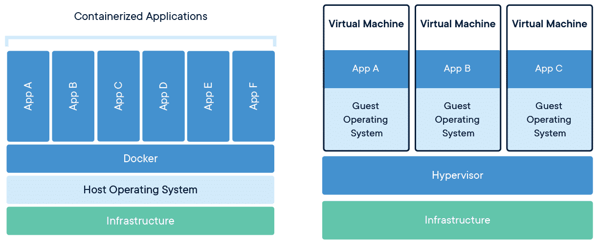

</center>

* Im Gegensatz zu einer Virtuellen Maschine ersetzt ein Container nur den Application Layer des OS und nicht den Kernel wie eine VM
* Anwendungen laufen in Containern unabhängig vom Betriebssystem
* Container interagieren mit anderen Containern nur wenn explizit gewollt
* Container können mit einem Befehl gestartet und gestoppt werden


---


###### https://cto.ai/blog/docker-image-vs-container-vs-dockerfile/

---

#### Installation von Docker

* Es gibt hunderte vorgefertigte Container Images, die einfach genutzt werden können
* [Installation Docker](https://docs.docker.com/engine/install/ubuntu/#install-using-the-repository)
* [Berechtigungen](https://docs.docker.com/engine/install/linux-postinstall/)
* [Docker-compose Plugin](https://docs.docker.com/compose/install/linux/) and `sudo apt install docker-compose` für Orchestrierung verschiedener Container
* zum Testen `docker run hello-world`
* unter WSL start mit `sudo service docker start`

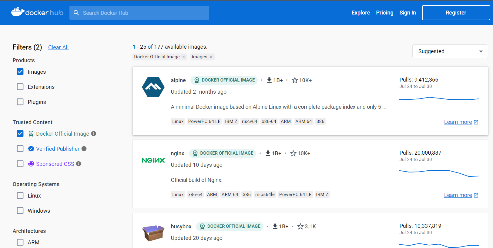

---

#### Beispiel: Python Skript in Docker-File `dockerfile`


```Docker
#Deriving the latest base image
FROM python:latest

#Labels as key value pair
LABEL Maintainer="julian"

# Any working directory can be chosen as per choice like '/' or '/home' etc
# i have chosen /usr/app/src
WORKDIR /usr/app/src

#to COPY the remote file at working directory in container
COPY test.py ./
# Now the structure looks like this '/usr/app/src/test.py'

#CMD instruction should be used to run the software
#contained by your image, along with any arguments.

CMD [ "python", "./test.py"]
```

[Anleitung](https://www.geeksforgeeks.org/how-to-run-a-python-script-using-docker/)

---

#### Beispiel: Python Skript `test.py`

```
print("Hello!")
i = 0
while True:
        i += 1
        print(i)`
```
---

* build docker-image: `sudo docker image build -t python1 ~/docker`
* run docker-container: `sudo docker run python1`
* run docker-container in background: `sudo start -d python1` (`-d` detached, `start`, da wir einen gestoppten Container erneut starten und keinen weiteren erstellen wollen)
* Show all running containers `docker ps`
* Show all containers `docker ps -all`
* connect with container `sudo docker attach <container_instance>`
* stop container `sudo docker stop <container_instance>`
* restart container `sudo docker restart <container_instance>`
* open shell in container `sudo docker exec -it <container_instance> /bin/bash` or `sh`
* Warum ist das nützlich?
    * Container können auf jedem System gleich gestartet werden
    * Abhängigkeiten werden automatisch installiert
* [Dokumentation](https://docs.docker.com/engine/reference/commandline/docker/)

---

#### Lebenszyklus eines Containers

<center>

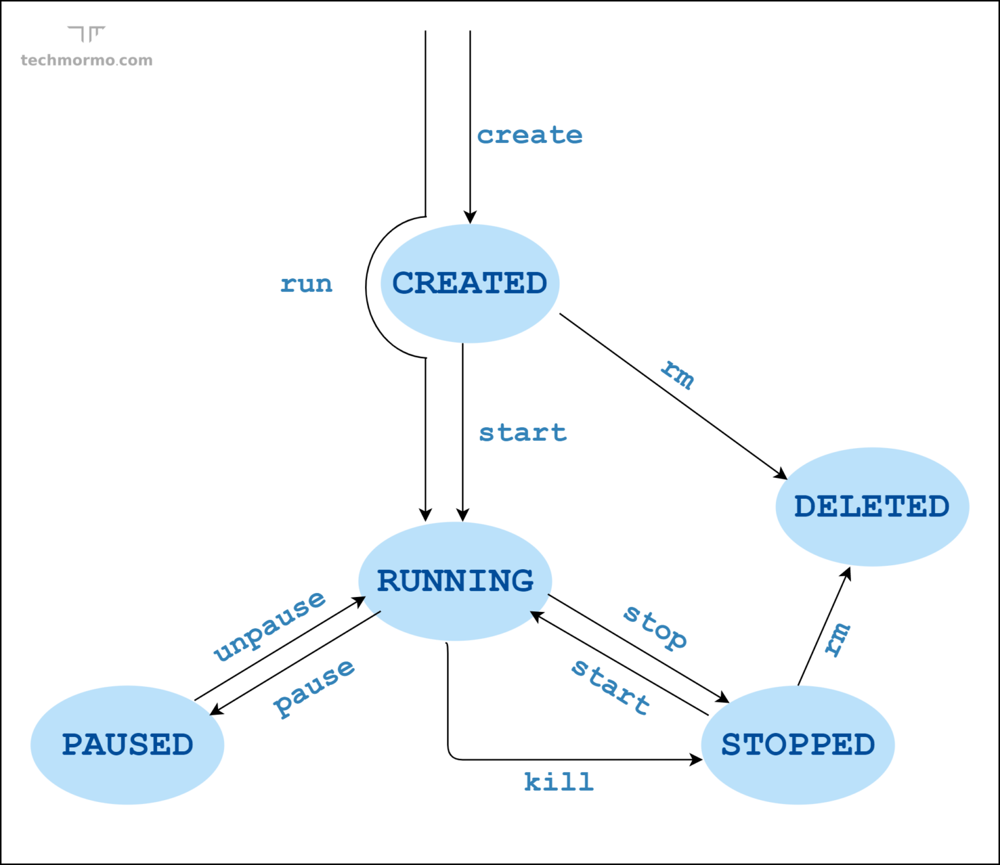

</center>

---

#### Beispiel:  Eigener MQTT-Broker

- in user-Verzeichnis `cd ~`
- Ordner anlegen `mkdir mosquitto`
- in Ordner wechseln `cd mosquitto/`
- Ordner anlegen `mkdir config`
- in Ordner wechseln `cd config/`
- Config-Datei anlegen `nano mosquitto.conf`

```
persistence true
persistence_location /mosquitto/data/
log_dest file /mosquitto/log/mosquitto.log
listener 1883
allow_anonymous true
```


---

- Starten des Containers
    - `docker run -d -p 1883:1883 -p 9001:9001 -v ~/mosquitto/config/mosquitto.conf:/mosquitto/config/mosquitto.conf -v /mosquitto/data -v /mosquitto/log eclipse-mosquitto`
    - ggf mit `sudo`
    - `-d` für detached
    - `-p` für Port mapping, falls einer schon vergeben wäre
    - `-v` for volumes
        - links aktueller Ordner, rechts Ordnerstruktur/Datei im Container
        - `mosquitto.conf:mosquitto/config/mosquitto.conf`


- `docker ps` für alle laufenden Container
- `docker stop <id>`zum anhalten

---

- Testen
    - in azure Portfreigabe für `1883` einrichten
    - Mittels [MQTT-Explorer](https://mqtt-explorer.com/) verbinden

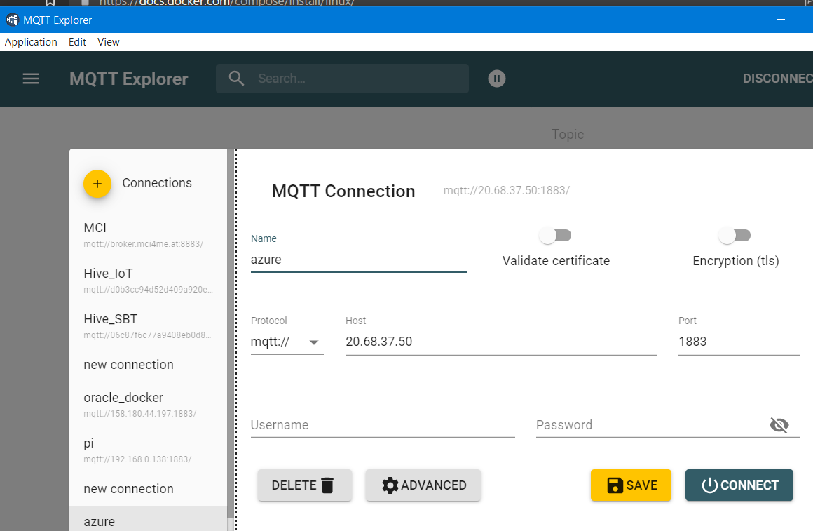

- weitere Anleitungen
    - [Passwort und Nutzername](http://www.steves-internet-guide.com/mqtt-username-password-example/)
    - [TLS-Zertifikate](http://www.steves-internet-guide.com/mosquitto-tls/)
    - [mosquitto ohne docker](https://medium.com/gravio-edge-iot-platform/how-to-set-up-a-mosquitto-mqtt-broker-securely-using-client-certificates-82b2aaaef9c8)
---


### Docker Compose

- Anstelle die Optionen nach dem `docker run <options>` einzugeben werden diese in einem `docker-compose` file gespeichert
- Zudem lässt dieses eine Orchestrierung mehrerer Container zu (z.B. App startet erst, wenn Datenbank online) 


---

#### docker-compose.yaml

- in Verzeichnis  `cd ~/mosquitto`
- compose-file anlegen `nano docker-compose.yaml` 

```docker
version: "3.3" # Docker-compose version

services: # container die gestartet werden sollen
  mosquitto:
    image: eclipse-mosquitto:latest # zugrunde liegendes Image
    restart: always # was passiert wenn etwas schief geht
    ports: # Port mapping
      - "1883:1883"
      - "9001:9001"
    volumes: # Volume mapping
      - ./config/:/mosquitto/config/
```

- Ggf. alten Container stoppen : `docker stop <id>`
- Starten: `docker-compose up -d`
- Beenden: `docker-compose down`


---

## 🏆 7.1: Cloud-Services

Aufgabe ist es einen MQTT-Broker in der Cloud,auf einem RasPi, oder einem PC zu betreiben

- 1 pkt: es wurde docker oder docker-compose (empfohlen) genutzt
- 6 pkt: ein eigener MQTT-Broker ist auf dem Server oder RasPi eingerichtet 
- 1 pkt: dieser ist passwort-gesichert
- 2 pkt: dieser ist TLS zertifiziert (herausfordernd)

- Laden Sie einen Screenshot auf dem MQTT-Explorer mit sichtbaren Anmelde-Daten und ggf. notwendigen Zertifikaten und Keys hoch
- Laden Sie auch die `mosquitto.conf` und ggf. die `docker-compose.yaml` hoch

---

### Beispiel: Docker Compose für IoT-Datenbank mit Dashboard

* Docker Compose erlaubt es mehrere Container gleichzeitig zu starten und miteinander zu verbinden
* https://github.com/jhumci/docker_iot (privates repository)


---

### Optional: Mosquitto Passwortfile erstellen

- [Dokumentation](https://mosquitto.org/man/mosquitto_passwd-1.html)
- `sudo apt install mosquitto`
- `touch passwordfile`
- `mosquitto_passwd -D passwordfile <user> <password>`
- `passwordfile` muss in `mosquitto.conf` eingetragen werden und in den Container gemappt werden


---

## Wichtige Docker-Befehle

* download a image for installation: (:`<version>` part is optional, empty -> newest version)
	`docker pull <imagename>:<version> `
* show local images: `docker images`
* create and start a container with an image: `docker run <imagename>`
* create and start a container with an image (detached): `docker run -d <imagename>` $^1$
* create and start an container and giving them a name: `docker run --name <containername>`
* start an existing container: `docker start <container-id or name>` $^2$
* stop an existing container `docker stop <container-id or name>`
* show running containers: `docker ps`
* show all containers (running and stopped): `docker ps -a`
* restart a container: `docker stop <container-id>`, `docker start <container-id>`

$^1$: Also don´t use "docker run" always for starting an container. You will build
every time a new one. So you have 2 after running this command 2 times.

$^2$: Attention: Imagename ≠ name of the container

---

* binding a host port during the run command (for existing containers): `docker run -p<hostport>:<containerport> <container-id or name>`
* example for all togehter (portainer, detached, portbinded, renamed as r2d2) `docker run -d -p6000:6379 --name r2d2 portainer`


---

## Troubleshooting commands:

* showing logs from the running container: `docker logs <container-id or name>`
* get the terminal of a running container: `docker exec -it <container-id or name> /bin/bash`
* get out of the terminal of a running container: `exit`


---

## Videos

- [Docker in 100 seconds](https://www.youtube.com/watch?v=Gjnup-PuquQ)
- [Docker Tutorial for Beginners](https://www.youtube.com/watch?v=eGz9DS-aIeY)