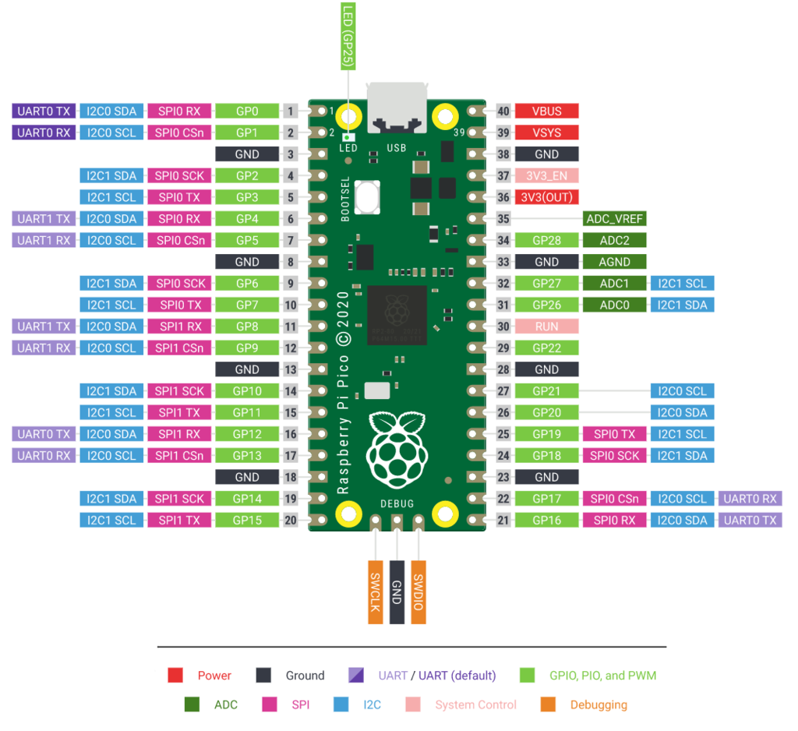
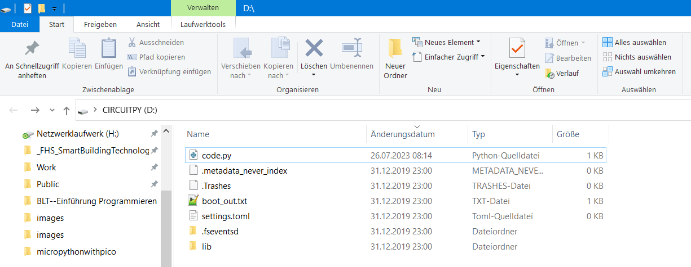
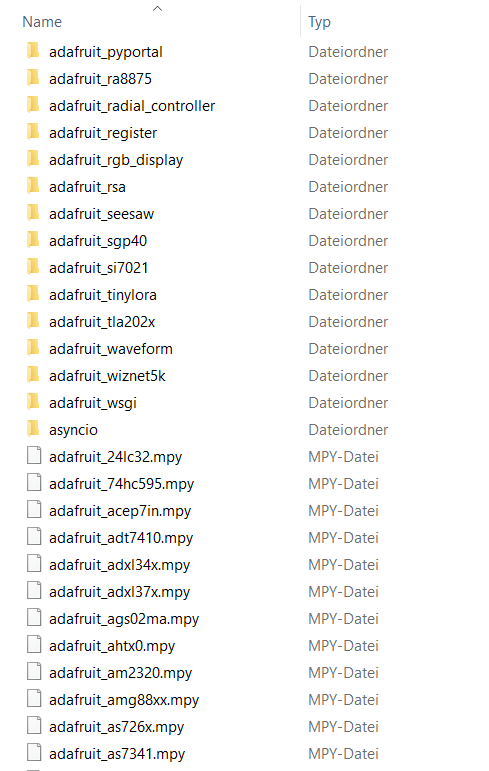
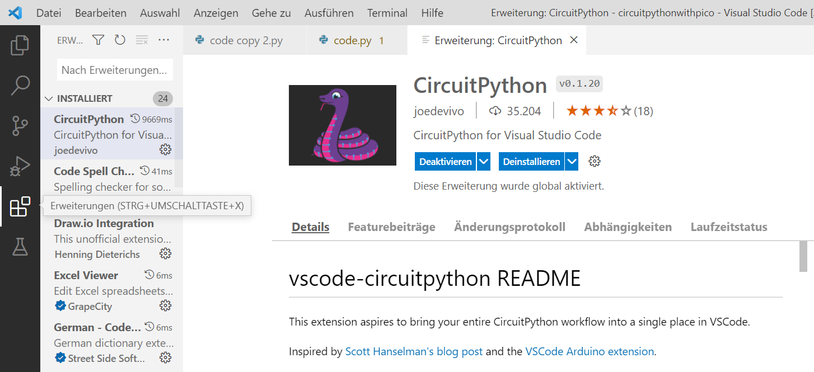
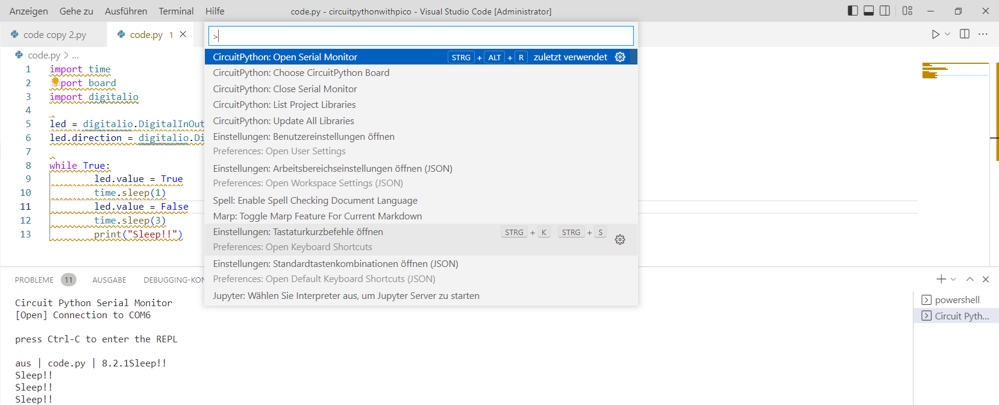
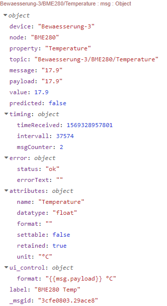

<!-- paginate: true -->

# Internet of Things


Dr. Julian Huber


---

## 8 Telemetrie


---

## Mikrocontroller

- Prozessor und Peripheriefunktionen auf einer Platine
- Ausführen von programmierbarer Software
- Erfassung von Daten (Analog, Digital, Bussysteme)
- Kommunikation (z.B. Bussysteme, Bluetooth oder WLan)
- selten Betriebssysteme ([Zephyr](https://docs.zephyrproject.org/latest/boards/arm/rpi_pico/doc/index.html), FreeRTOS) für Task Management
- meist hardwarenahe Programmierung mit  C, C#, aber auch Basic und Java oder MicroPython


---

| | Raspberry Pi Pico    | Arduino Uno R3        | ESP8266                | ESP32                          |                                  
|----------------------|-----------------------|------------------------|--------------------------------|-----------------------------------|
| Mikrocontroller      | RP2040                | ATMega328P             | ESP8266                        | ESP32                             |
| Kerne                | 2                     | 1                      | 1                              | 2                                 |
| Prozessor            | ARM Cortex M0+ 32 Bit | RISC 8 Bit             | LX106 32 Bit                   | LX6 32 Bit                        |
| Taktrate             | bis 250 MHz           | 16 MHz                 | bis 160 MHz                    | bis 240 MHz                       |
| Betriebsspannung     | 3,3 V (1,8 bis 5,5 V) | 5 V (7 bis 12 V)       | 3,3 V                          | 3,3 V                             |
| GPIO-Spannung        | 3,3 V                 | 5 V                    | 3,3 V                          | 3,3 V                             |
| Digital              | 26                    | 14                     | 16                             | 36                                |
| PWM                  | 16                    | 6                      | 16                             | 32                                |
| Analog               | 3                     | 6                      | 1                              | 15                                |
| SPI/I2C/UART/I2S     | 2/2/2                 | 1/1/1                  | 2/1/2/2                        | 4/2/2/2                           |
| Wifi/Bluetooth       | nein*/nein            | nein/nein              | ja/nein                        | ja/ja                             |
| Integrierter Sensor  | Temperatur            | -                      | -                              | Berührung, Tempertur, Hall-Effekt |
| Programmier-sprachen | C/C++, MicroPython    | C/C++                  | C/C++, MicroPython, Javascript | C/C++, MicroPython                |
| Onboard-LED          | GP25 (LED)            | D13                    | D0                             | D2                                |
| Flash                | 2 MB                  | 32 KB                  | 4 MB                           | 4 MB                              |
| RAM                  | 264 kB                | 264 kB                 | 128 kB                         | 520 kB                            |
| EEPROM               | -                     | 1 kB                   | 520 Bit                        | -                                 |
| Anwendung            | IoT und Smart Home    | Allgemeine Anwendungen | IoT und Smart Home             | IoT und Smart Home                |
| Preis**              | 4 bis 7 EUR           | 20 bis 30 EUR          | 5 bis 15 EUR                   | 7 bis 15 EUR                      |

###### https://www.elektronik-kompendium.de/sites/com/1907171.htm

---

### Beispiel Raspberry Pi Pico



- im Folgenden werden wir mit einem Raspberry Pi Pico und CircuitPython arbeiten
- mit diesem Framework lässt sich mit geringen Einstiegshürden arbeiten
- Wir nutzen eine uns bekannte Programmiersprache
- für Entwicklung über verschiedene Plattformen [PlatformIO](https://platformio.org/)


---

#### MicroPython und sein Fork CircuitPython


- schlanke und effiziente Version Pythons für Mikrocontroller
- enthält Teile der Python Standard Bibliothek
- CircuitPython ist etwas einsteigs-freundlicher und enthält mehr Bibliotheken

---


### CircuitPython installieren

* Halte den `BOOTSEL` Taster auf dem Pico gedrückt und verbinde diesen über USB mit dem Rechner
* Passende Firmware [UF2-File](https://circuitpython.org/board/raspberry_pi_pico_w/) herunterladen und in den als USB-Laufwerk erkannten Pico kopieren
* Pico sollte jetzt neue Starten und die Firmware installieren
* Nach dem erneuten Verbinden sollten nun einige Programme im Pico liegen




---

#### Hauptprogramm `code.py`

- Dieses Programm wird automatisch ausgeführt und ist der Einsteigspunkt für alle Programme (vgl. `MAIN` bei TwinCat)
- Passen Sie das Hauptprogramm so an, dass die LED länger hell als dunkel ist
```python
# Externe Bibliotheken laden
import time     # Bibliothek Zeit-Funktionen
import digitalio# Bibliothek zur Steuerung von GPIOs
import board    # Bibliothek welches die Adressen der Pins kennt: z.B. board.LED

# Ein- und Ausgänge definieren
led = digitalio.DigitalInOut(board.LED) # Die Variable LED wird mit dem GPIO der LED auf dem Board verbunden
led.direction = digitalio.Direction.OUTPUT # Legt Richtung des PIN fest -> Output

# Endlosschleife
while True:
        led.value = True
        time.sleep(0.2)
        led.value = False
        time.sleep(3)
        print("Sleep!")
```

---

#### Bibliotheken `/lib`

* für viele Sensoren stehen [Bibliotheken](https://circuitpython.org/libraries) bereit, die die Interaktion vereinfachen (Register-Positionen müssen nicht mehr von Hand eingetragen werden)
* Bei CircuitPython liegen viele Bibliotheken entweder als `. py`-Skripte (können eingesehen und verändert werden) oder als kompilierte Binaries `.mpy` vor (platzsparender)



###### In der Musterlösung ist V8 genutzt
 

---

##### Bibliotheken installieren

* Die Bibliotheken des gewünschten Sensors herunterladen und in den Ordner `lib` kopieren
* Meist findet sich auch ein [github-Repository](https://github.com/adafruit/Adafruit_CircuitPython_MPU6050) mit Beispielen und Dokumentation
* Die Bibliotheken werden automatisch mittels `import` geladen und können im Code verwendet werden


```Python
# Wenn Bus keine Geräte findet, Widerstand prüfen!
import time
import board
import busio
import adafruit_mpu6050
import os

mpu = adafruit_mpu6050.MPU6050(i2c)

while True:
    print(mpu.acceleration)
```

---

### VS-Code einrichten



* Voraussetzung: RapPi Pico mit CircuitPython ist verbunden
* Installation
    * Download VS code from [Visual Studio Code](https://code.visualstudio.com/)
    * Installiere CircuitPython Erweiterung


---

### Projekt anlegen

* Neuen Ordner und `code.py` anlegen
* Unterordner `lib` für Bibliotheken anlegen
* Mit Pico verbinden `STRG` + `Shift` + `P` und  `CircuitPython: Select Serial Port`eingeben
* COM Port des Pi Pico auswählen
* Wenn dies fehlschlägt Verbindung über [Online-Editor](https://code.circuitpython.org/)


###### https://tasnimzotder.com/blog/how-to-write-code-on-pi-pico-using-circuitpython-vs-code

---

#### Code übertragen und überwachen

* Hochladen des Codes über Power-Shell Terminal
    * `PS C:\code\circuitpythonwithpico> cp ./* D:/ -Recurse -Force`
    * Kopiere alles im aktuellen Verzeichnis in den Pico auch die Unterordner
* Der Code wird sofort ausgeführt und Ausgaben und Fehler in der Konsole des Serial Ports angezeigt



---

#### Umgebungsvariablen


- einige Variablen sind so grundlegend, dass wir Sie nicht im Code sondern zentral verändern wollen
- z.B. wenn wir einen Sensor in einem anderen Netzwerk einsetzen wollen
- Hierzu können wird Umgebungsvariablen in der `settings.toml` verändern

```
CIRCUITPY_WIFI_SSID = "your-ssid-here"
CIRCUITPY_WIFI_PASSWORD = "your-ssid-password-here"
```
- Im Code können diese mittels `os` aufgerufen werden

```Python
#  connect to your SSID
import os
import wifi

wifi.radio.connect(os.getenv('CIRCUITPY_WIFI_SSID'), os.getenv('CIRCUITPY_WIFI_PASSWORD'))
```


---

#### Analoge Pins

- Im Gegensatz zum großen RasPi verfügt der Pico auch über analoge Eingänge
- Hier können analoge Spannungswerte ausgelesen und in digitale Werte gewandelt werden


```Python
import analogio

knob = analogio.AnalogIn(board.ADC0) # Abfrage des Kontakts ADC0

def get_voltage(raw):
    return (raw * 3.3) / 65536 # raw Werte sind Integer mit 16 Bit
    # Um auf Die Spannung in Volt zu kommen wird mit 65536 normalisiert
    # mit 3.3 V Multipliziert

while True:
    raw = knob.value
    volts = get_voltage(raw)
    print("raw = {:5d} volts = {:5.2f}".format(raw, volts))
    time.sleep(0.5)
```


---

### Weitere Anleitungen

- [Musterlösung](https://github.com/jhumci/circuitpythonwithpico)
- [WiFi-Einrichtung](https://learn.adafruit.com/pico-w-wifi-with-circuitpython/pico-w-basic-wifi-test) erfolgt nicht über Betriebssystem sondern im Code
- [ADXL345 mit I2C auslesen](https://learn.adafruit.com/adxl345-digital-accelerometer/python-and-circuitpython)
- [MPU6050 Doku](https://docs.circuitpython.org/projects/mpu6050/en/stable/api.html)
- [MQTT verbinden](https://www.hivemq.com/article/iot-reading-sensor-data-raspberry-pi-pico-w-micropython-mqtt-node-red/)
- [Beispiel Telemetrie mit Azure-Cloud](https://learn.adafruit.com/pico-w-wifi-with-circuitpython/pico-w-with-azure-iot-central)


---

## Selbst-Beschreibende Telemetrie-Daten



- Um die Weiterverarbeitung zu erleichtern macht es Sinn die Nachricht in einem MQTT-Topic, um weitere Informationen anzureichern
-  Dies ist insbesondere dann hilfreich, wenn hunderte Geräte automatisiert verarbeitet werden sollen
- [Homie MQTT-Konventions](https://homieiot.github.io/specification/spec-core-v1_5_0/)


---

#### Beispiel Thermostat `homie/device/node/property`

Das Gerät `device123` hat eine Thermostat-Funktion, bei der die Zieltemperatur ausgelesen oder gesetzt werden kann. Die Thermostat-Funktion wird als node `mythermostat` modelliert. Die Temperatur ist eine Eigenschaft (property) dieses nodes. Auch Eigenschaften können Eigenschaften haben. Diese sind durch `$` gekennzeichnet. 


---

Folgender Umfang ist obligatorisch:


```
  homie / device123 / $homie → 3.0
  homie / device123 / $name → My device
  homie / device123 / $state → ready
  homie / device123 / $nodes → mythermostat, mythermometer

  homie / device123 / mythermostat / $name → My thermostat
  homie / device123 / mythermostat / $properties → temperature

  homie / device123 / mythermostat / temperature → 22 
  homie / device123 / mythermostat / temperature / $name → Temperature
  homie / device123 / mythermostat / temperature / $unit → °C
  homie / device123 / mythermostat / temperature / $datatype → integer
  homie / device123 / mythermostat / temperature / $settable → true
```

---

#### Weitere wichtige Punkte

* 2.3 Quality of Service muss mindestens 1 und Nachrichten `retained` sein, damit Information auch nach Ausfall erhalten bleiben
* 2.4 Last will: Gerät meldet sich bei ungeplantem Verbindungsverlust ab
    `homie / device ID / $state` attribute to the value `lost`


###### https://homieiot.github.io/specification/

---

## 🏆 P8.1: Telemetrie mit Mikrocontroller


- Um weitere Daten zu erfassen, bauen wir zusätzliche Sensormodule mit Mikro-Controllern ein
- Entwickeln Sie eine Lösung, um die Daten eines Sensors Ihrer Wahl mittels eines RaspberryPi Pico zu erfassen und an einen MQTT-Broker zu streamen

---

### Bewertung

- 4 Punkte: zip-File mit dem CircuitPython-Projekt
- 2 Punkte: Daten für Beschleunigung und Temperatur kommen auf MQTT-Broker an
- 4 Punkte: Daten sind nach den oben genannten Punkten der Homie-Konvention konfiguriert oder als JSON mit dem gleichen Umfang
- 2 Punkte: Ausfall (wahlweise MQTT oder I²C) wird erkannt, dezentral mit Neustart und zentral mit Nachricht behandelt an den Broker

---

## Trouble Shooting

---

### Hilfestellung, wenn Sensor nicht gefunden

- einige MPU-ITG Sensoren haben leider einen [Fehler in ihrer Firmware](https://www.eevblog.com/forum/projects/counterfeit-mpu6050-chips-from-china/)
- Dabei ist die Adresse des Sensors zwar weiterhin `0x68`, aber so nicht richtig im Register hinterlegt
- Dies kann durch eine Anpassung in der Library behoben werden folgendem Code behoben werden
- Für Interessierte: 
    - Die Sensoren verfügen um ein `_MPU6050_WHO_AM_I `-Register in dem die Adresse zum Abgleich hinterlegt wurde [Line 73](https://github.com/jhumci/circuitpythonwithpico/blob/master/lib/adafruit_mpu6050_fix.py)
    - Entweder wurde das Register (Position) falsch gesetzt oder ein Fehlerhafter Eintrag vorgenommen
    - Nach einen Vergleich des Register-Eintrags (vgl. Zeile 207) mit der tatsächlichen Device-ID, wurde diese auf `0x72` anstelle `0x68` gesetzt (Zeile 55)
    - Dadurch wird der Fehler umgangen, da die Adresse des Sensors nun gleich der Adresse im Register ist
    - Diese Lösung ist aber nicht 100% schön, da die wahre Device-ID auf dem Bus weiterhin `0x68` ist 


---

#### Vorgehen

* Fügen Sie folgendes in die [code.py](https://github.com/jhumci/circuitpythonwithpico/blob/master/examples/scan_i2c.py) ein, um sicherzustellen, dass ein Gerät an Adresse `0x68` im i²C-Bus erkannt wird erkannt wird
* Fügen Sie die folgende angepasste [MPU6050-Library](https://github.com/jhumci/circuitpythonwithpico/blob/master/lib/adafruit_mpu6050_fix.py) ein
* Importieren Sie diese Library anstelle der originalen in der [Beispiel-Datei](https://github.com/jhumci/circuitpythonwithpico/blob/master/examples/send_acc_data_ITGMPU.py)

```Python
# Wenn Bus keine Geräte findet, Widerstand prüfen!
import time
import board
import busio
import adafruit_mpu6050_fix
import os

i2c = busio.I2C(scl=board.GP15, sda=board.GP14)

mpu = adafruit_mpu6050_fix.MPU6050(i2c)


while True:
    print(mpu.acceleration)
    
    time.sleep(1)
```

---

### Serial Port des Pico Pi wird nicht erkannt

Bei Nutzung einer Samsung SSD und des Tools Samsung Magician Tool unter Windows kann es zu Problemen kommen.

- Lösung:
    - Deinstallation von Samsung Magician
    - Raspberry Pi Pico aus- und wieder einstecken
