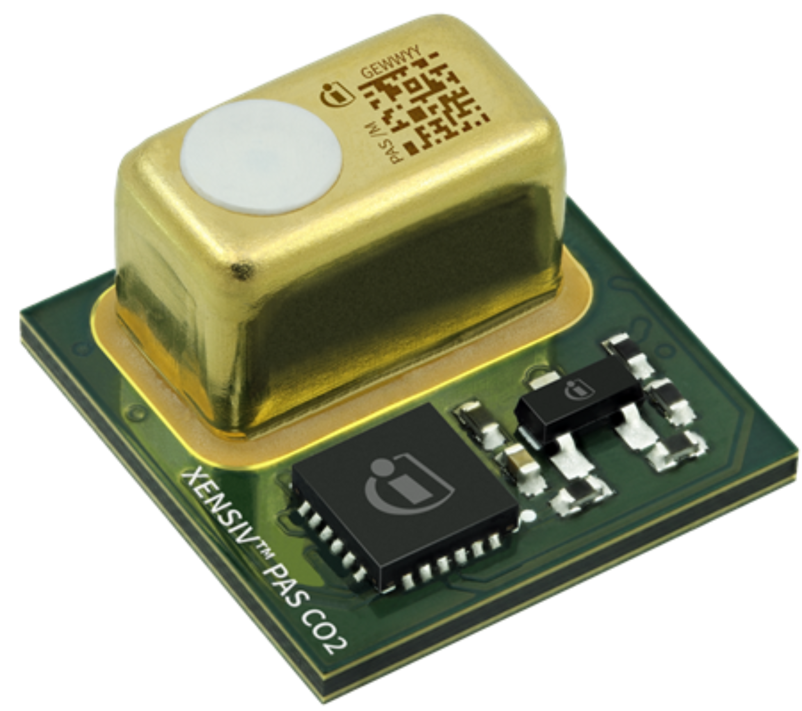

<!-- paginate: true -->

# Internet of Things

Dr. Julian Huber

---

## 9 Abschlussprojekt

---

## Vorstellung Projekte

---

<!--
---

### KI-Kaffee - Teil 1 (blau)

 

-  Am Beispiel einer Kaffeemaschine wird eine wiederverwendbare Box zur Erfassung von Vibrations- und Stromverbrauchsdaten entwickelt.
- Ergebnis ist eine Box welche die Daten erfassen, speichern und visualisieren kann und leicht zu konfigurieren ist, so dass diese in verschiedenen Kontexten eingesetzt werden kann.

---

### KI-Kaffee - Teil 2 (rot)

 

-  Basierend auf Vibrations- und Stromverbrauchsdaten einer Kaffeemaschine wird ein Modell entwickelt, welches den bezogenen Kaffee-Typ vorhersagen kann.
- Zudem wird ein Display entwickelt, welches die Vorhersage und die grundlegenden Daten visualisiert und über welches die Nutzer:in die Daten selbst labeln kann

-->---

### Studierenden-Werkstatt - Teil 1 (blau)

- Es soll ein Assistenz-System entwickelt werden, welches die Zufriedenheit mit der Studierenden-Werkstatt erhöht. 
- Mindestanforderungen: Über eine Spracherkennung können Studierende Probleme und Materialbedarf melden. Es werden automatisiert Tickets angelegt und diese können von den Laboringenieur:innen bearbeitet werden. 
- Die Anwesenheit im Labor wird erfasst.

---

### Studierenden-Werkstatt - Teil 2 (blau)

- Es sollen Nutzungsstatistiken von Arbeitsplätzen und Maschinen erfasst werden. Das kann z.B. über Infrarot-Sensoren, Strom- und Vibrationsdaten geschehen.
- Es wird eine sinnvolle Datenstruktur angelegt aus der sich z.B. Nutzungsstatistiken erfassen, Buchungen und Wartungsintervalle eintragen lassen.
- Es wird ein geeignetes User-Interface entwickelt.

---

### Studierenden-Werkstatt: Luftqualität

- Es soll ein System entwickelt werden, welches die Luftqualität in der Studierenden-Werkstatt überwacht.
- Hierzu sollen folgenden Sensoren eingesetzt werden: [Infineon XENSIV™ PAS CO2-Sensor](https://www.infineon.com/cms/de/product/sensor/gas-sensors/co2-sensors/)
- Schreiben Sie eine Library für den Sensor basierend auf der [Register-Map](https://www.infineon.com/dgdl/Infineon-Registermap_description_PASCO2_MA2-ApplicationNotes-v02_04-EN.pdf?fileId=5546d4627600a6bc017604238d967785) und vergleichbarer Libraries, [wie](https://docs.circuitpython.org/projects/mpu6050/en/latest/) wir sie in der Vorlesung kennengelernt haben.
- Erstellen sie ein Backend mit Datenspeicherung und Visualisierung der Daten und liefern Sie es als Docker-Container aus.

---

### Smarte Paket-Verwaltung am Infodesk

- Eingehende Pakete werden gescannt (Bilderkennung)
- Informationen werden übersetzt und in Datenbank gespeichert
- Datenbank kann über ein UI angepasst werden
- Adressaten eingehender Pakte werden per Email benachrichtigt
- Abgeholte Pakte werden gescant
- Erinnerungssystem für nicht abgeholte Pakete
- Übersicht über diverse Statistiken

---

### Integrationsaufgaben

- Nutzungsdaten von KI-Kaffee - Teil 1 werden als Gerät in die Datenbank von Studierenden-Werkstatt 2 integriert werden
angewandt werden
- KI-Kaffee - Teil 2

---

### Weitere Ideen

* Indoor Positioning System für Werkzeuge
* Predictive Maintenance System für 3D-Drucker
* Paket-Ein und Ausgangsverwaltung für Infodesk

---

## Pitch

- Jede Gruppe (3 Personen) bewirbt sich auf Ihr präferiertes Projekt
- Beschreibung des Projektumfangs z.B. als Use Case Template o.ä. als Präsentation ca. 5 Minuten
- Vorstellung am 9.11.2023

---

## Anforderungen and das Projekt

- Beschreibung des Projektumfangs z.B. als Use Case Template oder sauberer Text incl. Liste aller benötigten Hardware
- Projektverzeichnis (git repository) mit Anleitung zur Inbetriebnahme
    - Hardwareliste und Anleitung zum Aufbau
    - Befehle zum Start der Software in richtiger Reihenfolge
- Demonstrator funktioniert im laufenden Betrieb. Hierzu ist beispielsweise die Sicherheit durch geeignete Einhausung sicherzustellen.
- Das Projekt ist ausreichen komplex für ein Arbeitsaufwand von 25h pro Person. Dies kann z.B. durch folgendes Zustande kommen:
    - Daten werden in einer Datenbank hinterlegt
    - Fehlermanagement (Neustart bei Hardwarefehler, Fehlerbehandlung bei Softwarefehler, Benachrichtigung über Email o.ä.)
    - Es existiert ein sinnvolles Nutzerinterface für den Anwendungsfall
        - Anzeige wichtiger Informationen
        - Administrator-Ansicht 

---

### Vorgehen

- Die letzten drei Termine des Semesters werden für die Projektarbeit genutzt
- Alle im Semester eingesetzte Hardware kann weiter genutzt werden
- Bei Bedarf kann zusätzliche Hardware angeschafft werden, sofern diese nicht zu teuer ist und die Lieferzeit nicht zu lang ist
- Abgabe der Projekte über Sakai am 14.02.2024
- Kurze Präsentation des Zwischenstands der Projekte am 1.2.2024