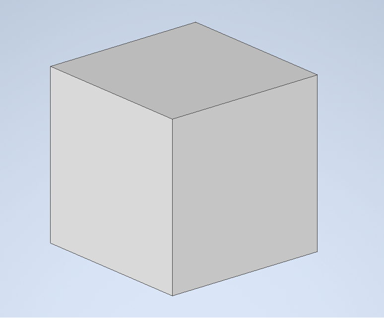
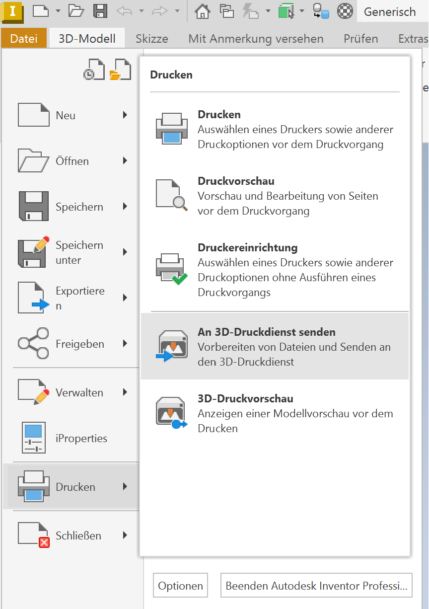
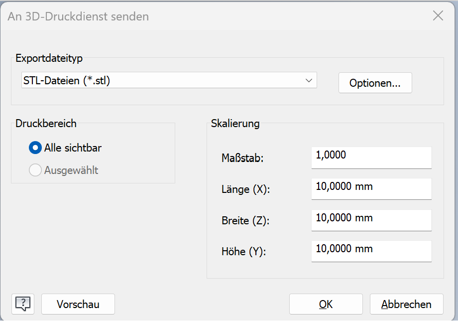
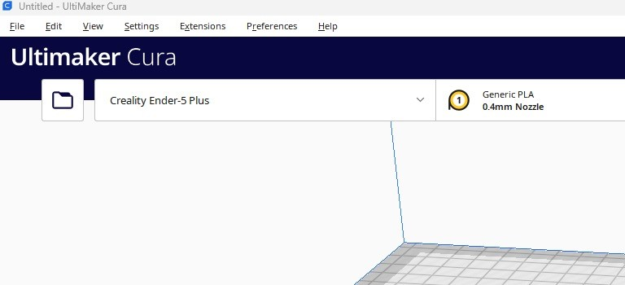
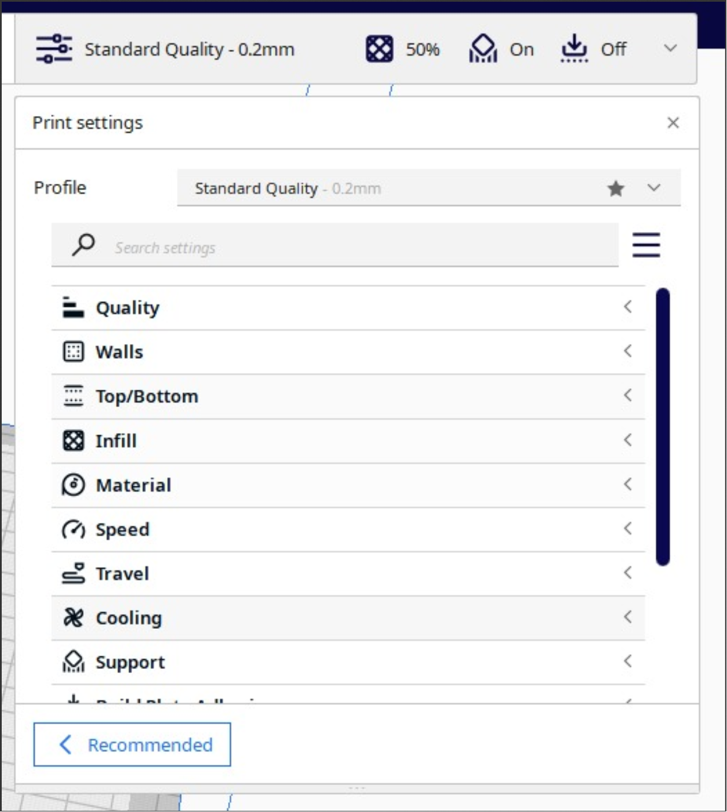

<!-- paginate: true -->

# Internet of Things

**SoSe 2023**
Dr. Julian Huber

---

## 3D-Druck for Dummies

>Julian Fritzer, Otto, Sandrini, Patrick Monthaler

In diesem Dokument wird anhand eines einfachen Beispiels aufgezeigt, wie man aus einem einfachen Körper aus Inventor einen fertigen 3D-Druck anfertigt

---

###	Export des AutoCAD-Inventor-Modells als `.STL`-Datei

 
Als Beispiel verwenden wir einen einfachen Würfel mit Kantenlänge $10 \text{ mm}$. Die Erstellung von Formen in Inventor sollte bekannt sein.

Um eine `.STL`-Datei zu erstellen (die für die weitere Bearbeitung benötigt wird), navigiert man zu `Datei`/`Drucken`/`An 3D-Druckdienst senden`
 
Anschließend konfigurieren wir die Skalierung auf die gewünschte Einstellung und klicken auf `OK`.

---

---

### Import der `.STL`-Datei in den Slicer

Der sogenannte **Slicer** wandelt die `.STL`-Datei in eine `.GCODE`-Datei um, um den 3D-Drucker mitzuteilen, wie der Druck genau vonstattengehen soll. Meist liefern die Hersteller von 3D-Druckern einen Slicer mit. Es gibt jedoch auch Varianten, die auf Open-Source basieren. Wir verwenden in diesem Tutorial den [Cura-Slicer](https://ultimaker.com/software/ultimaker-cura/)

---

- Zuerst wird die exportiere `.STL`-Datei in das Programm importiert:
    - Beim Ordner-Symbol wird die zu importierende Datei ausgewählt. Rechts daneben den entsprechenden Drucker auswählen.
- Anschließend wird die Druckkonfiguration je nach Bauteil durchgeführt.
    - Bei einem einfachen Quader muss nichts konfiguriert werden. Allerdings sollte der Support immer aktiviert werden. Dieser dient dazu, Stützstrukturen während des Druckens aufzubauen.
- Des weiteren sollte darauf geachtet werden, dass die Bauteile so im Slicer positioniert werden, dass möglichst wenig Support benötigt wird. 
    - Hierzu klicken wir das Objekt an und können dann links die Positionierung vornehmen.
- Zum Abschluss klickt man unten rechts auf Slice und speichert die Datei auf einer SD-Karte oder einem USB-Stick je nach 3D-Drucker.

---

---

### Übertragung der Datei auf den 3D-Drucker und Druckvorgang

- Nun wird die SD-Karte beziehungsweise der USB-Stick an den Drucker angeschlossen und die zu druckende Datei im Menü ausgewählt. 
- Da die Konfiguration bei jedem Drucker unterschiedlich ist, wird dies hier nicht behandelt.
- Anschließend wird der Druck gestartet.

---

### Tipps zum Druckvorgang:

- Bis die erste Schicht aufgetragen ist, sollte man sich nicht vom Drucker entfernen, da kontrolliert werden muss, ob das Druckfilament auf dem Druckpad haftet.
- Die sogenannte *Nozzle* sollte beim starten des Druckvorgangs frei von Filament sein.
- Soweit wie möglich Support vermeiden! Idealerweise schon beim Design beachten.
- Infill auf mehr als 50 % zu erhöhen bringt nicht mehr viel zusätzliche Stabilität

